## Содержание

### Часть I Командная оболочка
- [Глава 1. Что такое командная оболочка ](#глава-1-что-такое-командная-оболочка)
- [Глава 2. Навигация](#глава-2-навигация)
- [Глава 3. Исследование системы](#глава-3-исследование-системы)
- [Глава 4. Операции с файлами и каталогами](#глава-2-операции-с-файлами-и-каталогами)

## Глава 1. Что такое командная оболочка

<b>Командная оболочка</b> — это программа, которая принимает команды, введенные с клавиатуры, и передает их операционной системе для выполнения.
При запуске терминала появляется приглашение к вводу вида _user_name@computer_name_, за которым следует имя текущего каталога.
Если последний символ в приглашении - знак решетки (#), а не доллар ($), то это означает, что сеанс проходит в режиме суперпользователя.

_Пример: пользователь с обычными правами_  
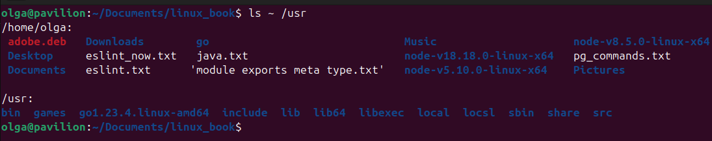  
_Пример: переключение в сеанс с правами root (sudo -i имитирует полноценный вход рута с окружением рута, а sudo su сохраняет окружение текущего пользователя)_ 
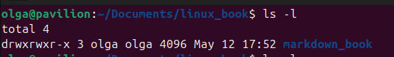

#### Копирование текста
В терминале копирование производится с помощью выделения текста, нажатия правой кнопки мыши, вставка также - правая кнопка мыши (ещё можно с помощью CTRL+SHIFT+C)

#### История команд
Для вызова истории необходимо нажать клавишу со стрелкой вверх, стрелки влево и вправо позволяют менять позицию курсора в команде, тем самым редактировать ввод.

#### Некоторые простые команды

_Вывод текущей даты и времени_  

_Вывод календаря текущего месяца (по умолчанию не установлен, sudo apt install ncal)_  
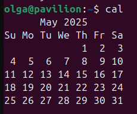

_Объем свободного пространства на дисках (ключ -h дает удобочитаемый формат)_  
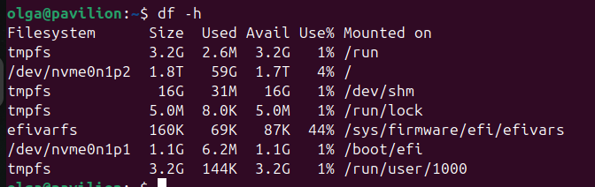

_Объем свободного пространства в ОЗУ (ключ -h дает удобочитаемый формат)_ 
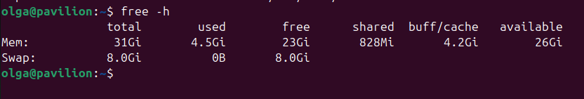

_Завершение сеанса работы с терминалом: команда exit_  

## Глава 2. Навигация

Первый каталог в файловой системе называется _корневым каталогом_. Корневой каталог содержит файлы и подкаталоги, которые в свою очередь также содержат файлы и каталоги, и т. д. 
В отличие от Windows, где для каждого устройства хранения создается отдельная файловая система, в Linux всегда имеется только одна файловая система, независимо от числа дисков, подключенных к компьютеру. Устройства хранения подключаются (или, как принято говорить, монтируются) к дереву файловой системы. 
Родительский каталог - вышележащий каталог от текущего местоположения в файловой системе.
Текущий рабочий каталог - это каталог, где мы находимся в данный момент.

_Вывод названия текущего рабочего каталога_  
  

Сразу после входа в систему (или запуска сеанса в эмуляторе терминала) текущим рабочим каталогом становится наш домашний каталог. Каждый пользователь имеет свой домашний каталог, который является единственным, где пользователю позволено осуществлять запись в файлы, когда он действует с привилегиями обычного пользователя.

### Вывод содержимого каталога

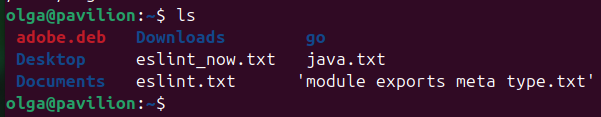 

### Смена текущего рабочего каталога

Абсолютный путь

Абсолютный путь начинается с корневого каталога и перечисляет ветви дерева, отделяющие корень от желаемого каталога или файла.  
 

Относительный путь

Относительный путь начинается в рабочем каталоге. Для обозначения относительных позиций в дереве файловой системы используется
пара специальных символов: . (точка) и .. (точка-точка). Символ . (точка) обозначает рабочий каталог, а символ .. (точка-точка) обозначает каталог, родительский по отношению к рабочему.  
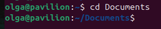  

Сокращенные варианты команды cd

| Команда                | Результат |
|------------------------|-----------|
| cd                     | Сменить рабочий каталог на домашний |
| cd -                   | Сменить рабочий каталог на предыдущий рабочий каталог |
| cd&nbsp;~username          | Сменить рабочий каталог на домашний каталог пользователя username. Например, cd ~olga выполнит переход в домашний каталог пользователя olga |

### Особенности имен файлов в Linux

* Файлы, имена которых начинаются с точки, считаются скрытыми. Это означает, что команда ls не будет выводить их, если не вызвать ее с ключом -a.  
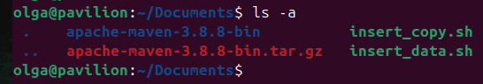  
* Linux различает регистр символов в именах файлов и командах. Файлы с именами File1 и file1 — это разные файлы.  
* Хотя Linux поддерживает длинные имена файлов с пробелами и знаками пунктуации, старайтесь не использовать в именах файлов другие знаки пунктуации,кроме точки, дефиса и подчеркивания. И самое главное, не используйте пробелы в именах файлов. Если необходимо отделить друг от друга слова в имени файла, используйте символы подчеркивания.  
* Linux различает регистр символов в именах файлов и командах. Файлы с именами File1 и file1 — это разные файлы.  
* В Linux не поддерживается понятие «расширения файла», как в некоторых других операционных системах. Вы можете давать своим файлам любые имена. Тип и/или назначение файла определяется другими средствами.  

## Глава 3. Исследование системы

### Возможности команды ls

Можно явно указать каталог, содержимое которого требуется вывести.  
Вывод содержимого домашнего каталога, а также /usr
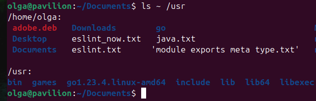 
Изменение формата вывода: команда ls -l предоставляет длинный (ключ -l --->> long) форма вывода  
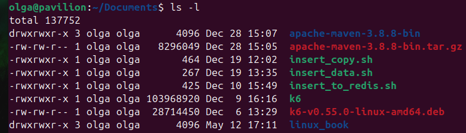  

### Аргументы команды ls

| Параметр | Длинный параметр | Описание | Пример|
|-------------|-------------|-------------|-------------|
| -a       | --all | Список всех (all) файлов, включая скрытые  | 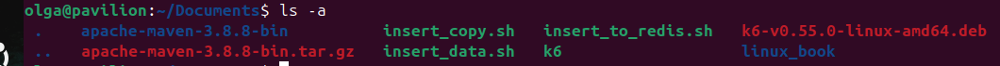  |
| -A | --almost-all | Действует подобно параметру -a, но не выводит каталоги . (текущий рабочий каталог) и .. (родительский каталог) |   |
| -d | --directory  | Информация о каталоге, а не о его содержимом. Используйте этот параметр в сочетании с параметром -l, чтобы получить дополнительную информацию о каталоге, а не о его содержимом. |   |
| -F   | --classify   | Добавляет в конец каждого имени символ-индикатор, например, прямой слеш, если это имя каталога  |  |
| -h | --human-readable  | При использовании ключа -l  отображает размеры файлов не в байтах, а в величинах с единицами измерения | 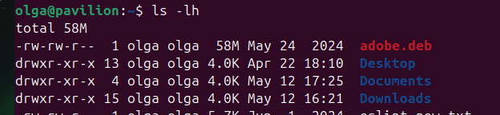  |
| -l  |   | Полное описание файлов  | 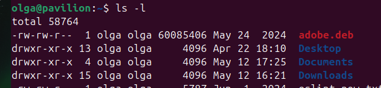  |
| -r  | --reverse | Выводит результаты в обратном порядке. Обычно команда ls выводит результаты в алфавитном порядке  | 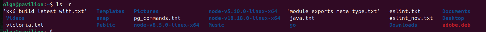 |
| -S  | --size  | Сортировка по размеру | 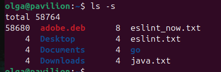 |
| -t  |  | Сортировать по времени последнего изменения  |   |

### Особенности вывода ls -l

Перед вами вывод команды ls -l  

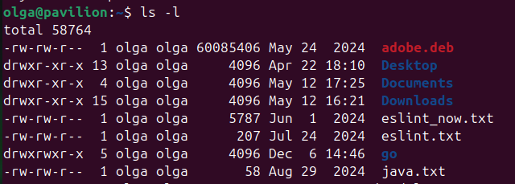  

Рассмотрим форматы вывода и их назначения

| Формат | Назначение | 
|-------------|-------------|
| -rw-r-r--   | Права доступа к файлу. Первый символ указывает тип файла. Например, символом дефиса обозначаются обычные файлы,а символом d — каталоги. Следующие три символа сообщают о правах доступа для владельца файла, следующие три — для членов группы, которой принадлежит файл, и последние три — для всех остальных.| 
| 1  | Число жестких ссылок на файл.  | 
| olga | Имя пользователя, владеющего файлом | 
| olga  | Имя группы, владеющей файлом | 
| 4096 | Размер файла в байтах  | 
| May 12 17:25  | Дата и время последнего изменения файла  |
| java.txt | Название файла  | 

### Определение типов файлов командой file

Имена файлов в Linux не обязаны отражать тип содержимого файлов. Например, увидев имя файла picture.jpg, можно предположить, что он содержит изображение в формате JPEG, но в Linux такие предположения могут не оправдываться. 
Чтобы точно понять, что за файл перед вами, даже если у него нет расширения, выполните команду:
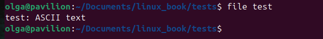  
В результате вы получите описание того, какой перед вами тип файла. Важно заметить, что одна из известных идей в Linux, гласит: «Все сущее есть файл». 

### Просмотр содержимого файлов командой less

Команда less служит для просмотра текстовых файлов с прокруткой. 

После запуска программа less позволяет прокручивать текстовый файл взад и вперед. Например, просмотреть содержимое файла со всеми известными системе учетными записями пользователей можно с помощью следующей команды:

less /etc/passwd

### Управление с клавиатуры для команды less

Если по ошибке вы попробовали просмотреть содержимое нетекстового файла и полностью нарушили нормальную работу окна терминала, вы можете вернуть его в исходное состояние, выполнив команду reset.

Команда less создавалась как улучшенная замена более ранней команды more. Ее имя — это игра слов «less is more» (меньше значит больше). В отличие от команды more, которая может листать страницы только вперед, less способна листать текст в обоих направлениях, вперед и назад, и имеет множество других
особенностей.

### Файловая система Linux

Рассмотрим некоторые основные каталоги файловой системы Linux и их предназначение

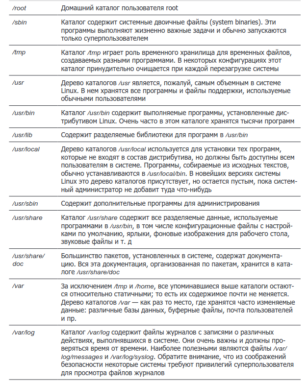

## Глава 4. Операции с файлами и каталогами

