## Содержание

### Часть I Командная оболочка
- [Глава 1. Что такое командная оболочка ](#глава-1-что-такое-командная-оболочка)
- [Глава 2. Навигация](#глава-2-навигация)
- [Глава 3. Исследование системы](#глава-3-исследование-системы)
- [Глава 4. Операции с файлами и каталогами](#глава-4-операции-с-файлами-и-каталогами)
- [Глава 5. Работа с командами](#глава-5-работа-с-командами)
- [Глава 6. Перенаправление](#глава-6-перенаправление)
- [Глава 7. Взгляд на мир глазами командной оболочки](#глава-7-взгляд-на-мир-глазами-командной-оболочки)
- [Глава 8. Продвинутые приемы работы с клавиатурой](#глава-8-продвинутые-приемы-работы-с-клавиатурой)

## Глава 1. Что такое командная оболочка

<b>Командная оболочка</b> — это программа, которая принимает команды, введенные с клавиатуры, и передает их операционной системе для выполнения.
При запуске терминала появляется приглашение к вводу вида _user_name@computer_name_, за которым следует имя текущего каталога.
Если последний символ в приглашении - знак решетки (#), а не доллар ($), то это означает, что сеанс проходит в режиме суперпользователя.

_Пример: пользователь с обычными правами_  
  
_Пример: переключение в сеанс с правами root (sudo -i имитирует полноценный вход рута с окружением рута, а sudo su сохраняет окружение текущего пользователя)_ 

#### Копирование текста
В терминале копирование производится с помощью выделения текста, нажатия правой кнопки мыши, вставка также - правая кнопка мыши (ещё можно с помощью CTRL+SHIFT+C)

#### История команд
Для вызова истории необходимо нажать клавишу со стрелкой вверх, стрелки влево и вправо позволяют менять позицию курсора в команде, тем самым редактировать ввод.

#### Некоторые простые команды

_Вывод текущей даты и времени_  

_Вывод календаря текущего месяца (по умолчанию не установлен, sudo apt install ncal)_  

_Объем свободного пространства на дисках (ключ -h дает удобочитаемый формат)_  

_Объем свободного пространства в ОЗУ (ключ -h дает удобочитаемый формат)_ 

_Завершение сеанса работы с терминалом: команда exit_  

## Глава 2. Навигация

Первый каталог в файловой системе называется _корневым каталогом_. Корневой каталог содержит файлы и подкаталоги, которые в свою очередь также содержат файлы и каталоги, и т. д. 
В отличие от Windows, где для каждого устройства хранения создается отдельная файловая система, в Linux всегда имеется только одна файловая система, независимо от числа дисков, подключенных к компьютеру. Устройства хранения подключаются (или, как принято говорить, монтируются) к дереву файловой системы. 
Родительский каталог - вышележащий каталог от текущего местоположения в файловой системе.
Текущий рабочий каталог - это каталог, где мы находимся в данный момент.

_Вывод названия текущего рабочего каталога_  
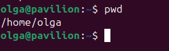  

Сразу после входа в систему (или запуска сеанса в эмуляторе терминала) текущим рабочим каталогом становится наш домашний каталог. Каждый пользователь имеет свой домашний каталог, который является единственным, где пользователю позволено осуществлять запись в файлы, когда он действует с привилегиями обычного пользователя.

### Вывод содержимого каталога

 

### Смена текущего рабочего каталога

Абсолютный путь

Абсолютный путь начинается с корневого каталога и перечисляет ветви дерева, отделяющие корень от желаемого каталога или файла.  
 

Относительный путь

Относительный путь начинается в рабочем каталоге. Для обозначения относительных позиций в дереве файловой системы используется
пара специальных символов: . (точка) и .. (точка-точка). Символ . (точка) обозначает рабочий каталог, а символ .. (точка-точка) обозначает каталог, родительский по отношению к рабочему.  
  

Сокращенные варианты команды cd

| Команда                | Результат |
|------------------------|-----------|
| cd                     | Сменить рабочий каталог на домашний |
| cd -                   | Сменить рабочий каталог на предыдущий рабочий каталог |
| cd&nbsp;~username          | Сменить рабочий каталог на домашний каталог пользователя username. Например, cd ~olga выполнит переход в домашний каталог пользователя olga |

### Особенности имен файлов в Linux

* Файлы, имена которых начинаются с точки, считаются скрытыми. Это означает, что команда ls не будет выводить их, если не вызвать ее с ключом -a.  
  
* Linux различает регистр символов в именах файлов и командах. Файлы с именами File1 и file1 — это разные файлы.  
* Хотя Linux поддерживает длинные имена файлов с пробелами и знаками пунктуации, старайтесь не использовать в именах файлов другие знаки пунктуации,кроме точки, дефиса и подчеркивания. И самое главное, не используйте пробелы в именах файлов. Если необходимо отделить друг от друга слова в имени файла, используйте символы подчеркивания.  
* Linux различает регистр символов в именах файлов и командах. Файлы с именами File1 и file1 — это разные файлы.  
* В Linux не поддерживается понятие «расширения файла», как в некоторых других операционных системах. Вы можете давать своим файлам любые имена. Тип и/или назначение файла определяется другими средствами.  

## Глава 3. Исследование системы

### Возможности команды ls

Можно явно указать каталог, содержимое которого требуется вывести.  
Вывод содержимого домашнего каталога, а также /usr
 
Изменение формата вывода: команда ls -l предоставляет длинный (ключ -l --->> long) форма вывода  
  

### Аргументы команды ls

| Параметр | Длинный параметр | Описание | Пример|
|-------------|-------------|-------------|-------------|
| -a       | --all | Список всех (all) файлов, включая скрытые  |   |
| -A | --almost-all | Действует подобно параметру -a, но не выводит каталоги . (текущий рабочий каталог) и .. (родительский каталог) | 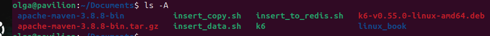  |
| -d | --directory  | Информация о каталоге, а не о его содержимом. Используйте этот параметр в сочетании с параметром -l, чтобы получить дополнительную информацию о каталоге, а не о его содержимом. |   |
| -F   | --classify   | Добавляет в конец каждого имени символ-индикатор, например, прямой слеш, если это имя каталога  |  |
| -h | --human-readable  | При использовании ключа -l  отображает размеры файлов не в байтах, а в величинах с единицами измерения |   |
| -l  |   | Полное описание файлов  |   |
| -r  | --reverse | Выводит результаты в обратном порядке. Обычно команда ls выводит результаты в алфавитном порядке  |  |
| -S  | --size  | Сортировка по размеру |  |
| -t  |  | Сортировать по времени последнего изменения  |   |

### Особенности вывода ls -l

Перед вами вывод команды ls -l  

  

Рассмотрим форматы вывода и их назначения

| Формат | Назначение | 
|-------------|-------------|
| -rw-r-r--   | Права доступа к файлу. Первый символ указывает тип файла. Например, символом дефиса обозначаются обычные файлы,а символом d — каталоги. Следующие три символа сообщают о правах доступа для владельца файла, следующие три — для членов группы, которой принадлежит файл, и последние три — для всех остальных.| 
| 1  | Число жестких ссылок на файл.  | 
| olga | Имя пользователя, владеющего файлом | 
| olga  | Имя группы, владеющей файлом | 
| 4096 | Размер файла в байтах  | 
| May 12 17:25  | Дата и время последнего изменения файла  |
| java.txt | Название файла  | 

### Определение типов файлов командой file

Имена файлов в Linux не обязаны отражать тип содержимого файлов. Например, увидев имя файла picture.jpg, можно предположить, что он содержит изображение в формате JPEG, но в Linux такие предположения могут не оправдываться. 
Чтобы точно понять, что за файл перед вами, даже если у него нет расширения, выполните команду:
  
В результате вы получите описание того, какой перед вами тип файла. Важно заметить, что одна из известных идей в Linux, гласит: «Все сущее есть файл». 

### Просмотр содержимого файлов командой less

Команда less служит для просмотра текстовых файлов с прокруткой. 

После запуска программа less позволяет прокручивать текстовый файл взад и вперед. Например, просмотреть содержимое файла со всеми известными системе учетными записями пользователей можно с помощью следующей команды:

less /etc/passwd

### Управление с клавиатуры для команды less

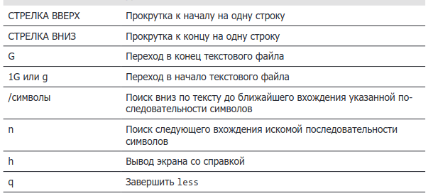

Если по ошибке вы попробовали просмотреть содержимое нетекстового файла и полностью нарушили нормальную работу окна терминала, вы можете вернуть его в исходное состояние, выполнив команду reset.

Команда less создавалась как улучшенная замена более ранней команды more. Ее имя — это игра слов «less is more» (меньше значит больше). В отличие от команды more, которая может листать страницы только вперед, less способна листать текст в обоих направлениях, вперед и назад, и имеет множество других
особенностей.

### Файловая система Linux

Рассмотрим некоторые основные каталоги файловой системы Linux и их предназначение

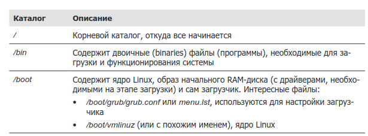

## Глава 4. Операции с файлами и каталогами

Поскольку имена файлов используются в консоли повсеместно, она поддерживает специальные символы, помогающие быстро определять группы имен файлов. Эти специальные символы называют wildcards. 

### Wildcards

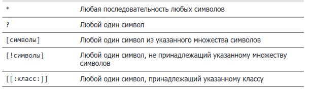

### Классы символов

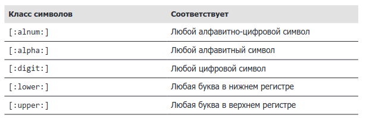

### Примеры использования wildcards 

### Создание каталогов

Команда mkdir позволяет создавать каталоги  

Если использовать ключ -p, то создаются вложенные каталоги. В примере создается test3, внутри которого находится test4.  

###  Копирование файлов и каталогов

Команда cp позволяет копировать файлы и каталоги  

Скопируем файл test в каталог test1  

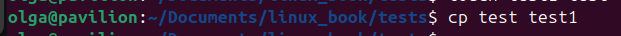

### Некоторые ключи команды cp

### Примеры использования команды cp

Скопируем файл с учетными записями пользователей в текущий каталог  

Точка в конце - это обозначение текущего каталога   

Если использовать ключ -v, то мы увидим сообщение, что операция была выполнена.  

Обратите внимание, что cp перезаписала первую копию без каких-либо предупреждений. Это как раз тот случай,когда cp полагает, что вы знаете, что делаете. Чтобы вывести предупреждение, включите параметр -i:

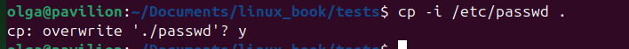

Если в ответ на запрос ввести y, команда перезапишет существующий файл; если ввести любой другой символ (например, n), cp оставит прежнюю копию файла нетронутой.

### Перемещение и переименование файлов с помощью команды mv

Команда mv выполняет операции перемещения и переименования файлов в зависимости от особенностей использования. В любом случае исходный файл исчезает после операции. Команда mv используется почти так же, как команда cp:  

mv item1 item2  

перемещает или переименовывает файл или каталог item1 в item2.  

mv элемент... каталог  

перемещает один или более элементов из одного каталога в другой.  

### Некоторые ключи команды mv 

### Примеры использования команды mv 

### Удаление файлов и каталогов с помощью команды rm

Команда rm используется для удаления (remove) файлов и каталогов, например:  
rm элемент  
где элемент — это один или несколько файлов или каталогов  

### Некоторые ключи команды rm

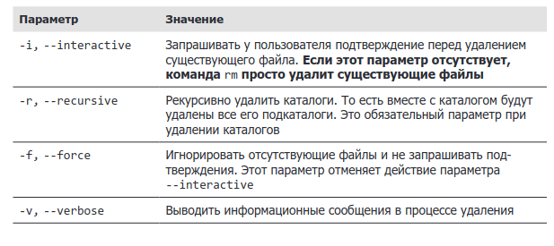

### Примеры использования команды rm

<b>БУДЬТЕ ОСТОРОЖНЫ С КОМАНДОЙ RM!</b>
Linux не имеет команды, отменяющей удаление. Если вы что-то удалили командой rm, это исчезнет навсегда. Linux считает вас достаточно ответственным человеком, отдающим себе отчет в своих действиях. Будьте особенно осторожны с wildcards. Рассмотрим следующий классический пример. Допустим, вы захотели удалить все файлы HTML в каталоге.  
Для этого вы вводите команду:  
rm *.html  
которая сделает именно то, что вам нужно, но если вы случайно вставите пробел
между * и .html, как в следующей команде:  
rm * .html  
rm удалит все файлы в каталоге и затем сообщит, что не нашла файла .html.
Полезный совет: всякий раз, используя групповые символы с командой rm (по-
мимо внимательной проверки ввода!), проверьте сначала аргумент с групповым
символом с командой ls. Это позволит увидеть, какие файлы будут удалены. За-
тем нажмите клавишу со стрелкой вверх, чтобы восстановить команду из истории,
и замените ls на rm.

### Символические и жесткие ссылки

#### Символические ссылки

Просматривая содержимое каталогов (например, /lib), нередко можно увидеть
такие записи:  
lrwxrwxrwx 1 root root 11 2018-08-11 07:34 libc.so.6 -> libc-2.6.so

Обратили внимание на первую букву l и на присутствие двух имен файлов в конце? Это специальный файл, который называется символической ссылкой (иногда их называют мягкими ссылками или, на жаргоне, симлинками). В большинстве Unix-подобных систем можно дать одному и тому же файлу несколько имен. Даже
притом, что на данный момент ценность такого приема может быть не очевидна, в действительности это очень удобная возможность.

Вообразите следующий сценарий: программе требуется некий разделяемый ресурс (например, библиотека), хранящийся в файле с именем «foo», но номер версии «foo» меняется очень часто. Было бы хорошо включить номер версии в имя файла, чтобы администратор или другое заинтересованное лицо могли видеть, какая версия «foo» установлена. И здесь возникает проблема. Если изменить имя разделяемого ресурса, нам придется проверять каждую программу, использующую этот ресурс, и изменять в ней имя ресурса на новое после установки новой версии ресурса. Если честно, такая перспектива не выглядит привлекательной.

Символические ссылки помогут спасти положение. Допустим, мы установили «foo» версии 2.6 с именем файла «foo-2.6» и затем создали символическую ссылку с простым именем «foo», указывающую на ресурс «foo-2.6». То есть когда программа откроет файл «foo», в действительности она откроет файл «foo-2.6». И все будут счастливы. Программы, полагающиеся на имя «foo», найдут нужный файл, а мы сможем увидеть фактическую версию ресурса. Когда придет время обновить ресурс до версии «foo-2.7», мы просто добавим файл в систему, удалим символическую ссылку «foo» и создадим новую символическую ссылку, указывающую на новую версию. Такой подход не только решает проблему обновления версий, но также позволяет сохранить на компьютере обе версии ресурса. Представьте, что в версии «foo-2.7» обнаружилась ошибка (ох уж эти разработчики!) и нужно вернуть старую версию. В этом случае достаточно просто вновь удалить символическую ссылку, указывающую на новую версию, и создать новую символическую ссылку, указывающую на старую версию. Запись выше (получена в каталоге /lib в системе Fedora) соответствует символи-
ческой ссылке с именем libc.so.6, указывающей на файл разделяемой библиотеки с именем libc-2.6.so. Это означает, что программа, ищущая libc.so.6, фактически получит файл libc-2.6.so. 

#### Жесткие ссылки

Жесткие ссылки также позволяют присвоить одному файлу несколько имен, но они действуют иначе. Жесткие ссылки — это первоначальный способ создания ссылок в Unix; символические ссылки — более позднее изобретение. По умолчанию каждый файл имеет одну жесткую ссылку, определяющую его имя. Создавая жесткую ссылку, мы создаем дополнительную запись в каталоге для файла. Жесткие ссылки имеют два важных ограничения. 
* Жесткая ссылка не может указывать на файл за пределами собственной файловой системы. Это означает, что ссылка не может указывать на файл, находящийся в другом разделе диска.
* Жесткая ссылка не может указывать на каталог.
Жесткая ссылка неотличима от самого файла. В отличие от символических ссылок, при выводе списка с содержимым каталогов жесткие ссылки никак не выделяются. При удалении жесткой ссылки удаляется только сама ссылка, а файл остается на месте (то есть пространство, занимаемое файлом, не освобождается), пока не будут удалены все жесткие ссылки на файл.

_Важно!_

Символические ссылки были придуманы с целью преодолеть ограничения жестких ссылок. Когда создается символическая ссылка, в действительности создается файл особого типа, содержащий текстовый указатель на файл или каталог. В некотором отношении они действуют подобно ярлыкам в Windows, но, конечно же,
появились задолго до ярлыков Windows. Файл, на который указывает символическая ссылка, и сама символическая ссылка почти неотличимы друг от друга. Например, если попытаться что-то записать в символическую ссылку, запись будет выполнена в файл, на который она указывает. Однако при удалении символической ссылки удаляется только символическая ссылка, но не файл. Если удалить файл до того, как будет удалена символическая ссылка, ссылка останется на месте, но будет указывать в никуда. О таких ссылках говорят, что они «битые». Во многих реализациях команда ls выделяет битые ссылки цветом, например красным, чтобы обратить на них внимание.

### Создание жестких ссылок

Посмотрим, что содержит наш каталог  

Прежде всего обратим внимание на второе поле в записях файлов test и test_hard_ln, мы видим число 2 - это число ссылок. Файл всегда имеет хотя бы одну жесткую ссылку, потому что имя файла определяется ссылкой. Но как же нам убедиться, что это один и тот же файл ?
Создавая жесткую ссылку, мы фактически создаем дополнительный раздел с именем, ссылающийся на тот же раздел с данными. Цепочку дисковых блоков система присваивает тому, что называется индексным узлом (inode), который затем присваивается разделу с именем. То есть каждая жесткая ссылка ссылается на определенный индексный узел с содержимым файла.
Команда ls может извлекать эту информацию. Для этого ее нужно вызвать с параметром -i:

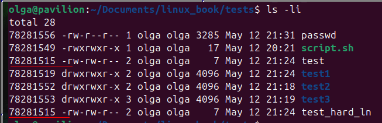

Как видно, значение inode у исходного файла и ссылки одинаковое - они ссылаются на один и тот же объект.

### Создание символических ссылок

Они создаются почти также, как и жесткие, добавляется лишь ключ -s. 

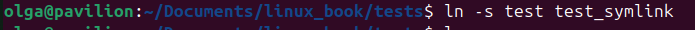

Не забывайте, что, создавая символическую ссылку, мы фактически определяем текст, описывающий местоположение целевого файла относительно символической ссылки. В этом легко убедиться, если взглянуть на вывод команды ls:

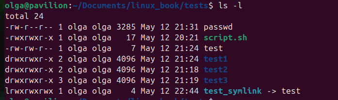

Обратите внимание на размер символической ссылки, равный 4, - это число символов в строке test, а не размер файла, на который он указывает. 
При создании символических ссылок можно также указывать абсолютные пути, и помимо обычных файлов, символические ссылки могут указывать также на каталоги.

### Пример удаления ссылок

Удалим жесткую ссылку

Заметим, что после удаления и вывода команды ls счетчик ссылок уменьшился. А теперь удалим сам файл и посмотрим на символическую ссылку. 

Поскольку теперь символическая ссылка указывает на несуществующий файл, она стала битой. В большинстве дистрибутивов Linux команда ls особым образом настраивается на отображение битых ссылок. Битые ссылки не представляют никакой опасности, но вносят определенную путаницу. При попытке использовать битую ссылку вы увидите:

Главное, что следует помнить о символических ссылках: большинство операций с файлами воздействуют на целевой элемент, а не на саму ссылку. Однако команда rm является исключением из этого правила. Когда вы удаляете ссылку, удаляется сама ссылка, а не элемент, на который она указывает.

## Глава 5. Работа с командами

### Команда может быть:

* <b>Выполняемой программой</b>, как те файлы, что мы видели в каталоге /usr/bin. (скомпилированные бинари, код на различных ЯП)  
* <b>Встроенной командой внутри командной оболочки </b> - например, команды cd, pwd. Это те, которые не требуют дополнительной установки  
* <b>Функцией командной оболочки </b> - как пример, пользовательские шелл скрипты, встроенные в окркжение ОС
* <b>Алиасы </b> - команда, которую мы можем определить сами, сконструировав из других команд.
* <b>Ключевые слова </b> - команда, которая по сути является не командой, а частью баш скрипта, например, слово for или if

### Идентификация команд

Часто бывает полезным точно знать, к какому из типов принадлежит команда. Линукс предлагает несколько способов, как это лучше сделать:

* Команда type - строенная утилита, предназначенная для определения типа введённой команды и способа её интерпретации оболочкой. Если команда - внешний исполняемый файл, выводит путь к нему в системе.
Помогает узнать, как именно будет выполнена команда, если её ввести в терминале

 Например,

#### Для чего это нужно

1. Проверить, не подменён ли псевдонимом или функцией стандартный вызов команды (например, чтобы избежать неожиданных или вредоносных действий, пример *alias rm='rm -i'*)
2. Определить, где именно находится исполняемый файл команды
3. Убедиться, что команда действительно существует и будет выполнена ожидаемым образом

* Команда which - определение местоположения выполняемого файла

1. Показывает, где именно находится исполняемый файл команды
2. Помогает проверить, установлена ли команда и доступна ли она в текущем окружении
3. Используется для отладки, чтобы убедиться, что запускается именно нужная версия программы.
4. При наличии алиасов может показать их определение вместе с путём к исполняемому файлу
5. Опция -a позволяет вывести все найденные в PATH экземпляры команды, а не только первый

Например:

which ищет только исполняемые программы, она не способна выявлять встроенные команды или псевдонимы, замещающие фактические исполняемые программы. Если попытаться с помощью which определить местоположение встроенной команды (например, cd), мы либо ничего не получим, либо получим сообщение
об ошибке.

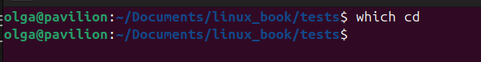

## Получение документации с описанием команд

### help — получение справки для встроенных команд
bash имеет встроенную справку для каждой встроенной команды. Чтобы получить ее, введите help с именем встроенной команды. Например:

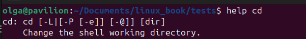

Квадратные скобки в описании синтаксиса команды указывают на необязательность элемента. Вертикальная черта используется для перечисления взаимоисключающих вариантов. В примере с описанием команды
cd, приведенном выше, ее синтаксис описывается как

cd [-L|[-P[-e]]] [dir]

Эта форма записи говорит, что команда cd может принимать необязательный параметр -L или -P и необязательный аргумент dir. Если указан параметр -P, вместе с ним можно также передать параметр -e.

--help — вывод инструкции по использованию
Многие выполняемые программы поддерживают параметр --help для вывода описания синтаксиса и параметров, поддерживаемых командой. Например:

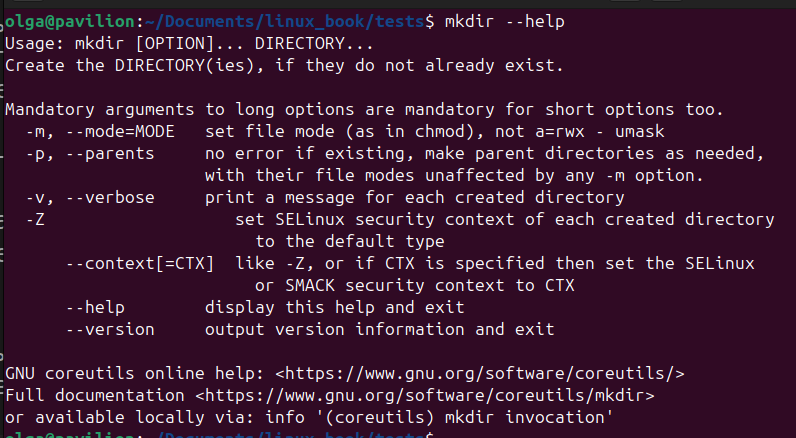

Некоторые программы не поддерживают параметр --help, но вы все равно пробуйте передать его. Часто в результате выводится сообщение об ошибке, содержащее ту же информацию о порядке использования.

### man — вывод страниц справочного руководства
Большинство программ, предназначенных для использования в командной строке, предоставляют официальную документацию, которую называют страницей справочного руководства (man-страницу). Для просмотра этих страниц используется специальная программа постраничного просмотра man. Важно, что страницы справочного руководства обычно не включают примеры использования, и их главная цель — служить справочником, а не инструкцией по использованию. Например,

man - это большое справочное руководство, которое разбито на разделы и охватывает не только  пользовательские команды, но и команды системного администрирования, форматы файлов и т.д. Ниже представлены разделы:

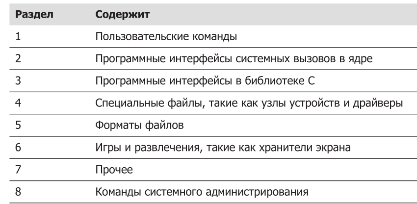

Иногда, чтобы найти искомое, нужно заглянуть в конкретный раздел. Это актуально для форматов файлов, названия которых часто совпадают с именами команд. Если номер раздела не указан, man всегда будет возвращать первую найденную страницу, обычно из раздела 1. Ниже приведен пример прямого указания номера
раздела:

*man 5 passwd*

выводит страницу с описанием формата файла /etc/passwd

### apropos — вывод списка подходящих команд

Кроме того, существует возможность найти страницы справочного руководства для близких совпадений с искомым термином. Несмотря на неточность, этот подход иногда оказывается полезным. Это очень удобно, когда вы знаете, что хотите сделать, но не помните точное название команды.
Ниже приводится пример поиска страниц справочного руководства по слову partition:

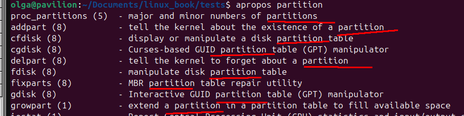

### whatis — вывод очень краткого описания команды
Программа whatis выводит имя и однострочное описание из страницы справочного руководства, соответствующей искомому слову:

###  info — вывод записи из справочного руководства Info
В проекте GNU имеется альтернативное руководство Info, которое часто называют info-страницами. Info-страницы выводятся с помощью программы чтения с подходящим названием info. Info-страницы содержат гиперссылки, подобно веб-страницам. Например:

### Просмотр файлов в архиве

Пакет gzip включает специальную версию less с именем zless, которая выводит содержимое текстовых файлов, сжатых архиватором gzip (ещё zcat для просмотра коротких файлов). Например, у нас есть большой текстовый файл, который находится в архиве gzip. Его можно просмотреть, не распаковывая архив с помощью команды zless. Например:

### Создание собственных команд с помощью alias

Для начала посмотрим, как можно уместить в одной строке несколько команд - для этого нужно просто отделить их друг от друга точкой с запятой:

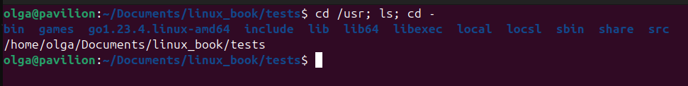

Как видите, мы поместили три команды в одну строку. Первая выполняет переход в каталог /usr, вторая выводит его содержимое, и третья осуществляет возврат в предыдущий каталог (команда cd -), поэтому по завершении мы оказываемся там же, где и были. Давайте теперь с помощью alias превратим эту последовательность в новую команду. Первое, что мы должны сделать, — придумать имя для новой команды. Пусть это будет test. Но прежде чем продолжить, хорошо бы проверить, не занято ли уже имя test. Для этого воспользуемся командой type:

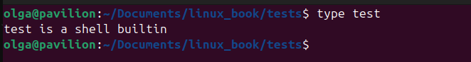

Как мы видим, это имя уже занято. Определим незанятое имя и создадим алиас:

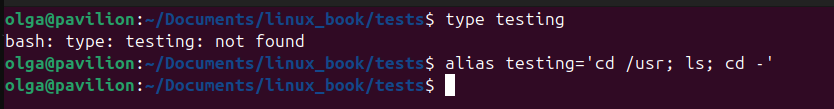

За командой alias следует имя, сразу за которым (то есть без пробелов) следует знак «равно» и строка в кавычках, описывающая действие, присваиваемое имени. После определения псевдонима его можно использовать везде, где ожидается коман­да.

Существует одна маленькая проблема, связанная с определением псевдонимов в командной строке. Они исчезают по завершении сеанса работы с командной оболочкой. Как исправить ситуацию мы рассмотрим позже.

## Глава 6. Перенаправление

Многие программы, которыми мы уже пользовались, что-нибудь выводят на конcоль. Этот вывод часто делится на два типа:
* Результаты работы программы, то есть данные, для получения которых создавалась программа, - перенаправление стандартного вывода   
* Сообщения о состоянии или об ошибках, извещающие нас о самочувствии
программы.

Например, если взглянуть на вывод программы ls, можно увидеть, что она выводит на экран результаты своей работы и иногда сообщения об ошибках. Согласно центральной идее Linux, что «все есть файл», такие программы, как ls, в действительности выводят свои результаты в специальный файл, который называется *стандартным выводом* (standard output, часто обозначается как stdout), а сообщения о состоянии — в специальный файл *стандартный вывод ошибок* (standard error, stderr). По умолчанию оба файла, стандартный вывод и стандартный вывод ошибок, связаны с экраном и не сохраняются на диске. Кроме того, многие программы принимают ввод из специального файла с названием *стандартный ввод* (standard input, stdin), который по умолчанию связан с клавиатурой. Механизм перенаправления ввода/вывода позволяет изменять направление вывода и ввода. Обычно вывод осуществляется на экран, а ввод — с клавиатуры, но механизм перенаправления ввода/вывода позволяет изменить этот порядок вещей.

## Перенаправление стандартного вывода

Механизм перенаправления ввода/вывода позволяет явно указать, куда должен осуществляться стандартный вывод. Чтобы перенаправить стандартный вывод в другой файл вместо экрана, нужно добавить в команду оператор перенаправления > и имя файла. Где это может пригодиться? Иногда полезно сохранить вывод команды в файл. Например, можно сообщить командной оболочке, что она должна направить вывод команды ls в файл ls-output.txt вместо экрана, затем откроем файл и посмотрим его содержимое:

Прекрасно, файл не пустой. Давайте теперь повторим эксперимент с перенаправлением, но с небольшим усложнением: укажем имя несуществующего каталога:

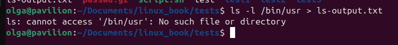

Мы получили сообщение об ошибке. Все логично — мы указали несуществующий каталог /bin/usr, посмотрим размер файла 

Файл очистился! Это объясняется тем, что при перенаправлении вывода с помощью оператора > файл назначения всегда перезаписывается с самого начала. Поскольку команда ls не вывела никаких результатов, а только сообщение об ошибке, оператор перенаправления перезаписал файл, а затем остановился из-за ошибки, что привело к его очистке. Получается, что если вам понадобится очистить какой-нибудь файл (или создать новый, пустой файл), это можно сделать с помощью команды:

*> file_name*

Простой оператор перенаправления, без предшествующей ему команды, очистит существующий файл или создаст новый, пустой файл.

А чтобы не перетирать файл, а добавить что-нибудь в конец файла, нужно использовать оператор >>. Например:

Мы видим, что после выполнения команды с >> три раза, наш файл значительно увеличился в размере.

## Перенаправление стандартного вывода ошибок

Чтобы перенаправить стандартный вывод ошибок, нужно указать его дескриптор файла. 
Файловый дескриптор — натуральное число (идентификатор), закреплённое за определённым потоком ввода-вывода. При создании нового потока ввода-вывода (который может быть связан как с файлами, так и с каталогами, сокетами и FIFO), ядро возвращает его файловый дескриптор создавшему его процессу. Файловый дескриптор может использоваться для получения доступа к потоку.

По умолчанию Unix-оболочки связывают файловый дескриптор 0 с потоком стандартного ввода (клавиатура), файловый дескриптор 1 — с потоком стандартного вывода (терминал) и файловый дескриптор 2 — со стандартным выводом ошибок (диагностические и отладочные сообщения, информация об ошибках). 

Программа может производить вывод в любой из нескольких нумерованных файловых потоков. Первые три из них мы упомянули как стандартный ввод, вывод и вывод ошибок. Командная оболочка ссылается на них как на файловые дескрипторы 0, 1 и 2 соответственно. Командная оболочка поддерживает синтаксис перенаправления файлов с использованием номеров файловых дескрипторов. Так как стандартному выводу ошибок соответствует файловый дескриптор 2, мы можем перенаправить его таким образом:

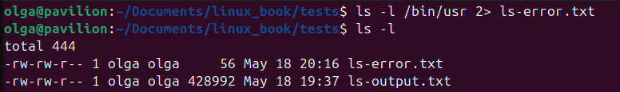

Номер файлового дескриптора 2 помещается непосредственно перед оператором перенаправления, чтобы перенаправить стандартный вывод ошибок в файл ls-error.txt.

## Перенаправление стандартного вывода и стандартного вывода ошибок в один файл

Иногда необходимо сохранить весь вывод команды в один файл. Для этого перенаправьте сразу два потока, стандартный вывод и стандартный вывод ошибок.
Сделать это можно двумя способами. 

Первый — традиционный — работает в старых версиях командной оболочки:

Здесь выполняются два перенаправления. Сначала — перенаправление стандартного вывода в файл ls-output.txt, а затем, с использованием нотации 2>&1, — перенаправление файлового дескриптора 2 (стандартный вывод ошибок) в файловый
дескриптор 1 (стандартный вывод).

Современные версии bash поддерживают второй, более простой метод выполнения перенаправления этого вида:

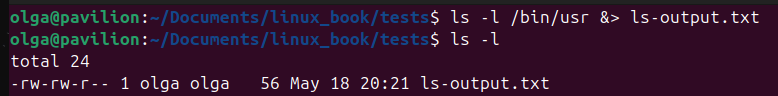

В данном примере используется единственный оператор &>, перенаправляющий стандартный вывод и стандартный вывод ошибок в файл ls-output.txt. Аналогично можно перенаправить стандартный вывод и стандартный вывод ошибок с добавлением в конец одного и того же файла:

*ls -l /bin/usr &>> ls-output.txt*

### ИМЕЙТЕ В ВИДУ, ЧТО ПОРЯДОК ПЕРЕНАПРАВЛЕНИЯ ИГРАЕТ ВАЖНУЮ РОЛЬ

Перенаправление стандартного вывода ошибок всегда должно производиться после перенаправления стандартного вывода, иначе этот трюк не сработает.

Следующий пример перенаправит стандартный вывод ошибок в файл ls-output.txt:
*> ls-output.txt 2>&1*

Если порядок перенаправления изменить, как показано ниже, стандартный вывод
ошибок будет перенаправлен на экран:

*2>&1 >ls-output.txt*

### Удаление нежелательного вывода

Чтобы подавить вывод сообщений об ошибках, достаточно выполнить следующую команду:

В Linux есть специальный файл /dev/null, куда можно перенаправить вывод. Этот файл представляет собой мусорную корзину, которая принимает любой ввод и ничего с ним не делает.

### Перенаправление стандартного ввода

## Команда cat

Команда cat позволяет прочитать содержимое одного или более файлов и скопировать его в стандартный вывод.

Для начала разобьем архив на части с помощью команды

split -b 1k -d -a 3 passwd.gz part_

Описание команды:

* split — команда для разбиения файлов на части

* -b 1k — задаёт размер каждой части: 1 килобайт (1024 байта)

* Файл будет разбит на куски по 1 КБ.

* -d — использовать числовые суффиксы вместо буквенных (по умолчанию используются буквы: xaa, xab и т.д., с этой опцией — x000, x001 и т.д.)

* -a 3 — длина суффикса в имени выходных файлов равна 3 символам (например, part_000, part_001, ...)

* passwd.gz — исходный файл, который нужно разбить.

* part_ — префикс для имён выходных файлов. Итоговые файлы будут называться part_000, part_001, part_002 и т.д.

Также команда cat позволяет объединять несколько файлов в один. В качестве примера создадим архив из разных частей.

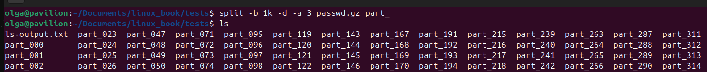

Теперь объединим их с помощью данной команды.

Заметим, что команда cat не удаляет части, их надо удалять вручную.

Теперь введем команду без аргументов и посмотрим, что получится.

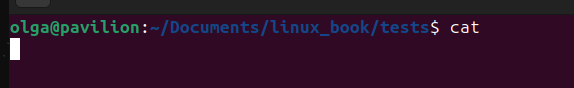

Ничего не произошло, однако, если писать что-то, команда будет считывать текст со стандартного ввода до нажатия сочетания CTRL+D, что вызовет END-OF-FILE.

В отсутствие аргументов с именами файлов cat копирует содержимое стандартного ввода в стандартный вывод, поэтому-то мы и увидели, как она повторила введенную нами строку. Эту ее особенность можно использовать для создания коротких текстовых файлов. Представьте, что вам потребовалось создать файл с именем eat_more.txt, содержащий текст из примера, приведенного выше. Сделать это можно было бы так:

Теперь, когда мы знаем, что команда cat может принимать данные не только из
файлов, указанных в аргументах, но и со стандартного ввода, попробуем выполнить перенаправление стандартного ввода:

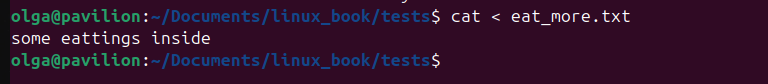

Используя оператор перенаправления <, мы изменили источник данных для стандартного ввода с клавиатуры на файл eat_more.txt. Как видите, результат получился тот же, как если бы мы просто передали единственный аргумент с именем файла. Этот способ не имеет никаких преимуществ в сравнении с передачей простого аргумента, но он демонстрирует, как можно использовать файлы в роли источника данных для стандартного ввода. Другие команды находят лучшее применение стандартному вводу.

### Pipes (пайпы)

С помощью пайпа | (вертикальная черта) стандартный вывод одной команды можно связать со стандартным вводом другой.
команда1 | команда2
Для демонстрации этого механизма нам понадобится несколько команд. Мы уже упоминали команду, которая может получать данные со стандартного ввода. Это команда less. Теперь используем less для постраничного отображения вывода любой команды, которая посылает свои результаты в стандартный вывод:

*ls -l /usr/bin | less*

Это очень удобно! С помощью этого приема можно со всем комфортом исследовать вывод любой команды, посылающей результаты на стандартный вывод.

### Фильтры

Пайпы часто используются для выполнения сложных операций с данными. Они позволяют объединить вместе несколько команд. Часто команды, используемые таким способом, называют фильтрами. Фильтры принимают ввод, изменяют его определенным образом и выводят результат. Первый из таких фильтров, который мы опробуем, — команда sort.

Представьте, что нам необходимо составить список всех выполняемых программ в каталогах /bin и /usr/bin, расположив их по алфавиту, и затем вывести его:
*ls /bin /usr/bin | sort | less*

Поскольку в команде указаны два каталога (/bin и /usr/bin), вывод команды ls будет состоять из двух сортированных списков, по одному для каждого каталога. Добавив команду sort в пайп, мы изменили данные, чтобы получить единый сортированный список.

Приведем другой пример, отсортируем строки в файле и выведем первые 10 строк.

Чтобы отсортировать в обратном порядке используется ключ -r

## РАЗЛИЧИЯ МЕЖДУ ≥ И |
С первого взгляда трудно понять разницу между пайпом | и оператором перенаправления >. Выражаясь простым языком, оператор перенаправления связывает команду с файлом, а пайп связывает вывод одной команды с вводом другой.

*команда1 > файл1*
*команда1 | команда2*

Многие, впервые познакомившись с идеей пайпов, пробуют проделать следующий трюк, «только чтобы посмотреть, что из этого получится»:

*команда1 > команда2*

Не повторяйте этот эксперимент: иногда он может стать причиной больших проблем.
Вот конкретный пример. Зарегистрировавшись как суперпользователь, человек выполнил следующую пару команд:

 *cd /usr/bin*
 *ls > less*

Первая команда выполнила переход в каталог, где хранится большинство программ, а вторая потребовала от командной оболочки очистить файл less и записать в него вывод команды ls. Так как в каталоге /usr/bin уже имеется файл с именем less (программа less), вторая команда затерла программу в файле less текстом, который вернула команда ls, и тем самым уничтожила программу less.

*Помните, что оператор перенаправления без лишних предупреждений создает или
затирает файлы, поэтому относитесь к нему с особым вниманием.*

### uniq — поиск или удаление повторяющихся строк

Команда uniq часто используется в комбинации с командой sort. uniq принимает сортированный список данных либо со стандартного ввода, либо из файла, имя которого можно передать в единственном аргументе и по умолчанию удаляет повторяющиеся строки из списка. Поэтому, чтобы гарантировать отсутствие дубликатов в нашем списке (то есть любых программ с одинаковыми именами в каталогах /bin и /usr/bin), добавим uniq в пайп. 

*ls /bin /usr/bin | sort | uniq | less*

В этом примере мы использовали uniq для удаления любых повторяющихся строк в выводе команды sort. Если бы нам потребовалось, наоборот, получить список дубликатов, мы добавили бы в команду uniq параметр -d:

*ls /bin /usr/bin | sort | uniq -d | less*

С помощью параметра -c можно подсчитать количество повторяющихся строк:

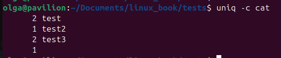

### wc — вывод числа строк, слов и байтов
Команда wc (word count — счетчик слов) используется для подсчета числа строк, слов и байтов в файлах. 
Например:

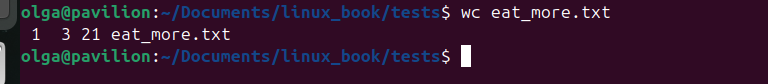

В данном случае команда вывела три числа: число строк, число слов и число байт в файле. Подобно предыдущим командам, она может вызываться без аргументов, и в этом случае wc будет принимать данные со стандартного ввода. 
Команду удобно использовать в пайпах для подсчета: например, подсчитать число элементов в нашем сортированном списке можно так:

Существуют ключи для вывода:

* -l количество строк
* -w количество слов
* -c количество символов

### grep — поиск строк, соответствующих шаблону

В данной главе мы рассматриваем только поиск по шаблону, остальные возможности будут рассмотрены в других главах книги.

Допустим, что нам нужно найти все файлы в списке программ, которые имеют в своем имени последовательность символов zip. Результаты такого поиска могут подсказать нам, какие программы в системе имеют отношение к сжатию файлов.

Сделать это можно так:

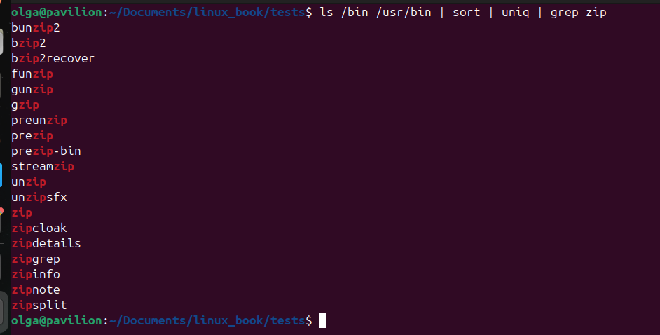

Команда grep имеет пару удобных параметров:
* -i требует от grep игнорировать регистр символов в процессе поиска (обычно поиск выполняется с учетом регистра символов);
* -v требует от grep выводить только строки, где совпадение с шаблоном не найдено.

### head/tail — вывод первых/последних строк из файлов

Иногда требуется выводить не все результаты работы команды, а только несколько первых или несколько последних строк. Команда head выводит первые 10 строк из
файла, а tail — последние 10 строк. По умолчанию обе команды выводят 10 строк текста, но это число можно изменить с помощью параметра -n:

Другой пример с пайпом:

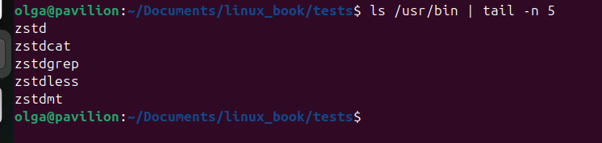

Команда tail позволяет наблюдать, как изменяется содержимое файла в режиме реального времени. Эту ее особенность удобно использовать для наблюдения
за появлением новых записей в файлах журналов. В следующем примере демонстрируется наблюдение за файлом messages в каталоге /var/log. В некоторых дистрибутивах Linux для этого требуется обладать привилегиями суперпользователя, поскольку файл /var/log/messages может содержать секретную информацию.

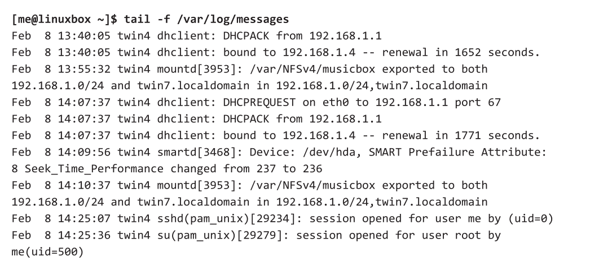

При вызове с параметром -f команда tail продолжает следить за файлом и при добавлении в конец этого файла новых строк немедленно выводит их. Так продолжается до тех пор, пока пользователь не нажмет комбинацию клавиш CTRL+C. 

### tee — чтение со стандартного ввода и запись в стандартный вывод и в файлы

Команда tee читает данные со стандартного ввода и копирует их в стандартный вывод (чтобы дать возможность передать их дальше через pipe) и в один или несколько файлов. Это позволяет, например, видеть вывод команды на экране и одновременно сохранять его в файл для последующего использования

Этa функция может пригодиться для сохранения промежуточных результатов обработки в пайпе. Ниже, продолжая один из предыдущих примеров, мы сохраним полный список файлов в каталогах в файле
ls.txt, перед тем как он будет отфильтрован командой grep:

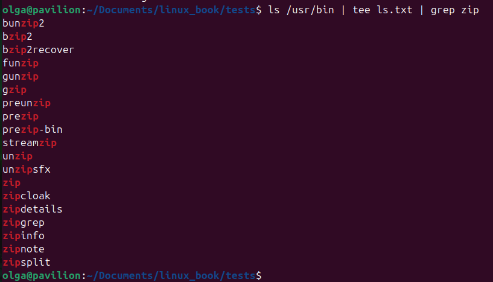

Или такой пример:

ls -la | tee output.txt

В этом случае список файлов будет выведен на экран и сохранён в файл output.txt

## Глава 7. Взгляд на мир глазами командной оболочки

### Подстановка

Каждый раз, когда вы вводите команду и нажимаете ENTER, bash производит несколько операций с текстом, прежде чем выполнит вашу команду. Мы уже видели пару примеров, где простая последовательность символов, например *, может много значить для командной оболочки. Процесс, который происходит при этом, называется подстановкой (expansion). То есть вы вводите что-то, и это что-то замещается чем-то другим, прежде чем командная оболочка продолжит обработку. Чтобы показать, что все это значит, возьмем для примера команду echo — встроенную команду, выполняющую очень простую операцию: она выводит свои текстовые аргументы в стандартный поток вывода.

Команда echo выводит любые переданные ей аргументы. Давайте рассмотрим ещё один пример.

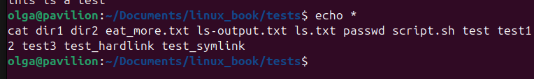

В данном примере echo не вывела *, потому что сам символ * означает последовательность любых символов. Перед тем, как выполнить команду echo, оболочка
замещает символ * чем-то другим (в данном случае именами файлов в текущем рабочем каталоге). После нажатия клавиши ENTER командная оболочка автоматически производит подстановку любых групповых символов в командной строке, прежде чем выполнить ее, поэтому команда echo не увидела * — она получила уже готовый результат после подстановки.

### Подстановка путей

Механизм работы групповых символов называется подстановкой пути (pathname expansion).

Приведем некоторые примеры. Допустим, содержимое каталога выгдядит вот так:

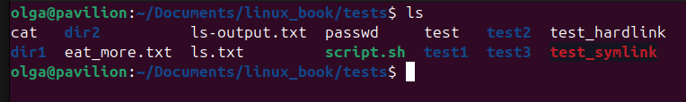

С помощью подстановок мы можем вывести все файлы, начинающиеся с какой-нибудь последовательности символов:

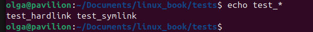

Или заканчивающиеся на какую-нибудь последовательности символов:

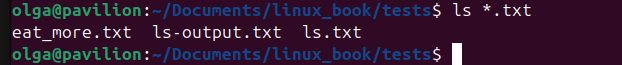

А теперь перейдём в домашний каталог и выведем всё, что начинается с заглавной буквы:

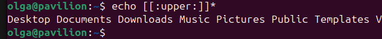

Можем даже вывести каталоги, которые находятся в других каталогах, используя подстановки и wildcards:

## Подстановка пути для скрытых файлов

Файлы с именами, начинающимися с точки, считаются скрытыми. Механизм подстановки пути также учитывает это. Как мы уже видели ранее, такая подстановка

echo * 

не покажет скрытые файлы.
На первый взгляд кажется, что можно было бы включить скрытые файлы в подстановку, добавив в начало шаблона точку, например:

echo .*

ls -d .* | less

Дело в том, что эти имена соответствуют текущему рабочему каталогу и родительскому каталогу, применение такого шаблона может привести к неправильным результатам. 

Чтобы обеспечить правильную подстановку пути в такой ситуации, следует использовать специализированный шаблон. Следующий шаблон действует правильно:

ls -d .[!.]?*

Этот шаблон замещается именами файлов, начинающимися с единственной точки, за которой следует любое количество других символов. Он будет работать правильно с большинством имен скрытых файлов (кроме тех, что начинаются с нескольких точек). Команда ls с параметром -A («almost all» — «почти все») выведет список всех скрытых файлов без ошибок (не выводит текущий рабочий каталог (точка) и родительский (две точки)).

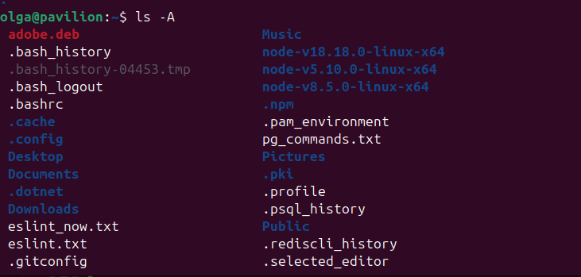

### Подстановка тильды

Тильда в начале слова - это домашний каталог пользователя. Можно данные по домашнему каталогу или по известному пользователю.

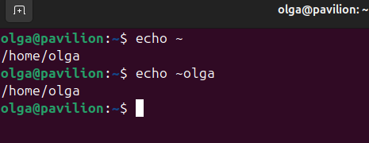

### Подстановка результатов арифметических выражений

Командная оболочка поддерживает также подстановку результатов арифметиче-
ских выражений. Это позволяет использовать командную строку как калькуля-
тор. Для подстановки арифметических выражений используется следующий формат:

$((выражение)) 

где выражение — это арифметическое выражение, состоящее из значений и арифметических операторов. Механизм подстановки арифметических выражений позволяет использовать только целые числа.

Приведём арифметические операции:

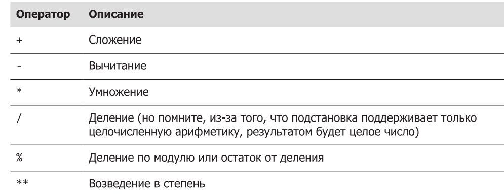

### Подстановка фигурных скобок

С помощью данной подстановки можно создавать большое количество разнообразных файлов. Например:

Внутри фигурных скобок находится список строк, разделенных запятыми, или диапазон целых чисел или одиночных символов. Использование пробелов внутри фигурных скобок не допускается.

Такая возможность может очень хорошо пригодиться для формирования списков файлов или каталогов, которые требуется создать.

### Подстановка параметров

Существуют различные предустановленные переменные в ОС Linux. Например, переменная с именем USER хранит ваше имя пользователя. Подстановка параметра и получение содержимого переменной USER выполняется следующим образом:

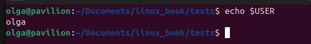

Чтобы увидеть список доступных переменных, выполните следующую команду:

*printenv | less*

Если в других вариантах подстановки допустить ошибку в шаблоне, подстановка не будет выполнена и команда echo просто выведет ошибочный шаблон. В случае с подстановкой параметров все иначе: если ошибиться в имени переменной, подстановка все равно будет выполнена, но результатом будет пустая строка:

### Подстановка команд

Подстановка команд позволяет использовать поток вывода команд в качестве аргументов других команд:

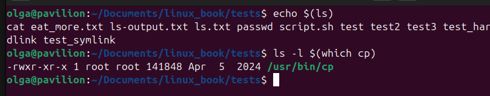

Интересн второй вывод: результат команды which cp передается как аргумент команде ls, благодаря чему мы получаем информацию о программе cp, не зная полного пути к ней.

Механизм подстановки команд имеет альтернативный синтаксис, унаследованный от более старых командных оболочек, который также поддерживается в bash. В нем вместо знака доллара и круглых скобок используются обратные апострофы:

### Экранирование

Экранирование - это механизм, который служит выборочного подавления нежелательной подстановки. Например, в первом выводе пробелы схлопываются, а во втором - вместо $1 подставляется пустая строка, потому что переменная с таким названием не найдена.

#### Двойные кавычки

Если заключить текст в двойные кавычки, все специальные символы потеряют свое
специальное значение и будут интерпретироваться как обычные символы. Исключение составляют: $ (знак доллара), \ (обратный слеш) и ` (обратный апостроф). То есть разбиение на слова, подстановка путей, подстановка тильды и подстановка фигурных скобок выполняться не будут, но подстановка параметров, подстановка значений арифметических выражений и подстановка команд все еще будут выполняться. Благодаря двойным кавычкам мы сможем обрабатывать имена файлов с пробелами.

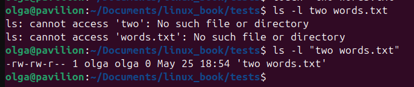

Запомните: подстановка параметров, подстановка значений арифметических выражений и подстановка команд все еще выполняются в двойных кавычках. Обратите внимание на вывод в кавычках и без:

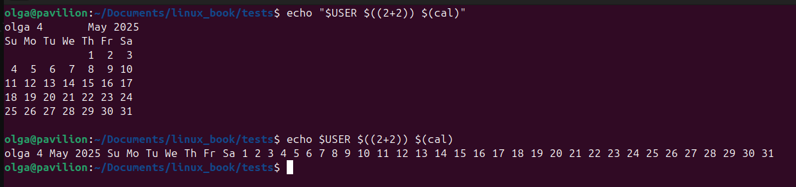

По умолчанию находятся пробелы, символы табуляции и символы перевода строки и интерпретирются как разделители слов. То есть вне кавычек упомянутые символы не считаются частью текста. Они являются лишь разделителями. Поскольку они делят слова на аргументы, получается, что в нашем примере командная строка состоит из команды и нескольких аргументов. Однако если добавить двойные кавычки, разбиение на слова выполняться не будет и внутренние пробелы не будут считаться разделителями — они станут частью аргумента.

#### Одиночные кавычки

Если вам требуется подавить все подстановки, используйте одиночные кавычки. Ниже для сравнения приводятся результаты неэкранированной команды и команды экранированной двойными и одиночными кавычками:

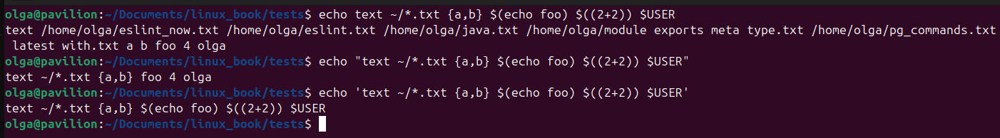

#### Экранирование символов

Чтобы заэкранировать один символ, перед ним надо добавить обратный слеш.

#### Управляющие последовательности

Обратный слеш используется не только в роли экранирующего символа, но и как часть специальных символов, которые называют управляющими кодами.

Некоторые символы:

\a --->> звуковой сигнал
\b --->> backspace
\n --->> перевод строки
\r --->> возврат каретки
\t --->> табуляция

Ключ -e команды echo позволяет интерпретировать данные коды. Их можно также заключать в конструкцию $' '. Ниже демонстрируется использование команды sleep для создания таймера - пользователь ждет указанное число секунд, и программа завершается. В примере указаны два варианты использования синтаксиса.

## Глава 8. Продвинутые приемы работы с клавиатурой

### Перемещение курсора

Ниже перечислены комбинации клавиш, используемые для перемещения курсора.

### Редактирование текста

Ниже перечислены комбинации клавиш, используемые для редактирования текста.

Ниже перечислены комбинации клавиш, используемые для вырезания и вставки текста.

### Донабор текста, клавиша TAB

Если в процессе работы в консоли нажать клавишу TAB, то команда дополняется до существующих вариантов. Например: 

Если сейчас нажать клавишу TAB, то пользователь увидит команду *ls passwd*. Это очень полезная функция, которая помогает сэкономить кучу времени во время набора команд.

Приведем некоторые сочетания клавиш, которые помогут в донаборе текста.

### Просмотр истории команд

Bash поддерживает историю вводившихся команд. Этот список команд хранится в домашнем каталоге, в файле с именем .bash_history. История команд помогает уменьшить объем ручного ввода, особенно в сочетании с командами редактирования командной строки.

###  Поиск в истории
Просмотреть содержимое истории можно в любой момент с помощью команды:

*history | less*

По умолчанию bash хранит последние 500 введенных команд, однако в большинстве современных дистрибутивов этот предел увеличен до 1000.

А теперь представим, что вам понадобилось найти команды, использовавшиеся для получения списка содержимого /usr/bin. Вот один из возможных способов:

А теперь представим, что среди результатов нужно выбрать запись с интересующей вас командой:

1545  ls -l /usr/bin > ls-output.txt

Здесь число 1545 — это порядковый номер записи команды в списке истории. Можно вызвать конкретно эту команду вот таким способом.

bash также дает возможность выполнять поступательный поиск в списке истории. Это означает, что bash может выполнять поиск в списке истории по мере ввода символов, уточняя результаты с вводом каждого нового символа. Чтобы запустить поступательный поиск, нажмите комбинацию CTRL+R и введите искомый текст. Закончив поиск, нажмите ENTER, чтобы выполнить команду, или CTRL+J, чтобы скопировать запись из списка истории в текущую командную строку. Чтобы найти следующее вхождение текста (переместиться «вверх» по списку истории), нажмите CTRL+R еще раз. Чтобы завершить поиск, нажмите CTRL+G или CTRL+C.

Некоторые команды для работы с историей:

### Подстановка записей истории

Командная оболочка поддерживает специализированный вид подстановки — подстановку записей из списка истории при использовании символа !. Мы уже видели, как восклицательный знак, сопровождаемый числом, замещается записью из списка истории.
Приведем команды постановки:

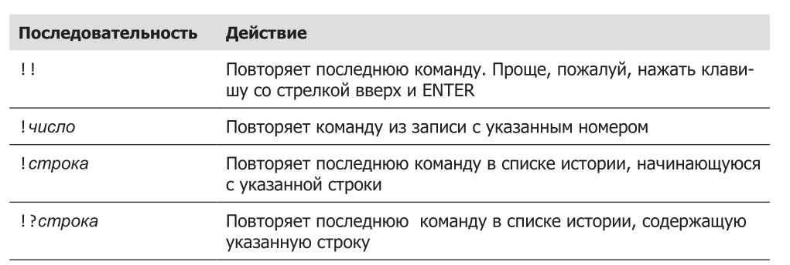

Не используйте формы !строка и !?строка, если только вы абсолютно точно не знаете содержимого записей в списке истории.

### Запись истории команд в файл

В дополнение к истории команд в bash большинство дистрибутивов Linux включают программу script, которую можно использовать для записи в файлы целых сеансов работы с командной оболочкой. Базовый синтаксис команды:

script [файл]

где файл — это имя файла для записи. Если файл не будет указан, сохранение
сеанса будет произведено в файл typescript.

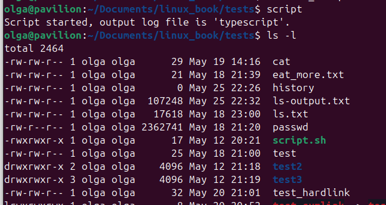

Выход из записи и сохранение данных в файл делается с помощью ключевого слова exit. 

Вот так выглядит история команд. записанная в файл с дефолтным именем typescript в программе nano.

