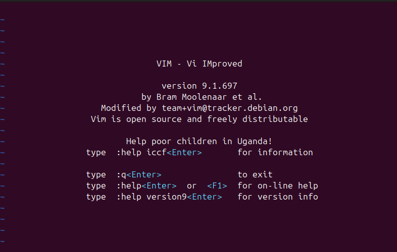
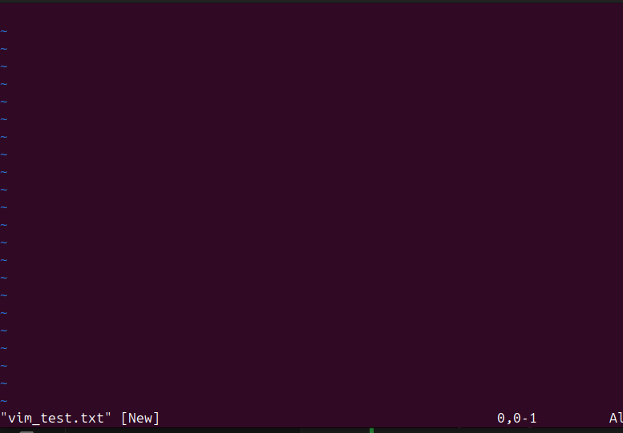
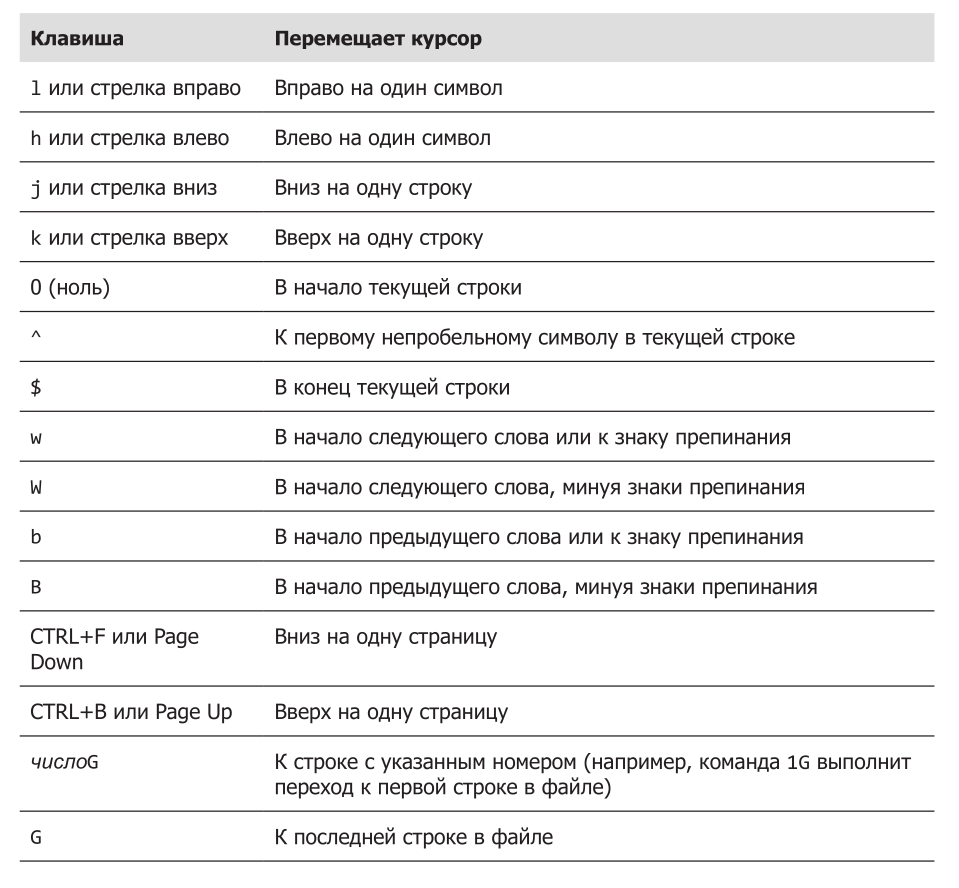
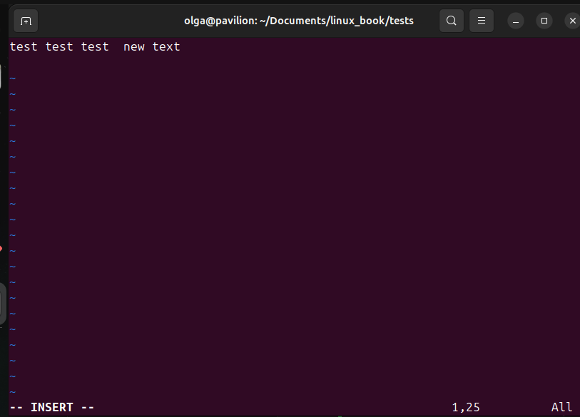
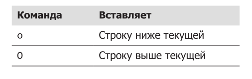
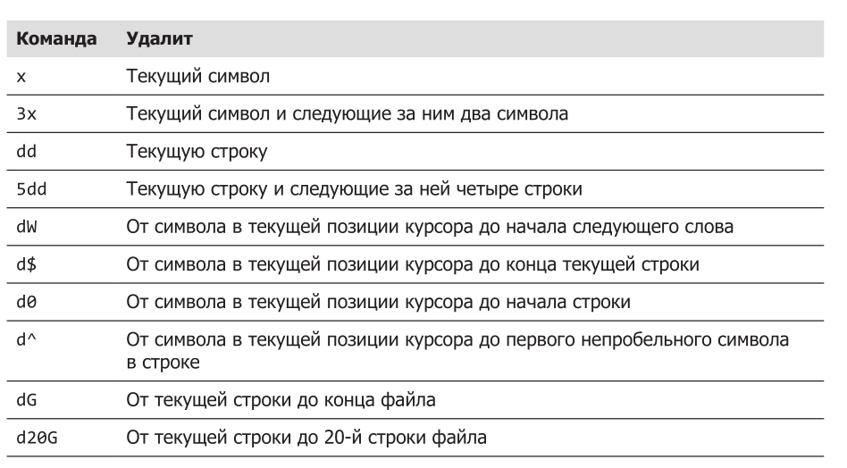
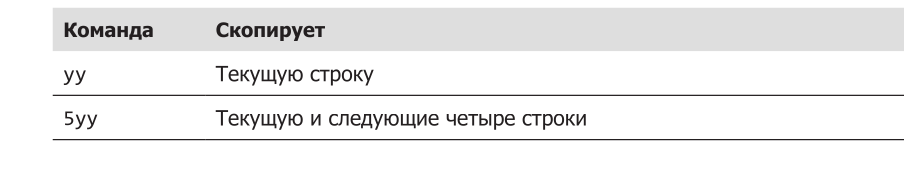
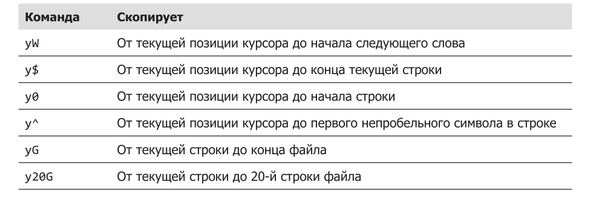
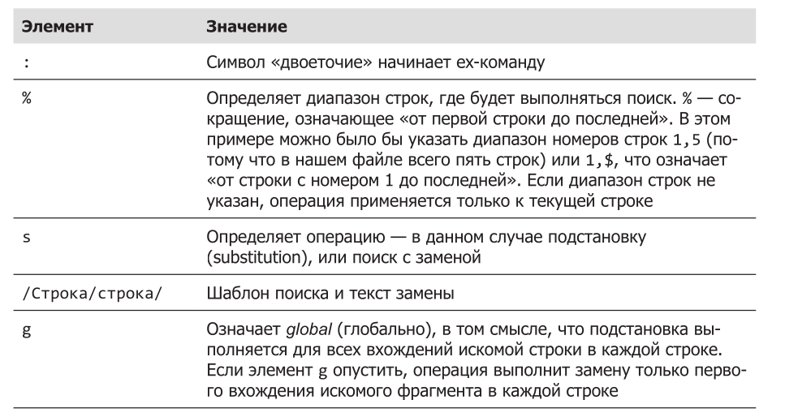
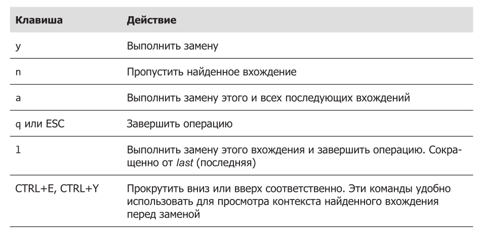

## Содержание

## Часть II Окружение и настройка
- [Глава 11. Окружение](#глава-11-окружение)
- [Глава 12. Плавное введение в vi](#глава-12-плавное-введение-в-vi)

### Глава 11. Окружение

Командная оболочка на протяжении всего сеанса работы использует массу информации, которая называется окружением. Данные, хранящиеся в окружении, используются программами для выяснения деталей конфигурации системы. Даже притом, что для хранения своих настроек большинство программ использует конфигурационные файлы, некоторые программы также учитывают значения, хранящиеся в окружении. Зная это, можно использовать окружение для настройки некоторых параметров командной оболочки.

В этой главе мы будем работать со следующими командами:  

printenv — выводит часть или все окружение;  
set — устанавливает параметры командной оболочки;  
export — экспортирует окружение для программ, которые будут выполняться позднее;  
alias — создает псевдоним команды.  

### Что хранится в окружении?

Командная оболочка хранит в окружении данные двух основных типов - переменные командной оболочки и переменные окружения, хотя bash практически не делает различий между типами. Переменные командной оболочки — это фрагменты данных, инициализируемые командой bash, а переменные окружения — практически все остальное.

### Исследование окружения

Увидеть, что хранится в окружении, можно при помощи встроенной в bash команды set или программы printenv. 

Команда set выводит переменные обоих видов — командной оболочки и окружения, — тогда как printenv выводит только последние. Так как список содержимого окружения очень велик, его лучше просматривать, передавая вывод любой из команд через пайп в less:

printenv | less

Запустив эту команду, вы должны увидеть нечто похожее:

Это список переменных окружения с их значениями. Например, в списке можно увидеть переменную с именем USER, содержащую значение olga. Команда printenv может также вывести значение конкретной переменной:

Команда set при вызове без параметров и аргументов выводит переменные обоих типов — командной оболочки и окружения, — а также все объявленные функции командной оболочки.

set | less

Получить значение единственной переменной можно также с помощью команды echo, например:

Единственный элемент окружения, который не выводится командами set и printenv, это псевдонимы. Чтобы вывести список псевдонимов, используйте коман­ду alias без аргументов:

### Некоторые интересные переменные

Окружение содержит довольно много переменных, и хотя ваше окружение может отличаться от представленного здесь, вы почти наверняка увидите у себя переменные, перечисленные ниже.

Не волнуйтесь, если какие-то переменные у вас отсутствуют. Они могут отличаться в разных дистрибутивах.

### Как устанавливается окружение?

Когда мы входим в систему, запускается программа bash и читает содержимое серии конфигурационных сценариев, называемых файлами запуска (startup files), где определяется окружение по умолчанию, общее для всех пользователей. Затем она читает дополнительные файлы запуска в вашем домашнем каталоге, где
определяется личное окружение. Точная последовательность обработки файлов зависит от типа запускаемого сеанса командной оболочки. Сеансы работы с командной оболочкой входа могут быть двух типов.

* Сеанс командной оболочки входа (login shell session) — это сеанс, который на входе запрашивает имя пользователя и пароль, например, когда вход выполняется в виртуальной консоли.

* Сеанс простой командной оболочки (non-login shell session) обычно начинается, когда запускается терминал в графическом окружении.

Командные оболочки входа читают один или несколько файлов запуска, перечисленных ниже.

Обычные сеансы командной оболочки читают файлы, перечисленные ниже.

.bash_profile выполняется один раз при входе пользователя в систему (login shell). В этот файл обычно помещают настройки, которые должны происходить единожды при старте сессии, например настройка переменных окружения (PATH, EDITOR и т.п.). Он отвечает за конфигурацию среды именно при авторизации пользователя, например при входе в консоль или SSH

.bashrc выполняется при запуске каждого нового интерактивного терминала (non-login shell). Это значит, что если вы уже вошли в систему и открываете новое окно терминала, он выполнит команды из .bashrc. В этом файле обычно хранятся настройки для интерактивной работы — псевдонимы, функции, настройки приглашения командной строки и прочее, что нужно применять в каждом терминальном сеансе.

На практике часто делают так, чтобы .bash_profile вызывал .bashrc для загрузки настроек, чтобы не дублировать код:

if [ -f ~/.bashrc ]; then
  source ~/.bashrc
fi

Помимо чтения настроек из файлов запуска, перечисленных выше, обычные командные оболочки наследуют окружение от родительского процесса, каковым обычно является командная оболочка входа. С точки зрения обычного пользователя, файл ~/.bashrc является, пожалуй, самым важным файлом запуска, потому что его содержимое читается практически всегда. Обычные командные оболочки читают его по умолчанию, а большинство файлов запуска для командных оболочек входа написаны так, что оболочка также
прочитает файл ~/.bashrc.

### Что находится в файлах запуска?

Если заглянуть внутрь типичного файла .profile (Ubuntu), можно увидеть следующее:

Определение пользовательского окружения и запуск программ
PATH=$PATH:$HOME/bin
export PATH

Строки, начинающиеся с #, — это комментарии, они не читаются командной оболочкой, а предназначены для человека. Первый интересный фрагмент начинается сразу после комментариев:

if [ -f ~/.bashrc ]; then
. ~/.bashrc
fi 

Если файл ~/.bashrc существует, тогда прочитать файл ~/.bashrc file.

Важный момент!

Можно вызывать bashrc из profile, чтобы не дублировать настройки, что, в принципе, и показано выше.

Как видите, этот фрагмент вынуждает командную оболочку входа прочитать содержимое файла .bashrc. Следующая операция, выполняемая в файле запуска, имеет отношение к переменной PATH.

Приходилось ли вам задумываться над тем, как командная оболочка находит коман­ды, которые вводятся в командной строке? Например, когда мы вводим ls, командная оболочка не обыскивает весь компьютер целиком, чтобы найти /bin/ls (полный путь к команде ls), а просматривает только каталоги, перечисленные
в переменной PATH.

Переменная PATH часто (но не всегда, в зависимости от дистрибутива) устанавливается в файле запуска /.etc/profile, как показано ниже:

PATH=$PATH:$HOME/bin

Здесь в конец списка в переменной PATH добавляется каталог $HOME/bin. Этот код может служить примером использования механизма подстановки параметров, с которым мы познакомились ранее. 

Для демонстрации попробуйте выполнить следующий пример:  

[me@linuxbox ~]$ foo="This is some"  
[me@linuxbox ~]$ echo $foo  
This is some  
[me@linuxbox ~]$ foo=$foo" text."  
[me@linuxbox ~]$ echo $foo  
This is some text.  

Используя этот прием, можно добавлять текст в конец содержимого пере­менной. При добавлении строки $HOME/bin в конец содержимого переменной PATH происходит добавление каталога $HOME/bin в список каталогов, где будет выполняться поиск вводимых команд. Это означает, что если мы решим создать каталог в своем домашнем каталоге для хранения личных программ, командная оболочка уже будет готова к этому. Нам останется только дать имя bin этому каталогу.

### ПРИМЕЧАНИЕ

Многие дистрибутивы предоставляют настройки PATH по умолчанию. Некоторые дистрибутивы на основе Debian, такие как Ubuntu, проверяют наличие каталога ~/bin во время входа, и если он имеется, динамически добавляют его в переменную PATH.

Наконец, у нас осталась еще одна строка:  
export PATH  

Команда export указывает командной оболочке сделать содержимое переменной PATH доступным дочерним процессам этой оболочки.

### Изменение окружения

Теперь, зная, где находятся файлы запуска и что они содержат, мы можем изменить их, чтобы настроить окружение.

### Какие файлы следует изменять?

Как правило, изменение содержимого переменой PATH или определение дополнительных переменных окружения следует производить в файле .bash_profile (или эквивалентном ему, в зависимости от дистрибутива, — например, в Ubuntu используется файл .profile). Во всех остальных случаях изменения должны производиться в .bashrc.

### Текстовые редакторы

Для редактирования (то есть изменения) файлов запуска командной оболочки, а также большинства других конфигурационных файлов в системе используется программа, которая называется текстовым редактором. Текстовый редактор, подобно текстовому процессору, позволяет редактировать слова на экране, перемещая курсор. От текстового процессора эта программа отличается только поддержкой простого текста и нередко наличием особенностей, необходимых при разработке программ. Текстовые редакторы — основной инструмент, используемый программистами для создания программного кода и системными администраторами для управления конфигурационными файлами, определяющими настройки системы.

Текстовые редакторы делятся на две основные категории: с графическим и с текстовым интерфейсом. Оба окружения рабочего стола, GNOME и KDE, включают несколько популярных редакторов с графическим интерфейсом. В состав GNOME входит редактор с названием gedit, который в меню GNOME обычно
называется Text Editor (Текстовый редактор). Вместе с KDE обычно распространяется три редактора (в порядке увеличения сложности): kedit, kwrite и kate. Существует множество редакторов с текстовым интерфейсом. 

Наиболее популяр­ные из них, с которыми, возможно, вы столкнетесь: nano, vi и emacs. Редактор
nano — простой в использовании редактор, созданный как замена редактору pico, поставляемому в составе пакета программ для работы с электронной почтой PINE. Редактор vi (в большинстве систем Linux его замещает программа vim, название которой является сокращением от Vi IMproved (Vi улучшенный)) — традиционный редактор для Unix-подобных систем. 

### Использование текстового редактора

Любой текстовый редактор можно запустить из командной строки, введя имя редактора и имя файла, который требуется отредактировать. Если указанный файл не существует, редактор решит, что вы хотите создать новый файл. Ниже приводится пример использования gedit:

[me@linuxbox ~]$ gedit some_file

Эта команда запустит текстовый редактор gedit и загрузит в него файл с именем some_file, если таковой существует. Все текстовые редакторы с графическим интерфейсом имеют интуитивно понятный интерфейс, поэтому мы не будем описывать их здесь. Вместо этого сосредоточимся на редакторе с текстовым интерфейсом nano. Давайте запустим nano и внесем изменения в файл .bashrc. Но перед этим поговорим немного о мерах предосторожности. Всякий раз, собираясь редактировать важный конфигурационный файл, создайте сначала его резервную копию. Это обезопасит вас, если в процессе редактирования вы безнадежно испортите содержимое файла. 

Чтобы создать резервную копию файла .bashrc, выполните следующую команду:
[me@linuxbox ~]$ cp .bashrc .bashrc.bak

Неважно, как вы назовете файл с резервной копией; просто дайте ему такое имя, чтобы было понятно, что это за файл. Наиболее часто для имен файлов с резервными копиями используются расширения .bak, .sav, .old и .orig. Да, и не забудьте, что команда cp без лишних вопросов затирает существующие файлы.

### ВАЖНОСТЬ КОММЕНТАРИЕВ

Всякий раз, изменяя конфигурационные файлы, добавляйте краткие комментарии, описывающие эти изменения. Вне всяких сомнений, вы будете помнить назначение своих изменений завтра, но вспомните ли вы об этом через шесть месяцев? Сделайте себе подарок, добавьте несколько комментариев. Кроме того, хорошо бы завести файл журнала и в нем фиксировать произведенные изменения. Комментарии в сценариях на языке командной оболочки и в файлах запуска начинаются с символа #. В других конфигурационных файлах для этой цели могут использоваться другие символы. Комментарии можно найти в большинстве конфигурационных файлов. Используйте их как руководство.

### Активация изменений

Изменения, произведенные в файле .bashrc, не вступят в силу, пока вы не закроете терминал и не запустите новый, потому что оболочка читает содержимое файла .bashrc только в начале сеанса. Однако существует возможность принудить bash повторно прочитать измененный файл .bashrc следующей командой:

[me@linuxbox ~]$ source .bashrc

Например, в файл .bashrc можно добавить строку alias test='pwd –color=auto' как алиас, и после активауии изменений проверить работу алиаса таким образом: 

[me@linuxbox ~]$ test

### Глава 12. Плавное введение в vi

## Зачем осваивать vi

* vi всегда под рукой. Он может прийти на помощь в системах, где отсутству-
ет графический интерфейс, например, на удаленном сервере или в локальной
системе с нерабочей конфигурацией X. Редактор nano, хотя и чрезвычайно по-
пулярен, все же недостаточно универсален. POSIX, стандарт программной со-
вместимости систем Unix, требует наличия в них vi.

POSIX - стандарт, который делает разные ОС похожими для программ, чтобы программы могли работать везде, где соблюдается этот стандарт. Говоря простым языком, POSIX - это "общее правило" для ОС, чтобы программы легко переносились между ними и корректно работали. 

* vi легковесный и быстрый. Для многих задач гораздо проще запустить vi, чем
найти в меню редактор с графическим интерфейсом и ждать, пока несколько
мегабайтов загрузится в память. Кроме того, vi специально проектировался
для скоростного ввода с клавиатуры. Как будет показано ниже, опытный поль-
зователь vi никогда не отрывает рук от клавиатуры во время редактирования.

## Немного предыстории

Первая версия vi была написана Билли Джоем, студентом Калифорнийского университета в городе Беркли, который позднее стал сооснователем Sun Microsystems
в 1976 году. Название vi произошло от слова visual (экранный), потому что редактор предназначался для редактирования на экране видеотерминала с возможностью перемещения курсора по всей его поверхности. 

До экранных редакторов существовали строчные редакторы, позволяющие редактировать текст только по одной строке. Чтобы внести изменения в строчном редакторе, нужно было сначала перейти к требуемой строке, а затем описать требуемое изменение: добавление или удаление текста. С появлением видеотерминалов (взамен терминалов с печатающим устройством, таких как телетайпы) стало возможным визуальное редактирование на экране.

В действительности vi включает в себя мощный строчный редактор ex, и его можно использовать для ввода команд во время работы в vi. Большинство дистрибутивов Linux содержат не настоящий редактор vi, а его улучшенную замену с именем vim (сокращенно от Vi IMproved — Vi улучшенный), созданную Брамом Моленаром (Bram Moolenaar). vim намного совершеннее традиционного редактора vi и в системах Linux обычно используется под символической ссылкой (или псевдонимом) vi. В пояснении ниже будет предполагаться, что у вас есть программа с именем vi, которая в действительности является редактором vim.

## Запуск и завершение vi

Чтобы запустить vi, введите следующую команду:
[me@linuxbox ~]$ vi
На экране должно появиться:

## РЕЖИМ СОВМЕСТИМОСТИ

В примере выше, где показан экран, который выводится сразу после запуска vim,
можно заметить текст: «Running in Vi compatible mode» (запущен в режиме совместимости с vi). Это означает, что vim был запущен в режиме, близко повторяющем
обычное поведение vi, а не в расширенном режиме vim. Чтобы беспрепятственно
следить за нитью повествования в этой главе, запустите vim в расширенном режиме. Для этого в вашем распоряжении имеется пара возможностей. Попробуйте
запустить редактор командой vim вместо vi. Если этот прием сработает, подумайте
о том, чтобы добавить псевдоним vi='vim' в свой файл .bashrc. Или выполните
следующую команду, чтобы добавить строку в конфигурационный файл vim:
echo "set nocp" >> ~/.vimrc

В разных дистрибутивах Linux vim упакован по-разному. В некоторых по умолчанию
устанавливается минимальная версия vim, поддерживающая лишь ограниченный
набор возможностей. Поэтому, выполняя примеры из этой главы, вы можете
столкнуться с отсутствием некоторых возможностей, — в этом случае просто
установите полную версию vim.

Важным моментом является выход из vim, потому что он делается не так, как в привычных редакторах. Для выхода наберите данное сочетание:

:q!

## СОВЕТ

Если вы «заблудились» в vi, попробуйте дважды нажать ESC, чтобы вернуться
на верный путь.

## Режимы редактирования

Давайте снова запустим vi, но на этот раз укажем имя несуществующего файла.
Именно так можно с помощью vi создать новый файл:

[me@linuxbox ~]$ vi vim_test.txt
В случае успеха на экране должно появиться следующее:

Начальные символы тильды (~) сообщают об отсутствии текста в соответствующих
строках. Таким способом vi сообщает нам, что файл пуст. Не вводите пока ничего!
Вторая важная вещь, которую нужно усвоить (после того, как вы научились выходить), — vi является режимным редактором. Сразу после запуска vi оказывается в командном режиме. В этом режиме практически каждая клавиша является командой, поэтому если вы начнете ввод, vi может запутаться сам и запутать вас.

## Переход в режим вставки

Чтобы добавить какой-то текст в файл, необходимо сначала перейти в режим
вставки. Для этого нажмите клавишу i. Вслед за этим, если vim работает в обычном
расширенном режиме, в нижней части экрана появится надпись (она не появится,
если редактор работает в режиме совместимости с vi):
-- INSERT --

Теперь можно ввести какой-нибудь текст. Попробуйте, например:

Съешь же ещё этих мягких французских булок, да выпей чаю.

Чтобы выйти из режима вставки и вернуться в командный режим, нажмите ESC.

## Сохранение изменений
Чтобы сохранить изменения в файл, введите ex-команду, находясь в командном
режиме. Для этого нажмите клавишу :. После этого в нижней части должен по-
явиться символ двоеточие:

:

Чтобы выполнить запись изменений в файл, вслед за двоеточием введите w и нажмите ENTER:

:w
Файл будет записан на жесткий диск, и в нижней части появится подтверждение.

## СОВЕТ

Если заглянуть в документацию к vim, можно заметить, что (по непонятной причине) командный режим в ней называется нормальным режимом, а ex-команды называются командным режимом. Имейте эту неточность в виду.

## Перемещение курсора

Находясь в командном режиме, vi предлагает большое число команд управления
курсором, часть из которых также используется программой less. Ниже перечислены некоторые из этих команд.

Почему для перемещения курсора были выбраны клавиши h, j, k и l? Потому что,
когда был написан редактор vi, не все видеотерминалы имели кнопки со стрелками на клавиатуре. Таким образом, опытные пользователи, хорошо владеющие
клавиатурой, могли управлять курсором, не отрывая пальцев от клавиш.

Многие команды в vi могут начинаться с числа, как команда G. Добавляя число в команду, можно указать, сколько раз она должна быть выполнена. Например, команда 5j переместит курсор на пять строк вниз.

## Основы редактирования

Редактирование в основном заключается в нескольких простых операциях, таких как вставка текста, удаление текста и перемещение фрагментов текста с применением операций вырезания и вставки. Конечно же, vi поддерживает все эти операции своим неповторимым способом. vi поддерживает ограниченную форму отмены. Если нажать клавишу u в командном режиме, vi отменит последнее выполненное изменение. Это пригодится нам, когда мы будем пробовать некоторые
простые команды редактирования.

## Добавление текста в конец

vi поддерживает несколько способов входа в режим вставки. Мы уже использовали команду i для вставки текста.

Если попытаться добавить текст в конец приложения, можно обнаружить, что
команда i не позволяет сделать это, не давая переместить курсор за конец строки. vi поддерживает команду добавления текста в конец, разумно названную a.
Если переместить курсор в конец строки и ввести a, курсор переместится за конец строки и vi перейдет в режим вставки. Добавьте новый текст.

Сначала командой 0 (ноль) переместите курсор в начало строки. Затем введите A
и добавьте новые строки текста. Снова нажмите клавишу ESC, чтобы выйти из режима вставки. Как видите, команда A очень удобна, потому что помещает курсор в конец строки перед переходом в режим вставки.

## Вставка строки

Другой способ вставки текста — вставка строк. Он позволяет вставить пустую строку между двумя имеющимися строками и перейти в режим вставки. Данный способ предлагает два варианта вставки, перечисленные в таблице ниже.

Рассмотрим действие этих команд на следующих примерах: поместите курсор
в строку с текстом Строка 3 и введите o.

Съешь же ещё этих мягких французских булок, да выпей чаю. Это классно.
Строка 2
Строка 3
Строка 4
Строка 5

Под третьей строкой появилась пустая строка, и редактор перешел в режим вставки. Выйдите из режима вставки нажатием ESC. Введите u, чтобы отменить изменения. 

Введите O, чтобы вставить пустую строку выше курсора:
Съешь же ещё этих мягких французских булок, да выпей чаю. Это классно.
Строка 2
Строка 3
Строка 4
Строка 5

Выйдите из режима вставки нажатием ESC и введите u, чтобы отменить изме­нения.

## Удаление текста

Как можно догадаться, vi предлагает несколько способов удаления текста, и все
они требуют нажатия одной или двух клавиш. Первый способ: команда x удаляет
символ в позиции курсора. Команде x может предшествовать число, определяющее количество удаляемых символов. Команда d более универсальна. Команде d
также может предшествовать число, определяющее количество операций удаления. Кроме того, команда d всегда сопровождается командой перемещения курсора, управляющей размером удаляемой области. В таблице ниже приводятся несколько примеров команды удаления.

Поместите курсор на слово Это в первой строке. Вводите x, пока текст до конца
предложения не будет удален. Затем введите несколько раз команду u, чтобы отменить удаление.

## ПРИМЕЧАНИЕ

Настоящий редактор vi поддерживает отмену только самой последней команды.
vim поддерживает отмену множества команд.

Теперь давайте проведем операцию удаления еще раз, но теперь воспользуемся
командой d. Снова установите курсор на слово Это и введите dW, чтобы удалить
слово:

Съешь же ещё этих мягких французских булок, да выпей чаю. классно.
Строка 2
Строка 3
Строка 4
Строка 5

Введите d$, чтобы удалить все от текущей позиции курсора до конца строки:
Съешь же ещё этих мягких французских булок, да выпей чаю.

Строка 2
Строка 3
Строка 4
Строка 5

Введите dG, чтобы удалить все от текущей строки до конца файла:
~
~
~
~
~
Введите u три раза, чтобы отменить операции удаления.

## Вырезание, копирование и вставка текста

Команда d не просто удаляет текст, она «вырезает» его. Каждый раз, когда выполняется команда d, удаленный текст копируется в буфер вставки (своего рода буфер обмена — clipboard), откуда позднее его можно извлечь командой p и вставить
правее позиции курсора или левее — командой P. Команда y выполняет копирование (yank) текста в буфер вставки почти так же, как команда d. В таблице ниже перечислены некоторые примеры комбинирования коман­ды y с разными командами перемещения курсора.

Давайте попробуем что-нибудь скопировать и вставить. Поместите курсор на пер-
вую строку и введите yy, чтобы скопировать текущую строку. Далее, переместите
курсор в последнюю строку (G) и введите p, чтобы вставить скопированную стро-
ку ниже текущей:

Съешь же ещё этих мягких французских булок, да выпей чаю. Это классно.
Строка 2
Строка 3
Строка 4
Строка 5
Съешь же ещё этих мягких французских булок, да выпей чаю. Это классно.
Введите команду u, чтобы отменить изменение. Оставив курсор в последней стро-
ке, введите P, чтобы вставить текст выше текущей строки:

Съешь же ещё этих мягких французских булок, да выпей чаю. Это классно.
Строка 2
Строка 3
Строка 4
Съешь же ещё этих мягких французских булок, да выпей чаю. Это классно.
Строка 5

## Объединение строк

vi очень строго относится к понятию строки. Обычно он не дает возможности переместить курсор в конец строки и удалить символ конца строки, чтобы объединить текущую строку со следующей за ней. По этой причине в vi была добавлена
специальная команда J (не путайте с командой j, которая перемещает курсор на
одну строку вниз) для объединения строк.

Если поместить курсор в третью строку и ввести команду J, получится следующее:
Съешь же ещё этих мягких французских булок, да выпей чаю. Это классно.
Строка 2
Строка 3 Строка 4
Строка 5

## Поиск и замена

Редактор vi имеет возможность перемещать курсор, опираясь на результаты поиска. Он может это делать в пределах одной строки или всего файла. Он может также выполнять замену текста с подтверждением или без подтверждения пользователя.

## Поиск в пределах строки

Команда f выполняет поиск в строке и перемещает курсор к следующему вхождению указанного символа. Например, команда fa переместит курсор к следующему
вхождению символа a в текущей строке. После выполнения операции поиска символа в строке ее можно повторить, введя точку с запятой.

## Поиск во всем файле

Для перемещения курсора к следующему вхождению слова или фразы используется команда /. Она действует точно так же, как в программе less, о которой рассказывалось в главе 3. После ввода команды / в нижней части экрана появится прямой слеш, вслед за которым нужно ввести искомое слово или фразу и нажать ENTER. После этого курсор переместится к следующему вхождению искомой строки. Поиск
следующего вхождения той же строки можно повторить командой n. Например:

Съешь же ещё этих мягких французских булок, да выпей чаю. Это классно.
Строка 2
Строка 3
Строка 4
Строка 5
Поместите курсор в первую строку и введите
/Строка
затем нажмите ENTER. Курсор переместится в строку 2. Затем введите команду n,
и курсор переместится в строку 3. С каждой следующей командой n курсор будет перемещаться вниз по файлу, пока не достигнет последнего вхождения искомого
фрагмента. В примерах выше мы использовали для поиска только слова и фразы,
однако vi позволяет применять регулярные выражения — очень мощное средство
выражения сложных шаблонов текста. О них мы поговорим в других главах.

## Глобальный поиск и замена

Для выполнения поиска с заменой (в vi эта операция называется подстановкой)
в диапазоне строк или во всем файле vi использует ex-команды. Например, заменить слово Строка словом строка во всем файле можно следующей командой:

:%s/Строка/строка/g

Давайте разобьем эту команду на элементы и рассмотрим их по отдельности.

После выполнения поиска с заменой наш файл будет выглядеть так:
Съешь же ещё этих мягких французских булок, да выпей чаю. Это классно.
строка 2
строка 3
строка 4
строка 5

В команде подстановки можно указать, что она должна запрашивать подтвержде-
ние у пользователя перед заменой. Для этого добавьте символ c в конец команды.
Например:

:%s/строка/Строка/gc

Эта команда вернет содержимое файла в прежнее состояние, но перед каждой за-
меной vi будет останавливаться и спрашивать подтверждение, выдавая следую-
щее сообщение:

заменить на Строка? (y/n/a/q/l/^E/^Y)

В круглых скобках перечислены возможные варианты ответов, описание которых
приводится в таблице ниже.

## Редактирование нескольких файлов

Иногда бывает необходимо редактировать сразу несколько файлов. Например,
может понадобиться внести изменения в файлы или скопировать содержимое из
одного файла в другой. Редактор vi позволяет открыть несколько файлов, перечислив их в командной строке:

vi файл1 файл2 файл3...

Давайте закроем текущий сеанс работы vi и создадим новый файл для редактирования. Введите :wq, чтобы выйти из vi с сохранением изменений в тексте. Далее,
создайте новый файл в домашнем каталоге, который мы будем использовать в наших экспериментах. Создайте файл, захватив в него вывод команды ls:

[me@linuxbox ~]$ ls -l /usr/bin > ls-output.txt
Теперь откройте в vi старый и новый файлы:
[me@linuxbox ~]$ vi foo.txt ls-output.txt
После запуска vi вы увидите на экране первый файл:

Съешь же ещё этих мягких французских булок, да выпей чаю. Это классно.
Строка 2
Строка 3
Строка 4
Строка 5

## Переключение между файлами
Чтобы переключиться с одного файла на следующий, выполните ex-команду:

:bn
Чтобы вернуться обратно, в предыдущий файл, выполните:
:bp

Теперь мы можем переключаться между файлами, но vi проводит политику, запрещающую переключаться между файлами, если в текущем файле имеются несохраненные изменения. Чтобы заставить vi переключиться между файлами с потерей всех несохраненных изменений, добавьте в команду восклицательный знак (!).

В дополнение к методам переключения между файлами, описанным выше, vim
(и некоторые версии vi) предоставляет дополнительные ex-команды, упрощающие управление множеством файлов. Например, командой :buffers можно вывести список редактируемых файлов. В этом случае список появляется в нижней части экрана:

:buffers
1 %a
"foo.txt"
line 1
2
"ls-output.txt"
line 0
Нажмите ENTER или введите команду для продолжения

Чтобы перейти к другому буферу (файлу), введите :buffer и номер искомого буфера. Например, переключиться с буфера 1, содержащего файл foo.txt, на буфер 2,
содержащий файл ls-output.txt, можно командой:

:buffer 2

после выполнения этой команды на экране появится второй файл.

## Открытие дополнительных файлов для редактирования

Также существует возможность добавлять файлы в текущий сеанс редактирования. Команда :e (сокращенно от edit — редактировать) с именем файла откроет
дополнительный файл. Завершите текущий сеанс редактирования и вернитесь
в командную строку.

Запустите vi снова, но на этот раз с единственным файлом:
[me@linuxbox ~]$ vi foo.txt
Чтобы добавить второй файл, введите:
:e ls-output.txt

и на экране должен появиться второй файл. Первый файл останется открытым
в редакторе, в чем легко убедиться:

:buffers
1 #
"foo.txt"
line 1
2 %a
"ls-output.txt" line 0
Нажмите ENTER или введите команду для продолжения

## Копирование содержимого из одного файла в другой

Часто в процессе редактирования множества файлов бывает необходимо скопировать фрагмент текста из одного файла в другой. Это легко сделать с помощью
обычных команд копирования и вставки, представленных выше. Посмотрим, как
можно это осуществить. Сначала, в случае с использованием двух наших файлов,
переключитесь на буфер 1 (foo.txt), выполнив команду:

:buffer 1

В результате на экране должно появиться следующее:

Съешь же ещё этих мягких французских булок, да выпей чаю. Это классно.
Строка 2
Строка 3
Строка 4
Строка 5

Далее переместите курсор на первую строку и введите yy, чтобы скопировать
строку.
Переключитесь на второй буфер командой:

:buffer 2

Теперь на экране должен появиться некий список файлов (здесь показана только
часть):

total 343700
-rwxr-xr-x 1 root root
-rwxr-xr-x 1 root root
-rwxr-xr-x 1 root root
-rwxr-xr-x 1 root root
-rwxr-xr-x 1 root root
-rwxr-xr-x 1 root root
31316 2017-12-05 08:58 [
8240 2017-12-09 13:39 411toppm
111276 2018-01-31 13:36 a2p
25368 2017-10-06 20:16 a52dec
11532 2017-05-04 17:43 aafire
7292 2017-05-04 17:43 aainfo

Переместите курсор на первую строку и вставьте строку, скопированную в преды-
дущем файле, введя команду p:

total 343700
Съешь же ещё этих мягких французских булок, да выпей чаю. Это классно.
-rwxr-xr-x 1 root root
31316 2017-12-05 08:58 [
-rwxr-xr-x 1 root root
8240 2017-12-09 13:39 411toppm
-rwxr-xr-x 1 root root
111276 2018-01-31 13:36 a2p
-rwxr-xr-x 1 root root
25368 2017-10-06 20:16 a52dec
-rwxr-xr-x 1 root root
11532 2017-05-04 17:43 aafire
-rwxr-xr-x 1 root root
7292 2017-05-04 17:43 aainfo

## Вставка целого файла в другой файл

Кроме того, мы можем вставить файл целиком в другой файл. Для выполнения
этого приема завершите сеанс vi и запустите новый, с одним файлом:
[me@linuxbox ~]$ vi ls-output.txt

На экране снова появится список файлов:
total 343700
-rwxr-xr-x 1 root root
-rwxr-xr-x 1 root root
-rwxr-xr-x 1 root root
-rwxr-xr-x 1 root root
-rwxr-xr-x 1 root root
-rwxr-xr-x 1 root root
31316 2017-12-05 08:58 [
8240 2017-12-09 13:39 411toppm
111276 2018-01-31 13:36 a2p
25368 2017-10-06 20:16 a52dec
11532 2017-05-04 17:43 aafire
7292 2017-05-04 17:43 aainfo

Переместите курсор в третью строку и введите следующую ex-команду:
:r foo.txt

Команда :r (сокращенно от read — читать) вставит указанный файл перед позици-
ей курсора. Теперь экран должен выглядеть так:

total 343700
-rwxr-xr-x 1 root root
31316 2017-12-05 08:58 [
-rwxr-xr-x 1 root root
8240 2017-12-09 13:39 411toppm
Съешь же ещё этих мягких французских булок, да выпей чаю. Это классно.
Строка 2
Строка 3
Строка 4
Строка 5

-rwxr-xr-x 1 root root
111276 2018-01-31 13:36 a2p
-rwxr-xr-x 1 root root
25368 2017-10-06 20:16 a52dec
-rwxr-xr-x 1 root root
11532 2017-05-04 17:43 aafire
-rwxr-xr-x 1 root root
7292 2017-05-04 17:43 aainfo

## Сохранение результатов работы

И здесь vi предлагает нам несколько способов сохранения отредактированных
файлов. Мы уже знакомы с ex-командой :w, но существуют и другие команды, которые могут оказаться полезными.

В командном режиме можно ввести ZZ, чтобы сохранить текущий файл и выйти из
vi. Аналогично, ex-команда :wq сочетает в себе команды :w и :q, первая из которых
сохраняет файл, а вторая закрывает редактор.В команде :w можно также указать имя файла. В этом случае она будет действовать как команда Save As (Сохранить как). Например, если вы редактируете foo.txt и хотите сохранить альтернативную версию с именем foo1.txt, введите следующую команду:

:w foo1.txt

## ПРИМЕЧАНИЕ

Эта команда сохранит файл с новым именем, но она не изменит имя текущего
редактируемого файла. Если после этого продолжить редактирование, вы будете
редактировать foo.txt, а не foo1.txt.

## Заключение

Освоив эти основные навыки, вы сможете решать простейшие задачи админи-
стрирования типичной системы Linux, связанные с редактированием текста. Время, потраченное на изучение приемов использования vim, обязательно окупится
в будущем. vi-подобные редакторы глубоко укоренились в культуре Unix, и мы
увидим множество других программ, подвергшихся их влиянию. Ярким приме-
ром такого влияния может служить программа less.

