## Содержание

### Часть III Типичные задачи и основные инструменты
- [Глава 14. Управление пакетами](#глава-14-управление-пакетами)

## Глава 14. Управление пакетами

Общаясь с другими членами сообщества Linux, мы услышим массу мнений о том,
какой дистрибутив Linux лучше. Часто обзоры дистрибутивов выглядят довольно
глупыми, скатываясь к сравнению, например, привлекательности обоев рабочего
стола (некоторые отвергают Ubuntu, потому что им не нравится цветовая схема по
умолчанию!) и других тривиальных особенностей.
Самой важной отличительной чертой дистрибутива является система управления
пакетами и активность сообщества, поддерживающего дистрибутив. Поработав
с Linux достаточно долгое время, легко заметить, насколько динамичен программный ландшафт этой системы. Он находится в постоянном движении. Большинство создателей основных дистрибутивов Linux выпускают новые версии каждые шесть месяцев, а множество отдельных программ обновляется каждый день. Чтобы не отставать от этой лавины программного обеспечения, нам нужен хороший
инструмент для управления пакетами.

Управление пакетами (package management) — это методика установки и управления программным обеспечением в системе.

Вообще существуют несколько способов установки приложений в линуксе:

* Графический режим (в Ubuntu это app center)
* Менеджеры пакетов (через терминал)
* Установка уже скачанных пакетов с официальных сайтов разработчика
* Универсальные форматы пакетов (snap/flatpak). Позволяет устанавливать новейшие версии пакетов вне зависимости от дистрибутивов
* Установка из исходных кодов (с компиляцией исходного кода)
* Подключение сторонних репозиториев, если нужного приложения нет в стандартных

### Системы пакетов

Разные дистрибутивы используют различные системы пакетов, и, как правило, пакеты, подготовленные для одного дистрибутива, несовместимы с другими. В большинстве дистрибутивов используется одна из двух основных технологий упаковки: разработанная создателями дистрибутива Debian с пакетами .deb и разработанная создателями дистрибутива Red Hat с пакетами .rpm. Существует несколько важных исключений, таких как Gentoo, Slackware и Arch, но в большинстве других дистрибутивов используется одна из двух основных систем, что показано в таблице ниже.

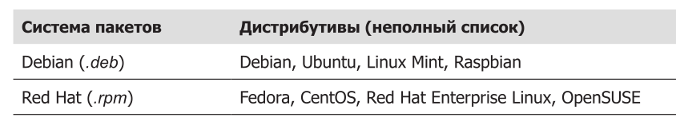 

### Как действует система пакетов

Способ распространения программ, используемый в индустрии патентованного
программного обеспечения, обычно включает покупку установочного носителя,
такого как «установочный диск», и последующий запуск мастера установки нового приложения в систему (Windows).
Linux действует иначе. Практически все программное обеспечение для системы
Linux находится в Интернете. Большая его часть предоставляется создателями
дистрибутивов в форме файлов пакетов, а остальная часть доступна в исходном
коде, который можно установить вручную. Мы еще поговорим об установке программ путем компиляции исходного кода в последующих главах.

### Файлы пакетов

Основной единицей программного обеспечения в системе пакетов является файл
пакета. Файл пакета — это сжатая коллекция файлов, составляющих программный пакет. Пакет может состоять из множества программ и файлов с данными, поддерживающих программы. Помимо файлов для установки, файл пакета включает также метаданные с информацией о пакете, например текстовым описанием
пакета и его содержимого. Дополнительно многие пакеты включают сценарии для
выполнения настроек до и после установки пакета.

## Репозитории

Некоторые проекты самостоятельно создают пакеты и дистрибутивы своего программного обеспечения, и все же большинство пакетов в наше время собирается
создателями дистрибутивов и заинтересованными третьими сторонами. Готовые
пакеты помещаются в центральный репозиторий дистрибутива, где они становятся доступными для пользователей. Репозиторий может содержать тысячи пакетов, специально собранных для дистрибутива.
Для дистрибутива может поддерживаться несколько разных репозиториев с про-
граммным обеспечением, находящимся на разных этапах разработки. 

* тестовый репозиторий, содержащий недавно созданные пакеты, которые предназначены для смельчаков, пытающихся отыскать ошибки до того, как пакеты попадут в основной дистрибутив. 
* репозиторий для разработки, куда помещаются пакеты, продолжающие разрабатываться и предназначенные для включения в ближайший выпуск дистрибутива.
* сторонние репозитории. Они необходимы для распространения программного обеспечения, которое по юридическим причинам, связанным с патентами или законами об управлении цифровыми правами (Digital Rights Management, DRM), не может быть включено в дистрибутив. Самым известным случаем является поддержка шифрования DVD, которая считается незаконной в Соединенных Штатах. Сторонние репозитории располагаются в странах, где патенты или законы, ограничивающие распространение программного обеспечения, отсутствуют или действуют иначе. Эти репозитории обычно полностью независимы от поддерживаемого ими дистрибутива, и для их использования нужно знать об их существовании и вручную включать их в конфигурационные файлы с настройками системы управления пакетами.

## Зависимости

Программы редко действуют в одиночку; чаще они полагаются на наличие других
программных компонентов. Стандартные операции, такие как ввод/вывод, выполняются процедурами, которые совместно используются многими
программами. Эти процедуры хранятся в так называемых разделяемых библиотеках, предоставляющих важные услуги нескольким программам.
Если пакету требуется некий общий ресурс, такой как разделяемая библиотека,
про него говорят, что он имеет зависимость. Современные системы управления
пакетами поддерживают некоторые методы разрешения зависимостей, — это гарантирует, что после установки пакета в системе будут также установлены все его зависимости.

## Высоко- и низкоуровневые инструменты управления пакетами

Системы управления пакетами обычно включают инструменты двух типов:

* низкоуровневые инструменты, решающие такие задачи, как установка и удале-
ние файлов пакетов;
* высокоуровневые инструменты, выполняющие поиск в метаданных и разрешение зависимостей.

В этой главе мы посмотрим, какие инструменты входят в состав систем на основе Debian, а также в состав последних продуктов Red Hat. Несмотря на то что все дистрибутивы на основе Red Hat опираются на одну и ту же низкоуровневую программу (rpm), они используют разные высокоуровневые инструменты. В таблице ниже приведены инструмены управления пакетами. 

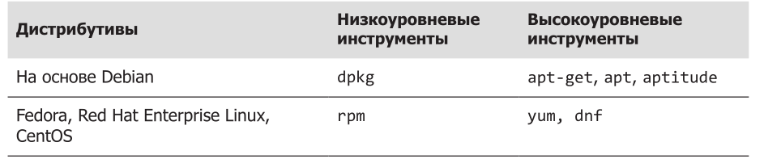 

## Типичные задачи управления пакетами

С помощью инструментов командной строки для управления пакетами можно
выполнить множество разных операций. Мы рассмотрим наиболее типичные из
них. Вы должны знать, что низкоуровневые инструменты поддерживают также
создание файлов пакетов, но эта тема выходит за рамки данной книги.
В следующем обсуждении под термином имя_пакета будет подразумеваться фактическое имя пакета, а под термином файл_пакета — имя файла пакета.

## Поиск пакета в репозитории

Используя высокоуровневые инструменты для поиска метаданных в репозитории, можно найти пакет по его имени или описанию.

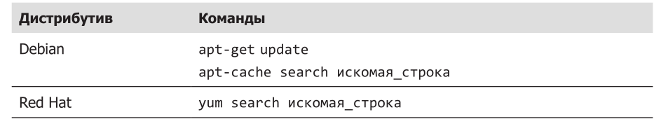 

Вот пример поиска текстового редактора emacs в системе Red Hat с помощью
коман­ды yum:

yum search emacs

## Установка пакета из репозитория

Высокоуровневые инструменты позволяют загрузить пакет из репозитория
и установить его с полным разрешением всех зависимостей.

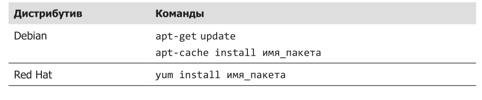 

Вот пример установки текстового редактора emacs в системе Debian из репозито-
рия apt:

apt-get update; apt-get install emacs

## Установка пакета из файла пакета

Если файл пакета загружен из источника, не являющегося репозиторием, его
можно установить непосредственно (без разрешения зависимостей) с использо-
ванием низкоуровневого инструмента.

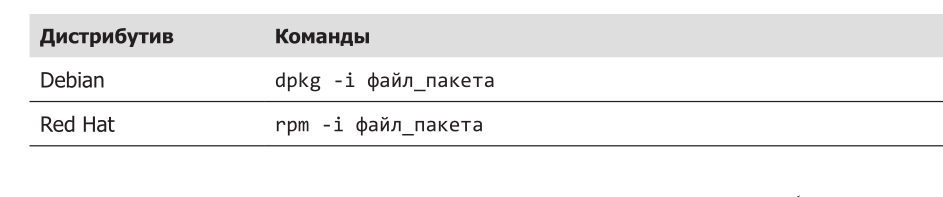

Пример: если с некоторого сайта, не являющегося репозиторием, был загружен
файл emacs-22.1-7.fc7-i386.rpm, его можно установить в систему Red Hat командой

rpm -i emacs-22.1-7.fc7-i386.rpm

## ПРИМЕЧАНИЕ

Поскольку этот прием установки основан на использовании низкоуровневой
программы rpm, он не выполняет разрешения зависимостей. Если программа rpm
обнаружит неразрешенную зависимость, она завершится с сообщением об ошибке.

## Удаление пакета

Пакеты можно удалять с помощью и низкоуровневых, и высокоуровневых инструментов.

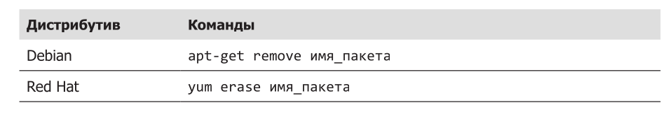

Пример: удалить пакет emacs из системы Debian можно командой:
apt-get remove emacs

Этот способ можно использовать, если предполагается, что в будущем пакет будет использоваться.

Ещё немаловажной командой являетя purge

apt-get purge emacs

Эта команда удаляет пакет и всю его конфигурацию, пользовательские файлы остаются, но конфиги в /etc будут удалены. 

Но если надо очистить систему полностью от неиспользуемых зависимостей (если удалённому пакету нужны сторонние зависимости, то ни remove, ни purge не удалит их), то надо использовать другую команду:

apt-get autoremove

Некоторые полезные команды:

apt-get clean

Используется для очистки локального кеша менеджера пакетов APT, удаляет все загруженные .deb пакеты в каталоге /var/cache/apt/archives/ и его подкаталогах, освобождая место на дисках. То есть, при скачивании пакетов с помощью APT,  этот кеш сохраняются пакеты, чтобы можно было в дальнейшем их использовать. 

apt-get autoclean 

Удаляет только устаревшие пакеты, которые больше нельзя загрузить из репозитория, а apt-get clean - абсолютно все пакеты из кеша. 

## Обновление пакетов из репозитория

Наиболее типичной задачей управления пакетами является поддержание системы
в актуальном состоянии обновлением пакетов до последних версий. Высокоуровневые инструменты способны выполнять эту важную задачу за один шаг.

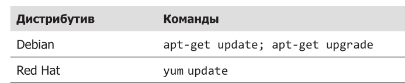

Пример: следующая команда применит все обновления, доступные для пакетов,
установленных в системе на основе Debian:

apt-get update; apt-get upgrade

Можно ещё ставить ключ -y, который говорит, чтобы на все вопросы команда отвечала yes по дефолту. 

Ещё есть команда apt-get dist-upgrade, которая является как бы расширенной версией apt-get upgrade. Она может удалять существующие пакеты и устанавливать новые, чтобы корректно разрешать зависимости между пакетами. Позволяет обновить пакеты за счёт удаления менее значимых. 

## Обновление пакета из файла пакета

Если обновленная версия пакета была загружена из источника, не являющегося
репозиторием, ее можно установить, заменив предыдущую версию.

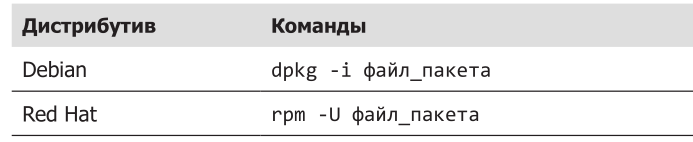

Пример: обновить установленную программу emacs до версии, содержащей в файле пакета emacs-22.1-7.fc7-i386.rpm, в системе Red Hat можно командой

rpm -U emacs-22.1-7.fc7-i386.rpm

## ПРИМЕЧАНИЕ

dpkg не имеет параметра, отвечающего за обновление пакета вместо установки,
как в программе rpm.

## Список установленных пакетов

Команды в таблице ниже можно использовать для вывода списка всех пакетов, установленных в системе.

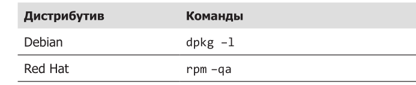

## Определение, установлен ли пакет

С помощью низкоуровневых инструментов из таблицы ниже можно определить, был
ли установлен определенный пакет.

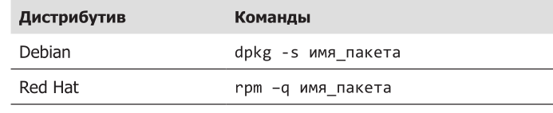

Пример: определить, был ли установлен пакет emacs в системе Debian, можно
­командой

dpkg -s emacs

## Вывод информации об установленном пакете

Если известно имя установленного пакета, с помощью команд из таблицы ниже можно получить описание пакета.

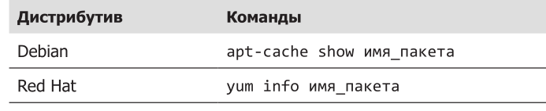

Пример: получить описание пакета emacs в системе Debian можно командой

apt-cache show emacs

## Поиск пакета по установленному файлу

Определить, в составе какого пакета был установлен некий файл, можно с помо-
щью команд из таблице ниже.

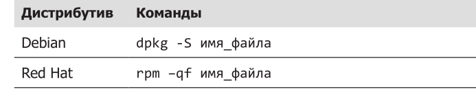

Пример: узнать, в составе какого пакета был установлен файл /usr/bin/vim в си-
стеме Red Hat, можно командой

rpm -qf /usr/bin/vim

## Заключение

В последующих главах мы исследуем множество программ, решающих широкий
спектр прикладных задач. Хотя большинство этих программ обычно устанавливается по умолчанию, иногда возникает необходимость установить дополнительные
пакеты. С вновь обретенными знаниями (и пониманием) особенностей управления пакетами вы без труда сможете установить дополнительные программы
и управлять ими.

## МИФ ОБ УСТАНОВКЕ ПРОГРАММНОГО ОБЕСПЕЧЕНИЯ В LINUX

Те, кто прежде использовал другие платформы, иногда становятся жертвами
мифов о сложности установки программного обеспечения в Linux и верят, что
многообразие систем управления пакетами, используемых разными дистрибутивами, является серьезной помехой. Вообще-то и правда — помехой, только
не для пользователей, а для производителей патентованного программного
обеспечения, желающих распространять свои программы только в виде дво-
ичных файлов.
Драйверы устройств распространяются почти так же, только они не выделяются
в отдельные пакеты в репозитории дистрибутива, а включаются в ядро Linux. Можно сказать, что в Linux нет такого понятия, как «диск с драйверами». Либо ядро поддерживает данное устройство, либо нет, а ядро Linux поддерживает огромное число устройств. В действительности намного больше, чем Windows. Конечно, едва ли вас утешит информация, что нужное вам устройство не поддерживается ядром. Однако если такое случится, ищите причину. Отсутствие драйвера поддержки обычно обусловлено одной из следующих причин:

* Устройство слишком новое. Так как многие производители аппаратного обе-
спечения не очень активно поддерживают Linux, задача написать драйвер для
включения в ядро ложится на членов сообщества Linux. А это требует времени.
* Устройство чересчур экзотическое. Не все дистрибутивы включают все
возможные драйверы устройств. Для каждого дистрибутива настраивается
свое ядро, и так как ядра настраиваются до мелочей (благодаря чему от-
крывается возможность использовать Linux в самых разных устройствах, от
наручных часов до больших ЭВМ), создатели дистрибутива могли пропустить
ваше устройство. Найдя и загрузив исходный код драйвера, вы (да, да — вы)
сможете скомпилировать и установить драйвер самостоятельно. Это не очень
сложно, скорее утомительно. О компиляции программного обеспечения мы
поговорим в последующих главах.
* Производители аппаратного обеспечения что-то скрывают. Производитель не выпустил либо исходный код драйвера для Linux, либо документацию, на основе которой можно было бы написать драйвер. Это означает, что
производитель аппаратного обеспечения пытается сохранить программные
интерфейсы устройства в секрете. Так как мы предпочитаем не использовать
засекреченные устройства в своих компьютерах, я предлагаю удалить это нетолерантное устройство и отправить его в кучу из других бесполезных гаджетов.