## Содержание

### Часть III Типичные задачи и основные инструменты
- [Глава 14. Управление пакетами](#глава-14-управление-пакетами)
- [Глава 15. Устройства хранения](#глава-15-устройства-хранения)
- [Глава 16. Сети](#глава-16-сети)
- [Глава 17. Поиск файлов](#глава-17-поиск-файлов)
- [Глава 18. Архивация и резервное копирование](#глава-18-Архивация-и-резервное-копирование)
- [Глава 19. Регулярные выражения](#глава-19-Регулярные выражения)

## Глава 14. Управление пакетами

Общаясь с другими членами сообщества Linux, мы услышим массу мнений о том,
какой дистрибутив Linux лучше. Часто обзоры дистрибутивов выглядят довольно
глупыми, скатываясь к сравнению, например, привлекательности обоев рабочего
стола (некоторые отвергают Ubuntu, потому что им не нравится цветовая схема по
умолчанию!) и других тривиальных особенностей.
Самой важной отличительной чертой дистрибутива является система управления
пакетами и активность сообщества, поддерживающего дистрибутив. Поработав
с Linux достаточно долгое время, легко заметить, насколько динамичен программный ландшафт этой системы. Он находится в постоянном движении. Большинство создателей основных дистрибутивов Linux выпускают новые версии каждые шесть месяцев, а множество отдельных программ обновляется каждый день. Чтобы не отставать от этой лавины программного обеспечения, нам нужен хороший
инструмент для управления пакетами.

Управление пакетами (package management) — это методика установки и управления программным обеспечением в системе.

Вообще существуют несколько способов установки приложений в линуксе:

* Графический режим (в Ubuntu это app center)
* Менеджеры пакетов (через терминал)
* Установка уже скачанных пакетов с официальных сайтов разработчика
* Универсальные форматы пакетов (snap/flatpak). Позволяет устанавливать новейшие версии пакетов вне зависимости от дистрибутивов
* Установка из исходных кодов (с компиляцией исходного кода)
* Подключение сторонних репозиториев, если нужного приложения нет в стандартных

### Системы пакетов

Разные дистрибутивы используют различные системы пакетов, и, как правило, пакеты, подготовленные для одного дистрибутива, несовместимы с другими. В большинстве дистрибутивов используется одна из двух основных технологий упаковки: разработанная создателями дистрибутива Debian с пакетами .deb и разработанная создателями дистрибутива Red Hat с пакетами .rpm. Существует несколько важных исключений, таких как Gentoo, Slackware и Arch, но в большинстве других дистрибутивов используется одна из двух основных систем, что показано в таблице ниже.

 

### Как действует система пакетов

Способ распространения программ, используемый в индустрии патентованного
программного обеспечения, обычно включает покупку установочного носителя,
такого как «установочный диск», и последующий запуск мастера установки нового приложения в систему (Windows).
Linux действует иначе. Практически все программное обеспечение для системы
Linux находится в Интернете. Большая его часть предоставляется создателями
дистрибутивов в форме файлов пакетов, а остальная часть доступна в исходном
коде, который можно установить вручную. Мы еще поговорим об установке программ путем компиляции исходного кода в последующих главах.

### Файлы пакетов

Основной единицей программного обеспечения в системе пакетов является файл
пакета. Файл пакета — это сжатая коллекция файлов, составляющих программный пакет. Пакет может состоять из множества программ и файлов с данными, поддерживающих программы. Помимо файлов для установки, файл пакета включает также метаданные с информацией о пакете, например текстовым описанием
пакета и его содержимого. Дополнительно многие пакеты включают сценарии для
выполнения настроек до и после установки пакета.

## Репозитории

Некоторые проекты самостоятельно создают пакеты и дистрибутивы своего программного обеспечения, и все же большинство пакетов в наше время собирается
создателями дистрибутивов и заинтересованными третьими сторонами. Готовые
пакеты помещаются в центральный репозиторий дистрибутива, где они становятся доступными для пользователей. Репозиторий может содержать тысячи пакетов, специально собранных для дистрибутива.
Для дистрибутива может поддерживаться несколько разных репозиториев с про-
граммным обеспечением, находящимся на разных этапах разработки. 

* тестовый репозиторий, содержащий недавно созданные пакеты, которые предназначены для смельчаков, пытающихся отыскать ошибки до того, как пакеты попадут в основной дистрибутив. 
* репозиторий для разработки, куда помещаются пакеты, продолжающие разрабатываться и предназначенные для включения в ближайший выпуск дистрибутива.
* сторонние репозитории. Они необходимы для распространения программного обеспечения, которое по юридическим причинам, связанным с патентами или законами об управлении цифровыми правами (Digital Rights Management, DRM), не может быть включено в дистрибутив. Самым известным случаем является поддержка шифрования DVD, которая считается незаконной в Соединенных Штатах. Сторонние репозитории располагаются в странах, где патенты или законы, ограничивающие распространение программного обеспечения, отсутствуют или действуют иначе. Эти репозитории обычно полностью независимы от поддерживаемого ими дистрибутива, и для их использования нужно знать об их существовании и вручную включать их в конфигурационные файлы с настройками системы управления пакетами.

## Зависимости

Программы редко действуют в одиночку; чаще они полагаются на наличие других
программных компонентов. Стандартные операции, такие как ввод/вывод, выполняются процедурами, которые совместно используются многими
программами. Эти процедуры хранятся в так называемых разделяемых библиотеках, предоставляющих важные услуги нескольким программам.
Если пакету требуется некий общий ресурс, такой как разделяемая библиотека,
про него говорят, что он имеет зависимость. Современные системы управления
пакетами поддерживают некоторые методы разрешения зависимостей, — это гарантирует, что после установки пакета в системе будут также установлены все его зависимости.


## Высоко- и низкоуровневые инструменты управления пакетами

Системы управления пакетами обычно включают инструменты двух типов:

* низкоуровневые инструменты, решающие такие задачи, как установка и удале-
ние файлов пакетов;
* высокоуровневые инструменты, выполняющие поиск в метаданных и разрешение зависимостей.

В этой главе мы посмотрим, какие инструменты входят в состав систем на основе Debian, а также в состав последних продуктов Red Hat. Несмотря на то что все дистрибутивы на основе Red Hat опираются на одну и ту же низкоуровневую программу (rpm), они используют разные высокоуровневые инструменты. В таблице ниже приведены инструмены управления пакетами. 

 

## Типичные задачи управления пакетами

С помощью инструментов командной строки для управления пакетами можно
выполнить множество разных операций. Мы рассмотрим наиболее типичные из
них. Вы должны знать, что низкоуровневые инструменты поддерживают также
создание файлов пакетов, но эта тема выходит за рамки данной книги.
В следующем обсуждении под термином имя_пакета будет подразумеваться фактическое имя пакета, а под термином файл_пакета — имя файла пакета.

## Поиск пакета в репозитории

Используя высокоуровневые инструменты для поиска метаданных в репозитории, можно найти пакет по его имени или описанию.


 

Вот пример поиска текстового редактора emacs в системе Red Hat с помощью
коман­ды yum:

yum search emacs

## Установка пакета из репозитория

Высокоуровневые инструменты позволяют загрузить пакет из репозитория
и установить его с полным разрешением всех зависимостей.


 

Вот пример установки текстового редактора emacs в системе Debian из репозито-
рия apt:

apt-get update; apt-get install emacs

## Установка пакета из файла пакета

Если файл пакета загружен из источника, не являющегося репозиторием, его
можно установить непосредственно (без разрешения зависимостей) с использо-
ванием низкоуровневого инструмента.


Пример: если с некоторого сайта, не являющегося репозиторием, был загружен
файл emacs-22.1-7.fc7-i386.rpm, его можно установить в систему Red Hat командой

rpm -i emacs-22.1-7.fc7-i386.rpm

## ПРИМЕЧАНИЕ

Поскольку этот прием установки основан на использовании низкоуровневой
программы rpm, он не выполняет разрешения зависимостей. Если программа rpm
обнаружит неразрешенную зависимость, она завершится с сообщением об ошибке.

## Удаление пакета

Пакеты можно удалять с помощью и низкоуровневых, и высокоуровневых инструментов.


Пример: удалить пакет emacs из системы Debian можно командой:
apt-get remove emacs

Этот способ можно использовать, если предполагается, что в будущем пакет будет использоваться.

Ещё немаловажной командой являетя purge

apt-get purge emacs

Эта команда удаляет пакет и всю его конфигурацию, пользовательские файлы остаются, но конфиги в /etc будут удалены. 

Но если надо очистить систему полностью от неиспользуемых зависимостей (если удалённому пакету нужны сторонние зависимости, то ни remove, ни purge не удалит их), то надо использовать другую команду:

apt-get autoremove

Некоторые полезные команды:

apt-get clean

Используется для очистки локального кеша менеджера пакетов APT, удаляет все загруженные .deb пакеты в каталоге /var/cache/apt/archives/ и его подкаталогах, освобождая место на дисках. То есть, при скачивании пакетов с помощью APT,  этот кеш сохраняются пакеты, чтобы можно было в дальнейшем их использовать. 

apt-get autoclean 

Удаляет только устаревшие пакеты, которые больше нельзя загрузить из репозитория, а apt-get clean - абсолютно все пакеты из кеша. 

## Обновление пакетов из репозитория

Наиболее типичной задачей управления пакетами является поддержание системы
в актуальном состоянии обновлением пакетов до последних версий. Высокоуровневые инструменты способны выполнять эту важную задачу за один шаг.


Пример: следующая команда применит все обновления, доступные для пакетов,
установленных в системе на основе Debian:

apt-get update; apt-get upgrade

Можно ещё ставить ключ -y, который говорит, чтобы на все вопросы команда отвечала yes по дефолту. 


Ещё есть команда apt-get dist-upgrade, которая является как бы расширенной версией apt-get upgrade. Она может удалять существующие пакеты и устанавливать новые, чтобы корректно разрешать зависимости между пакетами. Позволяет обновить пакеты за счёт удаления менее значимых. 

## Обновление пакета из файла пакета

Если обновленная версия пакета была загружена из источника, не являющегося
репозиторием, ее можно установить, заменив предыдущую версию.


Пример: обновить установленную программу emacs до версии, содержащей в файле пакета emacs-22.1-7.fc7-i386.rpm, в системе Red Hat можно командой

rpm -U emacs-22.1-7.fc7-i386.rpm

## ПРИМЕЧАНИЕ

dpkg не имеет параметра, отвечающего за обновление пакета вместо установки,
как в программе rpm.

## Список установленных пакетов

Команды в таблице ниже можно использовать для вывода списка всех пакетов, установленных в системе.


## Определение, установлен ли пакет

С помощью низкоуровневых инструментов из таблицы ниже можно определить, был
ли установлен определенный пакет.


Пример: определить, был ли установлен пакет emacs в системе Debian, можно
­командой

dpkg -s emacs

## Вывод информации об установленном пакете

Если известно имя установленного пакета, с помощью команд из таблицы ниже можно получить описание пакета.


Пример: получить описание пакета emacs в системе Debian можно командой

apt-cache show emacs

## Поиск пакета по установленному файлу

Определить, в составе какого пакета был установлен некий файл, можно с помо-
щью команд из таблице ниже.


Пример: узнать, в составе какого пакета был установлен файл /usr/bin/vim в си-
стеме Red Hat, можно командой

rpm -qf /usr/bin/vim

## Заключение

В последующих главах мы исследуем множество программ, решающих широкий
спектр прикладных задач. Хотя большинство этих программ обычно устанавливается по умолчанию, иногда возникает необходимость установить дополнительные
пакеты. С вновь обретенными знаниями (и пониманием) особенностей управления пакетами вы без труда сможете установить дополнительные программы
и управлять ими.

## МИФ ОБ УСТАНОВКЕ ПРОГРАММНОГО ОБЕСПЕЧЕНИЯ В LINUX

Те, кто прежде использовал другие платформы, иногда становятся жертвами
мифов о сложности установки программного обеспечения в Linux и верят, что
многообразие систем управления пакетами, используемых разными дистрибутивами, является серьезной помехой. Вообще-то и правда — помехой, только
не для пользователей, а для производителей патентованного программного
обеспечения, желающих распространять свои программы только в виде дво-
ичных файлов.
Драйверы устройств распространяются почти так же, только они не выделяются
в отдельные пакеты в репозитории дистрибутива, а включаются в ядро Linux. Можно сказать, что в Linux нет такого понятия, как «диск с драйверами». Либо ядро поддерживает данное устройство, либо нет, а ядро Linux поддерживает огромное число устройств. В действительности намного больше, чем Windows. Конечно, едва ли вас утешит информация, что нужное вам устройство не поддерживается ядром. Однако если такое случится, ищите причину. Отсутствие драйвера поддержки обычно обусловлено одной из следующих причин:

* Устройство слишком новое. Так как многие производители аппаратного обе-
спечения не очень активно поддерживают Linux, задача написать драйвер для
включения в ядро ложится на членов сообщества Linux. А это требует времени.
* Устройство чересчур экзотическое. Не все дистрибутивы включают все
возможные драйверы устройств. Для каждого дистрибутива настраивается
свое ядро, и так как ядра настраиваются до мелочей (благодаря чему от-
крывается возможность использовать Linux в самых разных устройствах, от
наручных часов до больших ЭВМ), создатели дистрибутива могли пропустить
ваше устройство. Найдя и загрузив исходный код драйвера, вы (да, да — вы)
сможете скомпилировать и установить драйвер самостоятельно. Это не очень
сложно, скорее утомительно. О компиляции программного обеспечения мы
поговорим в последующих главах.
* Производители аппаратного обеспечения что-то скрывают. Производитель не выпустил либо исходный код драйвера для Linux, либо документацию, на основе которой можно было бы написать драйвер. Это означает, что
производитель аппаратного обеспечения пытается сохранить программные
интерфейсы устройства в секрете. Так как мы предпочитаем не использовать
засекреченные устройства в своих компьютерах, я предлагаю удалить это нетолерантное устройство и отправить его в кучу из других бесполезных гаджетов.

## Глава 15. Устройства хранения

Linux обладает удивительными возможностями работы с устройствами хранения, такими как жесткие диски, сетевые хранилища или виртуальные устройства хранения, например RAID массивы и LVM (Logical Volume Manager — диспетчер логических томов).

### Что такое диспетчер логических томов LVM?

LVM аккумулирует пространство, взятое из разделов или целых дисков, чтобы сформировать логический контейнер (Группа томов). Группа томов далее делится на логические разделы, называемые логическими томами. Проще говоря, LVM группирует все ваше пространство хранения в пул и позволяет вам создавать тома (логические тома) из этого пула. Преимущество использования LVM перед стандартным разделом заключается в том, что LVM предлагает вам больше гибкости и возможностей. Он позволяет онлайн изменять размеры логических групп и логических томов. Поэтому, если в каком-либо из ваших логических разделов закончилось место, вы можете легко увеличить размер раздела, используя свободное место в пуле.Вы также можете экспортировать и импортировать разделы. LVM также поддерживает зеркалирование и создание моментальных снимков логических томов.

Для выполнения упражнений к этой главе нам понадобится флеш-диск (флешка),
подключаемый к порту USB компьютера и диск CD-RW (для систем, оборудованных пишущим приводом CD-ROM).

Мы познакомимся со следующими командами:
* mount — монтирует файловые системы;
* umount — размонтирует файловые системы;
* fsck — проверяет и восстанавливает файловые системы;
* fdisk — инструмент для работы с таблицей разделов;
* mkfs — создает файловые системы;
* dd — выполняет запись данных блоками непосредственно в устройство;
* genisoimage (mkisofs) — создает файл образа ISO 9660;
* wodim (cdrecord) — записывает данные на оптический носитель;
* md5sum — вычисляет контрольную сумму MD5.

### Монтирование и размонтирование устройств хранения

Первый шаг в управлении устройствами хранения — подключение самого
устройства к дереву файловой системы. Этот процесс называется монтированием и позволяет устройству участвовать в работе операционной системы. Linux
поддерживает единое дерево файловой системы, к разным точкам которого подключаются дополнительные устройства. Этот подход отличается от используемо-
го в других операционных системах, таких как Windows, где каждому устройству
соответствует отдельное дерево файлов и каталогов (например, C:\, D:\ и т. д.).

В файле с именем /etc/fstab (сокращенно от «file system table» — таблица файло-
вых систем) перечисляются устройства (обычно разделы жесткого диска), мон-
тируемые на этапе загрузки. Ниже приводится пример содержимого /etc/fstab из
системы Fedora:


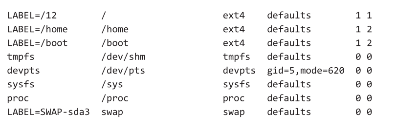

Большинство файловых систем из перечисленных в приведенном примере являются виртуальными, и наше обсуждение к ним неприменимо. Наибольший интерес для нас в рамках исследования данной темы представляют первые три:


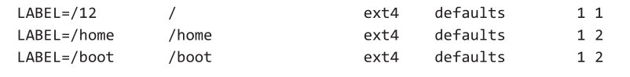

Это разделы жесткого диска. Каждая строка включает шесть полей, описание ко-
торых приводится в таблице ниже.

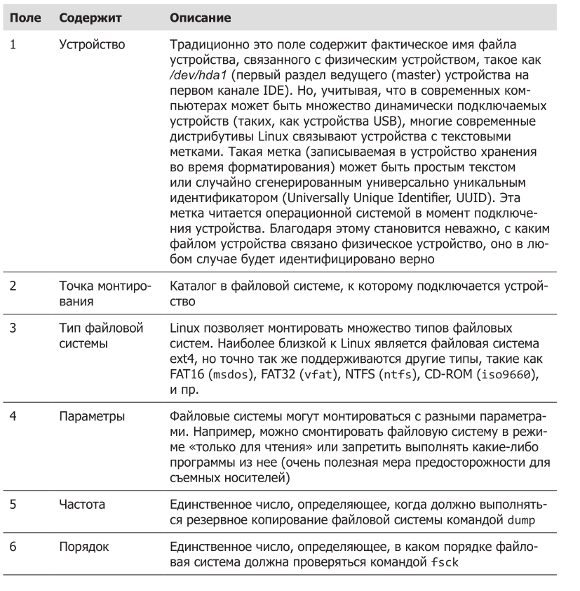

### Просмотр списка смонтированных файловых систем

Для монтирования файловых систем используется команда mount. Если ввести
команду без аргументов, она выведет список файловых систем, смонтированных
в настоящий момент в Ubuntu:

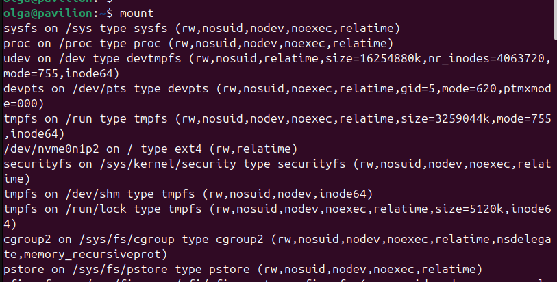

Приведем подобный список для Fedora

[me@linuxbox ~]$ mount <br>
/dev/sda2 on / type ext4 (rw) <br>
proc on /proc type proc (rw) <br>
sysfs on /sys type sysfs (rw) <br>
devpts on /dev/pts type devpts (rw,gid=5,mode=620) <br>
/dev/sda5 on /home type ext4 (rw) <br>
/dev/sda1 on /boot type ext4 (rw) <br>
tmpfs on /dev/shm type tmpfs (rw) <br>
none on /proc/sys/fs/binfmt_misc type binfmt_misc (rw) <br>
sunrpc on /var/lib/nfs/rpc_pipefs type rpc_pipefs (rw) <br>
fusectl on /sys/fs/fuse/connections type fusectl (rw) <br>
/dev/sdd1 on /media/disk type vfat (rw,nosuid,nodev,noatime, uhelper=hal uid=500,ut <br>

Список имеет следующий формат: устройство on точка_монтирования type тип_
файловой_системы (параметры). Например, первая строка соответствует устройству /dev/sda2, смонтированному как корневая файловая система типа ext4, доступная для чтения и записи (параметр rw). В конце списка можно заметить две
интересные записи. Предпоследняя запись соответствует 2-гигабайтной SD-карте
памяти в устройстве для чтения карт памяти, смонтированной в каталог /media/
disk, последняя запись соответствует сетевому приводу, смонтированному в каталог /misc/musicbox. Для первого эксперимента возьмем привод CD-ROM. Сначала посмотрим, что имеется в системе, перед тем как вставить компакт-диск:


Для первого эксперимента возьмем привод CD-ROM. Сначала посмотрим, что
имеется в системе, перед тем как вставить компакт-диск:
[me@linuxbox ~]$ mount <br>
/dev/mapper/VolGroup00-LogVol00 on / type ext4 (rw) <br>
proc on /proc type proc (rw) <br>
sysfs on /sys type sysfs (rw) <br>
devpts on /dev/pts type devpts (rw,gid=5,mode=620) <br>
/dev/hda1 on /boot type ext4 (rw) <br>
tmpfs on /dev/shm type tmpfs (rw) <br>
none on /proc/sys/fs/binfmt_misc type binfmt_misc (rw) <br>
sunrpc on /var/lib/nfs/rpc_pipefs type rpc_pipefs (rw) <br>

Этот список получен в системе CentOS 5, где для создания корневой файловой
системы используется диспетчер LVM. Подобно многим современным дистрибу-
тивам Linux, эта система пытается автоматически монтировать компакт-диски.
Вставив в привод компакт-диск, мы увидим следующее:

[me@linuxbox ~]$ mount <br>
/dev/mapper/VolGroup00-LogVol00 on / type ext4 (rw) <br>
proc on /proc type proc (rw) <br>
sysfs on /sys type sysfs (rw) <br>
devpts on /dev/pts type devpts (rw,gid=5,mode=620) <br>
/dev/hda1 on /boot type ext4 (rw) <br>
tmpfs on /dev/shm type tmpfs (rw) <br>
none on /proc/sys/fs/binfmt_misc type binfmt_misc (rw) <br>
sunrpc on /var/lib/nfs/rpc_pipefs type rpc_pipefs (rw) <br>
/dev/sdc on /media/live-1.0.10-8 type iso9660 (ro,noexec,nosuid,nodev,uid=500) <br>

Это практически тот же список, с одной дополнительной записью. Последняя запись в списке сообщает, что компакт-диск в приводе CD-ROM (устройство /dev/
sdc в этой системе) смонтирован в каталог /media/live-1.0.10-8 и имеет файловую
систему iso9660 (типичную для компакт-дисков). Обратите внимание на имя
устройства. Когда вы будете проводить эксперимент в своей системе, очень вероятно, что имя устройства у вас будет отличаться.


### ВНИМАНИЕ

В примерах, демонстрируемых ниже, особое внимание обращайте на фактические имена устройств в вашей системе и не используйте имена, приводящиеся
в примерах здесь! Также отметьте, что аудиодиск — это не то же самое, что CD-ROM. Аудиодиск не имеет файловой системы и потому не может быть смонтирован в общепринятом смысле.


Теперь, когда мы знаем имя устройства для привода CD-ROM, размонтируем диск
и повторно смонтируем его в другой каталог в дереве файловой системы. Для это-
го необходимо получить права суперпользователя (способом, соответствующим
вашей системе) и размонтировать диск командой umount:

[me@linuxbox ~]$ su - <br>
Password: <br>
[root@linuxbox ~]# umount /dev/sdc <br>

Следующий шаг: создать новую точку монтирования диска. Точка монтирова-
ния — это самый обычный каталог где-то в дереве файловой системы. В таком каталоге нет ничего необычного. Он даже не должен быть пустым каталогом, правда,монтирование устройства в непустой каталог сделает его прежнее содержимое недоступным, пока устройство не будет размонтировано. Итак, создадим новый каталог:

[root@linuxbox ~]# mkdir /mnt/cdrom <br>

И наконец, смонтируем CD-ROM в новую точку монтирования. Параметр -t позволяет указать тип файловой системы: <br>

[root@linuxbox ~]# mount -t iso9660 /dev/sdc /mnt/cdrom

### ПОЧЕМУ ВАЖНО РАЗМОНТИРОВАТЬ УСТРОЙСТВА

Если взглянуть на вывод команды free, показывающей статистику использования
памяти, можно увидеть статистику с названием buffers (буферы). Компьютерные
системы проектируются так, чтобы работать максимально быстро. Но медленные
устройства препятствуют этому. Ярким примером служат принтеры. Даже самый
быстрый принтер выглядит чрезвычайно медлительным по компьютерным стандартам. В давние времена при попытке распечатать екстовый документ компьютер мог стать недоступным до конца печати. Компьютер не мог посылать данные принтеру быстрее, чем тот мог их обработать, а принтеры не могли работать быстрее, потому что не могли быстро печатать. Эта проблема была решена созданием буфера печати, устройства, содержащего некоторый объем ОЗУ и находящегося между компьютером и принтером. При наличии буфера печати компьютер мог послать данные в буфер печати, который сохранял их в быстрой памяти ОЗУ, и компьютер возвращался к работе, не дожидаясь конца печати. В то же время буфер печати мог передавать данные принтеру из своей памяти со скоростью, приемлемой для принтера.
Идея буферизации широко используется для увеличения производительности
компьютеров — необходимость работы с медленными устройствами не должна
ухудшать производительность системы. Операционные системы хранят данные, прочитанные с устройства и предназначенные для записи в устройство,
так долго, насколько это возможно, и используют их, прежде чем фактически
обратиться к медленному устройству. В системе Linux, например, можно заметить, что при продолжительной работе она заполняет всю память. Это не
означает, что Linux «использует» всю память, это означает лишь то, что Linux
использует в своих интересах всю доступную память и буферизует как можно
больше данных.
Буферизация позволяет очень быстро выполнять запись в устройства хранения,
потому что запись в физическое устройство откладывается «на потом». Данные,
предназначенные для устройства, накапливаются в памяти. Время от времени
операционная система записывает эти данные в физическое устройство.
Размонтирование устройства влечет за собой запись всех оставшихся данных в это
устройство, чтобы его можно было безопасно извлечь. Если носитель извлечь, не
выполнив размонтирования, есть вероятность, что не все данные, предназначенные для устройства, будут записаны в него. Иногда эти данные могут включать
жизненно важные обновления каталогов, отсутствие которых может привести
к повреждению файловой системы — одной из самых больших неприятностей,
которые могут случиться с компьютером.


После этого можно исследовать содержимое компакт-диска в новой точке монти-
рования:

[root@linuxbox ~]# cd /mnt/cdrom <br>
[root@linuxbox cdrom]# ls <br>

Обратите внимание, что происходит при попытке размонтировать компакт-диск:

[root@linuxbox cdrom]# umount /dev/sdc <br>
umount: /mnt/cdrom: device is busy <br>

В чем причина? Устройство нельзя размонтировать, если оно используется каким-
то пользователем или другим процессом. В данном случае мы изменили текущий
рабочий каталог, перенеся его в точку монтирования компакт-диска, что и стало
причиной занятости устройства. Эту проблему легко исправить, перенеся текущий
рабочий каталог куда-нибудь в другое место за пределами точки монтирования:

[root@linuxbox cdrom]# cd <br>
[root@linuxbox ~]# umount /dev/hdc <br>
Теперь устройство было успешно размонтировано. <br>

### Определение названий устройств

Иногда сложно определить имя устройства. В прошлом это было проще. Устройство всегда находилось в одном месте и никогда не менялось. Unix-подобные системы именно так и действовали. Во времена, когда разрабатывалась система Unix, для «смены дискового устройства» требовалось использовать подъемник, чтобы извлечь из комнаты с ЭВМ устройство размером со стиральную машину.
Конечно, можно монтировать устройства, чтобы узнавать их названия постфактум. Но как быть тем, кто управляет сервером или каким-то другим окружением, где автоматическое монтирование не поддерживается? Как в этом случае определить название устройства?
Сначала давайте посмотрим, как система выбирает названия для устройств. Если
вывести содержимое каталога /dev (где живут все устройства), можно увидеть
значительное число устройств:

[me@linuxbox ~]$ ls /dev <br>

Содержимое списка показывает некоторые шаблоны в именовании устройств, неполный список которых приводится в таблице ниже.


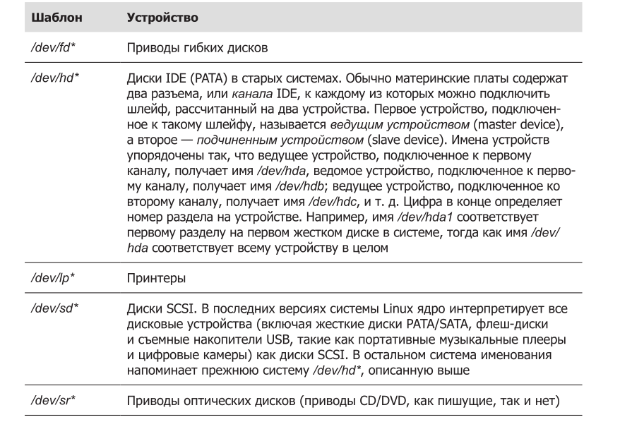

Кроме того, во многих системах можно увидеть такие символические ссылки, как
/dev/cdrom, /dev/dvd и /dev/floppy, которые ссылаются на фактические файлы
устройств и предусмотрены для удобства.

Если вам доведется работать в системе, которая не монтирует автоматически
съемные носители, вы можете использовать следующий прием для определения
названий таких устройств после их подключения. Сначала запустите мониторинг
содержимого файла /var/log/messages или /var/log/syslog в режиме реального времени (для этого могут потребоваться права суперпользователя):

[me@linuxbox ~]$ sudo tail -f /var/log/messages <br>

Эта команда выведет несколько последних строк из файла и приостановится.
Далее подключите извлекаемое устройство.

Когда вывод опять приостановится, нажмите CTRL+C, чтобы вернуться в пригла-
шение командной строки. Наибольший интерес для нас представляют строки
с упоминанием имени устройства [sdb], соответствующего нашим ожиданиям
в отношении названия устройства диска SCSI. Cледующие две строки являются
для нас особенно показательными:

Jul 23 10:07:59 linuxbox kernel: sdb: sdb1 <br>
Jul 23 10:07:59 linuxbox kernel: sd 3:0:0:0: [sdb] Attached SCSI removable disk <br>


Они сообщают, что имя /dev/sdb соответствует всему устройству, а имя /dev/
sdb1 — первому разделу на этом устройстве. 

### СОВЕТ

Прием с использованием команды tail -f /var/log/messages демонстрирует отличный способ наблюдения за происходящим в системе в режиме реального
времени.


Зная имя устройства, можно смонтировать флеш-диск:

[me@linuxbox ~]$ sudo mkdir /mnt/flash <br>
[me@linuxbox ~]$ sudo mount /dev/sdb1 /mnt/flash <br>

В конце можно выполнить команду df -h (disk free), чтобы посмотреть свободное дисковое пространство.

Имя устройства сохраняется неизменным, пока оно остается физически подключенным к компьютеру и до перезагрузки компьютера.

### Создание новых файловых систем

Представьте, что вам нужно отформатировать флеш-диск и вместо файловой системы FAT32 создать на нем файловую систему, родную для Linux. Для этого следует выполнить две операции:

1. Создать (при необходимости) новое распределение разделов, если имеющееся
вас не устраивает. <br>
2. Создать новую, пустую файловую систему. <br>

### ВНИМАНИЕ

Следующее упражнение производит форматирование флеш-диска. Используйте
диск, не содержащий ничего, что вам было бы нужно, потому что вся информация на диске будет стерта! И снова: убедитесь, что используете имя устройства,
верное для вашей системы, а не то, которое показано в примере. Игнорирование
этого предупреждения может привести к форматированию (то есть к стиранию)
другого диска!

### Управление разделами с помощью fdisk

Программа fdisk позволяет напрямую выполнять низкоуровневые операции
с дисковыми устройствами (такими, как жесткие диски и флеш-диски). С помощью этого инструмента можно изменять, удалять и создавать разделы на
устройстве. Чтобы приступить к работе с флеш-диском, его нужно сначала размонтировать (если прежде он был смонтирован) и затем запустить программу
fdisk, как показано ниже:

[me@linuxbox ~]$ sudo umount /dev/sdb1 <br>
[me@linuxbox ~]$ sudo fdisk /dev/sdb <br>


Обратите внимание, что здесь нужно указать имя, соответствующее устройству
целиком, то есть всему устройству, без номера раздела. После запуска программы
вы увидите следующее приглашение:


Первое, что следует сделать, — исследовать список имеющихся разделов. Для этого введите команду p, она выведет таблицу разделов на устройстве:

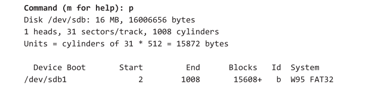

Обратите внимание, что устройство имеет объем 16 Мбайт и единственный раз-
дел (1), занимающий 1008 цилиндров на устройстве. Раздел идентифицирован как раздел Windows 95 FAT32. Некоторые программы используют этот идентификатор, ограничивая виды операций с диском, но чаще изменение идентификатора не влечет серьезных последствий. Однако ради демонстрации мы изменим его, чтобы показать, что это раздел Linux. Для этого нужно сначала узнать, какой идентификатор обозначает разделы Linux. В листинге, приведенном выше, мы видели, что существующий раздел имеет идентификатор b (столбец Id). Чтобы увидеть список известных типов разделов, вернитесь к меню программы и обратите внимание на пункт:

l список известных типов разделов

Если ввести команду l, появится длинный список допустимых типов разделов.
Среди них можно увидеть идентификатор b типа существующего раздела и иден-
тификатор 83 для Linux. Вернемся обратно к меню программы, где можно увидеть
команду изменения идентификатора раздела:

t изменить тип раздела

Введите t и затем новый идентификатор:
Command (m for help): t <br>
Selected partition 1 <br>
Hex code (type L to list codes): 83 <br>
Changed system type of partition 1 to 83 (Linux) <br>

Это все изменения, которые нам нужно было сделать. До этого момента никаких
изменений на самом устройстве не было произведено (все изменения пока просто
зафиксированы в памяти программы, а не на физическом устройстве), поэтому
теперь запишем измененную таблицу разделов на устройство и выйдем. Для этого
введите команду w:

Command (m for help): w <br>
The partition table has been altered! <br>
Calling ioctl() to re-read partition table. <br>

WARNING: If you have created or modified any DOS 6.x partitions, please see the fdisk manual page for additional information.
Syncing disks. <br>
[me@linuxbox ~]$ <br>

Если бы мы решили оставить устройство в неизменном состоянии, то могли бы
ввести команду q и покинуть программу без записи изменений на устройство.

### Создание новой файловой системы с помощью mkfs

Завершив редактирование разделов (довольно простое, хотя так бывает не всегда),
мы создадим на флеш-диске новую файловую систему. Для этого воспользуемся
программой mkfs (сокращенно от make filesystem — создать файловую систему), способной создавать разные файловые системы. Чтобы создать на устройстве файловую систему ext4, следует передать команде параметр -t с типом файловой системы ext4, затем указать имя устройства и раздел, который требуется отформатировать:


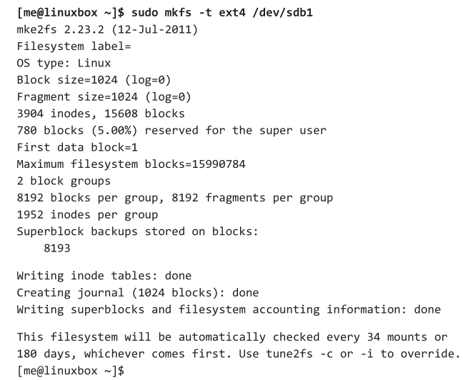

Когда выбирается тип файловой системы ext4, программа выводит массу ин-
формации. Чтобы восстановить на устройстве оригинальную файловую систему
FAT32, следует указать тип файловой системы vfat: <br>

[me@linuxbox ~]$ sudo mkfs -t vfat /dev/sdb1 <br>

Эту процедуру с редактированием разделов и форматированием можно повторять
с любыми дополнительными устройствами хранения, подключаемыми к системе.
Хотя в данном примере мы работали с маленьким флеш-диском, ту же процедуру можно применить и к внутренним жестким дискам, и к другим извлекаемым
устройствам хранения, таким как жесткие USB-диски.

### Проверка и восстановление файловой системы

Знакомясь с файлом /etc/fstab, мы видели некие странные цифры в конце каждой
строки. Каждый раз, когда система загружается, она проверяет целостность фай-
ловых систем перед их монтированием. Эту проверку выполняет программа fsck
(сокращенно от filesystem check — проверка файловой системы). Последнее число
в каждой записи в файле fstab определяет порядок проверки файловых систем.
В примере, приведенном выше, видно, что корневая файловая система проверяет-
ся первой, вслед за ней проверяются файловые системы home и boot. Устройства
с нулем в последнем поле не проверяются стандартными механизмами.
Программа fsck может не только проверить целостность, но и восстановить поврежденные файловые системы с той или иной степенью успеха в зависимости от
масштаба повреждений. В Unix-подобных системах восстановленные фрагменты
файлов помещаются в каталог lost+found, находящийся в корне каждой файловой
системы.

Проверить наш флеш-диск (который предварительно необходимо размонтировать) можно с помощью следующей команды:

[me@linuxbox ~]$ sudo fsck /dev/sdb1 <br>
fsck 1.40.8 (13-Mar-2016) <br>
e2fsck 1.40.8 (13-Mar-2016) <br>
/dev/sdb1: clean, 11/3904 files, 1661/15608 blocks <br>

В настоящее время файловые системы повреждаются крайне редко, если нет ника-
ких проблем с аппаратной частью, таких как выход из строя привода диска. В большинстве файловых систем обнаруженные на этапе загрузки повреждения вызывают
остановку системы с выводом предложения запустить fsck перед продолжением.

### ЧТО ТАКОЕ FSCK?

В культуре Unix слово «fsck» часто используется взамен распространенного ругательства, в котором три буквы совпадают с буквами в имени команды. Это показательно — вы почти наверняка будете произносить упомянутое слово, оказавшись в ситуации, вынуждающей запустить fsck.


### Непосредственное перемещение данных между устройствами

Обычно на компьютерах мы работаем с данными, организованными в файлы, однако
точно так же можно работать с данными в «низкоуровневой» форме. Если взглянуть на содержимое диска, можно увидеть, что оно состоит из множества «блоков»
данных, которые операционная система интерпретирует как файлы и каталоги. Если
бы мы умели интерпретировать диски как простые коллекции блоков данных, мы
смогли бы выполнять множество полезных задач, таких как клонирование дисков.
Эту задачу решает программа dd. Она копирует блоки данных из одного места
в другое. По историческим причинам команда имеет уникальный синтаксис:

dd if=входной_файл of=выходной_файл [bs=размер_блока [count=число_блоков]] <br>

### ВНИМАНИЕ

dd — очень мощная команда. Ее название происходит от data definition (определение данных), но иногда его расшифровывают как destroy disk (уничтожить
диск), потому что пользователи часто допускают ошибки в параметрах if и of.
Всегда дважды проверяйте их, прежде чем нажать ENTER!

Представьте, что у вас есть два флеш-диска USB одинакового размера и вам нужно
создать точную копию первого диска на втором. Допустим, что после подключения к компьютеру им назначаются имена устройств /dev/sdb и /dev/sdc соответственно. В этом случае скопировать содержимое первого диска на второй можно следующей командой: 

dd if=/dev/sdb of=/dev/sdc <br>

Как вариант, если к компьютеру подключено только первое устройство, можно
скопировать его содержимое в обычный файл, который впоследствии использовать для восстановления или копирования:

dd if=/dev/sdb of=flash_drive.img <br>

### Создание образа компакт-диска

Запись на компакт-диски (CD-R или CD-RW) выполняется в два этапа.
* Создается файл образа ISO, являющийся точным образом файловой системы
компакт-диска. 
* Файл образа записывается на носитель (то есть на сам компакт-диск).

### Создание образа-копии компакт-диска

Чтобы создать ISO-образ имеющегося компакт-диска, необходимо с помощью
dd прочитать все блоки с данными с этого компакт-диска и скопировать их в локальный файл. Например, допустим, что у нас есть компакт-диск с дистрибутивом Ubuntu, и мы хотим создать файл ISO-образа, который потом можно будет использовать для создания нескольких копий. Вставив компакт-диск в привод
CD-ROM и определив имя устройства (пусть это будет /dev/cdrom), мы сможем
создать файл ISO-образа следующим способом:

dd if=/dev/cdrom of=ubuntu.iso <br>

Этот прием также применим к дискам DVD с данными, но он не будет работать
с аудиодисками, так как для хранения данных на них файловая система не используется. Если вы хотите скопировать аудиодиск, обратитесь к команде cdrdao.

### Создание образа из коллекции файлов

Создать файл ISO-образа, включающий содержимое некоего каталога, можно
с помощью программы genisoimage. Для этого сначала создадим каталог со всеми необходимыми файлами для включения в образ и затем командой genisoimage
создадим файл образа. Например, если предположить, что вы создали каталог
~/cd-rom-files и наполнили его файлами для записи на компакт-диск, следующая
команда создаст файл образа с именем cd-rom.iso:

genisoimage -o cd-rom.iso -R -J ~/cd-rom-files <br>

Параметр -R требует добавить метаданные расширений Rock Ridge, позволяющих
использовать длинные имена файлов и права доступа к файлам в стиле POSIX.
Аналогично, параметр -J включает расширения Joliet, разрешающие использовать
длинные имена файлов в Windows.

#### Интересно

В руководствах по созданию и записи оптических дисков, таких как CD-ROM и DVD,
которых в избытке на просторах Интернета, часто можно встретить упоминание двух программ, mkisofs и cdrecord. Эти программы были некогда частью
популярного пакета cdrtools, созданного Йоргом Шиллингом (Jörg Schilling).
Летом 2006-го мистер Шиллинг изменил лицензию в части, касающейся пакета
cdrtools, из-за чего она, по мнению многих в сообществе пользователей Linux,
стала несовместимой с GNU GPL. Как результат, на основе cdrtools был создан
альтернативный проект, включающий программы wodim и genisoimage взамен
cdrecord и mkisofs соответственно.

## Запись образа компакт-диска

После подготовки файла образа его можно записать на оптический носитель.
Большинство команд, обсуждаемых ниже, применимы и для записи на носители
CD-ROM и DVD.

## Непосредственное монтирование файла ISO-образа

Существует один трюк, позволяющий монтировать ISO-образы, хранящиеся на
жестком диске, и работать с ними, как если бы это были оптические носители.
Параметр -o loop, добавленный в команду mount (вместе с обязательным параметром -t iso9660, определяющим тип файловой системы), позволяет смонтировать файл образа в дерево файловой системы, как если бы это было обычное устройство:

mkdir /mnt/iso_image <br>
mount -t iso9660 -o loop image.iso /mnt/iso_image <br>

В примере, приведенном выше, мы создали точку монтирования с именем /mnt/
iso_image и затем смонтировали в нее файл образа image.iso. После монтирования
образа с ним можно работать как с настоящим диском CD-ROM или DVD. Не забудьте размонтировать образ, когда он станет не нужен.


## Очистка перезаписываемых компакт-дисков

Перезаписываемые компакт-диски CD-RW нужно стирать, или очищать, перед
повторным использованием. Для этого воспользуемся командой wodim, указав ей
имя устройства пишущего привода компакт-дисков и тип очистки. Программа
wodim предлагает несколько типов очистки. Для минимальной (и самой быстрой)
очистки следует указать тип fast:

wodim dev=/dev/cdrw blank=fast <br>

## Запись образа

Записать образ можно с помощью все той же программы wodim, указав ей имя
устройства пишущего привода компакт-дисков и имя файла образа:

wodim dev=/dev/cdrw image.iso <br>


Помимо имени устройства и файла образа программа wodim поддерживает массу
дополнительных параметров. Чаще других используются параметры -v (обеспечивает вывод подробной информации в ходе записи) и -dao (выполняет запись на
диск в режиме disc-at-once — диск целиком). Режим «диск целиком» следует использовать, если вы собираетесь воспроизводить диски в коммерческих целях. По
умолчанию wodim использует режим track-at-once (по одной дорожке), который
хорошо подходит для записи музыкальных треков.

## Дополнительные сведения

Часто бывает полезно проверить целостность ISO-образа, загруженного из Интернета. В большинстве случаев распространители ISO-образов сопровождают их
файлами с контрольными суммами. Контрольная сумма — это результат экзотических математических вычислений в виде числа, представляющего содержимое
целевого файла. Если содержимое файла образа изменится хотя бы в одном бите,
его контрольная сумма будет отличаться от указанной распространителем. Для
вычисления контрольной суммы чаще всего используется программа md5sum, воз-
вращающая уникальное шестнадцатеричное число:

md5sum image.iso <br>
34e354760f9bb7fbf85c96f6a3f94ece image.iso <br>

Загрузив образ, запустите md5sum для него и сравните результат работы md5sum со
значением, указанным распространителем.

Помимо проверки целостности загруженного файла, программу md5sum можно использовать для проверки вновь записанного оптического носителя. Для этого сначала вычислите контрольную сумму для файла образа, а затем — для носителя. Вся хитрость проверки носителя заключается в том, чтобы ограничить вычисления частью оптического носителя, содержащей образ. Для этого определите число 2048-байтных блоков в образе (запись на оптические носители всегда выполняется блоками по 2048 байт) и прочитайте с носителя ровно столько блоков. Для некоторых типов носителей это не обязательно. Например, компакт-диск, записанный в режиме disc-at-once, можно проверить так:

md5sum /dev/cdrom <br>
34e354760f9bb7fbf85c96f6a3f94ece /dev/cdrom <br>

Многие типы носителей, такие как DVD, требуют точного вычисления числа блоков. Следующий пример демонстрирует проверку целостности файла образа dvd-
image.iso и диска в устройстве /dev/dvd привода DVD. 

md5sum dvd-image.iso; dd if=/dev/dvd bs=2048 count=$(( $(stat -c "%s" dvd-image.iso) / 2048 )) | md5sum

### Обзор файловых систем Linux

* <b>Ext (Extended File System) </b> Является первой файловой системой, разработанной специально для Linux. Она представляла собой значительный шаг вперед по сравнению с предыдущими решениями, предоставляя лучшую производительность и возможности для Linux-систем. Появилась в апреле 1992 года, это была первая файловая система, изготовленная специально под нужды Linux ОС. Разработана Remy Card с целью преодолеть ограничения файловой системы Minix.


* <b>Ext2 (Second Extended File System) </b> Была разработана как улучшение ext, предлагая лучшую надежность и управление ресурсами, а также поддержку большего размера данных и файлов. Эта система не использует журналирование, что делает ее менее предпочтительной для проектов, где важна высокая надежность данных, но по-прежнему эффективной для портативных устройств хранения данных. 

* <b>Ext3 (Third Extended File System) </b> Улучшенная версия ext2. Основным нововведением здесь является поддержка журналирования, что значительно повышает надежность и уменьшает время на восстановление после сбоев или некорректных выключений системы. Разработана Стивеном Твиди (Stephen Tweedie) в 1999 году, включена в основное ядро Linux в ноябре 2001 года. На фоне других своих сослуживцев обладает более скромным размером пространства, до 4 тебибайт (4*240 байт) для 32-х разрядных систем. На данный момент является наиболее стабильной и поддерживаемой файловой системой в среде Linux.

* <b>Ext4 (Fourth Extended File System)</b> Новейшее развитие в линейке Ext. Обладает улучшенной эффективностью, надежностью и масштабируемостью. Предлагает поддержку больших объемов хранения, а также ряд других технических усовершенствований. Попытка создать 64-х битную ext3 способную поддерживать больший размер файловой системы (1 эксбибайт). Позже добавились возможности — непрерывные области дискового пространства, задержка выделения пространства, онлайн дефрагментация и прочие. Обеспечивается прямая совместимость с системой ext3 и ограниченная обратная совместимость при недоступной способности к непрерывным областям дискового пространства.

* <b> ReiserFS (Reiser3) </b> Одна из первых журналируемых файловых систем под Linux, разработана Namesys в 2001м году. Смысл журналируемых систем заключается в дисковых транзакциях, которые последовательно пишутся в специальную зону диска (журнал, он же лог), перед тем как данные попадают в конечные точки файловой системы. Максимальный объём тома для этой системы равен 16 тебибайт (16*240 байт).

* <b> Reiser4 </b> Первая попытка создать файловую систему нового поколения для Linux. Впервые представленная в 2004 году, система включает в себя такие передовые технологии как транзакции, задержка выделения пространства, а так же встроенная возможность кодирования и сжатия данных. Ханс Рейзер (Hans Reiser), главный разработчик системы, рекламировал использовать своё детище непосредственно как БД с улучшенными метаданными. После того, как Ханс Рейзер был осуждён за убийство в 2008 году, дальнейшая судьба системы стала сомнительной.

* <b>XFS</b> Высокопроизводительная и масштабируемая файловая система. Известна своей способностью эффективно работать с большими файлами и обширными наборами данных, что делает ее популярным выбором для серверов и систем хранения данных. Начало разработки 1993 год, фирма Silicon Graphics, в мае 2000 года предстала в GNU GPL, для пользователей большинства Linux систем стала доступна в 2001-2002 гг. Отличительная черта системы — прекрасная поддержка больших файлов и файловых томов, 8 эксбибайт — 1 байт (8*260-1 байт) для 64-х битных систем. Ко всему прочему обладает другими немаловажными особенностями — непрерывные области дискового пространства, задержка выделения пространства и онлайн дефрагментация. Является одной из старейших журналируемых файловых систем для *nix, и содержит в себе наиболее отлаженный, в этом контексте, исходный код.

* <b>JFS (Journaled File System) </b> Создана компанией IBM, обладает высокой надежностью и эффективным использованием ресурсов, обеспечивая хорошую производительность даже при повышенных нагрузках. В виде первого стабильного релиза, для пользователей Linux, система стала доступна в 2001 году. Из плюсов системы — неплохая масштабируемость. Из минусов — не особо активная поддержка на протяжении всего жизненного цикла. Максимальный рамер тома 32 пэбибайта (32*250 байт).

* <b>ZFS (Zettabyte File System) </b> изначально созданная в Sun Microsystems файловая система, для небезызвестной операционной системы Solaris в 2005 году. Отличительные особенности — отсутствие фрагментации данных как таковой, возможности по управлению снапшотами (snapshots), пулами хранения (storage pools), варьируемый размер блоков, 64-х разрядный механизм контрольных сумм, а так же способность адресовать 128 бит информации! 

* <b> Btrfs (B-tree FS или Butter FS) </b> Разработана Oracle для повышения гибкости управления данными и обеспечения высокого уровня отказоустойчивости. Она включает в себя такие возможности, как проверка и восстановление данных на лету, эффективное сжатие и интеграцию множественных устройств в одну файловую систему. Проект изначально начатый компанией Oracle, впоследствии поддержанный большинством Linux систем. Многие считаеют систему эдаким ответом на ZFS. Ключевыми особенностями данной файловой системы являются технологии: copy-on-write, позволяющая сделать снимки областей диска (снапшоты), которые могут пригодится для последующего восстановления; контроль за целостностью данных и метаданных (с повышенной гарантией целостности); сжатие данных; оптимизированный режим для накопителей SSD (задаётся при монтировании) и прочие. Немаловажным фактором является возможность перехода с ext3 на Btrfs. С августа 2008 года данная система выпускается под GNU GPL.  

### Виртуальные файловые системы

Виртуальная файловая система (VFS) – это абстрактный слой, который позволяет операционной системе взаимодействовать с различными файловыми системами. Он не зависит от конкретных файловых систем и предоставляет стандартный интерфейс для работы с файлами и каталогами. 

Основная задача VFS – скрыть различия между файловыми системами и обеспечить единообразие таких операций, как открытие, чтение, запись и закрытие файлов.

Когда приложение выполняет операцию с файлом, VFS переводит эту операцию в конкретные команды, понятные соответствующей файловой системе. Так пользователи и программы могут работать с файлами, не беспокоясь о типе файловой системы, на которой они хранятся. Виртуальные файловые системы выполняют роль некой волшебной абстракции, которая позволяет философии Linux говорить, что «всё является файлом».

* <b>EncFS (Encrypted File System) </b> Файловая система, которая предназначена для прозрачного шифрования файлов. Это пользовательская файловая система, которая монтируется поверх существующей ФС и шифрует файлы в реальном времени. Она полезна для защиты конфиденциальных данных, так как обеспечивает прозрачное шифрование и дешифрование файлов.

* <b>Aufs (Another Union File System)</b> Слоистая файловая система, позволяющая объединять содержимое нескольких каталогов в один виртуальный каталог. Таким образом обеспечивается удобное управление директориями из различных источников. Это файловая система, которая позволяет объединять несколько директорий в одну виртуальную файловую систему. Она часто используется для создания Live CD/DVD  и в Docker-контейнерах, поддерживает наложение нескольких файловых систем.

* <b>NFS (Network File System) </b> Сетевая файловая система, которая дает возможность пользователям работать с файлами и папками на удаленных компьютерах, так, как будто они находятся непосредственно на их собственном устройстве. Она широко используется для организации сетевого хранения и общего доступа к данным в корпоративных сетях.

Информация взята из открытых источников:

 <a href="https://habr.com/ru/articles/45873/">хабр статья</a> <br>
 <a href="https://timeweb.com/ru/community/articles/struktura-i-tipy-faylovyh-sistem-v-linux">структура файловых систем Linux</a><br>
<a href="https://help.sweb.ru/struktura-i-tipy-fajlovyh-sistem-v-linux_1395.html#2">Файловые системы Linux</a><br>

### Файловые системы Windows

У операционных систем Windows встречаются файловые системы: NTFS, FAT, ReFS.

## FAT – таблица распределения файлов

FAT – это самая первая ФС, которая появилась в Windows. Она была разработана по договоренности Билла Гейтса с первым наемным сотрудником Microsoft Марком Макдональдом в 1977 году. Ключевой задачей FAT стала работа с информацией в Microsoft 8080/x80 на базе платформы MDOS/MIDAS.

FAT перетерпела за время своего существования несколько модификаций: FAT12, FAT16, FAT32. Последняя до сих пор используется на большинстве внешних накопителей. Модификации отличаются друг от друга объемом доступной для хранения информации. Цифры 12, 16 и 32 указывают на количество бит, используемых для перечисления блока файловой системы.

FAT32 – это фактический стандарт в Windows. Он устанавливается на большинстве сменных носителей по умолчанию. FAT32 может использоваться не только на современных компьютерах, но и на устаревшем оборудовании/консолях, оснащенных USB-разъемом.

FAT32 предусматривает логическое разделение на три области:

* табличная форма указателей;
* место, зарезервированное для служебных структур;
* непосредственное пространство записи содержимого документов.

Пользуясь файловой системой FAT32, необходимо помнить о недостатке этого стандарта – ограничение размера документов на диске до 4 Гб, а всего раздела – до 8 Гб. Из-за соответствующей особенности FAT32 обычно устанавливается на USB-накопители и иные внешние информационные хранилища.

Для устранения ограничений упомянутого стандарта Microsoft создали обновленную файловую систему – exFAT. Аббревиатура exFAT расшифровывается как Extended File Allocation Table и была выпущена специально для флеш-памяти в 2006 году. Максимальный размер файла для exFAT составляет 512 терабайт. Она дает возможность хранить документы большего размера. Число перезаписей секторов, ответственных за непосредственное хранение файлов, здесь значительно снижено. Стандарт exFAT поддерживает совместимость с Android, macOS, Windows. Для Linux необходимо воспользоваться вспомогательным программным обеспечением.

## NTFS

NTFS – это файловая система новой технологии. Стандарт, который достоин более детального изучения. Он был разработан с целью устранения недостатков FAT.

Первая реализация NTFS встретилась в Windows NT в 1995 году. Начиная с Windows Vista, внутренние жесткие диски можно форматировать только в NTFS. Максимальный размер файла в файловой системе NTFS теоретически составляет 16 терабайт. С тех пор она используется в качестве основной файловой системы семейства Windows. Этот стандарт может расширить максимальный размер файла до 16 ГБ. NTFS поддерживает возможность формирования разделов диска до 16 Эб. 

NTFS использует журналирование. Оно присуще всем современным операционным системам. За счет журналирования NTFS и другие ФС при системной сбое или аварийном завершении работы можно восстановить до последнего рабочего состояния. Документы утрачены не будут.

Работа с информацией за счет журналирования в NTFS осуществляется по принципу транзакций: операция будет совершена полностью или не совершаться вовсе. Примером может послужить запись системного документа на диск. Компьютер с NTFS создает пометки в метафайле MFT и ведет мини-журнал процесса копирования. Это происходит до тех пор, пока документ не будет записан полностью на необходимый раздел диска. Если устройство в процессе записи перезагружается, при следующем включении система обратится к журналу NTFS, узнает о совершенных и несовершенных транзакция, а затем оставит лишь те, что помечены как завершенные. Остальные транзакции вычеркиваются, а файлы удаляются или возвращаются на место.

Такая схема эффективна только с системными документами. Это связано с тем, что пользовательская информация может быть повреждена или вовсе удалиться при системном сбое. NTFS и другие использующие журналирование стандарты допускают проверку при помощи контрольных точек восстановления – их компьютер создает время от времени. Соответствующие точки можно использовать для отказа до прежних состояний ОС.

Шифрование – это отдельная надстройка над ФС устройства. Она дает возможность закрыть пользовательские данные от посторонних практически на аппаратном уровне. В NTFS шифрование имеет значимую роль. Защищенные таким образом файлы не получится просмотреть на другом компьютере, а также после смены операционной системы или материнской платы.

NTFS в Windows формирует ключи и сертификаты, актуальные только для той сборки системы, на которой было подключено соответствующее шифрование.

Посмотрим теперь на недостатки NTFS:

* Скорость работы. NTFS может работать чуть медленнее, чем другие файловые системы.
* Сложность. Структура и механизмы стандарта более сложные. За счет этого у пользователей могут возникать проблемы в процессе отладки и восстановления данных.
* Совместимость. У NTFS нет полной совместимости с отдельными операционными системами. Из-за соответствующей особенности не исключены проблемы при обмене документами между разными ОС.

## ReFS

ReFS – это свежая разработка от компании Microsoft. Она доступна для серверов Windows 8 и 10. ReFS (Resilient File System) — это файловая система от Microsoft, ранее известная как Protogon, которая была создана на основе исходного кода NTFS и впервые появилась в операционной системе Windows Server 2012. При создании ReFS, Microsoft ориентировалась на устранение недостатков файловой системы NTFS, а также на поддержку работы с экстремальными объемами данных, системами виртуализации и корпоративными хранилищами. Другими словами, файловая система ReFS, в отличие NTFS, была оптимизирована для работы с серверными инфраструктурами, для которых крайне важна высокая отказоустойчивость и широкие возможности масштабирования. Архитектура тут представлена преимущественно в виде B + -tree. ReFS обладает высокой отказоустойчивостью. Это обусловлено наличием следующих функций:

* Copy-on-Write (CoW) – никакие метаданные не будут изменяться без копирования;
информация записывается на новое дисковое пространство, а не поверх существующих документов;
* при модификации новая копия хранится на свободном дисковом пространстве, после чего система формирует ссылку из метаданных на новую версию.

ReFS – это файловая система, которая обеспечивает надежное хранение документов. А еще – гарантирует быстрое и легкое восстановление данных в случае необходимости.

Недостатки ReFS
Несмотря на прорывные возможности, ReFS не является универсальной заменой NTFS. ReFS не поддерживает следующие функции файловой системы NTFS:

* Поддержка файлов подкачки;
* Шифрование EFS;
* Краткие названия файлов;
* Расширенные атрибуты;
* Использование файловой системы на съемных накопителях;
* Дисковые квоты;
* Сжатие файловой системы.

Информация взята из открытых источников:

 <a href="https://habr.com/ru/articles/923190/">хабр статья</a> <br>
 <a href="https://otus.ru/journal/fajlovye-sistemy-windows-vidy-i-osobennosti/">структура файловых систем Windows</a><br>
<a href="https://www.langmeier-software.com/ru/seiten/news/die-vor-und-nachteile-der-verschiedenen-windows-dateisysteme">Преимущества и недостатки файловых систем Windows и Linux</a><br>

## Глава 16. Сети

Когда дело доходит до сетевых возможностей, трудно представить что-то, что
было бы невозможно для Linux. Насколько обширна тема сетей, настолько же обширна коллекция команд, которые можно использовать для настройки и управления ими. Мы сосредоточим свое внимание лишь на тех из них, которые чаще всего используются на практике. В число команд, выбранных для исследования в этой главе, входят команды, используемые для мониторинга сетей и передачи файлов.  В этой главе рассматриваются следующие команды:

* ping — посылает пакеты ICMP ECHO_REQUEST узлам в сети;
* traceroute — выводит трассировку маршрута пакетов к сетевому узлу;
* ip — отображает информацию о маршрутах, устройствах, политиках маршрутизации и туннелях и позволяет управлять ими;
* netstat — выводит список сетевых соединений, таблицы маршрутов, статистику
интерфейсов, маскируемые соединения и сведения о членстве в широковещатель-
ных группах;
* ftp — программа передачи файлов через Интернет;
* wget — неинтерактивный загрузчик файлов из сети;
* ssh — клиент OpenSSH SSH (программа для входа в удаленные системы).

### ПРИМЕЧАНИЕ

Для доступа к некоторым командам из рассматриваемых ниже может потребоваться установить дополнительные пакеты (в зависимости от дистрибутива)
из репозиториев вашего дистрибутива, и некоторые из них могут требовать
привилегий суперпользователя.

Например, для Ubuntu:
Можно удостовериться, что нужного пакета нет:
sudo apt search net-tools
А затем установить:
sudo apt install net-tools
sudo apt install inetutils-traceroute

### Исследование и мониторинг сети

#### ping
Команда ping является самой простой сетевой командой. Она посылает специальные сетевые пакеты IMCP ECHO_REQUEST указанному сетевому узлу. Большинство сетевых устройств принимает эти пакеты и отвечает на них, — это позволяет проверить сетевые соединения.

ICMP, который расшифровывается как Internet Control Message Protocol это протокол третьего уровня модели OSI, который используется для диагностики проблем со связностью в сети. Говоря простым языком, ICMP помогает определить может ли достичь пакет адреса назначения в установленные временные рамки. Обычно, ICMP используют маршрутизаторы и устройства третьего уровня. Основная цель ICMP это отчетность об ошибках. При соединении двух девайсов в сети, если часть данных не доходит до адреса назначения, теряется или превышает допустимые таймауты - ICMP генерирует ошибки. Второе, и, пожалуй, одно из самых популярных применений ICMP это утилиты ping и traceroute. Термин “пинговать" как - раз связан с протоколом ICMP и “пинговать" хост - означает отправлять ICMP пакеты с целью понять, отвечает ли на них целевое устройство. 

Например, с помощью команды ping можно проверить достижимость сетевого
узла http://www.linuxcommand.org. 


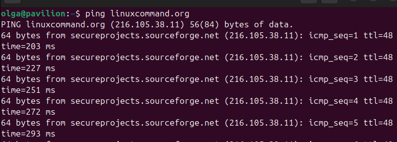

Сразу после запуска программа ping начинает посылать пакеты с определенным
интервалом (по умолчанию 1 секунда), пока ее выполнение не будет прервано. После прерывания нажатием CTRL+C (в данном примере после шестого пакета)
ping выводит результаты своей работы. Если сеть функционирует должным образом, число потерянных пакетов (packet loss) будет составлять ноль процентов.
Успешная работа ping может служить признаком того, что сетевые компоненты
(сетевые карты, кабели, маршрутизаторы и шлюзы) находятся в рабочем
состоянии.

#### traceroute

Программа traceroute (в некоторых системах используется похожая на нее программа tracepath) выводит список всех «переходов» (hops) на пути сетевого трафика между локальной системой и указанным узлом сети. Например, увидеть, как
выглядит маршрут к сайту http://www.slashdot.org/, можно с помощью следующей
команды:

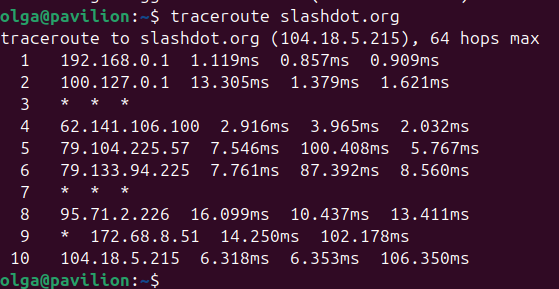

Здесь можно видеть, что на пути между нашей тестовой системой и http://www.
slashdot.org/ находится 10 маршрутизаторов. Для маршрутизаторов, предоставляющих идентификационную информацию, выводятся имена хостов, IP-адреса
и информация о производительности, которая включает три интервала времени,
понадобившихся для передачи/подтверждения пакетов между локальной системой и маршрутизатором. Для маршрутизаторов, не предоставляющих идентификационной информации (например, из-за особенностей настройки маршрутизатора, заторов в сети, действий брандмауэров и т. д.), выводятся звездочки, как это можно видеть в строке, соответствующей второму переходу. Иногда, когда информация о маршрутизаторе блокируется, это ограничение можно преодолеть, передав команде traceroute параметр -T или -I.

#### ip
Программа ip — это многофункциональный инструмент для настройки параметров подключения к сети, использующий весь спектр сетевых функций, доступных в современных ядрах Linux. Она пришла на замену ныне устаревшей программе ifconfig. С помощью ip можно исследовать сетевые интерфейсы и таблицу маршрутизации системы.

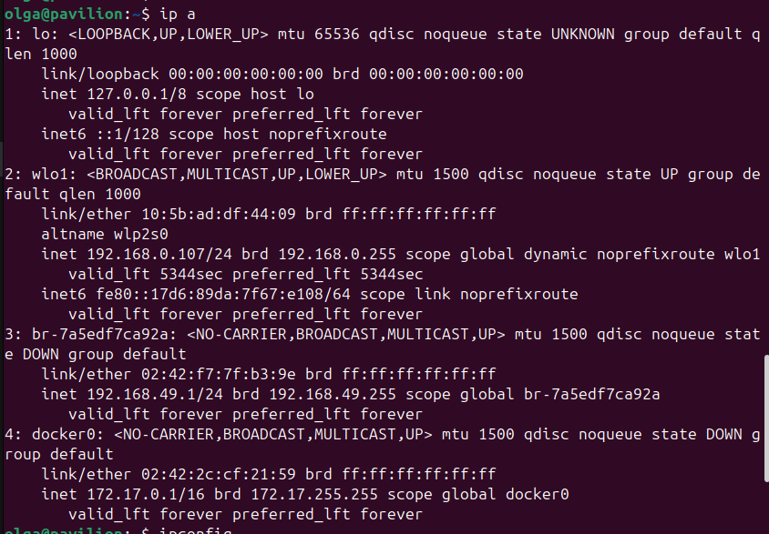

Пример, приведенный выше, показывает, что наша тестовая система имеет xtnsht сетевых интерфейса. Первый, с именем lo, — это петлевой интерфейс (loopback),
виртуальный интерфейс, который система использует, чтобы разговаривать «сама
с собой»; второй, с именем wlo1, — это беспроводной интерфейс, отвечающий за Wifi соединение; третий br-7a5edf7ca92a и четвертый docker0 - виртуальные сетевые мосты, созданные докером.

Выполняя причинно-следственную диагностику, первое, на что следует обратить внимание, — наличие слова UP в первой строке с информацией о каждом
интерфейсе, указывающего, что сетевой интерфейс включен, и присутствие
допустимого IP-адреса в поле inet во третьей строке. Для систем, использующих протокол динамической настройки хостов (Dynamic Host Configuration
Protocol, DHCP), наличие допустимого IP-адреса в этом поле подтвердит нормальную работу DHCP.

#### Mtr

В Windows существует команда pathping — это утилита, которая объединяет функции ping и tracert: она показывает маршрут до узла и одновременно собирает статистику задержек и потерь пакетов на каждом промежуточном узле сети. В Linux нет точного аналога pathping, но его функционал выполняет команда mtr (My Traceroute). Она комбинирует трассировку маршрута и измерение пинга на каждом этапе, показывая в реальном времени информацию о задержках и потерях пакетов для каждого узла маршрута. Также можно использовать отдельно ping и traceroute, но mtr удобнее, так как объединяет эти инструменты и обновляет статистику динамически.

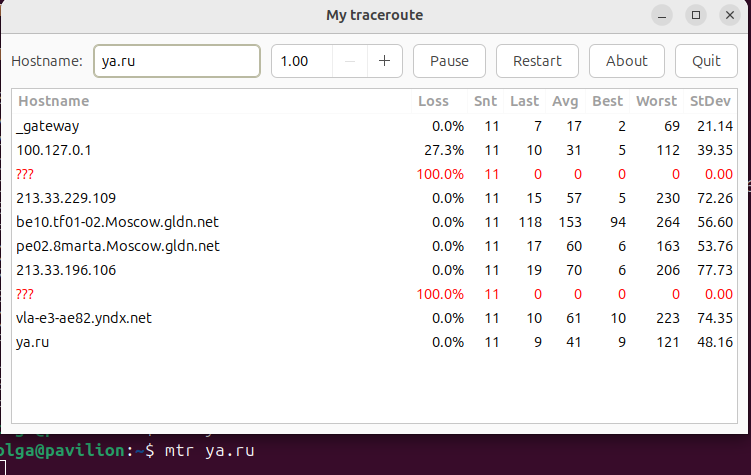

#### netstat

Программа netstat используется для исследования различных настроек сети
и статистик. С помощью множества параметров этой команды можно просматривать самые разные аспекты настройки сети. С помощью параметра -ie, например,
можно исследовать сетевые интерфейсы в системе:

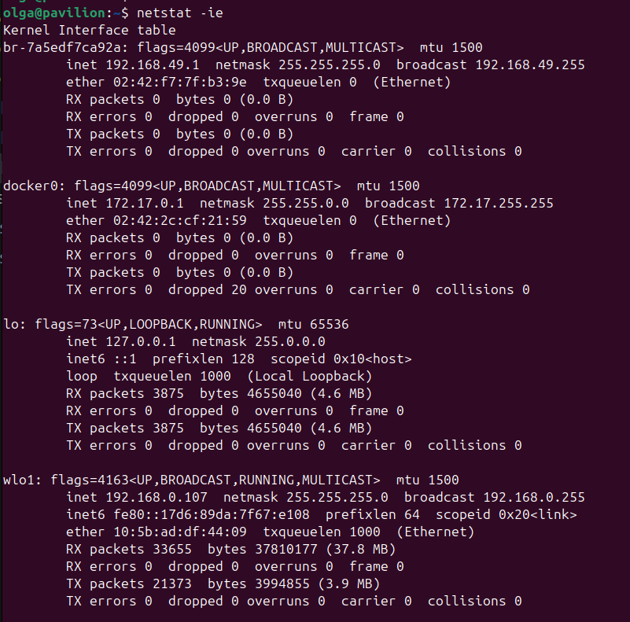

Использование параметра -r позволит получить таблицу маршрутизации ядра.
По этой таблице можно судить, как настроена передача пакетов между сетями:


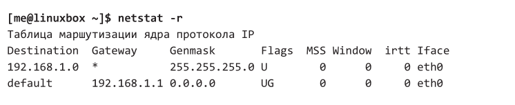

В этом простом примере представлена типичная таблица маршрутизации для
клиентской машины, подключенной к локальной сети (Local Area Network, LAN),
находящейся за брандмауэром/маршрутизатором. В первой строке демонстрируется адрес назначения 192.168.1.0. IP-адреса, оканчивающиеся нулем, соответствуют целым сетям, а не отдельным узлам в них, поэтому такой адрес подразумевает: «любой узел в локальной сети». Следующее поле, Gateway (шлюз), определяет имя или IP-адрес шлюза (маршрутизатора) для выхода текущего узла в указанную сеть. Звездочка в этом поле указывает, что использовать шлюз не требуется. В последней строке в качестве адреса назначения указано слово default (по умолчанию). Эта строка управляет трафиком, адресованным любым сетям, не перечисленным в таблице. В данном примере видно, что роль шлюза выполняет маршрутизатор с адресом 192.168.1.1, который, по всей видимости, знает, что делать с трафиком. Что касается флагов, Flags "UG" — U (маршрут активен), G (используется шлюз).

Так же как ip, программа netstat имеет множество параметров, из которых мы
рассмотрели только пару. Полный их список вы найдете на странице справочного
руководства (man) для netstat.

### Передача файлов по сети

Сейчас мы рассмотрим несколько команд, которые позволяют перемещать файлы по сети. 

#### ftp

Одна из по-настоящему «классических» программ — ftp — получила свое имя от
используемого ею протокола, протокола передачи файлов (File Transfer Protocol,
FTP). Протокол FTP широко используется в Интернете для передачи файлов.
Он поддерживается большинством веб-браузеров, если не всеми, и вам часто
будут встречаться идентификаторы URI, начинающиеся с префикса протоко-
ла ftp://.
Программа ftp появилась задолго до веб-браузеров. Она использовалась для обмена данными с серверами FTP, компьютерами, хранящими файлы, которые можно выгружать и загружать по сети.
Протокол FTP (в своем первоначальном виде) небезопасен, потому что пересылает имена и пароли в открытом текстовом виде. То есть они не шифруются,
и любой, кто способен перехватить сетевой трафик, сможет увидеть их. По этой
причине практически все операции по протоколу FTP в Интернете выполняются
анонимными северами FTP. Анонимный сервер позволяет любому желающему
подключиться с учетной записью anonymous без пароля. В следующем примере показан типичный сеанс работы с программой ftp для загрузки ISO-образа с дистрибутивом Ubuntu из каталога /pub/cd_images/Ubuntu-18.04 анонимного сервера FTP fileserver.

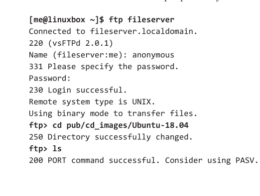

В таблице ниже приведены описания команд сеанса FTP.

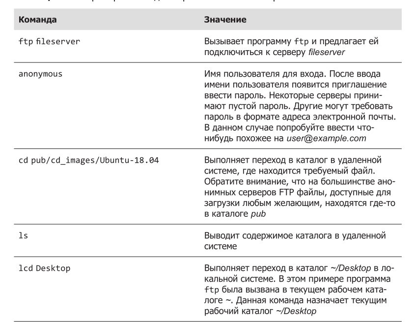

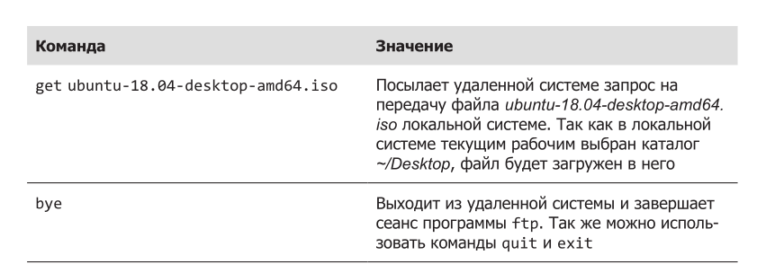

#### lftp — более удачная версия ftp

ftp — не единственный клиент FTP командной строки. В действительности та-
ких клиентов множество. Одним из лучших (и более популярным) считается
lftp. Этот клиент действует почти так же, как традиционная программа ftp, но имеет множество дополнительных функций, включая поддержку нескольких протоколов (в том числе и HTTP),возможность автоматического восстановления прервавшейся загрузки, выполнение операций в фоновом режиме, автодополнение путей по клавише Tab и многое другое.

#### wget

wget — еще одна популярная программа командной строки для загрузки файлов.
Ее удобно использовать для загрузки содержимого веб- и FTP-сайтов. С помо-
щью wget можно загрузить один файл, несколько файлов и даже целый сайт. На-
пример, загрузить первую страницу сайта http://www.linuxcommand.org/ можно
командой:

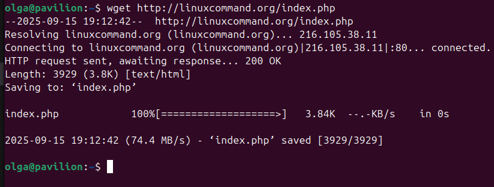

Большинство параметров, поддерживаемых программой wget, позволяет организовать рекурсивную загрузку, загрузку файлов в фоновом режиме (позволяет
выйти из системы без остановки загрузки) и догружать частично загруженные
файлы. Эти возможности хорошо описаны на странице справочного руководства
(man).

### Безопасные взаимодействия с удаленными узлами

Уже много лет Unix-подобные операционные системы поддерживают возможность удаленного администрирования по сети. На первом этапе, еще до повсеместного распространения Интернета, существовала пара популярных программ для входа в удаленные сетевые узлы: rlogin и telnet. Однако эти программы страдали
тем же фатальным недостатком, что и программа ftp; все данные (включая имена
пользователей и пароли) они передавали в виде открытого текста. Это совершенно недопустимо в эпоху Интернета.

Однако, команда telnet используется для проверки сетевого соединения с удалённым сервером или устройством на конкретном TCP-порту. Она позволяет установить текстовое соединение с указанным хостом и портом, что помогает:

* Проверить, доступен ли сервер и открыт ли нужный порт (например, 80 для HTTP, 22 для SSH).
* Диагностировать проблемы с сетью и межсетевыми экранами (firewall).
* В некоторых случаях открыть терминальный сеанс для удалённого управления устройствами или серверами (но сейчас редко из-за ненадежности безопасности).

#### ssh

Для решения описанной проблемы был разработан протокол с названием SSH
(Secure Shell — безопасная командная оболочка). SSH решает две основные проблемы безопасного взаимодействия с удаленными сетевыми узлами:

* подтверждает, что удаленный узел является именно тем, за кого себя выдает
(это предотвращает атаки вида «злоумышленник в середине» (man-in-the-
middle));
*  шифрует все данные, передаваемые между локальным и удаленным узлами.

В своей работе протокол SSH опирается на два компонента. На удаленном узле
действует сервер SSH, принимающий соединения на порте 22, а в локальной системе действует клиент SSH, осуществляющий обмен информацией с удаленным
сервером.

Большинство дистрибутивов Linux включают реализацию SSH с названием
OpenSSH из проекта BSD. Некоторые дистрибутивы (например, Red Hat) по умолчанию содержат пакеты с обоими компонентами, сервером и клиентом, тогда как другие (например, Ubuntu) включают только клиента. Чтобы система могла принимать удаленные соединения, в ней должен быть установлен пакет с реализацией сервера OpenSSH-server, этот сервер должен быть настроен и запущен, и если система находится за брандмауэром, последний должен пропускать входящие соединения на порт TCP с номером 22.

### СОВЕТ

Если у вас нет удаленной системы, с которой можно было бы устанавливать
соединения, но вы желаете поработать с примерами, приведенными ниже, установите пакет OpenSSH-server (sudo apt-get install openssh-server) в своей системе и используйте имя localhost в качестве имени удаленного узла. В этом случае ваш компьютер будет устанавливать соединения с самим собой.

Программа клиента SSH, используемая для подключения к серверам SSH, имеет
достаточно очевидное имя: ssh. Подключиться к удаленному сетевому узлу с именем localhost можно с помощью программы клиента ssh, как показано ниже:

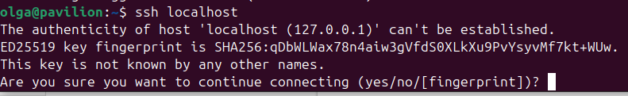

При первой попытке подключения на экран выводится предупреждение, сообща-
ющее, что аутентичность удаленного узла не может быть установлена. Это объясняется тем, что программа-клиент прежде никогда не подключалась к данному
удаленному узлу. Чтобы принять идентификационные данные удаленного узла,
введите yes в ответ на приглашение. После установки соединения пользователю
будет предложено ввести пароль.

Сеанс с удаленной командной оболочкой продолжается, пока пользователь не
введет команду exit в приглашении удаленной командной оболочки, после чего
соединение закроется. В этот момент возобновится сеанс локальной командной
оболочки и появится ее приглашение к вводу.
К удаленной системе можно также подключиться с другим именем пользователя.
Например, если локальный пользователь me имеет в удаленной системе учетную
запись с именем bob, он сможет войти в удаленную систему с именем test, выполнив следующую команду:

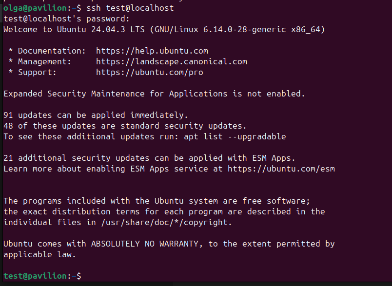

Помимо открытия сеанса командной оболочки в удаленной системе ssh позволяет
также выполнить единственную команду. Например, в удаленной системе localhoat можно выполнить команду free и получить результаты в локальной системе:


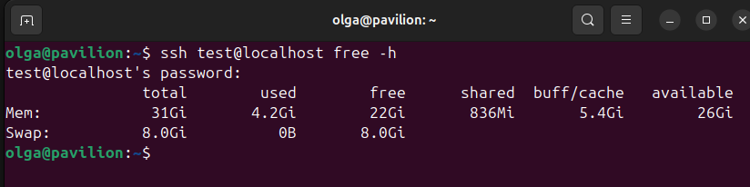

Этот прием открывает возможность для довольно интересных вариантов использования, как в следующем примере, где вывод команды ls в удаленной системе перенаправляется в локальный файл:

#### ssh test@localhost 'ls *' > dirlist.txt

Обратите внимание на одиночные кавычки. Они необходимы для предотвращения подстановки пути в локальной системе; нам требуется, чтобы подстановка
была выполнена в удаленной системе. Аналогично, если бы нам потребовалось
перенаправить вывод в файл в удаленной системе, мы могли бы поместить оператор перенаправления и имя файла внутрь одиночных кавычек:

#### ssh test@localhost 'ls * > dirlist.txt'

### СОЗДАНИЕ ТУННЕЛЯ SSH

При установке SSH-соединения с удаленным узлом между локальной и удаленной
системами создается шифрованный туннель. Обычно этот туннель используется
для безопасной передачи команд из локальной системы в удаленную и безопас-
ной передачи результатов обратно. Помимо этой основной задачи, протокол SSH
позволяет также передавать через шифрованный туннель самые разные виды
сетевого трафика, создавая своего рода виртуальную частную сеть (Virtual
Private Network, VPN) между локальной и удаленной системами.

Чаще всего, пожалуй, эта возможность используется для передачи трафика X
Window System. Из системы с действующим X-сервером (то есть отображающей
графический интерфейс) можно запустить программу-клиента X (приложение
с графическим интерфейсом) в удаленной системе и отображать ее интерфейс
в локальной системе. Как это делается, показано в следующем примере. Пред-
ставьте, что мы работаем в системе Linux с именем linuxbox, где запущен X-сервер,и нам понадобилось запустить программу xload в удаленной системе с именем remote-sys так, чтобы графический интерфейс программы отображался в локальной системе. Добиться этого можно следующим способом:

[me@linuxbox ~]$ ssh -X remote-sys <br>
me@remote-sys's password: <br>
Last login: Mon Sep 05 13:23:11 2018 <br>
[me@remote-sys ~]$ xload <br>

После запуска программы xload в удаленной системе ее окно появится в локальной системе. В некоторых системах может понадобиться использовать параметр -Y вместо -X.

### scp и sftp

Пакет OpenSSH включает еще две программы, способные использовать шифрованный туннель SSH для копирования файлов по сети. Первая, scp (secure
copy — безопасное копирование), используется для копирования файлов, как
уже знакомая вам программа cp. Основное отличие заключается в необходимости предварять пути к исходному или конечному файлу именем удаленного
узла и символом двоеточие за ним. Например, скопировать документ с именем
document.txt из домашнего каталога в удаленной системе remote-sys в текущий
рабочий каталог в локальной системе можно так:

[me@linuxbox ~]$ scp remote-sys:document.txt . <br>
me@remote-sys's password: <br>
document.txt <br>
100% 5581 <br>
[me@linuxbox ~]$ <br>
5.5KB/s <br>
00:00 <br>

По аналогии с командой ssh перед именем удаленного узла можно указать имя
пользователя, если имя учетной записи в удаленной системе не совпадает с именем учетной записи в локальной системе:

[me@linuxbox ~]$ scp bob@remote-sys:document.txt . <br>

Вторая программа копирования файлов через SSH-соединение — sftp. Как следует из ее имени — это безопасная замена для программы ftp. sftp действует
практически так же, как оригинальная программа ftp, которую мы использовали
выше, только передает данные не в открытом текстовом виде, а через шифрованный туннель SSH. sftp имеет важное преимущество перед обычной программой ftp — она не требует, чтобы на удаленном узле работал сервер FTP. Ей необходим только сервер SSH. Это означает, что любой компьютер, к которому можно подключиться с помощью клиента SSH, можно также использовать в качестве FTP-подобного сервера. Ниже приводится пример сеанса работы с программой sftp:


[me@linuxbox ~]$ sftp remote-sys <br>
Connecting to remote-sys... <br>
me@remote-sys's password: <br>
sftp> ls <br>
ubuntu-8.04-desktop-i386.iso <br>
sftp> lcd Desktop <br>
sftp> get ubuntu-8.04-desktop-i386.iso <br>
Fetching /home/me/ubuntu-8.04-desktop-i386.iso to ubuntu-8.04-desktop-i386.iso <br>
/home/me/ubuntu-8.04-desktop-i386.iso 100% 699MB <br>
7.4MB/s <br>
01:35 <br>
sftp> bye <br>


### СОВЕТ

Протокол SFTP поддерживается многими диспетчерами файлов с графическим
интерфейсом, входящими в состав дистрибутивов Linux. В GNOME или KDE
можно ввести в адресную строку идентификатор URI, начинающийся с sftp://,
и работать с файлами, хранящимися в удаленной системе с действующим сер-
вером SSH.

### СУЩЕСТВУЮТ ЛИ КЛИЕНТЫ SSH ДЛЯ WINDOWS?

Допустим, что вы работаете за компьютером с операционной системой Windows
и вам нужно зайти на свой сервер с Linux, чтобы выполнить некую работу. Как
быть? Нужно просто установить в Windows программу клиента SSH! Существует
довольно много таких программ. Наиболее популярной, пожалуй, является программа PuTTY. Программа PuTTY отображает окно терминала и позволяет пользователю Windows открыть сеанс SSH (или telnet) с удаленным узлом. Программа также предоставляет аналоги программ scp и sftp.

Для Windows есть mRemoteNG, которая позволяет работать с SSH подключениями, а WinScp предоставляет UI для связи windows/linux операционных систем и для передачи файлов между ними. 
В Linux аналогом mRemoteNG является Remmina.

## Глава 17 Поиск файлов

Блуждая по системе Linux, мы совершенно ясно увидели, что типичная Linux-
система содержит множество файлов. В связи с этим возникает вопрос: как ис-
кать нужные файлы? Мы уже знаем, что файловая система в Linux организована
в соответствии с определенными соглашениями, которые переходили из одного
поколения Unix-подобных систем в другое, но огромное число файлов может по-
рождать труднопреодолимую проблему.
В этой главе мы рассмотрим два инструмента для поиска файлов в системе:

* locate — выполняет поиск файлов по именам;
* find — выполняет поиск файлов в иерархии каталогов.

Мы также познакомимся с командой, часто используемой вместе с командами по-
иска файлов для обработки списков с результатами:
* xargs — конструирует команды на основе данных, полученных из стандартного
ввода, и выполняет их.
Дополнительно в этой главе будет представлена пара команд, которые помогут
нам в наших исследованиях:

* touch — изменяет времена, ассоциированные с файлом;
* stat — выводит статус файла или файловой системы.

### locate — простой способ поиска файлов

Программа locate выполняет быстрый поиск в базе данных имен файлов и выводит все имена, соответствующие искомой строке. 

Важно! 

В Ubuntu locate нет по умолчанию, её необходимо установить 
sudo apt install plocate.

Допустим, к примеру, что нужно найти все программы с именами, начинающимися с zip. Поскольку требуется найти программы, можно предположить, что имя каталога с программами оканчивается на bin/. Соответственно можно попробовать выполнить поиск с помощью locate, как показано ниже:


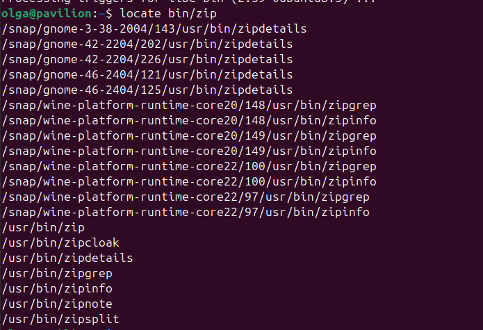

Если к результатам поиска предъявляются более строгие требования, команду
locate можно объединить с другими инструментами, такими как grep, позволяющими осуществить более сложный поиск:

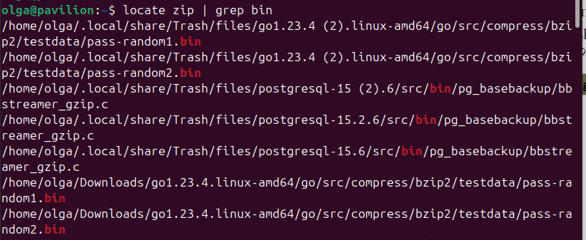

Программа locate существует уже много лет, и за эти годы было создано несколько ее вариантов, получивших широкое распространение. Два из них, наиболее часто используемые в современных дистрибутивах Linux, — это slocate и mlocate, которые, впрочем, являются символическими ссылками, указывающими на locate. Разные версии locate имеют пересекающиеся множества параметров. Некоторые поддерживают поиск с использованием регулярных выражений и групповые символы.

### ОТКУДА БЕРЕТСЯ БАЗА ДАННЫХ ДЛЯ LOCATE?

В некоторых дистрибутивах при попытке запустить locate сразу после установки
она потерпит неудачу, но если попытаться использовать ее на следующий день,
все, как ни странно, будет работать как надо. Так в чем же проблема? База данных для locate создается другой программой с именем updatedb. Обычно она
периодически запускается как задание cron; то есть она запускается системным
планировщиком cron через регулярные интервалы времени. В большинстве систем,
в состав которых входит locate, программа updatedb запускается один раз в сутки. Поскольку база данных не обновляется непрерывно, скорее всего, locate не находит самые свежие файлы. Чтобы решить эту проблему, запустите программу
updatedb вручную от имени суперпользователя.

### find — сложный способ поиска файлов

В отличие от программы locate, выполняющей поиск файлов по именам, программа find ищет файлы согласно заданным атрибутам в указанном каталоге (и во
вложенных подкаталогах). 
В простейшем случае программе find можно передать одно или несколько имен
каталогов для поиска. Например, с ее помощью можно получить список содержимого домашнего каталога:

#### [me@linuxbox ~]$ find ~

Для большинства активных пользователей она выдаст длинный список. Так как
список выводится в стандартный вывод, его можно передать по конвейеру другим
программам. Воспользуемся программой wc, чтобы подсчитать число файлов:

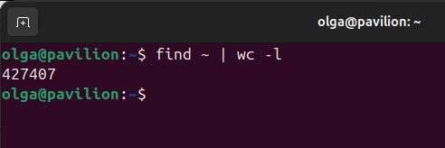

### Разные способы использования команды find

### Проверки

Допустим, мы хотим получить список каталогов. Для этого добавим в команду
следующую проверку:

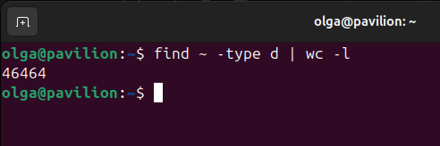

Добавив проверку -type d, мы ограничились поиском только каталогов. Но точно
так же можно ограничить поиск только обычными файлами:


В таблице ниже перечислены проверки типов файлов, наиболее часто используемые
с командой find.

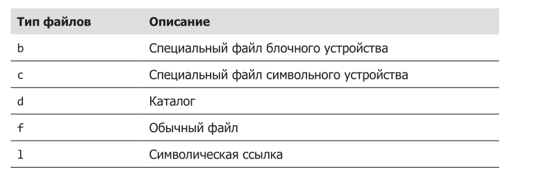

Добавив дополнительные проверки, можно выполнять поиск файлов по размеру
и имени. Давайте найдем все обычные файлы с именами, соответствующими ша-
блону *.txt, и имеющие размер больше 1 мегабайта:


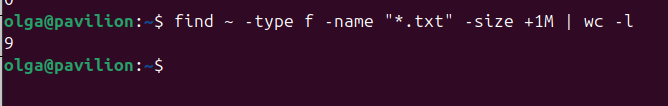

В этом примере мы добавили проверку -name с шаблоном имени файла. Обратите внимание, что шаблон заключен в кавычки, чтобы предотвратить подстановку имен файлов командной оболочкой. Далее мы добавили проверку -size со строкой +1M. Начальный символ «плюс» указывает, что требуется искать файлы, размер которых превышает указанное число. Начальный символ «минус» изменил бы значение строки на противоположное: «меньше указанного числа». Число без знака означает: «в точности соответствует значению». Буква M в конце определяет
единицы измерения — мегабайты (Megabytes). В таблице ниже перечислены символы,
которые можно использовать для обозначения единиц измерения.

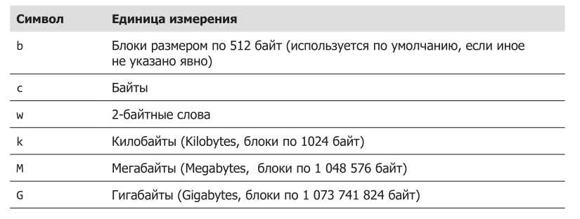

Команда find поддерживает множество разнообразных проверок. В таблице ниже приводится краткое описание наиболее часто используемых из них. Обратите внимание, что в случаях, когда требуется числовой аргумент, допустимо использование формы записи с символами + и -, обсуждавшейся выше.

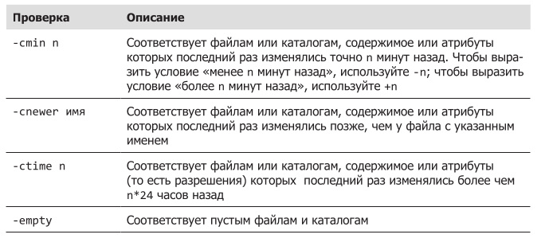

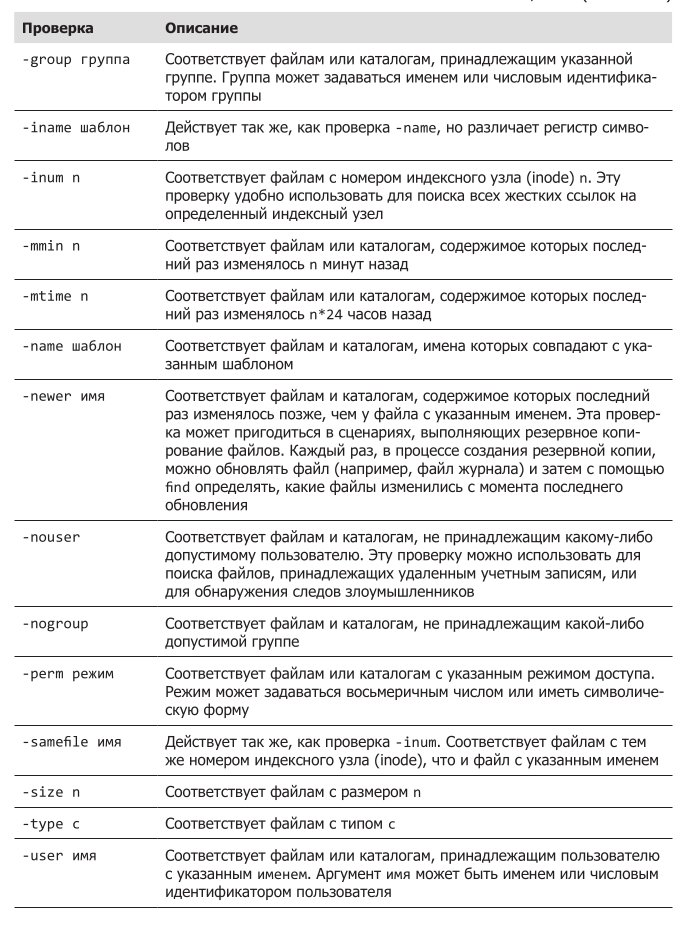

### Операторы

Несмотря на большое число проверок, поддерживаемых командой find, мы все еще
нуждаемся в способе определения логических отношений между проверками. Например, представьте, что в некотором каталоге мы хотим найти все файлы и подкаталоги с небезопасными разрешениями. Для этого можно было бы выполнить
поиск всех файлов с разрешениями, отличающимися от 0600, и каталогов с разрешениями, отличающимися от 0700. К счастью, find поддерживает возможность
комбинирования проверок с помощью логических операторов с целью определить
более сложные критерии отбора. Выразить вышеупомянутую проверку можно
так:

#### olga@pavilion:~$ find ~ \( -type f -not -perm 0600 \) -or \( -type d -not –perm 0700 \)

Достаточно сложно выглядит. На самом деле операторы перестанут казаться такими, как только вы с ними познакомитесь поближе (см. таблицу ниже).

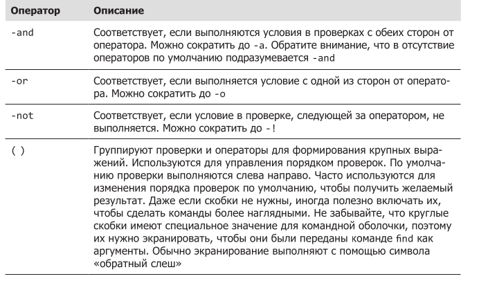

Имея список операторов под рукой, попробуем разобрать команду find. На самом
верхнем уровне мы видим, что проверки объединены в две группы, разделенные
оператором -or:

#### (выражение 1) -or (выражение 2)

В этом есть определенный смысл, потому что мы хотим найти файлы с одним набором разрешений и каталоги — с другим. Но если выполняется поиск и файлов,
и каталогов, почему используется оператор -or вместо -and? Потому, что find, выполняя обход файлов и каталогов, оценивает их по одному, чтобы понять, соответствует ли файл или каталог указанным проверкам. Команде требуется узнать, является ли очередной элемент файлом или каталогом с «плохими» разрешениями. Один и тот же элемент не может соответствовать сразу двум условиям. То есть если развернуть сгруппированные выражения, можно увидеть следующее:

####  (файл с плохими разрешениями) -or (каталог с плохими разрешениями)

Наша следующая задача — проверить «плохие разрешения». Как это сделать?
Фактически никак. Но мы можем проверить «неудовлетворительные разрешения», зная, что такое «удовлетворительные разрешения». В случае с файлами
удовлетворительными являются разрешения 0600, для каталогов — 0700. Выражение, проверяющее «неудовлетворительные» разрешения, выглядит так:

-type f -and -not -perm 0600

а для каталогов так:

-type d -and -not -perm 0700

Как отмечалось ранее, оператор -and можно просто удалить, так как он подразумевается по умолчанию. Теперь, объединив все вместе, мы получим оконча-
тельную команду:

find ~ (-type f -not -perm 0600) -or (-type d -not -perm 0700)

Однако поскольку круглые скобки имеют специальное значение для командной
оболочки, их нужно экранировать, чтобы предотвратить интерпретацию скобок
командной оболочкой. Для этого достаточно добавить обратный слеш перед каждой из них.

find ~ \( -type f \! -perm 0600 \) -o \( -type d \! -perm 0700 \)

Логические операторы имеют еще одну важную особенность, с которой необходи-
мо разобраться. Представьте, что у нас есть два выражения, разделенных логиче-
ским оператором:


#### выражение1 -оператор выражение2

Выражение1 будет вычислено в любом случае, а вот будет ли вычислено выражение2, зависит от оператора. В таблице ниже показано, как это работает.


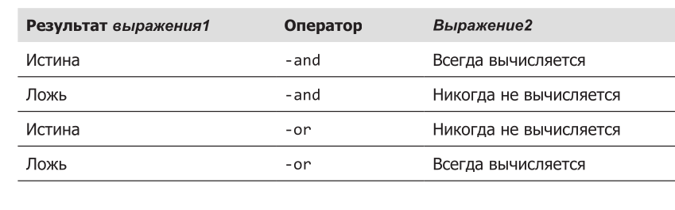

Почему так происходит? Это сделано для повышения производительности. Возьмем для примера оператор -and. Мы знаем, что выражение выражение1 -and выражение2 не может быть истинным, если выражение1 вернет ложный результат, поэтому
нет смысла вычислять выражение2. Аналогично, если имеется выражение выражение1
-or выражение2 и выражение1 вернет истинный результат, нет смысла вычислять выражение2, так как уже известно, что выражение1 -or выражение2 является истинным. Это удобно, поскольку такой порядок вычислений помогает повысить скорость выполнения. Но почему это так важно для нас? Потому, что мы можем использовать данную особенность для управления выполнением операций, о которых рассказывается далее.

#### Небольшая заметка:

В некоторых языках программирования (в данном случае поговорим про Java), существуют такие же операторы.

& в логических выражениях оценивает оба операнда всегда, а && оценивает второй только если первый — true. В большинстве случаев для логики используют &&. Такая же история с оператором ||.


#### Предопределенные операции

Давайте попробуем выполнить определенные действия в процессе поиска! Иметь
список с результатами работы команды find уже неплохо, но представьте, что нам
нужно выполнить некие операции с элементами списка. К счастью, find позволяет
выполнять наши операции, основываясь на результатах поиска. Существует множество предопределенных операций и несколько способов применения операций,
определяемых пользователем. Для начала взгляните на неполный список предопределенных операций в таблице ниже.

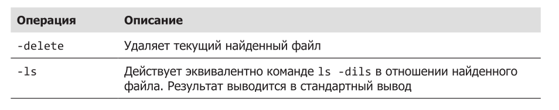

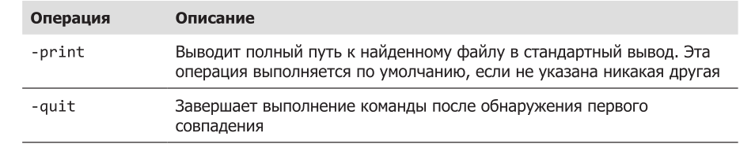

В нашем первом примере мы выполнили команду:

find ~
Она выводит список всех файлов и подкаталогов, хранящихся в домашнем каталоге. Список выводится просто потому, что в отсутствие других операций предполагается операция -print. То есть эту команду можно было бы выразить так:

#### find ~ -print

Программу find можно использовать для удаления файлов, соответствующих
определенным критериям. Например, следующая команда удалит все файлы
с расширением .bak (которое часто используется для обозначений резервных копий файлов):

#### find ~ -type f -name '*.bak' -delete

Эта команда найдет в домашнем каталоге (и во вложенных подкаталогах) пользователя все файлы с расширением .bak и удалит их.

#### ВНИМАНИЕ

Операцию -delete следует использовать с особыми предосторожностями. Всегда
предварительно проверяйте команду, подставив операцию -print вместо -delete,
чтобы убедиться, что она не удалит ничего лишнего.

Прежде чем продолжить, давайте посмотрим, как логические операторы воздействуют на операции. Взгляните на следующую команду:

find ~ -type f -name '*.bak' -print

Как видите, эта команда ищет обычные файлы (-type f) с расширением .bak (-name
'*.bak') и выводит относительные пути к ним в стандартный вывод (-print).
Однако такой порядок работы команды определяется логическими отношениями между всеми проверками и операциями. Как вы помните, между проверками
и операциями по умолчанию подразумевается отношение -and. Ту же команду
можно выразить, добавив логические операторы:

#### find ~ -type f -and -name '*.bak' -and -print

Теперь, имея перед глазами это определение, взгляните на таблицу ниже, где показано, как логические операторы влияют на порядок выполнения.

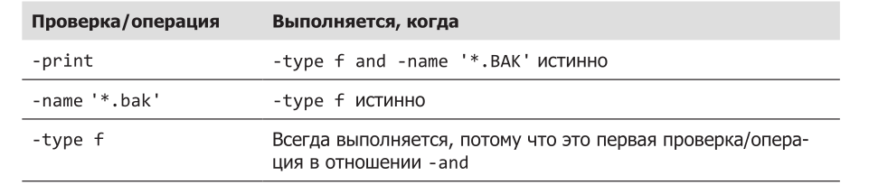


Так как логические отношения между проверками и операциями определяют необходимость их выполнения, можно сделать вывод, что их порядок следования играет важную роль. Например, если изменить порядок выполнения операций и проверок, поставив операцию -print на первое место, команда будет вести себя иначе:

#### find ~ -print -and -type f -and -name '*.bak'

Эта версия команды выведет каждый файл (операция -print всегда возвращает
истинное значение), а затем проверит тип файла и его расширение.

### Операции, определяемые пользователем

Помимо предопределенных операций можно также вызывать произвольные команды. Традиционно с этой целью используется операция -exec, что показано
ниже:

####  -exec команда {} ;

где команда — это имя команды, {} — символическое представление текущего пути
к файлу и точка с запятой — обязательный разделитель, обозначающий конец команды. Следующий пример демонстрирует использование -exec для получения
эффекта, аналогичного операции -delete, обсуждавшейся выше:
-exec rm '{}' ';'

И снова, поскольку фигурные скобки и точка с запятой имеют специальное зна-
чение для командной оболочки, они должны заключаться в кавычки или экранироваться. Кроме того, существует возможность выполнять пользовательские операции интерактивно. Если заменить операцию -exec операцией -ok, перед выполнением каждой указанной команды будет выводиться запрос:

find ~ -type f -name 'foo*' -ok ls -l '{}' ';'
< ls ... /home/me/bin/foo > ? y
-rwxr-xr-x 1 me me 224 2007-10-29 18:44 /home/me/bin/foo
< ls ... /home/me/foo.txt > ? y
-rw-r--r-- 1 me me 0 2016-09-19 12:53 /home/me/foo.txt

Эта команда ищет файлы с именами, начинающимися со строки foo, и для каждого найденного файла выполняет команду ls -l. Операция -ok запрашивает под-
тверждение у пользователя, прежде чем выполнить команду ls.

#### Увеличение эффективности

Каждый раз, когда обнаруживается файл, соответствующий критериям, операция
-exec запускает новый экземпляр указанной команды. Но иногда желательно объединить все результаты поиска и запустить единственный экземпляр команды.
Например, вместо последовательности команд, такой как

ls -l файл1
ls -l файл2

предпочтительнее было бы выполнить команду

ls -l файл1 файл2

Здесь команда выполняется только один раз, а не несколько. Существует два спо-
соба добиться этого: традиционный, с использованием внешней команды xargs,
и альтернативный, с использованием новой возможности в самой команде find.
Обсудим сначала альтернативный способ.


Если заменить завершающий символ «точка с запятой» знаком «плюс», в команде
find активируется функция объединения результатов в список аргументов для вы-
зова единственного экземпляра требуемой команды. Вернемся к нашему примеру.

Команда:
find ~ -type f -name 'foo*' -exec ls -l '{}' ';'
-rwxr-xr-x 1 me me 224 2007-10-29 18:44 /home/me/bin/foo
-rw-r--r-- 1 me me 0 2016-09-19 12:53 /home/me/foo.txt


будет вызывать ls для каждого найденного файла. Изменив команду, как показано ниже:

find ~ -type f -name 'foo*' -exec ls -l '{}' +
-rwxr-xr-x 1 me me 224 2007-10-29 18:44 /home/me/bin/foo
-rw-r--r-- 1 me me 0 2016-09-19 12:53 /home/me/foo.txt

мы получим тот же результат, но система выполнит команду ls только один раз.

### xargs

Команда xargs предлагает очень интересную возможность. Она принимает входные данные со стандартного ввода и преобразует их в список аргументов для указанной команды. В данном примере ее можно было бы использовать так:

find ~ -type f -name 'foo*' -print | xargs ls -l
-rwxr-xr-x 1 me me 224 2007-10-29 18:44 /home/me/bin/foo
-rw-r--r-- 1 me me 0 2016-09-19 12:53 /home/me/foo.txt

Здесь вывод команды find передается по конвейеру команде xargs, которая, в свою очередь, конструирует список аргументов для команды ls и выполняет ее.

### ПРИМЕЧАНИЕ

Несмотря на то что в командную строку можно включить большое число аргументов, оно не бесконечно. Не исключено, что в результате получится команда, слишком длинная для командной оболочки. Когда длина командной строки превышает максимально допустимый размер, xargs выполнит указанную команду
с максимально возможным числом аргументов и затем повторит процесс, пока не
исчерпает все, что получит со стандартного ввода. Чтобы увидеть максимально возможную длину командной строки, выполните xargs с параметром --show-limits.

### ОБРАБОТКА ФАЙЛОВ С НЕОБЫЧНЫМИ ИМЕНАМИ

Unix-подобные системы позволяют встраивать в имена файлов пробелы (и
даже символы перевода строки). Это порождает проблемы при выполнении
программ, таких как xargs, конструирующих списки аргументов для других программ. Внутренние пробелы интерпретируются как разделители, и получившаяся
коман­да будет интерпретировать слова, разделенные пробелами, как отдельные
аргументы. Для решения этой проблемы find и xarg предлагают использовать
в качестве разделителя аргументов пустой символ (null character). В кодировке
ASCII пустой символ определен как символ с нулевым кодом (в противоположность пробелу, например, который в кодировке ASCII определен как символ
с кодом 32). Команда find поддерживает операцию -print0, которая производит вывод имен файлов, разделенных пустым символом, а команда xargs имеет
параметр --null, позволяющий организовать прием значений, разделенных
пустым символом. Например:

#### find ~ -iname '*.jpg' -print0 | xargs --null ls -l

Этот прием гарантирует правильную обработку любых имен файлов, даже содержащих пробелы.

### Возвращаемся в песочницу

Пришло время применить find для решения некоторых практических (почти) задач. Сначала создадим песочницу с множеством файлов и каталогов:

#### [me@linuxbox ~]$ mkdir -p playground/dir-{001..100}
#### [me@linuxbox ~]$ touch playground/dir-{001..100}/file-{A..Z}

Это волшебство мы сотворили с помощью уже знакомой команды (mkdir), механизма подстановки в командной оболочке (фигурные скобки) и новой команды
touch. Объединив команду mkdir с параметром -p (который вынуждает mkdir создать родительские каталоги в указанном пути) с подстановкой фигурных скобок, мы смогли создать 100 каталогов.
Команда touch обычно используется для обновления времени последнего изменения файлов. Но если передать ей имя несуществующего файла, она создаст пустой
файл.

В нашей песочнице мы создали 100 файлов с именем file-A. Давайте найдем их:

#### [me@linuxbox ~]$ find playground -type f -name 'file-A'

Обратите внимание, что, в отличие от ls, find возвращает результаты в несортированном порядке. Порядок определяется организацией устройства хранения. Мы можем убедиться, что действительно имеем 100 файлов с именем file-A:

#### [me@linuxbox ~]$ find playground -type f -name 'file-A' | wc -l
100

А теперь выполним поиск файлов по времени их последнего изменения. Этот подход можно использовать для создания резервных копий или организации файлов
в хронологическом порядке. Для этого сначала создадим эталонный файл, время
последнего изменения которого будет использоваться для сравнения:

#### [me@linuxbox ~]$ touch playground/timestamp

Эта команда создаст пустой файл timestamp и установит время его последнего изменения равным текущему времени. Мы можем убедиться в этом, использовав
еще одну полезную команду, stat, которую можно рассматривать как своего рода
форсированную версию ls. Команда stat выводит всю информацию о файле и его
атрибутах, которой обладает система:

#### [me@linuxbox ~]$ stat playground/timestamp

File: `playground/timestamp'
Size: 0
Blocks: 0
IO Block: 4096 regular empty file
Device: 803h/2051d Inode: 14265061 Links: 1
Access: (0644/-rw-r--r--) Uid: ( 1001/ me)
Gid: ( 1001/ me)
Access: 2018-10-08 15:15:39.000000000 -0400
Modify: 2018-10-08 15:15:39.000000000 -0400
Change: 2018-10-08 15:15:39.000000000 -0400

Если применить команду touch к файлу еще раз и затем исследовать его с по­
мощью stat, мы увидим, что время последнего его изменения обновилось:

#### [me@linuxbox ~]$ touch playground/timestamp
#### [me@linuxbox ~]$ stat playground/timestamp
File: `playground/timestamp'
Size: 0
Blocks: 0
IO Block: 4096 regular empty file
Device: 803h/2051d Inode: 14265061 Links: 1
Access: (0644/-rw-r--r--) Uid: ( 1001/ me)
Gid: ( 1001/ me)
Access: 2018-10-08 15:23:33.000000000 -0400
Modify: 2018-10-08 15:23:33.000000000 -0400
Change: 2018-10-08 15:23:33.000000000 -0400

Далее воспользуемся командой find, чтобы обновить время последнего изменения
некоторых файлов в нашей песочнице:

#### [me@linuxbox ~]$ find playground -type f -name 'file-B' -exec touch '{}' ';'

Эта команда обновит время последнего изменения для всех файлов с именем
file-B, имеющихся в песочнице. Теперь найдем с помощью find обновленные файлы, сравнив все файлы с эталонным файлом timestamp:

#### [me@linuxbox ~]$ find playground -type f -newer playground/timestamp
В результате мы получим все 100 файлов с именем file-B. Поскольку команда
touch применялась ко всем файлам file-B в песочнице после обновления файла
timestamp, они оказались «новее», чем timestamp, и потому были идентифицирова-
ны проверкой -newer.
В заключение вернемся к проверке плохих разрешений, выполнявшейся выше,
и применим ее к каталогу playground:

#### [me@linuxbox ~]$ find playground \( -type f -not -perm 0600 \) -or \( -type d -not -perm 0700 \)

Эта команда выведет все 100 каталогов и 2600 файлов, хранящихся в playground
(а также файл timestamp и сам каталог playground, всего 2702 элемента), потому
что ни один из них не соответствует нашему определению «удовлетворительные
разрешения». Вооружившись новыми знаниями об операторах и операциях, добавим в эту команду операции для применения новых разрешений к файлам и каталогам в песочнице:

#### [me@linuxbox ~]$ find playground \( -type f -not -perm 0600 -exec chmod 0600 '{}' ';' \) -or \( -type d -not -perm 0700 -exec chmod 0700 '{}' ';' \)

Основываясь на повседневном опыте, следует отметить, что намного проще ввести две команды — одну для каталогов и одну для файлов, чем одну большую составную команду, но знание, что можно действовать именно так, вам не помешает. Главное, что вы должны понять, — как можно использовать операторы и операции для решения практических задач.

### Параметры

Наконец, мы добрались до параметров. Параметры помогают управлять областью
поиска. Они могут включаться в выражения команды find наряду с другими проверками и операциями. В таблице ниже перечислены наиболее часто используемые параметры.

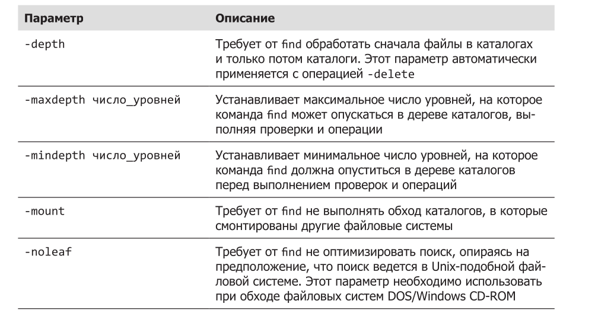

### Заключение

Вы видели сами, как легко определять местоположение файлов (locate) и как
сложно искать их (find). Каждая из этих команд имеет свою область применения.
Найдите время, чтобы исследовать богатые возможности find. При регулярном использовании эта команда поможет вам лучше понять операции с файловой системой Linux.

## Глава 18. Архивация и резервное копирование

Одной из основных задач администратора компьютерных систем является обеспечение безопасности данных, а одним из способов решения этой задачи — своевременное создание резервных копий системных файлов.

В этой главе мы рассмотрим несколько программ, часто используемых для управ-
ления коллекциями файлов:

Программы сжатия:
* gzip — сжимает и распаковывает файлы;
* bzip2 — программа поблочного сжатия файлов.

Программы архивирования:
* tar — утилита архивирования на ленту;
* zip — упаковывает и сжимает файлы.

И программа синхронизации файлов:
* rsync — выполняет синхронизацию файлов и каталогов с удаленной системой.

### Сжатие файлов

Сжатие данных — это процесс устранения избыточных данных. Давайте рассмо-
трим воображаемый пример. Допустим, у нас есть файл, хранящий изображение
абсолютно черного квадрата размером 100 на 100 пикселов. В терминах хране-
ния данных (если предположить, что каждый пиксел представлен 24 битами, или
3 байтами) изображение занимает 30 000 байт:
100 × 100 × 3 = 30 000.

Изображение, состоящее из пикселов одного цвета, содержит массу избыточных
данных. Будь мы умнее, мы могли бы закодировать данные в виде простого описания того факта, что изображение представлено блоком из 30 000 пикселов черного цвета. То есть вместо хранения блока данных с 30 000 нулей (черный цвет в файлах изображений обычно представлен нулевым значением) мы могли бы сжать данные до числа 30 000 с последующим нулем, описывающим цвет. Такая схема сжатия, она называется кодированием длин серий (run-length encoding), является одной из простейших технологий сжатия. Современные технологии не в пример сложнее и эффективнее, но главная цель осталась прежней — избавиться от избыточных данных. Алгоритмы сжатия (математические методики, применяемые
для осуществления сжатия) делятся на две основные категории:

* Сжатие без потерь (lossless) и с потерями (lossy). Сжатие без потерь гаран-
тирует сохранность всех данных, содержащихся в оригинале. То есть после
восстановления файла из сжатой версии восстановленный файл будет иметь
в точности то же содержимое, что и несжатый оригинал.
 
* Сжатие с потерями (lossy), с другой стороны, удаляет некоторые данные во
время сжатия, чтобы обеспечить более высокую степень сжатия. Восстанов-
ленный файл в этом случае не будет совпадать с оригинальной версией, скорее
он будет близкой аппроксимацией оригинала. Примерами сжатия с потерями
могут служить формат JPEG (для изображений) и MP3 (для музыкальных
произведений).

В дальнейшем обсуждении мы будем рассматривать только сжатие без потерь, поскольку большинство данных в компьютерах потерь не допускает.

### gzip

Программа gzip используется для сжатия одного или нескольких файлов. Во время
работы она замещает оригинальный файл его сжатой версией. Соответствующая программа gunzip используется для восстановления сжатых файлов до исходного
состояния. Например:

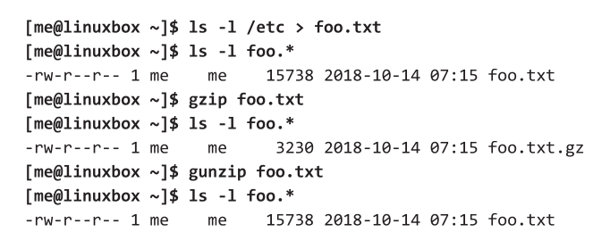

В этом примере мы создали текстовый файл с именем foo.txt, записав в него список содержимого каталога /etc. Далее мы запустили программу gzip, которая заменила оригинальный файл сжатой версией с именем foo.txt.gz. В списке содержимого каталога, который был получен с использованием шаблона foo.*, можно видеть, что исходный файл действительно был замещен сжатой версией, и эта сжатая версия получилась почти в пять раз меньше оригинала. Можно также заметить, что сжатый файл имеет такие же разрешения и время, что и оригинал.
Далее мы запустили программу gunzip, чтобы распаковать файл. После этого, как
видите, сжатая версия была замещена оригиналом, и снова с теми же разрешениями и временем.
Программа gzip имеет множество параметров, часть которых описана в таблице ниже.

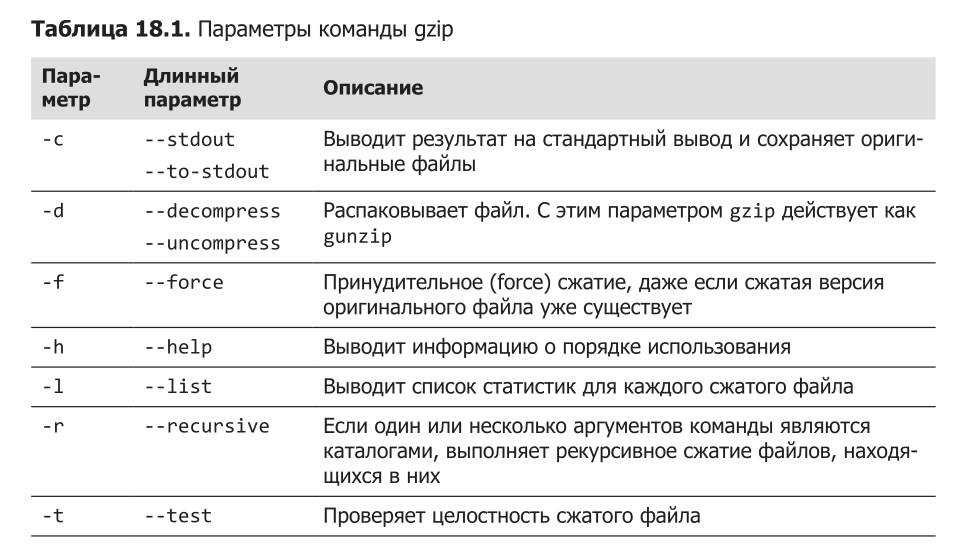

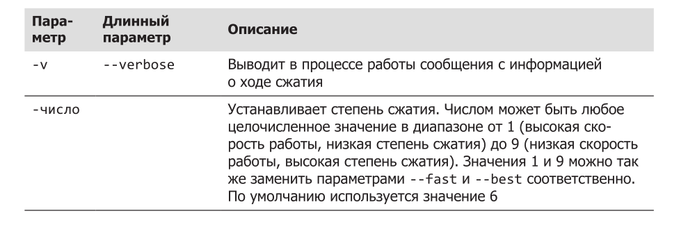

Вернемся к нашему примеру:

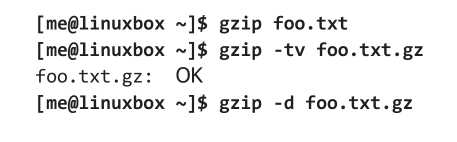

Здесь мы заменили файл foo.txt его сжатой версией с именем foo.txt.gz. Затем проверили целостность сжатой версии, передав параметры -t и -v. В заключение мы распаковали файл, вернув его исходное состояние.

gzip можно также использовать несколько необычным способом, через стандартные ввод и вывод:

ls -l /etc | gzip > foo.txt.gz

Эта команда создает сжатую версию списка с содержимым каталога.
Программа gunzip, которая распаковывает файлы, сжатые с помощью gzip, предполагает, что имена файлов оканчиваются расширением .gz, поэтому его можно не указывать при условии, что имя файла в команде не соответствует существующему несжатому файлу:

gunzip foo.txt

Если цель только в том, чтобы просмотреть содержимое сжатого текстового фай-
ла, сделать это можно так:

[me@linuxbox ~]$ gunzip -c foo.txt | less

#### Примечание.

Существует также программа zless. Она заменяет собой pipe, представленный выше.

Например, 

zless filename.gz

### bzip2

Программа bzip2 Джулиана Сюарда похожа на программу gzip, но использует
иной алгоритм, который обеспечивает более высокую степень сжатия ценой снижения скорости работы. Во многих отношениях она действует точно так же, как
gzip. Файл, сжатый с помощью bzip2, получает расширение .bz2:

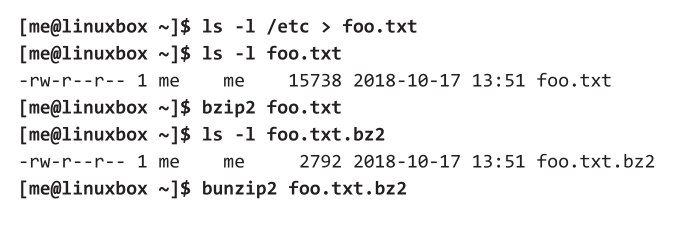

Как видите, bzip2 можно использовать так же, как gzip. Все параметры программы gzip (кроме -r), представленные выше, поддерживаются также программой
bzip2. Но имейте в виду, что параметр степени сжатия (-число) имеет несколько
иной смысл для bzip2. В паре с bzip2 поставляются программы bunzip2 и bzcat
для распаковывания файлов.

Существует также программа bzip2recover для восстановления поврежденных
файлов формата .bz2.

#### НЕ ПРЕВРАЩАЙТЕСЬ В ОДЕРЖИМЫХ МАНИЕЙ СЖАТИЯ

Мне иногда приходится видеть, как кто-то пытается сжать файл, уже сжатый с применением эффективного алгоритма сжатия, выполняя нечто подобное:
$ gzip picture.jpg

Это напрасная трата времени и дискового пространства! Если применить процедуру
сжатия к уже сжатому файлу, зачастую получается файл большего размера. Это
объясняется тем, что все методики сжатия добавляют в файл некоторую служебную
информацию, описывающую сжатие. Если попытаться сжать файл, не содержащий
избыточной информации, сжатие не приведет к экономии места, которая могла
бы покрыть расходы на хранение служебной информации. 

#### Архивирование файлов

Часто вместе со сжатием используется операция архивирования. Архивирование — это процесс сбора множества файлов и упаковывание их в один большой
файл. Архивирование часто применяется как один из этапов создания резервных копий системы. Оно также используется при перемещении старых данных из си-
стемы в некоторое долговременное хранилище.

#### tar

В мире программного обеспечения для Unix-подобных систем существует про-
грамма tar — классический инструмент для архивирования файлов. Ее имя, ко-
торое расшифровывается как tape archive (архив на магнитной ленте), указывает,
что первоначально инструмент предназначался для создания архивов на магнитных лентах. Он до сих пор используется для решения этой традиционной задачи,
но с неменьшим успехом поддерживает другие устройства хранения. Нам часто
приходится видеть имена файлов с расширением .tar или .tgz, которые обозначают «простые» tar-архивы и архивы, сжатые с помощью gzip соответственно. Архив может состоять из группы отдельных файлов, иерархий каталогов или и того и другого. Команда tar имеет следующий синтаксис:

tar режим[параметры] путь...

где под режимом подразумевается один из нескольких режимов работы, перечисленных в таблице ниже.


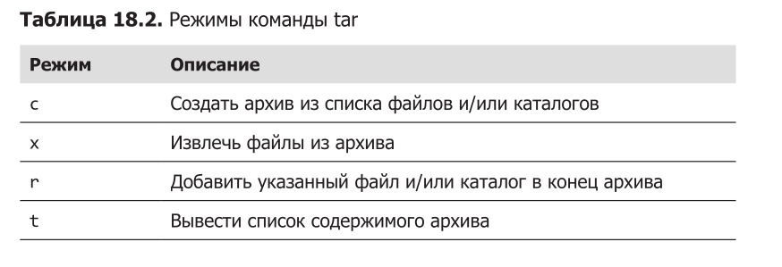

В программе tar используется немного непривычный способ определения параметров, поэтому рассмотрим несколько примеров ее использования. Для начала
воссоздадим нашу песочницу, как мы это делали в предыдущей главе:

[me@linuxbox ~]$ mkdir -p playground/dir-{001..100}
[me@linuxbox ~]$ touch playground/dir-{001..100}/file-{A..Z}

Далее создадим архив всей песочницы:

[me@linuxbox ~]$ tar cf playground.tar playground

Эта команда создаст tar-архив с именем playground.tar, включающий всю иерархию каталогов песочницы. Как видите, режим и параметр f, который используется для определения имени tar-архива, можно объединять, и при этом не требуется использовать начальный дефис. Но имейте в виду, что режим всегда должен указываться первым, перед любыми параметрами. Посмотреть содержимое архива можно с помощью следующей команды:

[me@linuxbox ~]$ tar tf playground.tar

Для получения более подробного списка добавим параметр v (verbose — подроб-
ности):
[me@linuxbox ~]$ tar tvf playground.tar

Теперь извлечем содержимое архива в другой каталог. Для этого создадим новый
каталог с именем foo, перейдем в него и извлечем содержимое tar-архива:

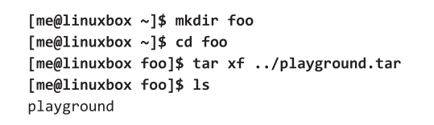


Если внимательно исследовать содержимое ~/foo/playground, можно заметить, что
в результате распаковывания архива мы получили точные копии оригинальных
файлов. Однако следует помнить, что если вы не действуете от имени суперпользователя, файлы и каталоги, извлеченные из архива, будут принадлежать пользователю, выполнившему восстановление, а не первоначальному их владельцу.

Другой интересной особенностью tar является способ обработки путей в архивах.
По умолчанию используются относительные пути, а не абсолютные. Для этого
программа tar просто удаляет начальный слеш во всех путях. Чтобы показать это,
создадим снова наш архив, но на этот раз укажем абсолютный путь к архивируе-
мому каталогу:

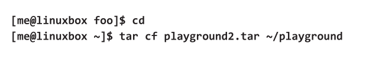

Как вы помните, командная оболочка заменит ~/playground полным путем /home/
me/playground после нажатия клавиши ENTER, благодаря этому мы получим полный путь для нашей демонстрации. Далее извлечем архив, так же как прежде,
и посмотрим, что из этого получилось:


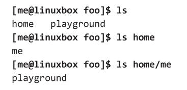


Как видите, здесь при извлечении архива каталог home/me/playground был вос-
создан не в корневом, а в текущем рабочем каталоге ~/foo, как было бы в случае
с абсолютными путями. Это может показаться странным, но такое решение имеет
свои преимущества: оно позволяет извлекать архивы в любое другое место, а не
только в исходное. Повторив это упражнение с параметром, управляющим выводом дополнительных сообщений (v), можно получить более понятную картину
происходящего.

Рассмотрим пусть и гипотетический, но все же имеющий практическую ценность
пример использования tar. Представим, что нужно скопировать домашний ка-
талог со всем его содержимым в другую систему и у нас имеется жесткий диск,
подключаемый к порту USB, который можно использовать для переноса файлов.
В современных системах Linux такие диски «как по волшебству» автоматически
монтируются в каталог /media. Допустим также, что подключаемый жесткий диск
имеет том с именем BigDisk. Чтобы создать требуемый архив, выполним следую-
щую команду:


[me@linuxbox ~]$ sudo tar cf /media/BigDisk/home.tar /home

После записи файла следует отмонтировать диск и подключить его ко второму
компьютеру. И снова он автоматически монтируется в каталог /media/BigDisk.
Чтобы извлечь архив, выполните следующие команды:

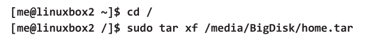

Обратите внимание, что здесь сначала выполняется переход в каталог /, чтобы
извлечение производилось относительно корневого каталога, потому что все пути
в архиве — относительные.

При распаковке архива можно ограничить количество извлекаемых данных. Например, можно извлечь из архива единственный файл:

tar xf archive.tar путь_к_файлу

Добавление в конец команды пути к файлу гарантирует извлечение только этого файла. Можно указать несколько путей. Обратите внимание, что путь к файлу
должен быть полным относительным путем в архиве. Обычно в путях к файлам нельзя использовать групповые символы; но GNU-версия tar (именно эта вер-
сия входит в состав большинства дистрибутивов Linux) поддерживает параметр
--wildcards. В следующем примере используется файл playground2.tar, создан-
ный выше:

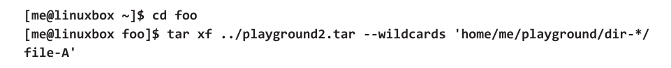

Эта команда извлечет только файлы, соответствующие указанному пути с груп-
повым символом dir-*.
Программа tar часто используется в сочетании с find. В следующем примере
коман­да find используется для поиска файлов, подлежащих включению в архив:

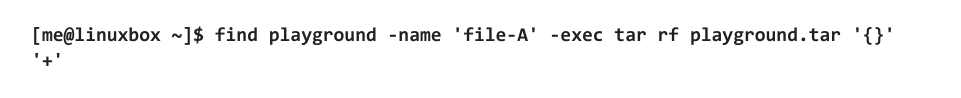

Здесь команда find отыскивает в каталоге playground все файлы с именем file-A
и затем с помощью операции -exec вызывает tar в режиме добавления в конец (r),
чтобы добавить найденные файлы в архив playground.tar.
Использование tar в сочетании с find предоставляет отличный способ инкрементного резервного копирования дерева каталогов или всей системы. Применяя find для поиска файлов, более новых, чем эталонный файл, определяющий отметку времени, можно создать архив, содержащий только более новые файлы, чем файлы предыдущего архива, при этом предполагается, что время последнего изменения эталонного файла будет изменяться сразу после создания архива.
Программа tar способна также использовать стандартный ввод и стандартный
вывод. Например:


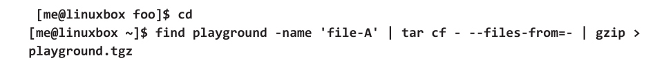

Здесь программа find создает список файлов и передает его по конвейеру программе tar. Когда программе tar передается имя файла - (дефис), под ним подразу­мевается стандартный ввод или стандартный вывод, в зависимости от контекста.

(Кстати, соглашение об использовании дефиса (-) для представления стандартного ввода/вывода используется также многими другими программами.) Параметр --files-from (который можно заменить эквивалентным параметром -T) заставляет tar читать список путей из файла, а не из командной строки. Наконец, архив, произведенный программой tar, передается по конвейеру программе gzip, чтобы в результате получить сжатый архив playground.tgz. Расширение .tgz по общепринятому соглашению используется для tar-архивов, сжатых программой gzip. В некоторых случаях используется расширение .tar.gz.

В примере, приведенном выше, для сжатия архива использовалась внешняя программа gzip, однако современные GNU-версии tar поддерживают возможность
gzip- и bzip2-сжатия своими встроенными средствами, для чего служат параме-
тры z и j соответственно. Взяв за основу предыдущий пример, его можно упро-
стить, как показано ниже:

[me@linuxbox ~]$ find playground -name 'file-A' | tar czf playground.tgz -T -

Если, напротив, понадобится создать архив, сжатый в формате bzip2, это можно
сделать так:

[me@linuxbox ~]$ find playground -name 'file-A' | tar cjf playground.tbz -T -

Произведя простую замену параметра сжатия z на j (и изменив расширение выходного файла на .tbz, указывающее, что для сжатия использовался алгоритм
bzip2), мы задействовали bzip2-сжатие.

Другой интересный пример использования поддержки стандартного ввода и выво-
да командой tar связан с передачей файлов между системами по сети. Представьте, что имеется две машины, действующие под управлением Unix-подобных систем и имеющие программы tar и ssh. В этом случае можно организовать передачу каталога из удаленной системы (с именем remote-sys в этом примере) в локальную:


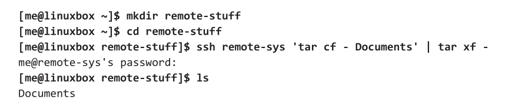

Здесь мы скопировали каталог Documents из удаленной системы remote-sys в ка-
талог с именем remote-stuff в локальной системе. Как это получилось? Во-первых,мы запустили программу tar в удаленной системе с помощью команды ssh. Как вы наверняка помните, ssh позволяет выполнить программу на удаленном компьютере в сети и «увидеть» результат в локальной системе — стандартный вывод,полученный в удаленной системе, пересылается в локальную систему для обзора.

Мы воспользовались этой особенностью и заставили tar создать архив (режим c)
и вывести его не в файл, а в стандартный вывод (параметр f с дефисом в качестве аргумента), вследствие чего архив передается через шифрованный туннель, созданный программой ssh, локальной системе. В локальной системе мы вызвали tar с целью распаковать архив (режим x), полученный со стандартного ввода (все тот же параметр f с дефисом в качестве аргумента).

#### zip

Программа zip одновременно является и инструментом сжатия, и архиватором.
Формат файлов, используемый программой, знаком пользователям Windows —
программа читает и создает файлы с расширением .zip. Однако в Linux чаще других используется программа сжатия gzip, а второе место занимает bzip2. Пользователи Linux используют zip в основном для обмена файлами с системами
Windows, а не как основной инструмент сжатия и архивирования.
В простейшем случае программа zip имеет следующий синтаксис:
zip параметры сжатый_файл файл...

Например, ниже показано, как создать zip-архив нашей песочницы:

[me@linuxbox ~]$ zip -r playground.zip playground
Без параметра -r (отвечает за рекурсивный обход каталогов) в архив будет включен только каталог playground (без своего содержимого). Расширение .zip добавляется к имени выходного файла автоматически, а мы включили его в пример для наглядности.
В процессе создания zip-архива программа zip обычно выводит последовательность сообщений, как показано ниже:


Эти сообщения показывают состояние каждого файла, добавленного в архив. zip
добавляет файлы в архив, используя один из двух методов: либо «store» (простое
сохранение) — без сжатия, как в примере, приведенном выше, либо «deflate» — со
сжатием. Числовое значение, следующее за названием метода добавления, указывает достигнутую степень сжатия. Поскольку в нашей песочнице хранятся только пустые файлы, сжатие их содержимого не производится.

Чтобы настроить степень сжатия, можно использовать уровень сжатия от 0 до 9 с параметром -0 до -9, где:

-0 — без сжатия (store),
-6 — уровень по умолчанию,
-9 — максимальное сжатие (deflate с большей степенью).

zip -9 -r archive.zip directory/

Извлечение содержимого из zip-архива выполняется просто — с помощью программы unzip:

[me@linuxbox ~]$ cd foo
[me@linuxbox foo]$ unzip ../playground.zip

Одно важное отличие zip (от tar) состоит в том, что если указанный архив существует, он дополняется, а не замещается. То есть существующий архив сохраняется, новые файлы добавляются в него, а существующие — замещаются.
Программа unzip позволяет выводить информацию о файлах и выборочно извлекать их, достаточно только передать ей имя интересующего нас файла:


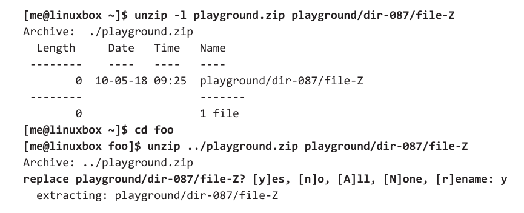

При наличии параметра -l программа unzip просто выведет информацию о содер-
жимом архива, не извлекая файл. Если имя файла (или файлов) не указано, unzip
выведет список всех файлов в архиве. Для получения более подробной информа-
ции следует добавить параметр -v. Обратите внимание, что когда при извлечении
из архива обнаруживается конфликт с существующим файлом, перед его заменой
у пользователя запрашивается разрешение.
Подобно программе tar, zip может использовать стандартный ввод и вывод, хотя
реализация этой возможности имеет меньшую практическую ценность. С помо-
щью параметра -@ программе zip по конвейеру передается список имен файлов:

[me@linuxbox foo]$ cd
[me@linuxbox ~]$ find playground -name "file-A" | zip -@ file-A.zip

Здесь команда find генерирует список файлов, соответствующих проверке -name
"file-A", и передает его по конвейеру команде zip, которая затем создает архив
file-A.zip с выбранными файлами.

zip также поддерживает запись результатов своей работы в стандартный вывод,
но эта особенность имеет ограниченное применение, потому что очень немногие
программы способны работать с форматом zip. К сожалению, программа unzip не
принимает входные данные со стандартного ввода. Это препятствует совместному
использованию zip и unzip для копирования файлов по сети, как это возможно
с программой tar.

zip, в свою очередь, способна принимать данные со стандартного ввода, поэтому
ее можно использовать для сжатия вывода других программ:

[me@linuxbox ~]$ ls -l /etc/ | zip ls-etc.zip -
adding: - (deflated 80%)

В этом примере вывод команды ls передается по конвейеру программе zip. Так же
как tar, zip интерпретирует завершающий дефис как требование «использовать
стандартный ввод вместо файла».
Программа unzip позволяет направить ее результаты в стандартный вывод, для
чего следует передать параметр -p (pipe — конвейер):

[me@linuxbox ~]$ unzip -p ls-etc.zip | less

Мы затронули лишь самые основные возможности программ zip и unzip. Обе они
имеют множество параметров, придающих им большую гибкость, хотя некоторые
из них допустимы только для определенных платформ. Для обеих программ, zip
и unzip, имеются подробные страницы справочного руководства (man) с множе-
ством полезных примеров; однако главное назначение этих программ — обмен
файлами с системами Windows, а не сжатие и архивирование файлов в Linux, где
большей популярностью пользуются tar и gzip.


### Синхронизация файлов и каталогов

В задачах резервного копирования систем широко используется стратегия синхронизации одного или нескольких каталогов с другими каталогами, находящимися в локальной системе (обычно на некотором извлекаемом устройстве) или в удаленной. Можно, к примеру, создать локальную копию веб-сайта, находящегося в разработке, и синхронизировать ее время от времени с «рабочей» копией на удаленном веб-сервере.

В мире Unix-подобных систем для решения этой задачи широко используется инструмент rsync. Эта программа синхронизует локальные и удаленные каталоги,
используя протокол rsync remote-update (протокол удаленного обновления rsync),
который позволяет rsync быстро обнаруживать различия между двумя каталогами и копировать минимальный объем данных, необходимый для синхронизации.Это делает программу rsync быстрой и экономичной по сравнению с другими программами копирования. Программа rsync имеет следующий синтаксис:

rsync параметры источник приемник

где роль источника и приемника могут играть:
* локальный файл или каталог;
* удаленный файл или каталог в форме [пользователь@]хост:путь;
* удаленный сервер rsync, определяемый идентификатором URI rsync://[поль-
зователь@]хост[:порт]/путь.

Обратите внимание, что либо источник, либо приемник должен находиться в локальной системе. Копирование из удаленной системы в удаленную систему не
поддерживается.

Давайте попробуем синхронизировать несколько локальных файлов. Сначала
очистим наш каталог foo:

[me@linuxbox ~]$ rm -rf foo/*

Далее синхронизируем каталог playground с соответствующей копией в foo:

[me@linuxbox ~]$ rsync -av playground foo

Мы добавили два параметра: -a (для архивирования — обеспечивает рекурсивный
обход и сохранение атрибутов файлов) и -v (подробный вывод), чтобы отразить
каталог playground в каталог foo. В процессе выполнения команды можно просматривать список копируемых файлов и каталогов. В конце программа выведет итоговое сообщение, как показано ниже, включающее общий объем скопированных
данных:


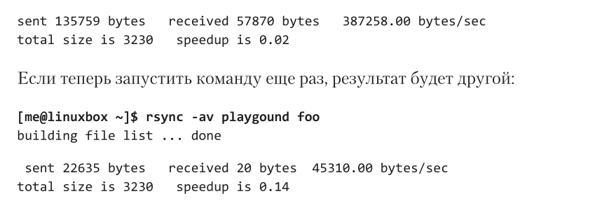

Обратите внимание на отсутствие списка файлов. Это объясняется тем, что про-
грамма rsync не обнаружила различий между ~/playground и ~/foo/playground
и поэтому ничего не скопировала. Если теперь изменить файл в playground и запустить rsync еще раз, она обнаружит изменившийся файл и скопирует только его.


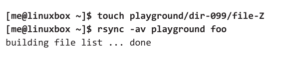

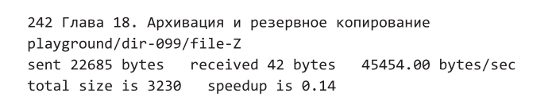


Как видите, rsync обнаружила изменения и скопировала только изменившийся
файл. Есть одна маленькая, но важная деталь, связанная с определением источника в коман­де rsync. Пусть у нас есть два каталога:

[me@linuxbox ~]$ ls
source
destination

Каталог source содержит один файл с именем file1, а каталог destination пуст. Если выполнить копирование source в destination так:

[me@linuxbox ~]$ rsync source destination
rsync скопирует каталог source в destination:
[me@linuxbox ~]$ ls destination
source

Но если в имя каталога source добавить завершающий слеш /, rsync скопирует
только содержимое каталога source, но не сам каталог:

[me@linuxbox ~]$ rsync source/ destination
[me@linuxbox ~]$ ls destination
file1

Это удобно, когда требуется скопировать только содержимое каталога, без созда-
ния еще одного уровня в дереве каталогов приемника. Этот трюк действует подобно source/*, но, в отличие от последнего, обеспечит копирование всего содержимого каталога-источника, включая скрытые файлы.
В качестве практического примера представьте воображаемый внешний жесткий
диск, использовавшийся выше с командой tar. Если после подключения такого
диска к системе он снова будет смонтирован в каталог /media/BigDisk, мы смо-
жем выполнить первое резервное копирование системы, cначала создав каталог
/backup на внешнем устройстве, а затем вызвав rsync для копирования наиболее
важных компонентов системы на внешнее устройство:


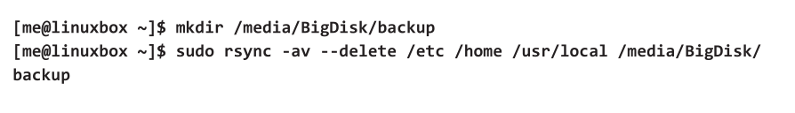

В этом примере мы скопировали каталоги /etc, /home и /usr/local из нашей си-
стемы на воображаемый внешний диск. Мы добавили параметр --delete, чтобы
удалить файлы, которые могут присутствовать на устройстве с резервной копией,
но отсутствовать на устройстве-источнике (этот параметр не нужен при создании
резервной копии в первый раз, но является полезным дополнением в последую-
щих операциях копирования). Периодическое повторение процедуры подключе-
ния внешнего диска и запуск этой команды rsync является неплохим (хотя и не
идеальным) способом сохранения резервной копии небольшой системы. Конечно,
здесь также могло бы пригодиться создание псевдонима. Определим псевдоним
и добавим его в свой файл .bashrc, чтобы обеспечить возможность быстрого ре-
зервного копирования:

alias backup='sudo rsync -av --delete /etc /home /usr/local /media/BigDisk/backup'

Теперь, чтобы выполнить всю работу, достаточно просто подключить внешний
диск и ввести команду backup.


### Использование rsync для копирования по сети

Одно из самых больших достоинств rsync — возможность копирования файлов
по сети, об этом нам «говорит» буква r в названии rsync, что означает remote (удаленная). Удаленную синхронизацию можно выполнить одним из двух способов.
Первый можно использовать с удаленными системами, где установлена rsync
и программа удаленной командной оболочки, такая как ssh. Допустим, что в локальной сети имеется другая система с огромным объемом дискового пространства, и мы хотели бы использовать эту систему для хранения резервной копии вместо внешнего диска. Если допустить, что в этой системе уже имеется каталог /backup, куда можно было бы сохранить наши файлы, мы могли бы выполнить резервное копирование так:

[me@linuxbox ~]$ sudo rsync -av --delete --rsh=ssh /etc /home /usr/local
remotesys:/backup

Мы внесли два изменения в команду, чтобы обеспечить копирование по сети. Во-первых, добавили параметр --rsh=ssh, который требует от rsync использовать
в качестве удаленной командной оболочки программу ssh. Благодаря этому для
передачи данных из локальной системы в удаленную мы можем использовать
шифрованный туннель SSH. Во-вторых, мы добавили имя удаленного узла (в данном примере remote-sys) перед именем удаленного каталога.

Второй способ использования rsync для синхронизации файлов по сети заключается в использовании сервера rysnc. rsync можно настроить на работу в режиме демона, принимающего входящие запросы на синхронизацию. Этот прием
часто используется для зеркалирования удаленных систем. Например, компания
Red Hat Software поддерживает огромный репозиторий программных пакетов,
разрабатываемых для ее дистрибутива Fedora. Для специалистов, занимающих-
ся тестированием программного обеспечения, очень удобно иметь зеркало этой
коллекции в ходе этапа тестирования, предшествующего этапу выпуска дистрибутива. Поскольку файлы в репозитории обновляются достаточно часто (порой по нескольку раз в день), неплохо было бы организовать периодическую синхронизацию локального зеркала вместо копирования всего объема репозитория. Один из таких репозиториев хранится в университете Georgia Tech; мы могли бы создать его зеркало с помощью локальной программы rsync и сервера rsync в Georgia Tech:

[me@linuxbox ~]$ mkdir fedora-devel
[me@linuxbox ~]$ rsync -av --delete rsync://archive.linux.duke.edu/fedora/
linux/development/rawhide/Everything/x86_64/os/ fedora-devel

В этом примере мы использовали идентификатор URI удаленного сервера rsync,
включающий протокол (rsync://), имя удаленного узла (archive.linux.duke.edu)
и путь к репозиторию.

### Заключение

Мы рассмотрели распространенные программы сжатия и архивирования, используемые в Linux и в других Unix-подобных операционных системах. Для архивирования файлов в Unix-подобных системах чаще других используется комбинация tar/gzip, тогда как команды zip/unzip в основном используются для организации обмена данными с системами Windows. Наконец, мы познакомились с программой rsync (моя любимица) — очень эффективным инструментом синхронизации
файлов и каталогов между системами.

## Глава 19. Регулярные выражения

### Что такое регулярные выражения?

Регулярные выражения — это всего лишь символическая форма записи, используемая для идентификации шаблонов в тексте. Они, до определенной степени, напоминают групповые символы, используемые командной оболочкой для выбора соответствующих файлов и путей, но в более широком масштабе. Регулярные
выражения поддерживаются многими инструментами командной строки и большинством языков программирования, чтобы упростить решение задач, связанных
с обработкой текста. Однако проблема в том, что не все регулярные выражения
одинаковы; разные инструменты и языки программирования используют собственные «диалекты» регулярных выражений. Для целей нашего обсуждения мы ограничимся регулярными выражениями, как они определены в стандарте POSIX
(и поддерживаются большинством инструментов командной строки) в противоположность многим языкам программирования (особенно это относится к Perl),где используются более широкие и богатые формы записи.

### grep

При работе с регулярными выражениями мы в основном будем использовать
программу grep. Название grep в действительности произошло от фразы «global regular expression print» (глобальный поиск с помощью регулярного выражения и вывод), то есть, как видите, grep имеет некоторое отношение к регулярным выражениям. В сущности, grep просматривает текстовые файлы в поисках совпадений с указанным регулярным выражением и выводит в стандартный вывод все строки с такими совпадениями. До сих пор мы передавали программе grep фиксированные строки, например:

[me@linuxbox ~]$ ls /usr/bin | grep zip <br>

Эта команда выведет список всех файлов из каталога /usr/bin, имена которых со-
держат подстроку zip.

Программа grep имеет следующий синтаксис:

grep [параметры] регулярное_выражение [файл...] <br>

В таблице ниже перечислены наиболее часто используемые параметры grep.


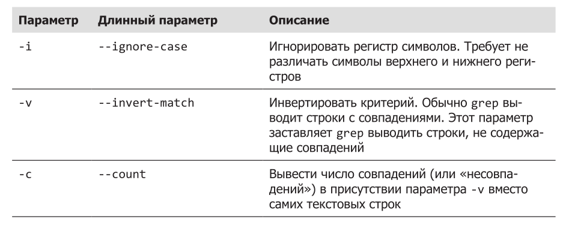


Давайте создадим несколько текстовых файлов, чтобы наше исследование grep
стало более предметным:

```
[me@linuxbox ~]$ ls /bin > dirlist-bin.txt
[me@linuxbox ~]$ ls /usr/bin > dirlist-usr-bin.txt
[me@linuxbox ~]$ ls /sbin > dirlist-sbin.txt
[me@linuxbox ~]$ ls /usr/sbin > dirlist-usr-sbin.txt
[me@linuxbox ~]$ ls dirlist*.txt
dirlist-bin.txt
dirlist-sbin.txt
dirlist-usr-sbin.txt
dirlist-usr-bin.txt
```

Ниже показано, как выполнить простой поиск в нашем списке файлов:

```
[me@linuxbox ~]$ grep bzip dirlist*.txt
dirlist-bin.txt:bzip2
dirlist-bin.txt:bzip2recover
```

В этом примере grep просматривает все перечисленные файлы в поисках строки
bzip и находит два совпадения, оба в файле dirlist-bin.txt. Если бы нам достаточно было получить только имена файлов с совпадениями, а не сами совпадения, мы могли бы добавить параметр -l:

```
[me@linuxbox ~]$ grep -l bzip dirlist*.txt
dirlist-bin.txt
```

Напротив, получить список файлов, не содержащих совпадений, можно так:

```
[me@linuxbox ~]$ grep -L bzip dirlist*.txt
dirlist-sbin.txt
dirlist-usr-bin.txt
dirlist-usr-sbin.txt
```

### Метасимволы и литералы

Несмотря на то что пока это не очевидно, во всех своих попытках поиска с помо-
щью grep мы использовали регулярные выражения, хотя и очень простые. Регулярное выражение bzip, к примеру, означает, что ему соответствуют только строки в файлах, содержащие не менее четырех символов, и среди этих символов присутствуют символы b, z, i и p, следующие именно в таком порядке, и между ними отсутствуют какие-либо другие символы. Символы в строке bzip — это литеральные символы, то есть они соответствуют сами себе. Помимо литералов регулярные выражения могут содержать метасимволы, они используются для определения более сложных критериев сопоставления. К метасимволам регулярных выражений относятся следующие символы:

```
^ $ . [ ] { } - ? * + ( ) | \
```

Все остальные символы считаются литералами. Впрочем, в некоторых случаях
символ «обратный слеш» используется для создания метапоследовательностей,
а также для экранирования метасимволов, чтобы они могли интерпретироваться
как литералы, а не как метасимволы.

### ПРИМЕЧАНИЕ

Как видите, многие метасимволы регулярных выражений имеют также специальное значение для механизма подстановки командной оболочки. Поэтому, передавая регулярные выражения с метасимволами в виде аргументов командной строки, следует заключать их в кавычки, чтобы предотвратить попытки
командной оболочки выполнить подстановку вместо них.

### Любой символ

Первый метасимвол, который мы рассмотрим, — это символ «точка», соответству-
ющий любому символу. Если включить его в регулярное выражение, он будет со-
ответствовать любому символу в данной позиции. Например:

```
[me@linuxbox ~]$ grep -h '.zip' dirlist*.txt
bunzip2
bzip2
bzip2recover
gunzip
gzip
funzip
gpg-zip
preunzip
prezip
prezip-bin
unzip
unzipsfx

```

Здесь выполнен поиск в наших файлах совпадений с регулярным выражением
.zip. В полученных результатах имеется пара важных моментов, которые необходимо отметить. Обратите внимание, что программа zip не была найдена. Это
объясняется включением в регулярное выражение метасимвола «точка», увеличившим длину обязательного совпадения до четырех символов; так как в имени программы zip всего три символа, оно не было найдено. Кроме того, если бы в наших списках имелись имена файлов с расширением .zip, они также были бы найдены, потому что символ «точка» в расширении файла интерпретировался бы как
«любой символ».

### Якоря

Символ крышки (^) и знак доллара ($) в регулярных выражениях интерпретируются как якоря. Это означает, что в их присутствии совпадение с регулярным
выражением возможно, только если совпадение будет найдено в начале строки (^)
или в ее конце ($).

```
[me@linuxbox ~]$ grep -h '^zip' dirlist*.txt
zip
zipcloak
zipgrep
zipinfo
zipnote
zipsplit
[me@linuxbox ~]$ grep -h 'zip$' dirlist*.txt
gunzip
gzip
funzip
gpg-zip
preunzip
prezip
unzip
zip
[me@linuxbox ~]$ grep -h '^zip$' dirlist*.txt
zip

```

Здесь выполняется поиск в списке файлов строки zip, находящейся в начале строки, в конце строки и занимающей всю строку, от начала до конца. Обратите внимание, что регулярное выражение ^$ (начало и конец без каких-либо символов
между ними) будет соответствовать пустым строкам.

### В ПОМОЩЬ ЛЮБИТЕЛЯМ КРОССВОРДОВ

Даже наши ограниченные познания в области регулярных выражений могут при-
нести некоторую пользу. Моя супруга обожает разгадывать кроссворды и иногда просит меня помочь с ответом на какой-нибудь вопрос. Например: «Слово из пяти букв, третья j, последняя r, которое означает...» Подобные вопросы навели меня на размышления. 
Знаете ли вы, что в вашей системе Linux имеется словарь? Загляните в каталог /usr/share/dict, и вы обнаружите там один или несколько словарей. Файлы словарей, находящиеся в каталоге, — это обычные длинные списки слов, по одному в строке, упорядоченные по алфавиту. В моей системе файл words содержит больше 98 500 слов. Найти возможные ответы на вопрос в кроссворде можно с помощью следующей команды:

```
[me@linuxbox ~]$ grep -i '^..j.r$' /usr/share/dict/words
Major
major
```

Это регулярное выражение помогает найти в файле словаря все слова длиной
в пять букв, где третья буква — j и последняя — r.

### Выражения в квадратных скобках и классы символов

В дополнение к возможности описать в регулярном выражении совпадение с любым символом в заданной позиции, используя выражения в квадратных скобках,
можно также описать совпадение с одним символом из определенного множества. Выражение в квадратных скобках помогает определить множество символов
(включая символы, которые иначе интерпретировались бы как метасимволы), которые находятся в данной позиции. В следующем примере используется множе-
ство из двух символов, благодаря которому обнаруживаются соответствия с последовательностями bzip и gzip:

```
[me@linuxbox ~]$ grep -h '[bg]zip' dirlist*.txt
bzip2
bzip2recover
gzip

```

Множество может содержать любое число символов. Метасимволы, заключенные
в квадратные скобки, теряют свое специальное значение. Лишь два метасимво-
ла интерпретируются особым образом, но при этом они имеют иной смысл. Пер-
вый — символ крышки (^), который используется для обозначения отрицания;
второй — дефис (-), который используется для обозначения диапазона символов.

### Отрицание

Если сразу после открывающей квадратной скобки стоит символ крышки (^),
остальные символы множества интерпретируются как недопустимые в данной
позиции. Проверим это, изменив предыдущий пример:

```
[me@linuxbox ~]$ grep -h '[^bg]zip' dirlist*.txt
bunzip2
gunzip
funzip
gpg-zip
preunzip
prezip
prezip-bin
unzip
unzipsfx
```

Включив отрицание, мы получили список файлов, имена которых содержат последовательность zip, которой предшествует любой символ, кроме b или g. Обратите внимание, что файл zip не был найден. Символ отрицания не отменяет необходимости присутствия символа в заданной позиции, он лишь требует, чтобы
символ в этой позиции не принадлежал указанному множеству.
Символ крышки обозначает операцию отрицания, только если является первым
символом в выражении в квадратных скобках; в противном случае он теряет свое
специальное значение и превращается в обычный символ.

### Традиционные диапазоны символов

Если необходимо сконструировать регулярное выражение, которое находило бы
в наших списках все файлы с именами, начинающимися с заглавной буквы, это
можно выполнить следующим образом:

```
[me@linuxbox ~]$ grep -h '^[ABCDEFGHIJKLMNOPQRSTUVWXZY]' dirlist*.txt
```

Достаточно просто поместить 26 букв в верхнем регистре в выражение в квадрат-
ных скобках. Но необходимость ввода всех этих символов вызывает некоторое
беспокойство, поэтому предусмотрен другой способ:

```
[me@linuxbox ~]$ grep -h '^[A-Z]' dirlist*.txt
MAKEDEV
ControlPanel
GET
HEAD
POST
X
X11
Xorg
MAKEFLOPPIES
NetworkManager
NetworkManagerDispatcher

```
Мы сократили множество с 26 буквами до 3-символьного диапазона. Так можно
выразить любой диапазон символов и даже несколько диапазонов, например, для
поиска имен файлов, начинающихся с буквы или цифры:

```
[me@linuxbox ~]$ grep -h '^[A-Za-z0-9]' dirlist*.txt
```

Как следует из примеров, символ «дефис» получает в диапазонах специальное
значение, поэтому возникает вопрос: как включить дефис в выражение в квадрат-
ных скобках, чтобы он интерпретировался как обычный символ? Для этого доста-
точно поставить его в начало выражения. Например:

```
[me@linuxbox ~]$ grep -h '[A-Z]' dirlist*.txt
```

Эта команда найдет все имена файлов, содержащие буквы верхнего регистра.
С другой стороны, следующее выражение:

```
[me@linuxbox ~]$ grep -h '[-AZ]' dirlist*.txt
```
найдет все имена файлов, содержащие дефис, букву A или букву Z.

### Классы символов POSIX

Традиционные диапазоны символов — простой и эффективный способ определения наборов символов. К сожалению, они могут использоваться не со всеми
программами. Мы не испытывали никаких проблем с диапазонами, используя
программу grep, но могли бы столкнуться с ними при использовании других программ.

Вернемся к главе 4, где демонстрировалось использование групповых символов
для подстановки имен файлов. Там говорилось, что можно использовать диапазо-
ны символов почти так же, как они используются в регулярных выражениях, но
есть одна проблема:

```
[me@linuxbox ~]$ ls /usr/sbin/[ABCDEFGHIJKLMNOPQRSTUVWXYZ]*
/usr/sbin/MAKEFLOPPIES
/usr/sbin/NetworkManagerDispatcher
/usr/sbin/NetworkManager

```

(В разных дистрибутивах будут получены разные списки файлов, а в некоторых
даже пустой список. Эти результаты получены в Ubuntu.) Эта команда вернула
ожидаемый результат — список имен файлов, начинающихся с заглавной буквы.
Но следующая команда даст совершенно другой результат (здесь приведена толь-
ко часть результатов):

```
[me@linuxbox ~]$ ls /usr/sbin/[A-Z]*
/usr/sbin/biosdecode
/usr/sbin/chat
/usr/sbin/chgpasswd
/usr/sbin/chpasswd
/usr/sbin/chroot
/usr/sbin/cleanup-info
/usr/sbin/complain
/usr/sbin/console-kit-daemon
```

В чем же причина? Для этой длинной истории имеется короткая версия.

Во времена, когда операционная система Unix только появилась на свет, был
известен только один набор символов — ASCII, и этот факт нашел свое отражение в данной особенности. В ASCII первые 32 символа (с номерами 0–31) —
это управляющие символы (такие, как табуляция, забой и возврат каретки).
Следующие 32 (32–63) представляют печатаемые символы, включая большин-
ство знаков пунктуации и цифры с нуля до девяти. Следующие 32 (с номерами 64–95) представляют буквы верхнего регистра и несколько знаков пунктуации. ­Последние 31 (с номерами 96–127) представляют буквы нижнего регистра
и еще несколько знаков пунктуации. Опираясь на эту классификацию, системы, использующие набор ASCII, придерживались следующего порядка сопоставления:

ABCDEFGHIJKLMNOPQRSTUVWXYZabcdefghijklmnopqrstuvwxyz
Этот порядок отличается от лексикографического, который выглядит так:
aAbBcCdDeEfFgGhHiIjJkKlLmMnNoOpPqQrRsStTuUvVwWxXyYzZ

С ростом популярности Unix за пределами США возникла необходимость в под-
держке символов, не входящих в алфавит американского английского. Таблица
ASCII была расширена до использования 8-битных символов, и в нее добави-
лись символы с номерами 128–255, используемые во многих других языках. Для
поддержки этой возможности в стандарт POSIX было введено понятие региона
(locale), определяющее выбор набора символов для конкретного географиче­
ского региона. Узнать, какой язык настроен в вашей системе, можно с помощью
команды:

```

[me@linuxbox ~]$ echo $LANG
en_US.UTF-8

```

При проверке этой настройки POSIX-совместимые приложения используют лексикографический порядок, а не порядок следования символов в наборе ASCII.
Это объясняет поведение команд, рассмотренное выше. Когда диапазон символов
[A-Z] интерпретируется в лексикографическом порядке, он включает все алфавитные символы, кроме символа a в нижнем регистре, — именно это объясняет
полученный результат.
Для частичного решения этой проблемы стандарт POSIX предусматривает несколько классов символов, описывающих диапазоны символов. Они перечислены
в таблице ниже. 


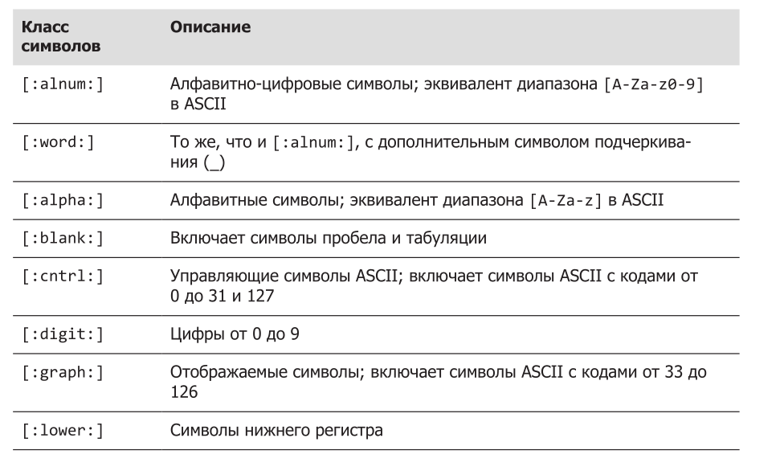


Но даже наличие классов символов не дает удобного способа выражения частич-
ных диапазонов, таких как [A-M].
Используя классы символов, можно повторить пример с выводом содержимого
каталога и посмотреть, насколько улучшился результат.

```

[me@linuxbox ~]$ ls /usr/sbin/[[:upper:]]*
/usr/sbin/MAKEFLOPPIES
/usr/sbin/NetworkManagerDispatcher
/usr/sbin/NetworkManager

```
Но не забывайте, что это не является примером использования регулярных выражений, скорее это пример того, как командная оболочка выполняет подстановку путей. Мы рассмотрели его лишь потому, что классы символов POSIX поддерживаются и там и там.

### Простые и расширенные регулярные выражения POSIX

Как раз когда, казалось бы, проблема путаницы с диалектами регулярных выражений решена, обнаруживается, что стандарт POSIX также делит реализации регулярных выражений на два вида: простые регулярные выражения (Basic
Regular Expressions, BRE) и расширенные регулярные выражения (Extended Regular
Expressions, ERE). Особенности, рассматривавшиеся до сих пор, поддерживаются
всеми POSIX-совместимыми приложениями и приложениями, реализующими
BRE. Программа grep — одна из них.

### ВОЗВРАТ К ТРАДИЦИОННОМУ ПОРЯДКУ СОРТИРОВКИ

Есть возможность вернуть систему к традиционному (ASCII) порядку сортировки,
изменив значение переменной окружения LANG. Как было показано в предыдущем
разделе, переменная LANG хранит название языка и набора символов, заданных
в региональных настройках. Значение этой переменной первоначально определя-
ется в момент, когда выбирается язык установки дистрибутива Linux.
Увидеть региональные настройки можно, выполнив команду locale:

```

[me@linuxbox ~]$ locale
LANG=en_US.UTF-8
LC_CTYPE="en_US.UTF-8"
LC_NUMERIC="en_US.UTF-8"
LC_TIME="en_US.UTF-8"
LC_COLLATE="en_US.UTF-8"
LC_MONETARY="en_US.UTF-8"
LC_MESSAGES="en_US.UTF-8"
LC_PAPER="en_US.UTF-8"
LC_NAME="en_US.UTF-8"
LC_ADDRESS="en_US.UTF-8"
LC_TELEPHONE="en_US.UTF-8"
LC_MEASUREMENT="en_US.UTF-8"
LC_IDENTIFICATION="en_US.UTF-8"
LC_ALL=

```
Чтобы установить региональные настройки, обеспечивающие традиционное по-
ведение системы Unix, присвойте переменной LANG значение POSIX:

```

[me@linuxbox ~]$ export LANG=POSIX

```
Имейте в виду, что в результате наших действий система будет использовать
набор символов американского английского (точнее, ASCII), поэтому подумайте,
действительно ли это то, что вам нужно.
Эти изменения можно сделать постоянными, добавив следующую строку в файл
.bashrc:
export LANG=POSIX

Чем различаются BRE и ERE? Различия касаются наборов метасимволов. В диа-
лекте BRE распознаются следующие метасимволы:
```

^ $ . [ ] *

```
Все остальные считаются литералами. В ERE во множество метасимволов (с соот-
ветствующими им функциями) добавляются:

```

( ) { } ? + |

```

### POSIX
На протяжении 1980-х система Unix обрела популярность как коммерческая опе-
рационная система, но до 1988-го в мире Unix царила полная анархия. Многие
производители компьютеров лицензировали исходный код Unix у ее создателя —
компании AT&T и поставляли разные версии операционной системы вместе со
своими машинами. Однако в стремлении к дифференциации продуктов каждый про-
изводитель добавлял свои, патентованные изменения и расширения. В результате
значительно ухудшилась совместимость программного обеспечения. Как обычно,
производители пытались играть в игру, победой в которой было «замыкание»
клиентов на конкретном производителе. Этот период истории Unix ныне известен
как Балканизация (Balkanization).
В середине 1980-х институт инженеров электроники и электротехники (Institute
of Electrical and Electronics Engineers, IEEE) начал разработку единого пакета
стандартов, которые должны были определить особенности работы системы Unix
(и Unix-подобных). Эти стандарты, формально известные как IEEE 1003, определяют прикладные программные интерфейсы (Application Programming Interface, API),командную оболочку и утилиты, которые должны присутствовать в стандартной Unix-подобной системе. Название POSIX, сокращенное от «Portable Operating System Interface» (интерфейс переносимой операционной системы, где буква X добавлена для лучшего звучания), было предложено Ричардом Столлманом (да, тем самым Ричардом Столлманом) и принято IEEE.
Однако (что самое интересное) символы ( ) { } интерпретируются в BRE как метасимволы, если они экранированы символом «обратный слеш», тогда как в ERE
присутствие обратного слеша перед этими же метасимволами превращает их в литералы.
Поскольку далее в этой главе мы рассмотрим особенности, являющиеся частью
ERE, необходимо использовать другую версию grep. Традиционно диалект ERE
поддерживался программой egrep, но GNU-версия grep также поддерживает рас-
ширенные регулярные выражения при вызове ее с параметром -E.

### Чередование

Первой особенностью расширенных регулярных выражений, которую мы об-
судим, будет чередование (alternation, или выражение выбора) — оно позволяет
выбирать совпадение с одним из нескольких выражений. Так же как выражения
в квадратных скобках позволяют одному символу соответствовать множеству
указанных символов, чередование позволяет находить совпадение с множеством
строк или других регулярных выражений.
Для демонстрации воспользуемся комбинацией команд grep и echo. Сначала по-
пробуем выполнить простое сопоставление строк:

```

[me@linuxbox ~]$ echo "AAA" | grep AAA
AAA
[me@linuxbox ~]$ echo "BBB" | grep AAA
[me@linuxbox ~]$

```
Достаточно простой пример, в котором мы передаем по конвейеру вывод команды
echo на ввод grep и видим результат. Если обнаруживается совпадение, мы видим
вывод; если совпадение отсутствует, ничего не выводится. Теперь добавим чередование, обозначаемое метасимволом вертикальной черты:

```

[me@linuxbox ~]$ echo "AAA" | grep -E 'AAA|BBB'
AAA
[me@linuxbox ~]$ echo "BBB" | grep -E 'AAA|BBB'
BBB
[me@linuxbox ~]$ echo "CCC" | grep -E 'AAA|BBB'
[me@linuxbox ~]$

```


Здесь мы видим регулярное выражение 'AAA|BBB', которое означает «совпадение
со строкой AAA или со строкой BBB». Так как это расширенная особенность, мы добавили в команду grep параметр -E (вместо этого можно было бы использовать
программу egrep) и заключили регулярное выражение в кавычки, чтобы предотвратить интерпретацию командной оболочкой символа вертикальной черты как
оператора конвейера. В чередовании может быть более двух вариантов:

```

[me@linuxbox ~]$ echo "AAA" | grep -E 'AAA|BBB|CCC'
AAA

```
Для объединения с другими элементами регулярного выражения чередование
можно заключать в круглые скобки ():
[me@linuxbox ~]$ grep -Eh '^(bz|gz|zip)' dirlist*.txt
Этому выражению будут соответствовать имена файлов из наших списков, начинающиеся с bz, gz или zip. Если отбросить круглые скобки, смысл регулярного выражения изменится, и ему будут соответствовать имена, начинающиеся с bz или содержащие gz или zip:

```

[me@linuxbox ~]$ grep -Eh '^bz|gz|zip' dirlist*.txt

```

### Квантификаторы

Расширенные регулярные выражения поддерживают несколько способов опреде-
ления числа совпадений с элементом.
? — совпадение с элементом ноль или один раз
Этот квантификатор фактически означает: «совпадение с предыдущим элементом
не обязательно». Представьте, что нужно проверить допустимость номера телефо-
на, и предполагается, что номер допустим, если представлен в одной из двух форм:


 (nnn) nnn-nnnn;
 nnn nnn-nnnn.

Для проверки можно было бы использовать следующее регулярное выражение:

```
^\(?[0-9][0-9][0-9]\)? [0-9][0-9][0-9]-[0-9][0-9][0-9][0-9]$

```

В этом выражении за круглыми скобками следуют знаки вопроса, указывающие,
что скобки могут либо отсутствовать, либо присутствовать один раз. И снова, поскольку круглые скобки считаются метасимволами (в ERE), мы экранировали их
обратными слешами, чтобы они интерпретировались как литералы.
Попробуем применить это выражение:

```
[me@linuxbox ~]$ echo "(555) 123-4567" | grep -E '^\(?[0-9][0-9][0-9]\)? [0-9]
[0-9][0-9]$'
(555) 123-4567
[me@linuxbox ~]$ echo "555 123-4567" | grep -E '^\(?[0-9][0-9][0-9]\)? [0-9][0-9]
[0-9]-[0-9][0-9][0-9][0-9]$'
555 123-4567
[me@linuxbox ~]$ echo "AAA 123-4567" | grep -E '^\(?[0-9][0-9][0-9]\)? [0-9][0-9]
[0-9]-[0-9][0-9][0-9][0-9]$'
[me@linuxbox ~]$

```

Здесь регулярному выражению соответствуют обе формы записи номера телефо-
на, но ему не соответствует номер, содержащий нецифровые символы.

### * — совпадение с элементом ноль или более раз

Подобно метасимволу ?, звездочка (*) обозначает необязательный элемент; однако, в отличие от знака вопроса (?), этот элемент может встречаться любое число раз, а не только единожды. Представьте, что нам нужно проверить, является ли строка предложением. Чтобы удовлетворять нашим требованиям, строка должна начинаться с большой буквы, содержать любое число букв верхнего и нижнего регистра и пробелов и заканчиваться точкой. Для поиска совпадений с этим (очень приблизительным) определением предложения воспользуемся следующим регулярным выражением:

```
[[:upper:]][[:upper:][:lower:] ]*\.
Выражение состоит из трех элементов: выражение в квадратных скобках с клас-
сом символов [:upper:], выражение в квадратных скобках с двумя классами
символов, [:upper:] и [:lower:], и пробелом, и точка, экранированная обратным
слешем. Второй элемент сопровождается метасимволом *, поэтому в нашем пред-
ложении ему может соответствовать любое число букв верхнего и нижнего реги-
стра и пробелов, следующих за первой буквой верхнего регистра:
[me@linuxbox ~]$ echo "This works." | grep -E '[[:upper:]][[:upper:][:lower:] ]*\.'
This works.
[me@linuxbox ~]$ echo "This Works." | grep -E '[[:upper:]][[:upper:][:lower:] ]*\.'
This Works.
[me@linuxbox ~]$ echo "this does not" | grep -E '[[:upper:]][[:upper:][:lower:] ]*\.'
[me@linuxbox ~]$

```

Первые два примера соответствуют выражению, а третий — нет, потому что
в нем отсутствует обязательный первый символ верхнего регистра и заверша-
ющая точка.

### + — совпадение с элементом один или более раз
Метасимвол + действует почти так же, как *, но требует совпадения с предыдущим
элементом не менее одного раза. Следующему регулярному выражению будут со-
ответствовать только строки, состоящие из групп, насчитывающих один или не-
сколько алфавитных символов и разделенных одиночными пробелами:

```
^([[:alpha:]]+ ?)+$
Опробуем его:
[me@linuxbox ~]$ echo "This that" | grep -E '^([[:alpha:]]+ ?)+$'
This that
[me@linuxbox ~]$ echo "a b c" | grep -E '^([[:alpha:]]+ ?)+$'
a b c
[me@linuxbox ~]$ echo "a b 9" | grep -E '^([[:alpha:]]+ ?)+$'
[me@linuxbox ~]$ echo "abc d" | grep -E '^([[:alpha:]]+ ?)+$'
[me@linuxbox ~]$

```

Как видите, этому выражению не соответствует строка "a b 9", потому что она
содержит неалфавитный символ; точно так же ему не соответствует строка
"abc   d", потому что между символами c и d в ней присутствует больше одного
пробела.

### { } — совпадение с элементом определенное число раз
Метасимволы { и } используются, чтобы выразить минимальное и максимальное
число обязательных совпадений. Эти числа можно представить четырьмя воз-
можными способами, как показано в таблице ниже.

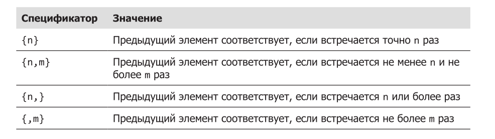

Вернемся к примеру с телефонными номерами и воспользуемся этим методом
определения повторений, чтобы упростить исходное регулярное выражение

```
^\(?[0-9][0-9][0-9]\)? [0-9][0-9][0-9]-[0-9][0-9][0-9][0-9]$
до
^\(?[0-9]{3}\)? [0-9]{3}-[0-9]{4}$
Опробуем его:
[me@linuxbox ~]$ echo "(555) 123-4567" | grep -E '^\(?[0-9]{3}\)? [0-9]{3}-
[0-9]{4}$'
(555) 123-4567
[me@linuxbox ~]$ echo "555 123-4567" | grep -E '^\(?[0-9]{3}\)?
[0-9]{3}-[0-9]{4}$'
555 123-4567
[me@linuxbox ~]$ echo "5555 123-4567" | grep -E '^\(?[0-9]{3}\)? [0-9]{3}-
[0-9]{4}$'
[me@linuxbox ~]$

```

Как видите, измененная версия регулярного выражения успешно справляется
с проверкой номеров, с круглыми скобками и без них, и отвергает неправильно
оформленные номера.

### Практические примеры применения регулярных выражений

Рассмотрим несколько уже знакомых команд и посмотрим, как они могут исполь-
зовать регулярные выражения.

### Проверка списка телефонов с помощью grep

В предыдущем примере мы брали телефонные номера по одному и проверяли
правильность их оформления. На практике же часто приходится проверять
списки телефонов, поэтому давайте создадим такой список. Для этого воспользуемся волшебной магией командной строки. Магией, потому что мы еще не
знакомы с большинством команд, привлеченных для решения поставленной
задачи, но не волнуйтесь — мы рассмотрим их в последующих главах. Вот это
волшебство:

```
[me@linuxbox ~]$ for i in {1..10}; do echo "(${RANDOM:0:3}) ${RANDOM:0:3}-
${RANDOM:0:4}" >> phonelist.txt; done

```
Эта команда создаст файл с именем phonelist.txt, содержащий 10 телефонных номеров. Если повторить команду, она добавит в список еще 10 номеров. Также можно изменить число 10 ближе к началу команды, чтобы создать больше или меньше номеров. Однако если заглянуть в файл, можно заметить проблему:

```
[me@linuxbox ~]$ cat phonelist.txt
(232) 298-2265
(624) 381-1078
(540) 126-1980
(874) 163-2885
(286) 254-2860
(292) 108-518
(129) 44-1379
(458) 273-1642
(686) 299-8268
(198) 307-2440

```

Некоторые номера оформлены неправильно, что очень хорошо для целей демон-
страции их проверки с помощью grep.

Было бы полезно просканировать файл в поисках недопустимых номеров и вы-
вести их.

```
[me@linuxbox ~]$ grep -Ev '^\([0-9]{3}\) [0-9]{3}-[0-9]{4}$' phonelist.txt
(292) 108-518
(129) 44-1379
[me@linuxbox ~]$

```

Здесь мы использовали параметр -v, чтобы обратить сопоставление и вывести
только строки, не соответствующие указанному выражению. Само выражение содержит якорные метасимволы на обоих концах и тем самым гарантирует отсутствие дополнительных символов слева и справа от номера. Кроме того, в отличие от примера, приведенного выше, это выражение также требует обязательного наличия круглых скобок в номере.

### Поиск необычных имен файлов с помощью find

Команда find поддерживает проверку, основанную на регулярном выражении. Су-
ществует одно важное обстоятельство, которое следует помнить, используя регу-
лярные выражения в командах find и grep. Если grep выводит строку, содержащую
совпадение с регулярным выражением, то find требует точного совпадения пути
с регулярным выражением. В следующем примере команда find использует регу-
лярное выражение для поиска путей к файлам, содержащим любые символы, не
входящие в следующее множество:

```
[-_./0-9a-zA-Z]

```

В результате такого поиска можно выявить имена файлов и каталогов, содержащие пробелы и другие, потенциально вредные символы:

```
[me@linuxbox ~]$ find . -regex '.*[^-_./0-9a-zA-Z].*'

```

Из-за требования точного совпадения всего пути мы добавили элемент .* с обоих
концов выражения, замещающий любое количество любых символов (в том числе и отсутствие символов). В середине выражения находится инвертированное
выражение в квадратных скобках, содержащее множество символов, допустимых
в именах файлов и каталогов.

### Поиск файлов с помощью locate

Программа locate поддерживает простые (параметр --regexp) и расширенные
(параметр --regex) регулярные выражения. Благодаря этому можно выполнять
те же операции, что производились выше с файлами dirlist:

```
[me@linuxbox ~]$ locate --regex ‚bin/(bz|gz|zip)'
/bin/bzcat
/bin/bzcmp
/bin/bzdiff
/bin/bzegrep
/bin/bzexe
/bin/bzfgrep
/bin/bzgrep
/bin/bzip2
/bin/bzip2recover
/bin/bzless
/bin/bzmore
/bin/gzexe
/bin/gzip
/usr/bin/zip
/usr/bin/zipcloak
/usr/bin/zipgrep
/usr/bin/zipinfo
/usr/bin/zipnote
/usr/bin/zipsplit

```
Использовав чередование, мы нашли пути, содержащие bin/bz, bin/gz или /bin/zip.

### Поиск текста в less и vim

less и vim поддерживают одинаковые способы поиска в тексте. Чтобы выполнить
поиск, нажмите клавишу / и введите регулярное выражение. Воспользуемся про-
граммой less, чтобы просмотреть содержимое файла phonelist.txt:

```
[me@linuxbox ~]$ less phonelist.txt
Затем выполним поиск с применением выражения для проверки:
(232) 298-2265
(624) 381-1078
(540) 126-1980
(874) 163-2885
(286) 254-2860
(292) 108-518
(129) 44-1379
(458) 273-1642
(686) 299-8268
(198) 307-2440
~
~
~
/^\([0-9]{3}\) [0-9]{3}-[0-9]{4}$
```

less выделит строки с совпадениями, что позволит сразу увидеть недопустимые
номера:

```
(232) 298-2265
(624) 381-1078
(540) 126-1980
(874) 163-2885
(286) 254-2860
(292) 108-518
(129) 44-1379
(458) 273-1642
(686) 299-8268
(198) 307-2440
~
~
~
(END)

```

Редактор vim поддерживает только простые регулярные выражения, поэтому вы-
ражение для поиска должно выглядеть следующим образом:


```
/([0-9]\{3\}) [0-9]\{3\}-[0-9]\{4\}

```

Как видите, выражение практически то же самое; различия обусловлены лишь
тем, что многие символы, которые в расширенной версии выражений считаются
метасимволами, в простой версии интерпретируются как литералы. Они действу-
ют как метасимволы, только если экранировать их символом «обратный слеш».
В зависимости от конкретных настроек vim совпадения могут быть выделены или
нет. Если совпадения не выделяются, попробуйте в командном режиме выполнить
команду :hlsearch, чтобы активировать выделение результатов поиска.


### ПРИМЕЧАНИЕ

В разных дистрибутивах vim может поддерживать или не поддерживать подсветку результатов поиска в тексте. В Ubuntu, например, по умолчанию включена
сильно упрощенная версия vim. В таких системах необходимо установить более
полную версию vim с помощью диспетчера пакетов.

### Заключение
В этой главе мы рассмотрели несколько примеров использования регулярных
выражений. Круг практического применения регулярных выражений можно расширить еще больше, если задействовать их для поиска в других приложениях,
поддерживающих такую возможность. Например, с их помощью можно выпол-
нять поиск на страницах справочного руководства:

```

[me@linuxbox ~]$ cd /usr/share/man/man1
[me@linuxbox man1]$ zgrep -El 'regex|regular expression' *.gz

```
Программа zgrep реализует интерфейс к grep, позволяя читать сжатые файлы.
В данном примере выполняется поиск в сжатых файлах первого раздела справочного руководства. Результатом этой команды будет список файлов, содержащих строку regex или regular expression. Как видите, регулярные выражения поддерживаются множеством программ.Простые регулярные выражения обладают одной интересной особенностью, которую мы пропустили, — обратным