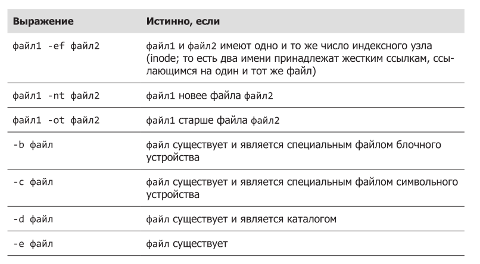
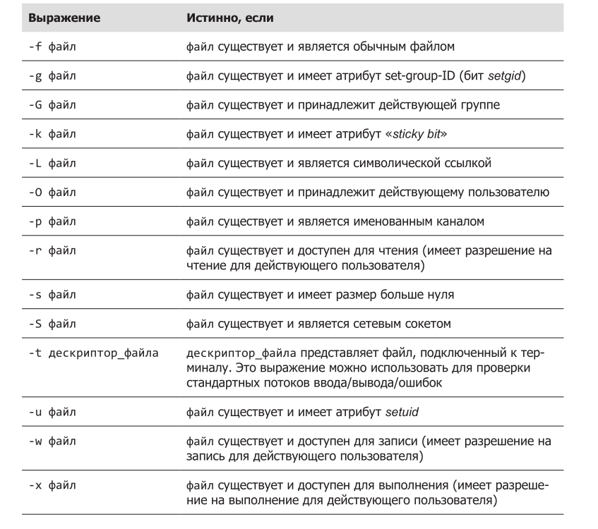
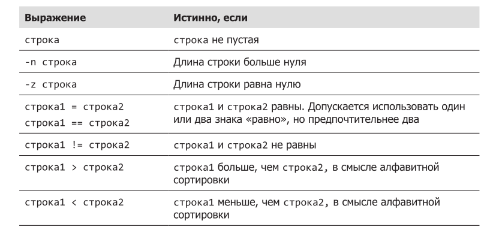
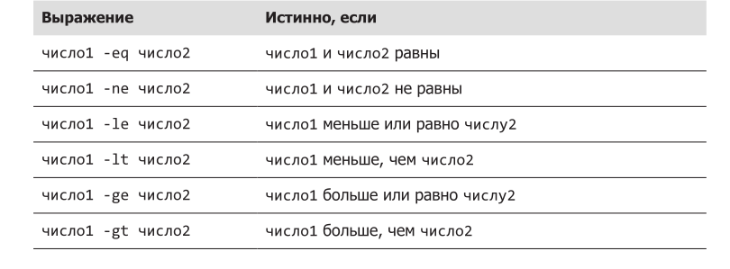
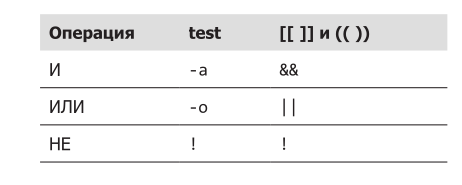

## Содержание

### Часть IV Сценарии командной оболочки
- [Глава 24. Создание первого сценария командной оболочки](#глава-14-создание-первого-сценария-командной-оболочки)
- [Глава 25. Начало проекта](#глава-25-начало-проекта)
- [Глава 26. Проектирование сверху вниз](#глава-26-проектирование-сверху-вниз)
- [Глава 27. Управление потоком выполнения: ветвление при помощи if](#глава-27-управление-потоком-выполнения:-ветвление-при-помощи-if)

## Глава 24. Создание первого сценария командной оболочки

### Что такое сценарии командной оболочки

Выражаясь простым языком, сценарий командной оболочки — это файл, содержащий последовательность команд. Командная оболочка читает этот файл и выполняет команды, как если бы они вводились вручную в командной строке.
Командная оболочка — это одновременно и мощный интерфейс командной строки к системе, и интерпретатор языка сценариев. 

### Как написать сценарий командной оболочки

Чтобы успешно создать и запустить сценарий командной оболочки, нам нужно:
1. Написать сценарий. Сценарии командной оболочки — это обычные текстовые
файлы. Поэтому для их создания нам понадобится текстовый редактор. Лучше
использовать текстовый редактор, обладающий функцией подсветки синтаксиса, позволяющей видеть элементы сценариев с цветной маркировкой. Подсветка синтаксиса помогает замечать некоторые типичные ошибки. Для создания сценариев хорошо подходят vim, gedit, kate и многие другие редакторы.
2. Сделать сценарий выполняемым. Система не позволяет интерпретировать
любой старый текстовый файл как программу, и небезосновательно! Поэтому,
чтобы выполнить сценарий, файлу сценария нужно дать разрешения на выполнение.
3. Поместить сценарий в каталог, где командная оболочка сможет найти его.
Командная оболочка автоматически ищет выполняемые файлы в нескольких
каталогах, если путь к файлу не указан явно. Для максимального удобства мы
будем помещать наши сценарии в такие каталоги.


###  Формат файла сценария

Следуя традициям программирования, напишем программу «hello world», чтобы
продемонстрировать чрезвычайно простой сценарий. Итак, запустите текстовый
редактор и введите следующий сценарий:

```
#!/bin/bash
# Это наш первый сценарий.
echo 'Hello World!'
```

Последняя строка в сценарии хорошо знакома — это простая команда echo со
строковым аргументом. Вторая строка также знакома. Она выглядит как комментарии, которые мы видели во многих конфигурационных файлах, исследованных и отредактированных нами. Еще одна особенность комментариев, о которой пока не рассказывалось, — они могут появляться в концах строк, если им предшествует хотя бы один пробельный символ, например:

```
echo 'Hello World!' # Это тоже комментарий
```

Все, начиная с символа # и до конца строки, игнорируется.
То же самое верно и для командной строки:


```
[me@linuxbox ~]$ echo 'Hello World!' # Это тоже комментарий
Hello World!
```

Первая строка в сценарии смотрится несколько необычно. Она похожа на ком-
ментарий, потому что начинается с символа #, но выглядит какой-то уж слишком специальной, чтобы быть комментарием. Последовательность символов #! — это на самом деле специальная конструкция, которая называется shebang (произносится как «шебанг») и сообщает системе имя интерпретатора, который должен использоваться для выполнения следующего за ним текста сценария. Каждый сценарий командной оболочки должен включать это определение в первой строке. Сохраните файл сценария с именем hello_world.

### Разрешения на выполнение

Далее сделаем сценарий исполняемым при помощи команды chmod:

```
[me@linuxbox ~]$ ls -l hello_world
-rw-r--r-- 1 me
me
63 2018-03-07 10:10 hello_world
[me@linuxbox ~]$ chmod 755 hello_world
[me@linuxbox ~]$ ls -l hello_world
-rwxr-xr-x 1 me
me
63 2018-03-07 10:10 hello_world
```

Существует два распространенных набора разрешений для сценариев: 755 — для
сценариев, которые должны быть доступны для выполнения всем, и 700 — для
сценариев, которые могут выполняться только владельцами. Обратите внимание,
что сценарии необходимо сделать доступными для чтения, чтобы их можно было
выполнить.

### Местоположение файла сценария

После установки разрешений попробуем запустить сценарий:

```
[me@linuxbox ~]$ ./hello_world
Hello World!
```
Но чтобы это сделать, необходимо добавить явный путь перед его именем. В противном случае мы получим следующее сообщение:
```
[me@linuxbox ~]$ hello_world
bash: hello_world: команда не найдена
```

В чем причина? Проблема — местоположение. Ранее мы изучали переменную окружения PATH и ее влияние на то, как система ищет выполняемые программы. Коротко напомним, что система просматривает каталоги по списку всякий раз, когда требуется найти исполняемую программу, если путь к ней не указан явно. Именно так система выполняет программу /bin/ls, если мы вводим ls в командной строке. Каталог /bin — один из каталогов, которые система просматривает автоматически. Список каталогов хранится в переменной
окружения PATH. Она содержит список каталогов, перечисленных через двоето-
чие. Увидеть, что содержится в PATH, можно с помощью команды:

```
[me@linuxbox ~]$ echo $PATH
/home/me/bin:/usr/local/sbin:/usr/local/bin:/usr/sbin:/usr/bin:/sbin:/bin:/usr/games
```

Как видите, это просто список каталогов. Если поместить сценарий в любой из
этих каталогов, наша проблема будет решена. Обратите внимание на первый ка-
талог в списке, /home/me/bin. В большинстве дистрибутивов Linux в переменную PATH включается каталог bin в домашнем каталоге пользователя, чтобы дать пользователям возможность выполнять собственные программы. То есть если создать каталог bin и поместить сценарий в него, его можно будет запускать как любые другие программы:
```
[me@linuxbox ~]$ mkdir bin
[me@linuxbox ~]$ mv hello_world bin
[me@linuxbox ~]$ hello_world
Hello World!
```
Если каталог отсутствует в переменной PATH, его легко туда добавить, включив следующую строку в файл .bashrc:
export PATH=~/bin:"$PATH"

Это изменение будет действовать в каждом последующем сеансе работы с терминалом. Чтобы применить изменения в текущем сеансе, нужно заставить командную оболочку повторно прочитать файл .bashrc, например, так:

```
[me@linuxbox ~]$ . .bashrc
```

Команда «точка» (.) является синонимом source, встроенной команды, которая
читает указанный файл и интерпретирует его как ввод с клавиатуры.

#### ПРИМЕЧАНИЕ

Ubuntu (и многие другие дистрибутивы на основе Debian) автоматически добавляет каталог ~/bin в переменную PATH, если он существует в момент выполнения файла .bashrc. То есть если в системе Ubuntu создать каталог ~/bin и затем выйти и войти в систему, проблема решится автоматически.

### НАСТРОЙКА VIM ДЛЯ РАЗРАБОТКИ СЦЕНАРИЕВ

Текстовый редактор vim имеет много, очень много параметров настройки. Некоторые из них можно использовать для подготовки редактора к разработке
сценариев. 
Следующая команда:

:syntax on
включает подсветку синтаксиса. С этой настройкой редактор будет отображать
синтаксические элементы сценариев разным цветом. Это помогает выявлять некоторые виды ошибок. И конечно же, выглядит очень круто. Обратите внимание, что для работы этой настройки должна быть установлена полная версия vim, а редактируемый файл должен содержать строку шебанг (shebang), сообщающую, что файл является сценарием командной оболочки. Если с этой командой возникнут сложности, попробуйте настройку :set syntax=sh.

:set hlsearch
включает подсветку результатов поиска. Например, если выполнить поиск слова
echo с этой настройкой, редактор выделит все вхождения искомого слова.

:set tabstop=4
определяет число колонок (знакомест), занимаемых символом табуляции. По
умолчанию один символ табуляции занимает восемь знакомест. Присвоив этому
параметру значение 4, вам проще будет уместить длинные строки на экране.

:set autoindent
включает автоматическое оформление отступов. Этот параметр заставляет vim
добавлять в новую строку отступ, как в строке выше. Это ускоряет ввод многих видов программных конструкций. Чтобы прекратить автоматическое выравнивание, достаточно нажать комбинацию CTRL+D.
Эти изменения можно сделать постоянными, добавив описанные команды (без
начального двоеточия) в файл ~/.vimrc.

### Выбор местоположения для сценариев

Каталог ~/bin хорошо подходит для сценария, если этот сценарий предназначен для личного использования. Сценарии, которые должны быть доступны всем пользователям в системе, лучше размещать в традиционном месте — в каталоге /usr/local/bin. 
Сценарии, предназначенные для использования системным администратором, часто помещаются в каталог /usr/local/sbin.
В большинстве случаев программное обеспечение, созданное в локальной системе, будь то сценарии или скомпилированные программы, следует помещать в иерархию каталогов /usr/local, а не /bin или /usr/bin. Последние два каталога, как определено стандартом иерархии файловой системы Linux, предназначены только для файлов, поставляемых создателями дистрибутива Linux.

### Дополнительные хитрости по оформлению

Одной из ключевых целей, стоящих перед создателями сценариев, является простота сопровождения, то есть простота, с которой сценарий может быть изменен автором или другими пользователями для удовлетворения меняющихся потребностей. Один из способов упростить сопровождение — улучшить читаемость и понятность сценария.

### Длинные имена параметров
Многие команды, с которыми мы уже знакомы, поддерживают параметры с короткими и длинными именами. Например, команда ls имеет множество параметров, которые можно выразить в короткой и в длинной форме. Например:

```
[me@linuxbox ~]$ ls -ad
и
[me@linuxbox ~]$ ls --all --directory
```

это эквивалентные команды. Параметры с короткими именами предпочтительнее
использовать в командной строке, так как они помогают уменьшить ручной ввод, но длинные имена параметров могут улучшить читаемость.


### Отступы и продолжения строк
Если приходится использовать длинные команды, их читаемость можно повы-
сить, распределяя такие команды по нескольким строкам. Ранее был представлен пример длинной команды find:

```
[me@linuxbox ~]$ find playground \( -type f -not -perm 0600 -exec
chmod 0600 '{}' ';' \) -or \( -type d -not -perm 0700 -exec chmod
0700 '{}' ';' \)
```

С первой попытки понять эту команду очень сложно. В тексте сценария ее можно упростить, записав следующим образом:

```
find playground \
\( \
-type f \
-not -perm 0600 \
-exec chmod 0600 '{}' ';' \
\) \
-or \
\( \
-type d \
-not -perm 0700 \
-exec chmod 0700 '{}' ';' \
\)
```

С помощью последовательностей продолжения строки (включающих обратный
слеш и символ перевода строки) и отступов логику этой сложной команды удалось сделать ясной для читателя. Этот прием работает также в командной строке, однако он редко используется из-за неудобства ввода и редактирования. Одно из отличий сценариев от командной строки — возможность использования символов табуляции для оформления отступов, тогда как в командной строке это невозможно, потому что клавиша ввода табуляции активирует функцию автодополнения.

### Заключение

В первой главе, посвященной сценариям, мы увидели, как писать сценарии и как упростить их запуск в своей системе. Мы также познакомились с некоторыми приемами оформления, улучшающими читаемость (и тем самым упрощающими сопровождение) сценариев. В следующих главах мы снова и снова будем возвращаться к простоте сопровождения как главному принципу создания качественных сценариев.

## Глава 25. Начало проекта

Далее мы напишем генератор отчетов. Он будет выводить разнообразную информацию о системе и ее состоянии в формате HTML, благодаря чему ее можно
будет просматривать в веб-браузере. Обычно создание программ выполняется в несколько этапов, на каждом из которых добавляются новые функции и возможности. 
По окончании первого этапа наша программа будет воспроизводить минимальную HTML-страницу без какой-либо информации. Эту информацию мы добавим на следующих этапах.

Этап первый: минимальный документ
Прежде всего, определим, как выглядит формат правильно сформированного
HTML-документа. Он имеет следующий вид:

```
<html>
  <head>
    <title>Заголовок страницы</title>
  </head>
  <body>
    Тело страницы.
  </body>
</html>
```

Если ввести этот текст в текстовом редакторе и сохранить в файле с именем foo.html, мы сможем открыть его, введя следующий адрес URL в Firefox: file:///home/username/foo.html.


На первом этапе создадим программу, которая будет выводить эту разметку
HTML в стандартный вывод. Написать такую программу очень просто. Откройте
текстовый редактор и создайте файл с именем ~/bin/sys_info_page:
[me@linuxbox ~]$ vim ~/bin/sys_info_page
А затем введите следующую программу:

```
#!/bin/bash
# Программа вывода страницы с информацией о системе
echo "<html>"
echo " <head>"
echo "
<title>Page Title</title>"
echo " </head>"
echo " <body>"
echo "
Page body."
echo " </body>"
echo "</html>"
```
Наша первая версия содержит строку-шебанг (shebang), комментарий и последовательность команд echo, по одной для вывода
каждой строки. После сохранения файла сделайте его выполняемым и попробуйте запустить:

```
[me@linuxbox ~]$ chmod 755 ~/bin/sys_info_page
[me@linuxbox ~]$ sys_info_page
```

После запуска на экране должен появиться текст HTML-документа, потому что
команды echo в сценарии посылают свои строки в стандартный вывод. Запустите программу снова и перенаправьте вывод программы в файл sys_info_page.html, чтобы затем посмотреть результат в веб-браузере:

```
[me@linuxbox ~]$ sys_info_page > sys_info_page.html
[me@linuxbox ~]$ firefox sys_info_page.html
```

Пока все идет неплохо.
Разрабатывая программы, всегда следует помнить о простоте и ясности. Если объединить все команды echo в одну, это определенно упростит в будущем добавление новых строк в вывод программы. Поэтому изменим программу, как показано ниже:

```
#!/bin/bash
# Программа вывода страницы с информацией о системе

echo "<html>
<head>
  <title>Page Title</title>
</head>
<body>
  Page body.
</body>
</html>"
```

Строки в кавычках могут включать символы перевода строки и, соответственно,
содержать несколько строк текста. Командная оболочка будет продолжать читать текст, пока не встретит закрывающую кавычку. Это правило действует также в командной строке:

```
[me@linuxbox ~]$ echo "<html>
>  <head>
>    <title>Page Title</title>
>  </head>
>  <body>
>    Page body.
>   </body>
>  </html>
EOF

```

Символ > в начале каждой строки — это приглашение к вводу командной оболочки, определяемое ее переменной PS2. Оно появляется всякий раз, когда происходит ввод многострочной инструкции, то есть, когда нажимается Enter. Эта особенность пока малопонятна, но потом, когда мы познакомимся с многострочными программными инструкциями, ее преимущества станут очевидными.

### Этап второй: добавление некоторых данных

Теперь, когда программа способна сгенерировать минимальный документ, добавим в отчет немного данных. Для этого внесите следующие изменения:

```
#!/bin/bash
# Программа вывода страницы с информацией о системе

echo "<html>
  <head>
    <title>System Information Report</title>
  </head>
  <body>
    <h1>System Information Report</h1>
  </body>
</html>"
```

Здесь добавлено название страницы и заголовок в теле отчета.

### Переменные и константы

В нашем сценарии возникла проблема. Обратили внимание, что строка System
Information Report повторяется дважды? Вообще, для такого крохотного сценария это не такая большая проблема, но представьте по-настоящему длинный сценарий, в котором эта строка повторяется много раз. Если в таком сценарии понадобится изменить название, придется внести изменения во множестве мест,а это масса ручной работы. Можно ли изменить сценарий так, чтобы строка определялась в нем только один раз? Это существенно упростило бы сопровождение сценария в будущем. Да, это возможно, например, так:

```
#!/bin/bash

title="System Information Report"

# Программа вывода страницы с информацией о системе

echo "<html>
  <head>
    <title>$title</title>
  </head>
  <body>
    <h1>$title</h1>
  </body>
</html>"
```

Создав переменную с именем title и присвоив ей значение System Information
Report, мы воспользовались преимуществами подстановки параметров и поместили строку во множество мест. Но как создать переменную? Просто — достаточно использовать ее. <b>Когда командная оболочка встречает переменную, она автоматически создает ее.</b> Этим она отличается от многих языков программирования, в которых переменные должны явно объявляться или определяться до ее использования. Командная оболочка слишком либеральна в этом отношении, что в итоге приводит к некоторым про-
блемам. Например, рассмотрим следующий сценарий, выполненный в команд-
ной строке:

```
[me@linuxbox ~]$ foo="yes"
[me@linuxbox ~]$ echo $foo
yes
[me@linuxbox ~]$ echo $fool
[me@linuxbox ~]$
```

Мы сначала присвоили значение yes переменной foo и затем вывели ее значение командой echo. Далее, мы попробовали вновь вывести значение переменной, но допустили опечатку, указав имя fool, и получили пустую строку. Такой результат объясняется тем, что командная оболочка благополучно создала переменную fool, встретив ее, и присвоила ей пустое значение по умолчанию. Из этого примера следует, что нужно внимательно следить за правописанием!
Также важно понять, что в действительности произошло в этом примере. Из
предыдущего знакомства с особенностями работы механизма подстановки мы
знаем, что команда

```
[me@linuxbox ~]$ echo $foo
```

подвергается действию механизма подстановки параметров, в результате чего
приобретает вид

```
[me@linuxbox ~]$ echo yes
```

С другой стороны, команда

```
[me@linuxbox ~]$ echo $fool
```
превращается в

```
[me@linuxbox ~]$ echo
```

На место пустой переменной ничего не подставляется! Это может вызвать ошибку в командах, требующих наличия аргументов. Например:

```
[me@linuxbox ~]$ foo=foo.txt
[me@linuxbox ~]$ foo1=foo1.txt
[me@linuxbox ~]$ cp $foo $fool
```
cp: после 'foo.txt' пропущен операнд, задающий целевой файл
По команде "cp --help" можно получить дополнительную информацию.

Мы присвоили значения двум переменным, foo и foo1. А затем попытались выполнить команду cp, но допустили опечатку в имени второго аргумента. После обработки механизмом подстановки команда cp получила только один аргумент, хотя требует двух.

Ниже приводятся несколько правил именования переменных:
1. Имена переменных могут состоять из алфавитно-цифровых символов (букв
и цифр) и символов подчеркивания.
2. Первый символ в имени переменной может быть только буквой или символом
подчеркивания.
3. Присутствие пробелов и знаков препинания в именах переменных не допускается.

Название переменная подразумевает значение, которое может изменяться, и во
многих приложениях переменные именно так и используются. Однако переменная title в нашем приложении используется как константа. Константа,
так же как переменная, имеет имя и содержит значение. Отличие лишь в том,
что значение константы не изменяется. В приложении, осуществляющем геометрические расчеты, можно определить константу PI со значением 3.1415, вместо того, чтобы использовать это число по всей программе. Командная оболочка не различает константы и переменные; эти термины используются в основном для удобства программиста. Типичное соглашение — использовать буквы верхнего регистра для обозначения констант и буквы нижнего регистра для истинных переменных. Давайте изменим сценарий, приведя его в соответствие с этим соглашением:

```
#!/bin/bash

TITLE="System Information Report For $HOSTNAME"

# Программа вывода страницы с информацией о системе

echo "<html>
  <head>
    <title>$TITLE</title>
  </head>
  <body>
    <h1>$TITLE</h1>
  </body>
</html>"
```

Попутно мы дополнили название, добавив в конец значение переменной командной оболочки HOSTNAME. Это — сетевое имя машины.

### ПРИМЕЧАНИЕ

В действительности командная оболочка имеет механизм, гарантирующий неизменяемость констант, в виде встроенной команды declare с параметром -r
(read-only — только для чтения). Если переменной TITLE присвоить значение,
как показано ниже:

```
declare -r TITLE="Page Title"
```

командная оболочка не допустит повторного присваивания значения переменной TITLE. Этот механизм редко используется на практике, но он имеется и его
можно применять в особенно строгих сценариях.

### Присваивание значений переменным и константам

Мы подошли к моменту, когда наше знание особенностей работы механизма под-
становки начинает приносить свои плоды. Как мы видели, присваивание значе-
ний переменным производится так:

переменная=значение
где переменная — это имя переменной, а значение — строка. 

В отличие от некоторых других языков программирования, командная оболочка не заботится о типах значений, присваиваемых переменным; она все значения интерпретирует как строки. Существует возможность заставить командную оболочку ограничить круг присваиваемых значений целыми числами, задействовав команду declare с параметром -i, но, как и объявление переменных, доступных только для чтения, эта возможность редко используется на практике.

Обратите внимание на отсутствие пробелов в операторе присваивания между
именем переменной, знаком «равно» и значением. А из чего может состоять значение? Из всего что угодно, что можно развернуть в строку.

```
a=z
# Присвоит переменной a строку "z".
b="a string"
# Внутренние пробелы должны находиться в кавычках.
c="a string and $b" # При присваивании допускается выполнять подстановку,
# например, значений других переменных.
d=$(ls -l foo.txt) # Результат выполнения команды.
e=$((5 * 7))
# Подстановка результата арифметического выражения.
f="\t\ta string\n" # Экранированные последовательности, такие как
# символы табуляции и перевода строки.
```

В одной строке можно выполнить присваивание сразу нескольким переменным:
a=5 b="a string"


При использовании подстановки имена переменных можно заключать в необяза-
тельные фигурные скобки {}. Это пригодится в том случае, когда имя переменной становится неоднозначным в окружающем контексте. В следующем примере выполняется попытка переименовать файл myfile в myfile1 с использованием переменной:

```
[me@linuxbox ~]$ filename="myfile"
[me@linuxbox ~]$ touch $filename
[me@linuxbox ~]$ mv $filename $filename1
```

mv: после 'myfile' пропущен операнд, задающий целевой файл
По команде "mv --help" можно получить дополнительную информацию.
Эта попытка не увенчалась успехом, потому что командная оболочка интерпретировала второй аргумент команды mv как имя новой (и пустой) переменной. Ниже показано, как решается подобная проблема:

```
[me@linuxbox ~]$ mv $filename ${filename}1
```

Добавив фигурные скобки, мы гарантировали, что командная оболочка не будет
интерпретировать последний символ 1 как часть имени переменной.

### ПРИМЕЧАНИЕ

Выполняя подстановку, имена переменных и команды рекомендуется заключать
в двойные кавычки, чтобы исключить разбиение строк на слова оболочкой.
Особенно важно использовать кавычки, когда переменная может содержать
имя файла.

Воспользуемся этой возможностью, чтобы добавить в отчет дополнительные данные, а именно дату и время составления отчета, а также имя пользователя, составившего отчет:

```
#!/bin/bash

TITLE="System Information Report For $HOSTNAME"
CURRENT_TIME=$(date +"%x %r %Z")
TIME_STAMP="Generated $CURRENT_TIME, by $USER"

# Программа вывода страницы с информацией о системе

echo "<html>
  <head>
    <title>$TITLE</title>
  </head>
  <body>
    <h1>$TITLE</h1>
    <p>$TIME_STAMP</p>
  </body>
</html>"
```

### Встроенные документы

Мы рассмотрели два разных метода вывода текста, и оба используют команду echo. Однако существует еще один, третий метод, который называется встроенным документом (here document), или встроенным сценарием (here script). 
Встроенный документ — это дополнительная форма перенаправления ввода/вывода, которая передает текст, встроенный в сценарий, на стандартный ввод команды. Действует это перенаправление так:

команда << индикатор
текст
индикатор

где команда — это имя команды, принимающей указанный текст через стандартный ввод, а индикатор — это строка, отмечающая конец встроенного текста. Изменим сценарий, задействовав в нем встроенный документ:

```
#!/bin/bash

TITLE="System Information Report For $HOSTNAME"
CURRENT_TIME=$(date +"%x %r %Z")
TIME_STAMP="Generated $CURRENT_TIME, by $USER"

# Программа вывода страницы с информацией о системе

cat << _EOF_

echo 
  <head>
    <title>$TITLE</title>
  </head>
  <body>
    <h1>$TITLE</h1>
    <p>$TIME_STAMP</p>
  </body>
</html>

_EOF_
```

Теперь вместо команды echo в сценарии используются команда cat и встро-
енный документ. На роль индикатора была выбрана строка _EOF_ (означает end-of-file — конец файла, распространенное соглашение), и она отмечает конец встроенного текста. Обратите внимание, что строка-индикатор должна находиться в отдельной строке, одна, и за ней не должно следовать никаких пробелов.
Но какие преимущества дало использование встроенного документа здесь? Прак-
тически никаких, кроме того, что кавычки внутри встроенных документов теряют свое специальное значение для командной оболочки. Ниже приводится пример использования встроенного документа в командной строке:

```
[me@linuxbox ~]$ foo="some text"
[me@linuxbox ~]$ cat << _EOF_
> $foo
> "$foo"
> '$foo'
> \$foo
> _EOF_
some text
"some text"
'some text'
$foo
```

Как видите, командная оболочка не обращает никакого внимания на кавычки.
Она интерпретирует их как обычные символы. Благодаря этому мы свободно
вставляем кавычки во встроенные документы. Этим обстоятельством можно воспользоваться при разработке программ составления отчетов.
Встроенные документы можно использовать с любыми командами, принимающими данные со стандартного ввода. В следующем примере встроенный документ
используется для передачи последовательности команд программе ftp, чтобы загрузить файл с удаленного FTP-сервера:

```
#!/bin/bash
# Сценарий загрузки файла через FTP
FTP_SERVER=ftp.nl.debian.org
FTP_PATH=/debian/dists/stretch/main/installer-amd64/current/images/cdrom
REMOTE_FILE=debian-cd_info.tar.gz
ftp -n << _EOF_
open $FTP_SERVER
user anonymous me@linuxbox
cd $FTP_PATH
hash
get $REMOTE_FILE
bye
_EOF_
ls -l $REMOTE_FILE
```

Если заменить оператор перенаправления << на <<-, командная оболочка будет
игнорировать начальные символы табуляции во встроенном документе. Благодаря этому во встроенный документ можно добавить отступы для большей удобочитаемости:

```
#!/bin/bash
# Сценарий загрузки файла через FTP
FTP_SERVER=ftp.nl.debian.org
FTP_PATH=/debian/dists/stretch/main/installer-amd64/current/images/cdrom
REMOTE_FILE=debian-cd_info.tar.gz
ftp -n <<- _EOF_
        open $FTP_SERVER
        user anonymous me@linuxbox
        cd $FTP_PATH
        hash
        get $REMOTE_FILE
        bye
_EOF_
ls -l $REMOTE_FILE
```

Однако пользоваться этой особенностью не всегда удобно, потому что для оформления отступов многие текстовые редакторы (и сами программисты) предпочитают использовать символы пробела вместо символов табуляции.

### Заключение

В этой главе мы приступили к разработке проекта, при помощи которого пройдем через все этапы создания сценария. Мы познакомились с переменными и константами и особенностями их использования. Они чаще других программных компонентов применяются для подстановки. Мы также увидели, как организовать вывод информации в сценарии, и познакомились с разными методами встраивания блоков текста.

## Глава 26. Проектирование сверху вниз

Процесс идентификации высокоуровневых шагов и проработку все
более мелких деталей этих шагов называют проектированием сверху вниз. Этот
прием позволяет разбивать большие, сложные задачи на множество мелких и простых задач. Проектирование сверху вниз часто используется в разработке программного обеспечения и хорошо подходит для программирования на языке командной оболочки.В этой главе воспользуемся приемом проектирования сверху вниз для дальнейшей разработки сценария генератора отчетов.

### Функции командной оболочки

В настоящий момент наш сценарий генерирует документ HTML, выполняя следующие шаги:

1. Открыть страницу.
2. Открыть заголовок страницы.
3. Установить название страницы.
4. Закрыть заголовок страницы.
5. Открыть тело страницы.
6. Вывести заголовок на странице.
7. Вывести текущее время.
8. Закрыть тело страницы.
9. Закрыть страницу.

На следующем этапе разработки мы добавим несколько задач между шагами 7 и 8:
Продолжительность непрерывной работы системы и степень ее загруженности — это интервал времени, прошедшего с момента последней загрузки системы, и среднее число задач, выполняемых процессором в настоящее время для
нескольких отрезков времени.
Дисковое пространство — информация об использовании дискового про-
странства на системных устройствах хранения.
Объем домашних каталогов — объем дискового пространства, занятого каж-
дым пользователем.
Если бы у нас были команды, решающие перечисленные задачи, мы бы просто
добавили их в сценарий, воспользовавшись механизмом подстановки результатов
команд:

```
#!/bin/bash
# Программа вывода страницы с информацией о системе

TITLE="System Information Report For $HOSTNAME"
CURRENT_TIME=$(date +"%x %r %Z")
TIME_STAMP="Generated $CURRENT_TIME, by $USER"

cat << _EOF_
<html>
<head>
    <title>$TITLE</title>
</head>
<body>
    <h1>$TITLE</h1>
    <p>$TIME_STAMP</p>
    
    $(report_uptime)
    $(report_disk_space)
    $(report_home_space)
    
</body>
</html>
_EOF_

```

Создать такие команды можно двумя способами: написать три отдельных сцена-
рия и поместить их в каталог, входящий в список PATH, или встроить эти сценарии в программу в виде функций командной оболочки. Как уже отмечалось ранее, функции — это «мини-сценарии», находящиеся внутри другого сценария, которые работают как автономные программы. Функции имеют две синтаксические
формы. Первая выглядит так:

```
function имя {
  команды
  return
}
```

Вторая проще (и часто предпочтительнее):
```
имя () {
  команды
  return
}
```

где имя — это имя функции, а команды — последовательность команд внутри функции. Обе формы эквивалентны и могут использоваться одна вместо другой. Ниже приводится сценарий, демонстрирующий использование функций командной
оболочки:

```
 1  #!/bin/bash
 2  
 3  # Демонстрация функций командной оболочки
 4  
 5  function step2 {
 6      echo "Step 2"
 7      return
 8  }
 9  
 10  # Здесь начинается основная программа
11  
12  echo "Step 1" 
13  step2
14  echo "Step 3"
```

Когда командная оболочка читает сценарий, она пропускает строки с 1-й по 11-ю, так как они содержат комментарии и определение функции. Выполнение начинается со строки 12 с командой echo. Строка 13 вызывает функцию step2, и командная оболочка выполняет функцию как любую другую команду. Управление передается в строку 6, и выполняется вторая команда echo. Следующей выполняется строка 7. Команда return в этой строке завершает выполнение функции и возвращает управление в строку, следующую за вызовом функции (строка 14). После этого выполняется заключительная команда echo. Обратите внимание: чтобы вызовы функций интерпретировались не как имена внешних программ, а действительно как вызовы функций, эти функции должны быть определены в сценарии до их вызова.

Добавим в наш сценарий минимальные определения функций:

```
#!/bin/bash
# Программа вывода страницы с информацией о системе

TITLE="System Information Report For $HOSTNAME"
CURRENT_TIME=$(date +"%x %r %Z")
TIME_STAMP="Generated $CURRENT_TIME, by $USER"

report_uptime () {
  return
}

report_disk_space () {
  return
}

report_home_space () {
  return
}

cat << _EOF_
<html>
<head>
    <title>$TITLE</title>
</head>
<body>
    <h1>$TITLE</h1>
    <p>$TIME_STAMP</p>
    $(report_uptime)
    $(report_disk_space)
    $(report_home_space)
    
</body>
</html>
_EOF_

```

Имена функций подчиняются тем же правилам, что и имена переменных. Функ-
ция должна содержать хотя бы одну команду. Команда return (которая является
необязательной) помогает удовлетворить это требование.

### Локальные переменные

В сценариях, что нам доводилось писать до сих пор, все переменные (включая
константы) были глобальными. Глобальные переменные существуют и доступны
в любой точке программы. В некоторых случаях это безусловно полезное свойство осложняет использование функций. Внутри функций иногда желательно использовать локальные переменные. Локальные переменные доступны только внутри функции, в которой они определены, и прекращают свое существование по завершении выполнения функции.
Поддержка локальных переменных позволяет программисту использовать переменные с именами, которые уже определены в сценарии, глобально или в других функциях, не беспокоясь о возможных конфликтах имен.
Следующий пример сценария демонстрирует, как определяются и используются
локальные переменные:

```
#!/bin/bash
# local-vars: сценарий, демонстрирующий локальные переменные

foo=0
# глобальная переменная foo

funct_1 () {
    local foo
    # переменная foo, локальная для funct_1
    foo=1
    echo "funct_1: foo = $foo"
}

funct_2 () {
    local foo
    # переменная foo, локальная для funct_2
    foo=2
    echo "funct_2: foo = $foo"
}

echo "global: foo = $foo"
funct_1
echo "global: foo = $foo"
funct_2
echo "global: foo = $foo"
```

Как видите, локальные переменные объявляются добавлением слова local перед
именем переменной. В результате создается переменная, локальная по отношению к функции, в которой она определена. Когда выполнение выйдет за пределы функции, переменная перестанет существовать. Если запустить этот сценарий, он выведет следующее:

```
[me@linuxbox ~]$ local-vars
global: foo = 0
funct_1: foo = 1
global: foo = 0
funct_2: foo = 2
global: foo = 0
```

Этот пример показывает, что присваивание значений локальной переменной foo
внутри обеих функций не оказывает влияния на значение переменной foo, объявленной за пределами функций.

Эта особенность позволяет писать функции, сохраняя их независимость друг от
друга и от сценария, в котором они определяются. Это очень ценное качество, оно предотвращает взаимовлияние разных частей программы друг на друга, а кроме того, помогает писать переносимые функции, то есть функции, которые можно скопировать из одного сценария в другой.

### Постоянное тестирование сценария

В процессе разработки программ необходимо постоянно проверять их работоспособность. Запуская и тестируя программы как можно чаще, мы сможем выявить ошибки на самых ранних этапах разработки. Это существенно упрощает задачу отладки. Например, если после внесения небольших изменений и очередного запуска программы обнаружится ошибка, источник проблемы почти наверняка будет находиться в последних изменениях. 

```
<html>
<head>
    <title>System Information Report For twin2</title>
</head>
<body>
    <h1>System Information Report For linuxbox</h1>
    <p>Generated 03/19/2012 04:02:10 PM EDT, by me</p>
</body>
</html>
```

Изменим функции, добавив в них сообщения для обратной связи:

```
report_uptime () {
  echo "Function report_uptime executed."
  return
}

report_disk_space () {
  echo "Function report_disk_space executed."
  return
}

report_home_space () {
  echo "Function report_home_space executed."
  return
}
```

И запустим сценарий еще раз:

```
<html>
<head>
    <title>System Information Report For linuxbox</title>
</head>
<body>
    <h1>System Information Report For linuxbox</h1>
    <p>Generated 03/20/2012 05:17:26 AM EDT, by me</p>
    Function report_uptime executed.
    Function report_disk_space executed.
    Function report_home_space executed.
</body>
</html>

```

Теперь можно с уверенностью сказать, что наши три функции выполняются как
надо. Теперь, когда каркас функций готов и работает, самое время добавить в них некий код. Сначала займемся функцией report_uptime:

```
report_uptime () {
    cat <<- _EOF_
        <h2>System Uptime</h2>
        <pre>$(uptime)</pre>
        _EOF_
    return
}
```

Она выглядит очень просто. Мы использовали встроенный документ для вывода
заголовка раздела и результатов выполнения команды uptime, заключив их в теги <pre>, чтобы сохранить формат вывода команды. Функция report_disk_space выглядит аналогично:

```
report_disk_space () {
    cat <<- _EOF_
        <h2>Disk Space Utilization</h2>
        <pre>$(df -h)</pre>
        _EOF_
    return
}
```

Она получает информацию о дисковом пространстве с помощью команды df -h.
Наконец, определим функцию report_home_space:

```
report_home_space () {
    cat <<- _EOF_
        <h2>Home Space Utilization</h2>
        <pre>$(du -sh /home/*)</pre>
        _EOF_
    return
}
```

Для решения поставленной задачи мы использовали команду du с параметрами
-sh. Однако это не полное решение задачи. Даже притом, что его можно использовать в некоторых системах (например, в Ubuntu), кое-где оно работать не будет. Причина в том, что во многих системах для домашних каталогов выбираются разрешения, не позволяющие читать их содержимое другим пользователям, что является вполне разумной мерой предосторожности. В этих системах функция report_home_space в том виде, в каком она написана здесь, будет работать, только если запустить сценарий с правами суперпользователя. Лучшее, что можно сделать в такой ситуации, — корректировать поведение сценария в соответствии с привилегиями пользователя, запустившего его. Мы изучим это позже.


### ФУНКЦИИ КОМАНДНОЙ ОБОЛОЧКИ В ФАЙЛЕ .BASHRC

Функции командной оболочки могут служить прекрасной заменой псевдонимам
и в действительности считаются предпочтительным способом определения небольших команд для личного использования. Возможности псевдонимов весьма
ограниченны в отношении использования некоторых видов команд и особенностей
командной оболочки, тогда как функции позволяют все, что можно выразить в виде сценария. Например, если вам понравилась функция report_disk_space, созданная нами для нашего сценария, вы можете создать похожую функцию с именем ds в своем файле .bashrc:

```
ds () {
  echo "Disk Space Utilization For $HOSTNAME"
  df -h
}
```

### Заключение

В этой главе мы познакомились с широко применяемым методом проектирования программ сверху вниз и увидели, как можно поэтапно развивать функции
командной оболочки. Мы также научились при помощи локальных переменных делать функции независимыми от других функций и программ, в которых
они находятся. Функции можно делать переносимыми и пригодными для повторного использования во множестве программ, что поможет сэкономить массу времени.

## Глава 27. Управление потоком выполнения: ветвление при помощи if

Рассмотрим простой пример логики, выраженный в псевдокоде:

x = 5
    Если x = 5, тогда:
Сказать "x равно 5".
    Иначе:
Сказать "x не равно 5".

### Инструкция if

В сценариях на языке командной оболочки описанную выше логику можно реализовать так:

```
x=5
  if [ $x = 5 ]; then
    echo "x equals 5."
  else
    echo "x does not equal 5."
  fi  
```

То же самое можно выполнить непосредственно в командной строке, получается
немного короче:

```
[me@linuxbox ~]$ x=5
[me@linuxbox ~]$ if [ $x = 5 ]; then echo "equals 5"; else echo
"does not equal 5"; fi
equals 5
[me@linuxbox ~]$ x=0
[me@linuxbox ~]$ if [ $x = 5 ]; then echo "equals 5"; else echo
"does not equal 5"; fi
does not equal 5
```

В этом примере мы выполнили команду дважды. Первый раз со значением 5 в переменной x, что привело к выводу строки equals 5, и второй раз со значением 0
в переменной x, что привело к выводу строки not equal 5.

Инструкция if имеет следующий синтаксис:

```
if команды; then
команды
[elif команды; then
команды...]
[else
команды]
fi
```

### Код завершения

Команды (включая пользовательские сценарии и функции) по завершении работы возвращают системе значение, которое называют кодом завершения (exit status). Это значение — целое число в диапазоне от 0 до 255 — сообщает об успешном или неуспешном завершении команды. По соглашениям значение 0 служит признаком успешного завершения, а любое другое — неуспешного. Командная оболочка поддерживает переменную, посредством которой можно определить код завершения. Например:

```
[me@linuxbox ~]$ ls -d /usr/bin
/usr/bin
[me@linuxbox ~]$ echo $?
0
[me@linuxbox ~]$ ls -d /bin/usr
ls: cannot access /bin/usr: No such file or directory
[me@linuxbox ~]$ echo $?
2
```

В этом примере мы дважды выполнили команду ls. В первый раз команда выпол-
нилась благополучно. Если вывести значение переменной $?, можно увидеть, что
оно равно 0. Во второй раз команда ls сообщила об ошибке, а переменная $? содер-
жала значение 2, указывающее, что команда столкнулась с ошибкой. Одни коман­
ды используют разные коды завершения, чтобы сообщить о характере ошибки,
тогда как другие, столкнувшись с любой ошибкой, просто возвращают значение 1.
Страницы справочного руководства часто включают раздел с заголовком «Exit
Status» («Коды завершения»), описывающий возвращаемые коды. Однако 0 всег-
да служит признаком успешного выполнения.
Командной оболочкой поддерживаются две чрезвычайно простые встроенные
коман­ды, которые просто завершаются с кодом 0 или 1. Команда true всегда завершается с признаком успеха, а команда false — всегда с признаком ошибки:

```
[me@linuxbox ~]$ true
[me@linuxbox ~]$ echo $?
0
[me@linuxbox ~]$ false
[me@linuxbox ~]$ echo $?
1
```

Эти команды можно использовать для исследования особенностей работы ин-
струкции if. Инструкция if в действительности просто оценивает код заверше-
ния команды:

```
[me@linuxbox ~]$ if true; then echo "It's true."; fi
It's true.
[me@linuxbox ~]$ if false; then echo "It's true."; fi
[me@linuxbox ~]$
```

Команда echo "It's true." выполняется, только если команда, следующая за if,
завершается успешно, и не выполняется, если команда, следующая за if, завершается с признаком ошибки. Если за if следует список команд, успешность выполнения всего списка определяется по последней команде:

```
[me@linuxbox ~]$ if false; true; then echo "It's true."; fi
It's true.
[me@linuxbox ~]$ if true; false; then echo "It's true."; fi
[me@linuxbox ~]$
```


### Команда test

Вне всяких сомнений, чаще всего с инструкцией if используется команда test.
Команда test может выполнять различные проверки и сравнения. Она имеет две
эквивалентные формы:

```
test выражение

```
и более популярную

```
[ выражение ]
```
где выражение возвращает истинное (true) или ложное (false) значение. Команда
test возвращает код завершения 0, если выражение истинно, и код завершения 1,
если выражение ложно.

### Выражения для проверки файлов

В таблице ниже перечислены выражения, используемые для проверки файлов.





Следующий сценарий демонстрирует применение некоторых выражений с файлами:

```
#!/bin/bash
# test-file: проверка файла

FILE=~/.bashrc

if [ -e "$FILE" ]; then
    if [ -f "$FILE" ]; then
        echo "$FILE is a regular file."
    fi
    
    if [ -d "$FILE" ]; then
        echo "$FILE is a directory."
    fi
    
    if [ -r "$FILE" ]; then
        echo "$FILE is readable."
    fi
    
    if [ -w "$FILE" ]; then
        echo "$FILE is writable."
    fi
    
    if [ -x "$FILE" ]; then
        echo "$FILE is executable/searchable."
    fi
else
    echo "$FILE does not exist"
    exit 1
fi

exit

```

Сценарий проверяет файл, имя которого присвоено константе FILE, и выводит
результат. Этот сценарий имеет две интересные особенности, на которые следует
обратить внимание. Во-первых, отметьте, что параметр $FILE внутри выражений
заключен в кавычки. Это не является обязательным требованием, но защищает от
случаев, когда параметр пуст. Если механизм подстановки заменит $FILE пустым
значением, это приведет к ошибке (операторы в этом случае будут интерпретироваться как непустые строки, а не как операторы). Использование кавычек гарантирует, что за оператором всегда будет следовать строка, даже если она пустая.
Во-вторых, обратите внимание на команду exit (в конце сценария). Команда exit
принимает единственный необязательный аргумент, определяющий код возврата
сценария. В отсутствие аргумента exit вернет значение по умолчанию 0. Такое
использование exit позволит сценарию сообщить об ошибке, если в $FILE содержится имя несуществующего файла. Команда exit в самом конце сценария добавлена исключительно для формальности. Когда командная оболочка достигает
конца сценария (то есть конца файла), она в любом случае завершает выполнение
сценария с кодом завершения 0.

Функции командной оболочки тоже могут возвращать свой код завершения, передавая целочисленный аргумент команде return. Чтобы преобразовать сценарий,
приведенный выше, в функцию для использования в больших программах, нужно
заменить команды exit инструкциями return:

```
test_file () {
    # test-file: проверка файла
    FILE=~/.bashrc
    
    if [ -e "$FILE" ]; then
        if [ -f "$FILE" ]; then
            echo "$FILE is a regular file."
        fi
        
        if [ -d "$FILE" ]; then
            echo "$FILE is a directory."
        fi
        
        if [ -r "$FILE" ]; then
            echo "$FILE is readable."
        fi
        
        if [ -w "$FILE" ]; then
            echo "$FILE is writable."
        fi
        
        if [ -x "$FILE" ]; then
            echo "$FILE is executable/searchable."
        fi
    else
        echo "$FILE does not exist"
        return 1
    fi
}
```


### Выражения для проверки строк

В таблице ниже перечислены выражения, используемые для проверки строк.



### ВНИМАНИЕ
При использовании с командой test операторы > и < необходимо заключать в кавычки (или экранировать символом «обратный слеш»). Если этого не сделать,
они будут интерпретироваться командной оболочкой как операторы перенаправления, что может привести к плачевным результатам. Обратите также внимание:
в документации к командной оболочке bash утверждается, что порядок сортировки соответствует порядку алфавитной сортировки, определяемому текущими
региональными настройками, но в действительности это не так. В версиях bash,
вплоть до 4.0, используется порядок сортировки ASCII (POSIX). Эта проблема
была исправлена в версии 4.1.

Следующий сценарий демонстрирует применение выражений для проверки строк:

```
#!/bin/bash
# test-string: проверка значения строки

ANSWER=maybe

if [ -z "$ANSWER" ]; then
    echo "There is no answer." >&2
    exit 1
fi

if [ "$ANSWER" == "yes" ]; then
    echo "The answer is YES."
elif [ "$ANSWER" == "no" ]; then
    echo "The answer is NO."
elif [ "$ANSWER" == "maybe" ]; then
    echo "The answer is MAYBE."
else
    echo "The answer is UNKNOWN."
fi
```
В этом сценарии определяется константа ANSWER. Сначала сценарий проверяет, не
является ли строка пустой. Если строка пустая, сценарий завершается с кодом 1.
Обратите внимание на оператор перенаправления в команде echo. Он перенаправ-
ляет сообщение об ошибке «There is no answer» («Нет ответа») в стандартный вывод ошибок как «наиболее подходящий» для сообщений об ошибках. Если строка
не пустая, сценарий сравнивает ее значение со строками «yes», «no» или «maybe».
Проверки выполняются с использованием инструкции elif, которая является краткой формой записи для else if. Инструкция elif позволяет конструировать
более сложные логические проверки.

### Выражения для проверки целых чисел
В таблице ниже перечислены выражения, используемые для проверки целых чисел.



Следующий сценарий демонстрирует их применение:

```
#!/bin/bash
# test-integer: проверка целочисленного значения.

INT=-5

if [ -z "$INT" ]; then
    echo "INT is empty." >&2
    exit 1
fi

if [ $INT -eq 0 ]; then
    echo "INT is zero."
else
    if [ $INT -lt 0 ]; then
        echo "INT is negative."
    else
        echo "INT is positive."
    fi
    
    if [ $((INT % 2)) -eq 0 ]; then
        echo "INT is even."
    else
        echo "INT is odd."
    fi
fi

```

### Более современная версия команды test

Последние версии bash реализуют составную команду, которая действует как
улучшенная замена для команды test. Она имеет следующий синтаксис:

```
[[ выражение ]]
```

где выражение возвращает истинное (true) или ложное (false) значение. Команда
[[ ]] очень похожа на команду test (она поддерживает те же выражения), но до-
бавляет новое выражение для проверки строк:

```
строка1 =~ регулярное_выражение
```

возвращающее истинное значение, если строка1 соответствует расширенному регулярному выражению. Это открывает широкие перспективы для решения таких
задач, как проверка корректности данных. Предыдущий сценарий, демонстрирующий применение выражений проверки целых чисел, может завершиться с ошиб-
кой, если константе INT присвоить любое значение, не являющееся целым числом.
Для надежности сценарию необходима возможность убедиться, что константа
действительно содержит целое число. Используя [[ ]] с оператором проверки
строки =~, мы усовершенствуем его, как показано ниже:

```
#!/bin/bash
# test-integer2: проверка целочисленного значения.

INT=-5

if [[ "$INT" =~ ^-?[0-9]+$ ]]; then
    if [ $INT -eq 0 ]; then
        echo "INT is zero."
    else
        if [ $INT -lt 0 ]; then
            echo "INT is negative."
        else
            echo "INT is positive."
        fi
        
        if [ $((INT % 2)) -eq 0 ]; then
            echo "INT is even."
        else
            echo "INT is odd."
        fi
    fi
else
    echo "INT is not an integer." >&2
    exit 1
fi
```

Применив регулярное выражение, мы смогли ограничить круг проверяемых зна-
чений в константе INT только строками, начинающимися с необязательного зна-
ка «минус», за которым следует одна или несколько цифр. Это выражение также
устраняет вероятность появления пустых значений.
Еще одна дополнительная особенность [[ ]]: оператор == поддерживает сопостав-
ление с шаблоном по аналогии с механизмом подстановки путей. Например:

```
[me@linuxbox ~]$ FILE=foo.bar
[me@linuxbox ~]$ if [[ $FILE == foo.* ]]; then
> echo "$FILE matches pattern 'foo.*'"
> fi
foo.bar matches pattern 'foo.*'

```
Она превращает [[ ]] в удобный инструмент проверки имен файлов и путей.

### (( )) — для проверки целых чисел

В дополнение к составной команде [[ ]] bash поддерживает также составную
коман­ду (( )), которую удобно использовать для работы с целыми числами. Она
поддерживает полное множество арифметических операторов, о которых подробно рассказывается далее.
Команда (( )) применяется для проверки истинности арифметических выраже-
ний. Арифметическое выражение считается истинным, если его результат отли-
чается от нуля.

```
[me@linuxbox ~]$ if ((1)); then echo "It is true."; fi
It is true.
[me@linuxbox ~]$ if ((0)); then echo "It is true."; fi
[me@linuxbox ~]$
```

Применив (( )), можно немного упростить сценарий test-integer2, как показано
ниже:

```
#!/bin/bash
# test-integer2a: проверка целочисленного значения.

INT=-5

if [[ "$INT" =~ ^-?[0-9]+$ ]]; then
    if ((INT == 0)); then
        echo "INT is zero."
    else
        if ((INT < 0)); then
            echo "INT is negative."
        else
            echo "INT is positive."
        fi
        
        if (( (INT % 2) == 0 )); then
            echo "INT is even."
        else
            echo "INT is odd."
        fi
    fi
else
    echo "INT is not an integer." >&2
    exit 1
fi
```

Обратите внимание, что здесь мы использовали знак «меньше», а равенство про-
веряется с помощью оператора ==. Такой синтаксис выглядит более естественным
при работе с целыми числами. Отметьте также, что составная команда (( )) явля-
ется частью синтаксиса командной оболочки, а не обычной командой, может при-
меняться только к целым числам, распознает переменные по именам и не требует
выполнять подстановку. Подробнее команду (( )) и связанную с ней подстановку
значения арифметического выражения мы обсудим далее.

### Объединение выражений

Для более сложных вычислений существует возможность объединения выражений. Объединяются выражения с помощью логических операторов. Мы уже
встречались с ними в главе 17, когда изучали команду find. Всего команды test
и [[ ]] поддерживают три логические операции. Это И (AND), ИЛИ (OR) и НЕ
(NOT). Для представления этих операций test и [[ ]] используют разные операторы, как показано в таблице ниже. 



Ниже приводится пример использования операции И (AND). Следующий сцена-
рий определяет вхождение целочисленного значения в определенный диапазон:

```
#!/bin/bash
# test-integer3: проверка вхождения целочисленного значения
# в определенный диапазон.

MIN_VAL=1
MAX_VAL=100
INT=50

if [[ "$INT" =~ ^-?[0-9]+$ ]]; then
    if [[ "$INT" -ge "$MIN_VAL" && "$INT" -le "$MAX_VAL" ]]; then
        echo "$INT is within $MIN_VAL to $MAX_VAL."
    else
        echo "$INT is out of range."
    fi
else
    echo "$INT is not an integer." >&2
    exit 1
fi
```

Этот сценарий определяет, попадает ли целочисленное значение INT в диапазон
между MIN_VAL и MAX_VAL. Эта операция выполняется единственной командой
[[ ]], включающей два выражения, разделенных оператором &&. Ту же проверку
можно выполнить с помощью test:

```
if [ "$INT" -ge "$MIN_VAL" -a "$INT" -le "$MAX_VAL" ]; then
    echo "$INT is within $MIN_VAL to $MAX_VAL."
else
    echo "$INT is out of range."
fi

```

Оператор отрицания ! обращает результат выражения. Он возвращает истинное
значение, если выражение ложно, и ложное значение, если выражение истинно.
В следующем сценарии мы изменили логику вычислений, чтобы определить, находится ли значение INT за пределами указанного диапазона:

```
#!/bin/bash
# test-integer4: проверка выхода целочисленного значения
# за границы определенного диапазона.

MIN_VAL=1
MAX_VAL=100
INT=50

if [[ "$INT" =~ ^-?[0-9]+$ ]]; then
    if [[ ! ("$INT" -ge "$MIN_VAL" && "$INT" -le "$MAX_VAL") ]]; then
        echo "$INT is outside $MIN_VAL to $MAX_VAL."
    else
        echo "$INT is in range."
    fi
else
    echo "$INT is not an integer." >&2
    exit 1
fi
```
Здесь выражение заключено в круглые скобки для группировки. Если этого не
сделать, оператор отрицания будет применяться к результату первого выражения,
а не к объединению двух выражений. Ту же проверку можно реализовать с помощью test:

```
if [ ! \( "$INT" -ge "$MIN_VAL" -a "$INT" -le "$MAX_VAL" \) ]; then
    echo "$INT is outside $MIN_VAL to $MAX_VAL."
else
    echo "$INT is in range."
fi
```

Поскольку все выражения и операторы в команде test интерпретируются ко-
мандной оболочкой как аргументы (в отличие от [[ ]] и (( ))), символы, имею-
щие специальное значение для bash, такие как <, >, ( и ), необходимо заключать
в кавычки или экранировать.
Учитывая, что команды test и [[ ]] до определенной степени равноценны, возникает вопрос: какой из них отдать предпочтение? Команда test является традиционной (и частью стандарта POSIX), тогда как команда [[ ]] характерна для bash.
Уметь пользоваться командой test крайне важно, потому что она применяется очень широко, но команда [[ ]] проще и удобнее, поэтому она часто используется
в современных сценариях.

### Операторы управления: еще один способ ветвления

bash поддерживает два оператора управления, которые используются для ветвления. Операторы && (И) и || (ИЛИ) действуют подобно логическим операторам
в составной команде [[ ]]. Они имеют следующий синтаксис:

```
команда1 && команда2
и
команда1 || команда2
```

Важно понимать, как они действуют. В последовательности с оператором && пер-
вая команда выполняется всегда, а вторая — только если первая завершилась успе-
хом. В последовательности с оператором || первая команда выполняется всегда,
а вторая — только если первая завершилась неудачей.
В практическом смысле это означает, что можно выполнить следующую последо-
вательность команд:

```
[me@linuxbox ~]$ mkdir temp && cd temp

```
Она создаст каталог с именем temp и, если эта операция завершится успехом, ката-
лог temp будет назначен текущим рабочим каталогом. Попытка выполнить вторую
команду будет произведена, только если команда mkdir завершится успехом. Ана-
логично, следующая команда

```
[me@linuxbox ~]$ [ -d temp ] || mkdir temp
```

проверит существование каталога temp, и только если проверка не увенчается
успехом, будет выполнена команда его создания. Такие конструкции очень удобно
использовать для обработки ошибок в сценариях, о чем подробнее рассказывается
в следующих главах. Например, в сценарии можно предусмотреть такую последо-
вательность:

```
[ -d temp ] || exit 1
```
Если сценарий требует наличия каталога temp, а он не существует, тогда сценарий
завершится с кодом 1.

### Заключение

Мы начали эту главу с вопроса, оставшегося без ответа в предыдущей главе: как
сценарию sys_info_page определить, имеет ли текущий пользователь права на
чтение всех домашних каталогов? После знакомства с инструкцией if эту проблему можно решить, добавив следующий код в функцию report_home_space:

```
report_home_space () {
    if [[ $(id -u) -eq 0 ]]; then
        cat <<- _EOF_
<h2>Home Space Utilization (All Users)</h2>
<pre>$(du -sh /home/*)</pre>
_EOF_
    else
        cat <<- _EOF_
<h2>Home Space Utilization ($USER)</h2>
<pre>$(du -sh $HOME)</pre>
_EOF_
    fi
    return
}

```

<<- _EOF_ — here-document с удалением табов

Здесь проверяется вывод команды id. Если вызвать команду id с параметром -u,
она выведет числовой идентификатор действующего пользователя. Суперпользователю всегда присваивается числовой идентификатор 0. Зная это, мы сконструировали два разных вложенных документа: один пользуется преимуществом привилегий суперпользователя, а другой ограничивается домашним каталогом
текущего пользователя.
Теперь мы немного отдохнем от программы sys_info_page, но не волнуйтесь. Мы
еще вернемся к ней. А пока затронем те темы, знание которых потребуется, когда
мы возобновим разработку.