## Содержание

### Часть IV Сценарии командной оболочки
- [Глава 24. Создание первого сценария командной оболочки](#глава-14-создание-первого-сценария-командной-оболочки)
- [Глава 25. Начало проекта](#глава-25-начало-проекта)
- [Глава 26. Проектирование сверху вниз](#глава-26-проектирование-сверху-вниз)
- [Глава 27. Управление потоком выполнения: ветвление при помощи if](#глава-27-управление-потоком-выполнения-ветвление-при-помощи-if)
- [Глава 28. Чтение ввода с клавиатуры](#глава-28-чтение-ввода-с-клавиатуры)
- [Глава 29. Управление потоком выполнения: циклы while и until](#глава-29-управление-потоком-выполнения-циклы-while-и-until)
- [Глава 30. Поиск и устранение ошибок](#глава-30-поиск-и-устранение-ошибок)
- [Глава 31. Управление потоком выполнения: ветвление с помощью case](#глава-31-управление-потоком-выполнения-ветвление-с-помощью-case)
- [Глава 32. Позиционные параметры](#глава-32-Позиционные-параметры)
- [Глава 33. Управление потоком выполнения: цикл for](#глава-33-управление-потоком-выполнения-цикл-for)
- [Глава 34. Строки и числа](#глава-34-строки-и-числа)
- [Глава 35. Массивы](#глава-35-массивы)
- [Глава 36. Экзотика](#глава-36-экзотика)

## Глава 24. Создание первого сценария командной оболочки

### Что такое сценарии командной оболочки

Выражаясь простым языком, сценарий командной оболочки — это файл, содержащий последовательность команд. Командная оболочка читает этот файл и выполняет команды, как если бы они вводились вручную в командной строке.
Командная оболочка — это одновременно и мощный интерфейс командной строки к системе, и интерпретатор языка сценариев. 

### Как написать сценарий командной оболочки

Чтобы успешно создать и запустить сценарий командной оболочки, нам нужно:
1. Написать сценарий. Сценарии командной оболочки — это обычные текстовые
файлы. Поэтому для их создания нам понадобится текстовый редактор. Лучше
использовать текстовый редактор, обладающий функцией подсветки синтаксиса, позволяющей видеть элементы сценариев с цветной маркировкой. Подсветка синтаксиса помогает замечать некоторые типичные ошибки. Для создания сценариев хорошо подходят vim, gedit, kate и многие другие редакторы.
2. Сделать сценарий выполняемым. Система не позволяет интерпретировать
любой старый текстовый файл как программу, и небезосновательно! Поэтому,
чтобы выполнить сценарий, файлу сценария нужно дать разрешения на выполнение.
3. Поместить сценарий в каталог, где командная оболочка сможет найти его.
Командная оболочка автоматически ищет выполняемые файлы в нескольких
каталогах, если путь к файлу не указан явно. Для максимального удобства мы
будем помещать наши сценарии в такие каталоги.


###  Формат файла сценария

Следуя традициям программирования, напишем программу «hello world», чтобы
продемонстрировать чрезвычайно простой сценарий. Итак, запустите текстовый
редактор и введите следующий сценарий:

```
#!/bin/bash
# Это наш первый сценарий.
echo 'Hello World!'
```

Последняя строка в сценарии хорошо знакома — это простая команда echo со
строковым аргументом. Вторая строка также знакома. Она выглядит как комментарии, которые мы видели во многих конфигурационных файлах, исследованных и отредактированных нами. Еще одна особенность комментариев, о которой пока не рассказывалось, — они могут появляться в концах строк, если им предшествует хотя бы один пробельный символ, например:

```
echo 'Hello World!' # Это тоже комментарий
```

Все, начиная с символа # и до конца строки, игнорируется.
То же самое верно и для командной строки:


```
[me@linuxbox ~]$ echo 'Hello World!' # Это тоже комментарий
Hello World!
```

Первая строка в сценарии смотрится несколько необычно. Она похожа на ком-
ментарий, потому что начинается с символа #, но выглядит какой-то уж слишком специальной, чтобы быть комментарием. Последовательность символов #! — это на самом деле специальная конструкция, которая называется shebang (произносится как «шебанг») и сообщает системе имя интерпретатора, который должен использоваться для выполнения следующего за ним текста сценария. Каждый сценарий командной оболочки должен включать это определение в первой строке. Сохраните файл сценария с именем hello_world.

### Разрешения на выполнение

Далее сделаем сценарий исполняемым при помощи команды chmod:

```
[me@linuxbox ~]$ ls -l hello_world
-rw-r--r-- 1 me
me
63 2018-03-07 10:10 hello_world
[me@linuxbox ~]$ chmod 755 hello_world
[me@linuxbox ~]$ ls -l hello_world
-rwxr-xr-x 1 me
me
63 2018-03-07 10:10 hello_world
```

Существует два распространенных набора разрешений для сценариев: 755 — для
сценариев, которые должны быть доступны для выполнения всем, и 700 — для
сценариев, которые могут выполняться только владельцами. Обратите внимание,
что сценарии необходимо сделать доступными для чтения, чтобы их можно было
выполнить.

### Местоположение файла сценария

После установки разрешений попробуем запустить сценарий:

```
[me@linuxbox ~]$ ./hello_world
Hello World!
```
Но чтобы это сделать, необходимо добавить явный путь перед его именем. В противном случае мы получим следующее сообщение:
```
[me@linuxbox ~]$ hello_world
bash: hello_world: команда не найдена
```

В чем причина? Проблема — местоположение. Ранее мы изучали переменную окружения PATH и ее влияние на то, как система ищет выполняемые программы. Коротко напомним, что система просматривает каталоги по списку всякий раз, когда требуется найти исполняемую программу, если путь к ней не указан явно. Именно так система выполняет программу /bin/ls, если мы вводим ls в командной строке. Каталог /bin — один из каталогов, которые система просматривает автоматически. Список каталогов хранится в переменной
окружения PATH. Она содержит список каталогов, перечисленных через двоето-
чие. Увидеть, что содержится в PATH, можно с помощью команды:

```
[me@linuxbox ~]$ echo $PATH
/home/me/bin:/usr/local/sbin:/usr/local/bin:/usr/sbin:/usr/bin:/sbin:/bin:/usr/games
```

Как видите, это просто список каталогов. Если поместить сценарий в любой из
этих каталогов, наша проблема будет решена. Обратите внимание на первый ка-
талог в списке, /home/me/bin. В большинстве дистрибутивов Linux в переменную PATH включается каталог bin в домашнем каталоге пользователя, чтобы дать пользователям возможность выполнять собственные программы. То есть если создать каталог bin и поместить сценарий в него, его можно будет запускать как любые другие программы:
```
[me@linuxbox ~]$ mkdir bin
[me@linuxbox ~]$ mv hello_world bin
[me@linuxbox ~]$ hello_world
Hello World!
```
Если каталог отсутствует в переменной PATH, его легко туда добавить, включив следующую строку в файл .bashrc:
export PATH=~/bin:"$PATH"

Это изменение будет действовать в каждом последующем сеансе работы с терминалом. Чтобы применить изменения в текущем сеансе, нужно заставить командную оболочку повторно прочитать файл .bashrc, например, так:

```
[me@linuxbox ~]$ . .bashrc
```

Команда «точка» (.) является синонимом source, встроенной команды, которая
читает указанный файл и интерпретирует его как ввод с клавиатуры.

#### ПРИМЕЧАНИЕ

Ubuntu (и многие другие дистрибутивы на основе Debian) автоматически добавляет каталог ~/bin в переменную PATH, если он существует в момент выполнения файла .bashrc. То есть если в системе Ubuntu создать каталог ~/bin и затем выйти и войти в систему, проблема решится автоматически.

### НАСТРОЙКА VIM ДЛЯ РАЗРАБОТКИ СЦЕНАРИЕВ

Текстовый редактор vim имеет много, очень много параметров настройки. Некоторые из них можно использовать для подготовки редактора к разработке
сценариев. 
Следующая команда:

:syntax on
включает подсветку синтаксиса. С этой настройкой редактор будет отображать
синтаксические элементы сценариев разным цветом. Это помогает выявлять некоторые виды ошибок. И конечно же, выглядит очень круто. Обратите внимание, что для работы этой настройки должна быть установлена полная версия vim, а редактируемый файл должен содержать строку шебанг (shebang), сообщающую, что файл является сценарием командной оболочки. Если с этой командой возникнут сложности, попробуйте настройку :set syntax=sh.

:set hlsearch
включает подсветку результатов поиска. Например, если выполнить поиск слова
echo с этой настройкой, редактор выделит все вхождения искомого слова.

:set tabstop=4
определяет число колонок (знакомест), занимаемых символом табуляции. По
умолчанию один символ табуляции занимает восемь знакомест. Присвоив этому
параметру значение 4, вам проще будет уместить длинные строки на экране.

:set autoindent
включает автоматическое оформление отступов. Этот параметр заставляет vim
добавлять в новую строку отступ, как в строке выше. Это ускоряет ввод многих видов программных конструкций. Чтобы прекратить автоматическое выравнивание, достаточно нажать комбинацию CTRL+D.
Эти изменения можно сделать постоянными, добавив описанные команды (без
начального двоеточия) в файл ~/.vimrc.

### Выбор местоположения для сценариев

Каталог ~/bin хорошо подходит для сценария, если этот сценарий предназначен для личного использования. Сценарии, которые должны быть доступны всем пользователям в системе, лучше размещать в традиционном месте — в каталоге /usr/local/bin. 
Сценарии, предназначенные для использования системным администратором, часто помещаются в каталог /usr/local/sbin.
В большинстве случаев программное обеспечение, созданное в локальной системе, будь то сценарии или скомпилированные программы, следует помещать в иерархию каталогов /usr/local, а не /bin или /usr/bin. Последние два каталога, как определено стандартом иерархии файловой системы Linux, предназначены только для файлов, поставляемых создателями дистрибутива Linux.

### Дополнительные хитрости по оформлению

Одной из ключевых целей, стоящих перед создателями сценариев, является простота сопровождения, то есть простота, с которой сценарий может быть изменен автором или другими пользователями для удовлетворения меняющихся потребностей. Один из способов упростить сопровождение — улучшить читаемость и понятность сценария.

### Длинные имена параметров
Многие команды, с которыми мы уже знакомы, поддерживают параметры с короткими и длинными именами. Например, команда ls имеет множество параметров, которые можно выразить в короткой и в длинной форме. Например:

```
[me@linuxbox ~]$ ls -ad
и
[me@linuxbox ~]$ ls --all --directory
```

это эквивалентные команды. Параметры с короткими именами предпочтительнее
использовать в командной строке, так как они помогают уменьшить ручной ввод, но длинные имена параметров могут улучшить читаемость.


### Отступы и продолжения строк
Если приходится использовать длинные команды, их читаемость можно повы-
сить, распределяя такие команды по нескольким строкам. Ранее был представлен пример длинной команды find:

```
[me@linuxbox ~]$ find playground \( -type f -not -perm 0600 -exec
chmod 0600 '{}' ';' \) -or \( -type d -not -perm 0700 -exec chmod
0700 '{}' ';' \)
```

С первой попытки понять эту команду очень сложно. В тексте сценария ее можно упростить, записав следующим образом:

```
find playground \
\( \
-type f \
-not -perm 0600 \
-exec chmod 0600 '{}' ';' \
\) \
-or \
\( \
-type d \
-not -perm 0700 \
-exec chmod 0700 '{}' ';' \
\)
```

С помощью последовательностей продолжения строки (включающих обратный
слеш и символ перевода строки) и отступов логику этой сложной команды удалось сделать ясной для читателя. Этот прием работает также в командной строке, однако он редко используется из-за неудобства ввода и редактирования. Одно из отличий сценариев от командной строки — возможность использования символов табуляции для оформления отступов, тогда как в командной строке это невозможно, потому что клавиша ввода табуляции активирует функцию автодополнения.

### Заключение

В первой главе, посвященной сценариям, мы увидели, как писать сценарии и как упростить их запуск в своей системе. Мы также познакомились с некоторыми приемами оформления, улучшающими читаемость (и тем самым упрощающими сопровождение) сценариев. В следующих главах мы снова и снова будем возвращаться к простоте сопровождения как главному принципу создания качественных сценариев.

## Глава 25. Начало проекта

Далее мы напишем генератор отчетов. Он будет выводить разнообразную информацию о системе и ее состоянии в формате HTML, благодаря чему ее можно
будет просматривать в веб-браузере. Обычно создание программ выполняется в несколько этапов, на каждом из которых добавляются новые функции и возможности. 
По окончании первого этапа наша программа будет воспроизводить минимальную HTML-страницу без какой-либо информации. Эту информацию мы добавим на следующих этапах.

Этап первый: минимальный документ
Прежде всего, определим, как выглядит формат правильно сформированного
HTML-документа. Он имеет следующий вид:

```
<html>
  <head>
    <title>Заголовок страницы</title>
  </head>
  <body>
    Тело страницы.
  </body>
</html>
```

Если ввести этот текст в текстовом редакторе и сохранить в файле с именем foo.html, мы сможем открыть его, введя следующий адрес URL в Firefox: file:///home/username/foo.html.


На первом этапе создадим программу, которая будет выводить эту разметку
HTML в стандартный вывод. Написать такую программу очень просто. Откройте
текстовый редактор и создайте файл с именем ~/bin/sys_info_page:
[me@linuxbox ~]$ vim ~/bin/sys_info_page
А затем введите следующую программу:

```
#!/bin/bash
# Программа вывода страницы с информацией о системе
echo "<html>"
echo " <head>"
echo "
<title>Page Title</title>"
echo " </head>"
echo " <body>"
echo "
Page body."
echo " </body>"
echo "</html>"
```
Наша первая версия содержит строку-шебанг (shebang), комментарий и последовательность команд echo, по одной для вывода
каждой строки. После сохранения файла сделайте его выполняемым и попробуйте запустить:

```
[me@linuxbox ~]$ chmod 755 ~/bin/sys_info_page
[me@linuxbox ~]$ sys_info_page
```

После запуска на экране должен появиться текст HTML-документа, потому что
команды echo в сценарии посылают свои строки в стандартный вывод. Запустите программу снова и перенаправьте вывод программы в файл sys_info_page.html, чтобы затем посмотреть результат в веб-браузере:

```
[me@linuxbox ~]$ sys_info_page > sys_info_page.html
[me@linuxbox ~]$ firefox sys_info_page.html
```

Пока все идет неплохо.
Разрабатывая программы, всегда следует помнить о простоте и ясности. Если объединить все команды echo в одну, это определенно упростит в будущем добавление новых строк в вывод программы. Поэтому изменим программу, как показано ниже:

```
#!/bin/bash
# Программа вывода страницы с информацией о системе

echo "<html>
<head>
  <title>Page Title</title>
</head>
<body>
  Page body.
</body>
</html>"
```

Строки в кавычках могут включать символы перевода строки и, соответственно,
содержать несколько строк текста. Командная оболочка будет продолжать читать текст, пока не встретит закрывающую кавычку. Это правило действует также в командной строке:

```
[me@linuxbox ~]$ echo "<html>
>  <head>
>    <title>Page Title</title>
>  </head>
>  <body>
>    Page body.
>   </body>
>  </html>
EOF

```

Символ > в начале каждой строки — это приглашение к вводу командной оболочки, определяемое ее переменной PS2. Оно появляется всякий раз, когда происходит ввод многострочной инструкции, то есть, когда нажимается Enter. Эта особенность пока малопонятна, но потом, когда мы познакомимся с многострочными программными инструкциями, ее преимущества станут очевидными.

### Этап второй: добавление некоторых данных

Теперь, когда программа способна сгенерировать минимальный документ, добавим в отчет немного данных. Для этого внесите следующие изменения:

```
#!/bin/bash
# Программа вывода страницы с информацией о системе

echo "<html>
  <head>
    <title>System Information Report</title>
  </head>
  <body>
    <h1>System Information Report</h1>
  </body>
</html>"
```

Здесь добавлено название страницы и заголовок в теле отчета.

### Переменные и константы

В нашем сценарии возникла проблема. Обратили внимание, что строка System
Information Report повторяется дважды? Вообще, для такого крохотного сценария это не такая большая проблема, но представьте по-настоящему длинный сценарий, в котором эта строка повторяется много раз. Если в таком сценарии понадобится изменить название, придется внести изменения во множестве мест,а это масса ручной работы. Можно ли изменить сценарий так, чтобы строка определялась в нем только один раз? Это существенно упростило бы сопровождение сценария в будущем. Да, это возможно, например, так:

```
#!/bin/bash

title="System Information Report"

# Программа вывода страницы с информацией о системе

echo "<html>
  <head>
    <title>$title</title>
  </head>
  <body>
    <h1>$title</h1>
  </body>
</html>"
```

Создав переменную с именем title и присвоив ей значение System Information
Report, мы воспользовались преимуществами подстановки параметров и поместили строку во множество мест. Но как создать переменную? Просто — достаточно использовать ее. <b>Когда командная оболочка встречает переменную, она автоматически создает ее.</b> Этим она отличается от многих языков программирования, в которых переменные должны явно объявляться или определяться до ее использования. Командная оболочка слишком либеральна в этом отношении, что в итоге приводит к некоторым про-
блемам. Например, рассмотрим следующий сценарий, выполненный в команд-
ной строке:

```
[me@linuxbox ~]$ foo="yes"
[me@linuxbox ~]$ echo $foo
yes
[me@linuxbox ~]$ echo $fool
[me@linuxbox ~]$
```

Мы сначала присвоили значение yes переменной foo и затем вывели ее значение командой echo. Далее, мы попробовали вновь вывести значение переменной, но допустили опечатку, указав имя fool, и получили пустую строку. Такой результат объясняется тем, что командная оболочка благополучно создала переменную fool, встретив ее, и присвоила ей пустое значение по умолчанию. Из этого примера следует, что нужно внимательно следить за правописанием!
Также важно понять, что в действительности произошло в этом примере. Из
предыдущего знакомства с особенностями работы механизма подстановки мы
знаем, что команда

```
[me@linuxbox ~]$ echo $foo
```

подвергается действию механизма подстановки параметров, в результате чего
приобретает вид

```
[me@linuxbox ~]$ echo yes
```

С другой стороны, команда

```
[me@linuxbox ~]$ echo $fool
```
превращается в

```
[me@linuxbox ~]$ echo
```

На место пустой переменной ничего не подставляется! Это может вызвать ошибку в командах, требующих наличия аргументов. Например:

```
[me@linuxbox ~]$ foo=foo.txt
[me@linuxbox ~]$ foo1=foo1.txt
[me@linuxbox ~]$ cp $foo $fool
```
cp: после 'foo.txt' пропущен операнд, задающий целевой файл
По команде "cp --help" можно получить дополнительную информацию.

Мы присвоили значения двум переменным, foo и foo1. А затем попытались выполнить команду cp, но допустили опечатку в имени второго аргумента. После обработки механизмом подстановки команда cp получила только один аргумент, хотя требует двух.

Ниже приводятся несколько правил именования переменных:
1. Имена переменных могут состоять из алфавитно-цифровых символов (букв
и цифр) и символов подчеркивания.
2. Первый символ в имени переменной может быть только буквой или символом
подчеркивания.
3. Присутствие пробелов и знаков препинания в именах переменных не допускается.

Название переменная подразумевает значение, которое может изменяться, и во
многих приложениях переменные именно так и используются. Однако переменная title в нашем приложении используется как константа. Константа,
так же как переменная, имеет имя и содержит значение. Отличие лишь в том,
что значение константы не изменяется. В приложении, осуществляющем геометрические расчеты, можно определить константу PI со значением 3.1415, вместо того, чтобы использовать это число по всей программе. Командная оболочка не различает константы и переменные; эти термины используются в основном для удобства программиста. Типичное соглашение — использовать буквы верхнего регистра для обозначения констант и буквы нижнего регистра для истинных переменных. Давайте изменим сценарий, приведя его в соответствие с этим соглашением:

```
#!/bin/bash

TITLE="System Information Report For $HOSTNAME"

# Программа вывода страницы с информацией о системе

echo "<html>
  <head>
    <title>$TITLE</title>
  </head>
  <body>
    <h1>$TITLE</h1>
  </body>
</html>"
```

Попутно мы дополнили название, добавив в конец значение переменной командной оболочки HOSTNAME. Это — сетевое имя машины.

### ПРИМЕЧАНИЕ

В действительности командная оболочка имеет механизм, гарантирующий неизменяемость констант, в виде встроенной команды declare с параметром -r
(read-only — только для чтения). Если переменной TITLE присвоить значение,
как показано ниже:

```
declare -r TITLE="Page Title"
```

командная оболочка не допустит повторного присваивания значения переменной TITLE. Этот механизм редко используется на практике, но он имеется и его
можно применять в особенно строгих сценариях.

### Присваивание значений переменным и константам

Мы подошли к моменту, когда наше знание особенностей работы механизма под-
становки начинает приносить свои плоды. Как мы видели, присваивание значе-
ний переменным производится так:

переменная=значение
где переменная — это имя переменной, а значение — строка. 

В отличие от некоторых других языков программирования, командная оболочка не заботится о типах значений, присваиваемых переменным; она все значения интерпретирует как строки. Существует возможность заставить командную оболочку ограничить круг присваиваемых значений целыми числами, задействовав команду declare с параметром -i, но, как и объявление переменных, доступных только для чтения, эта возможность редко используется на практике.

Обратите внимание на отсутствие пробелов в операторе присваивания между
именем переменной, знаком «равно» и значением. А из чего может состоять значение? Из всего что угодно, что можно развернуть в строку.

```
a=z
# Присвоит переменной a строку "z".
b="a string"
# Внутренние пробелы должны находиться в кавычках.
c="a string and $b" # При присваивании допускается выполнять подстановку,
# например, значений других переменных.
d=$(ls -l foo.txt) # Результат выполнения команды.
e=$((5 * 7))
# Подстановка результата арифметического выражения.
f="\t\ta string\n" # Экранированные последовательности, такие как
# символы табуляции и перевода строки.
```

В одной строке можно выполнить присваивание сразу нескольким переменным:
a=5 b="a string"


При использовании подстановки имена переменных можно заключать в необяза-
тельные фигурные скобки {}. Это пригодится в том случае, когда имя переменной становится неоднозначным в окружающем контексте. В следующем примере выполняется попытка переименовать файл myfile в myfile1 с использованием переменной:

```
[me@linuxbox ~]$ filename="myfile"
[me@linuxbox ~]$ touch $filename
[me@linuxbox ~]$ mv $filename $filename1
```

mv: после 'myfile' пропущен операнд, задающий целевой файл
По команде "mv --help" можно получить дополнительную информацию.
Эта попытка не увенчалась успехом, потому что командная оболочка интерпретировала второй аргумент команды mv как имя новой (и пустой) переменной. Ниже показано, как решается подобная проблема:

```
[me@linuxbox ~]$ mv $filename ${filename}1
```

Добавив фигурные скобки, мы гарантировали, что командная оболочка не будет
интерпретировать последний символ 1 как часть имени переменной.

### ПРИМЕЧАНИЕ

Выполняя подстановку, имена переменных и команды рекомендуется заключать
в двойные кавычки, чтобы исключить разбиение строк на слова оболочкой.
Особенно важно использовать кавычки, когда переменная может содержать
имя файла.

Воспользуемся этой возможностью, чтобы добавить в отчет дополнительные данные, а именно дату и время составления отчета, а также имя пользователя, составившего отчет:

```
#!/bin/bash

TITLE="System Information Report For $HOSTNAME"
CURRENT_TIME=$(date +"%x %r %Z")
TIME_STAMP="Generated $CURRENT_TIME, by $USER"

# Программа вывода страницы с информацией о системе

echo "<html>
  <head>
    <title>$TITLE</title>
  </head>
  <body>
    <h1>$TITLE</h1>
    <p>$TIME_STAMP</p>
  </body>
</html>"
```

### Встроенные документы

Мы рассмотрели два разных метода вывода текста, и оба используют команду echo. Однако существует еще один, третий метод, который называется встроенным документом (here document), или встроенным сценарием (here script). 
Встроенный документ — это дополнительная форма перенаправления ввода/вывода, которая передает текст, встроенный в сценарий, на стандартный ввод команды. Действует это перенаправление так:

команда << индикатор
текст
индикатор

где команда — это имя команды, принимающей указанный текст через стандартный ввод, а индикатор — это строка, отмечающая конец встроенного текста. Изменим сценарий, задействовав в нем встроенный документ:

```
#!/bin/bash

TITLE="System Information Report For $HOSTNAME"
CURRENT_TIME=$(date +"%x %r %Z")
TIME_STAMP="Generated $CURRENT_TIME, by $USER"

# Программа вывода страницы с информацией о системе

cat << _EOF_

echo 
  <head>
    <title>$TITLE</title>
  </head>
  <body>
    <h1>$TITLE</h1>
    <p>$TIME_STAMP</p>
  </body>
</html>

_EOF_
```

Теперь вместо команды echo в сценарии используются команда cat и встро-
енный документ. На роль индикатора была выбрана строка _EOF_ (означает end-of-file — конец файла, распространенное соглашение), и она отмечает конец встроенного текста. Обратите внимание, что строка-индикатор должна находиться в отдельной строке, одна, и за ней не должно следовать никаких пробелов.
Но какие преимущества дало использование встроенного документа здесь? Прак-
тически никаких, кроме того, что кавычки внутри встроенных документов теряют свое специальное значение для командной оболочки. Ниже приводится пример использования встроенного документа в командной строке:

```
[me@linuxbox ~]$ foo="some text"
[me@linuxbox ~]$ cat << _EOF_
> $foo
> "$foo"
> '$foo'
> \$foo
> _EOF_
some text
"some text"
'some text'
$foo
```

Как видите, командная оболочка не обращает никакого внимания на кавычки.
Она интерпретирует их как обычные символы. Благодаря этому мы свободно
вставляем кавычки во встроенные документы. Этим обстоятельством можно воспользоваться при разработке программ составления отчетов.
Встроенные документы можно использовать с любыми командами, принимающими данные со стандартного ввода. В следующем примере встроенный документ
используется для передачи последовательности команд программе ftp, чтобы загрузить файл с удаленного FTP-сервера:

```
#!/bin/bash
# Сценарий загрузки файла через FTP
FTP_SERVER=ftp.nl.debian.org
FTP_PATH=/debian/dists/stretch/main/installer-amd64/current/images/cdrom
REMOTE_FILE=debian-cd_info.tar.gz
ftp -n << _EOF_
open $FTP_SERVER
user anonymous me@linuxbox
cd $FTP_PATH
hash
get $REMOTE_FILE
bye
_EOF_
ls -l $REMOTE_FILE
```

Если заменить оператор перенаправления << на <<-, командная оболочка будет
игнорировать начальные символы табуляции во встроенном документе. Благодаря этому во встроенный документ можно добавить отступы для большей удобочитаемости:

```
#!/bin/bash
# Сценарий загрузки файла через FTP
FTP_SERVER=ftp.nl.debian.org
FTP_PATH=/debian/dists/stretch/main/installer-amd64/current/images/cdrom
REMOTE_FILE=debian-cd_info.tar.gz
ftp -n <<- _EOF_
        open $FTP_SERVER
        user anonymous me@linuxbox
        cd $FTP_PATH
        hash
        get $REMOTE_FILE
        bye
_EOF_
ls -l $REMOTE_FILE
```

Однако пользоваться этой особенностью не всегда удобно, потому что для оформления отступов многие текстовые редакторы (и сами программисты) предпочитают использовать символы пробела вместо символов табуляции.

### Заключение

В этой главе мы приступили к разработке проекта, при помощи которого пройдем через все этапы создания сценария. Мы познакомились с переменными и константами и особенностями их использования. Они чаще других программных компонентов применяются для подстановки. Мы также увидели, как организовать вывод информации в сценарии, и познакомились с разными методами встраивания блоков текста.

## Глава 26. Проектирование сверху вниз

Процесс идентификации высокоуровневых шагов и проработку все
более мелких деталей этих шагов называют проектированием сверху вниз. Этот
прием позволяет разбивать большие, сложные задачи на множество мелких и простых задач. Проектирование сверху вниз часто используется в разработке программного обеспечения и хорошо подходит для программирования на языке командной оболочки.В этой главе воспользуемся приемом проектирования сверху вниз для дальнейшей разработки сценария генератора отчетов.

### Функции командной оболочки

В настоящий момент наш сценарий генерирует документ HTML, выполняя следующие шаги:

1. Открыть страницу.
2. Открыть заголовок страницы.
3. Установить название страницы.
4. Закрыть заголовок страницы.
5. Открыть тело страницы.
6. Вывести заголовок на странице.
7. Вывести текущее время.
8. Закрыть тело страницы.
9. Закрыть страницу.

На следующем этапе разработки мы добавим несколько задач между шагами 7 и 8:
Продолжительность непрерывной работы системы и степень ее загруженности — это интервал времени, прошедшего с момента последней загрузки системы, и среднее число задач, выполняемых процессором в настоящее время для
нескольких отрезков времени.
Дисковое пространство — информация об использовании дискового про-
странства на системных устройствах хранения.
Объем домашних каталогов — объем дискового пространства, занятого каж-
дым пользователем.
Если бы у нас были команды, решающие перечисленные задачи, мы бы просто
добавили их в сценарий, воспользовавшись механизмом подстановки результатов
команд:

```
#!/bin/bash
# Программа вывода страницы с информацией о системе

TITLE="System Information Report For $HOSTNAME"
CURRENT_TIME=$(date +"%x %r %Z")
TIME_STAMP="Generated $CURRENT_TIME, by $USER"

cat << _EOF_
<html>
<head>
    <title>$TITLE</title>
</head>
<body>
    <h1>$TITLE</h1>
    <p>$TIME_STAMP</p>
    
    $(report_uptime)
    $(report_disk_space)
    $(report_home_space)
    
</body>
</html>
_EOF_

```

Создать такие команды можно двумя способами: написать три отдельных сцена-
рия и поместить их в каталог, входящий в список PATH, или встроить эти сценарии в программу в виде функций командной оболочки. Как уже отмечалось ранее, функции — это «мини-сценарии», находящиеся внутри другого сценария, которые работают как автономные программы. Функции имеют две синтаксические
формы. Первая выглядит так:

```
function имя {
  команды
  return
}
```

Вторая проще (и часто предпочтительнее):
```
имя () {
  команды
  return
}
```

где имя — это имя функции, а команды — последовательность команд внутри функции. Обе формы эквивалентны и могут использоваться одна вместо другой. Ниже приводится сценарий, демонстрирующий использование функций командной
оболочки:

```
 1  #!/bin/bash
 2  
 3  # Демонстрация функций командной оболочки
 4  
 5  function step2 {
 6      echo "Step 2"
 7      return
 8  }
 9  
 10  # Здесь начинается основная программа
11  
12  echo "Step 1" 
13  step2
14  echo "Step 3"
```

Когда командная оболочка читает сценарий, она пропускает строки с 1-й по 11-ю, так как они содержат комментарии и определение функции. Выполнение начинается со строки 12 с командой echo. Строка 13 вызывает функцию step2, и командная оболочка выполняет функцию как любую другую команду. Управление передается в строку 6, и выполняется вторая команда echo. Следующей выполняется строка 7. Команда return в этой строке завершает выполнение функции и возвращает управление в строку, следующую за вызовом функции (строка 14). После этого выполняется заключительная команда echo. Обратите внимание: чтобы вызовы функций интерпретировались не как имена внешних программ, а действительно как вызовы функций, эти функции должны быть определены в сценарии до их вызова.

Добавим в наш сценарий минимальные определения функций:

```
#!/bin/bash
# Программа вывода страницы с информацией о системе

TITLE="System Information Report For $HOSTNAME"
CURRENT_TIME=$(date +"%x %r %Z")
TIME_STAMP="Generated $CURRENT_TIME, by $USER"

report_uptime () {
  return
}

report_disk_space () {
  return
}

report_home_space () {
  return
}

cat << _EOF_
<html>
<head>
    <title>$TITLE</title>
</head>
<body>
    <h1>$TITLE</h1>
    <p>$TIME_STAMP</p>
    $(report_uptime)
    $(report_disk_space)
    $(report_home_space)
    
</body>
</html>
_EOF_

```

Имена функций подчиняются тем же правилам, что и имена переменных. Функ-
ция должна содержать хотя бы одну команду. Команда return (которая является
необязательной) помогает удовлетворить это требование.

### Локальные переменные

В сценариях, что нам доводилось писать до сих пор, все переменные (включая
константы) были глобальными. Глобальные переменные существуют и доступны
в любой точке программы. В некоторых случаях это безусловно полезное свойство осложняет использование функций. Внутри функций иногда желательно использовать локальные переменные. Локальные переменные доступны только внутри функции, в которой они определены, и прекращают свое существование по завершении выполнения функции.
Поддержка локальных переменных позволяет программисту использовать переменные с именами, которые уже определены в сценарии, глобально или в других функциях, не беспокоясь о возможных конфликтах имен.
Следующий пример сценария демонстрирует, как определяются и используются
локальные переменные:

```
#!/bin/bash
# local-vars: сценарий, демонстрирующий локальные переменные

foo=0
# глобальная переменная foo

funct_1 () {
    local foo
    # переменная foo, локальная для funct_1
    foo=1
    echo "funct_1: foo = $foo"
}

funct_2 () {
    local foo
    # переменная foo, локальная для funct_2
    foo=2
    echo "funct_2: foo = $foo"
}

echo "global: foo = $foo"
funct_1
echo "global: foo = $foo"
funct_2
echo "global: foo = $foo"
```

Как видите, локальные переменные объявляются добавлением слова local перед
именем переменной. В результате создается переменная, локальная по отношению к функции, в которой она определена. Когда выполнение выйдет за пределы функции, переменная перестанет существовать. Если запустить этот сценарий, он выведет следующее:

```
[me@linuxbox ~]$ local-vars
global: foo = 0
funct_1: foo = 1
global: foo = 0
funct_2: foo = 2
global: foo = 0
```

Этот пример показывает, что присваивание значений локальной переменной foo
внутри обеих функций не оказывает влияния на значение переменной foo, объявленной за пределами функций.

Эта особенность позволяет писать функции, сохраняя их независимость друг от
друга и от сценария, в котором они определяются. Это очень ценное качество, оно предотвращает взаимовлияние разных частей программы друг на друга, а кроме того, помогает писать переносимые функции, то есть функции, которые можно скопировать из одного сценария в другой.

### Постоянное тестирование сценария

В процессе разработки программ необходимо постоянно проверять их работоспособность. Запуская и тестируя программы как можно чаще, мы сможем выявить ошибки на самых ранних этапах разработки. Это существенно упрощает задачу отладки. Например, если после внесения небольших изменений и очередного запуска программы обнаружится ошибка, источник проблемы почти наверняка будет находиться в последних изменениях. 

```
<html>
<head>
    <title>System Information Report For twin2</title>
</head>
<body>
    <h1>System Information Report For linuxbox</h1>
    <p>Generated 03/19/2012 04:02:10 PM EDT, by me</p>
</body>
</html>
```

Изменим функции, добавив в них сообщения для обратной связи:

```
report_uptime () {
  echo "Function report_uptime executed."
  return
}

report_disk_space () {
  echo "Function report_disk_space executed."
  return
}

report_home_space () {
  echo "Function report_home_space executed."
  return
}
```

И запустим сценарий еще раз:

```
<html>
<head>
    <title>System Information Report For linuxbox</title>
</head>
<body>
    <h1>System Information Report For linuxbox</h1>
    <p>Generated 03/20/2012 05:17:26 AM EDT, by me</p>
    Function report_uptime executed.
    Function report_disk_space executed.
    Function report_home_space executed.
</body>
</html>

```

Теперь можно с уверенностью сказать, что наши три функции выполняются как
надо. Теперь, когда каркас функций готов и работает, самое время добавить в них некий код. Сначала займемся функцией report_uptime:

```
report_uptime () {
    cat <<- _EOF_
        <h2>System Uptime</h2>
        <pre>$(uptime)</pre>
        _EOF_
    return
}
```

Она выглядит очень просто. Мы использовали встроенный документ для вывода
заголовка раздела и результатов выполнения команды uptime, заключив их в теги \<pre\>, чтобы сохранить формат вывода команды. Функция report_disk_space выглядит аналогично:

```
report_disk_space () {
    cat <<- _EOF_
        <h2>Disk Space Utilization</h2>
        <pre>$(df -h)</pre>
        _EOF_
    return
}

```

Она получает информацию о дисковом пространстве с помощью команды df -h.
Наконец, определим функцию report_home_space:

```
report_home_space () {
    cat <<- _EOF_
        <h2>Home Space Utilization</h2>
        <pre>$(du -sh /home/*)</pre>
        _EOF_
    return
}
```

Для решения поставленной задачи мы использовали команду du с параметрами
-sh. Однако это не полное решение задачи. Даже притом, что его можно использовать в некоторых системах (например, в Ubuntu), кое-где оно работать не будет. Причина в том, что во многих системах для домашних каталогов выбираются разрешения, не позволяющие читать их содержимое другим пользователям, что является вполне разумной мерой предосторожности. В этих системах функция report_home_space в том виде, в каком она написана здесь, будет работать, только если запустить сценарий с правами суперпользователя. Лучшее, что можно сделать в такой ситуации, — корректировать поведение сценария в соответствии с привилегиями пользователя, запустившего его. Мы изучим это позже.


### ФУНКЦИИ КОМАНДНОЙ ОБОЛОЧКИ В ФАЙЛЕ .BASHRC

Функции командной оболочки могут служить прекрасной заменой псевдонимам
и в действительности считаются предпочтительным способом определения небольших команд для личного использования. Возможности псевдонимов весьма
ограниченны в отношении использования некоторых видов команд и особенностей
командной оболочки, тогда как функции позволяют все, что можно выразить в виде сценария. Например, если вам понравилась функция report_disk_space, созданная нами для нашего сценария, вы можете создать похожую функцию с именем ds в своем файле .bashrc:

```
ds () {
  echo "Disk Space Utilization For $HOSTNAME"
  df -h
}
```

### Заключение

В этой главе мы познакомились с широко применяемым методом проектирования программ сверху вниз и увидели, как можно поэтапно развивать функции
командной оболочки. Мы также научились при помощи локальных переменных делать функции независимыми от других функций и программ, в которых
они находятся. Функции можно делать переносимыми и пригодными для повторного использования во множестве программ, что поможет сэкономить массу времени.

## Глава 27. Управление потоком выполнения: ветвление при помощи if

Рассмотрим простой пример логики, выраженный в псевдокоде:

x = 5
    Если x = 5, тогда:
Сказать "x равно 5".
    Иначе:
Сказать "x не равно 5".

### Инструкция if

В сценариях на языке командной оболочки описанную выше логику можно реализовать так:

```
x=5
  if [ $x = 5 ]; then
    echo "x equals 5."
  else
    echo "x does not equal 5."
  fi  
```

То же самое можно выполнить непосредственно в командной строке, получается
немного короче:

```
[me@linuxbox ~]$ x=5
[me@linuxbox ~]$ if [ $x = 5 ]; then echo "equals 5"; else echo
"does not equal 5"; fi
equals 5
[me@linuxbox ~]$ x=0
[me@linuxbox ~]$ if [ $x = 5 ]; then echo "equals 5"; else echo
"does not equal 5"; fi
does not equal 5
```

В этом примере мы выполнили команду дважды. Первый раз со значением 5 в переменной x, что привело к выводу строки equals 5, и второй раз со значением 0
в переменной x, что привело к выводу строки not equal 5.

Инструкция if имеет следующий синтаксис:

```
if команды; then
команды
[elif команды; then
команды...]
[else
команды]
fi
```

### Код завершения

Команды (включая пользовательские сценарии и функции) по завершении работы возвращают системе значение, которое называют кодом завершения (exit status). Это значение — целое число в диапазоне от 0 до 255 — сообщает об успешном или неуспешном завершении команды. По соглашениям значение 0 служит признаком успешного завершения, а любое другое — неуспешного. Командная оболочка поддерживает переменную, посредством которой можно определить код завершения. Например:

```
[me@linuxbox ~]$ ls -d /usr/bin
/usr/bin
[me@linuxbox ~]$ echo $?
0
[me@linuxbox ~]$ ls -d /bin/usr
ls: cannot access /bin/usr: No such file or directory
[me@linuxbox ~]$ echo $?
2
```

В этом примере мы дважды выполнили команду ls. В первый раз команда выпол-
нилась благополучно. Если вывести значение переменной $?, можно увидеть, что
оно равно 0. Во второй раз команда ls сообщила об ошибке, а переменная $? содер-
жала значение 2, указывающее, что команда столкнулась с ошибкой. Одни коман­
ды используют разные коды завершения, чтобы сообщить о характере ошибки,
тогда как другие, столкнувшись с любой ошибкой, просто возвращают значение 1.
Страницы справочного руководства часто включают раздел с заголовком «Exit
Status» («Коды завершения»), описывающий возвращаемые коды. Однако 0 всег-
да служит признаком успешного выполнения.
Командной оболочкой поддерживаются две чрезвычайно простые встроенные
коман­ды, которые просто завершаются с кодом 0 или 1. Команда true всегда завершается с признаком успеха, а команда false — всегда с признаком ошибки:

```
[me@linuxbox ~]$ true
[me@linuxbox ~]$ echo $?
0
[me@linuxbox ~]$ false
[me@linuxbox ~]$ echo $?
1
```

Эти команды можно использовать для исследования особенностей работы ин-
струкции if. Инструкция if в действительности просто оценивает код заверше-
ния команды:

```
[me@linuxbox ~]$ if true; then echo "It's true."; fi
It's true.
[me@linuxbox ~]$ if false; then echo "It's true."; fi
[me@linuxbox ~]$
```

Команда echo "It's true." выполняется, только если команда, следующая за if,
завершается успешно, и не выполняется, если команда, следующая за if, завершается с признаком ошибки. Если за if следует список команд, успешность выполнения всего списка определяется по последней команде:

```
[me@linuxbox ~]$ if false; true; then echo "It's true."; fi
It's true.
[me@linuxbox ~]$ if true; false; then echo "It's true."; fi
[me@linuxbox ~]$
```


### Команда test

Вне всяких сомнений, чаще всего с инструкцией if используется команда test.
Команда test может выполнять различные проверки и сравнения. Она имеет две
эквивалентные формы:

```
test выражение

```
и более популярную

```
[ выражение ]
```
где выражение возвращает истинное (true) или ложное (false) значение. Команда
test возвращает код завершения 0, если выражение истинно, и код завершения 1,
если выражение ложно.

### Выражения для проверки файлов

В таблице ниже перечислены выражения, используемые для проверки файлов.

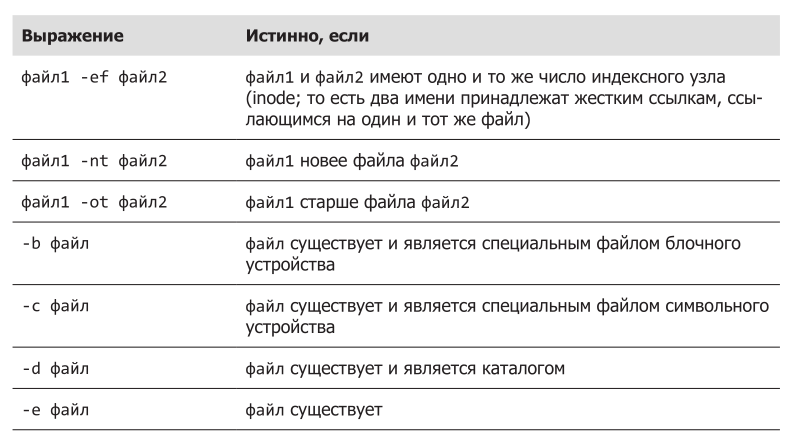

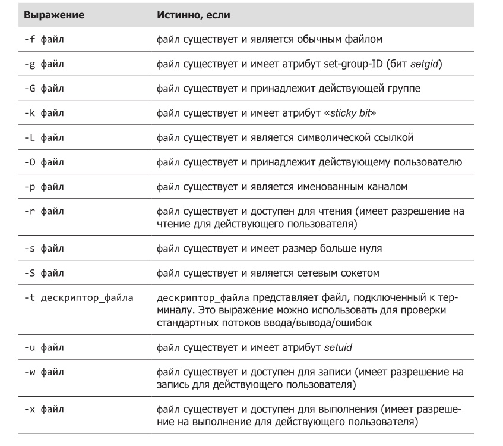

Следующий сценарий демонстрирует применение некоторых выражений с файлами:

```
#!/bin/bash
# test-file: проверка файла

FILE=~/.bashrc

if [ -e "$FILE" ]; then
    if [ -f "$FILE" ]; then
        echo "$FILE is a regular file."
    fi
    
    if [ -d "$FILE" ]; then
        echo "$FILE is a directory."
    fi
    
    if [ -r "$FILE" ]; then
        echo "$FILE is readable."
    fi
    
    if [ -w "$FILE" ]; then
        echo "$FILE is writable."
    fi
    
    if [ -x "$FILE" ]; then
        echo "$FILE is executable/searchable."
    fi
else
    echo "$FILE does not exist"
    exit 1
fi

exit

```

Сценарий проверяет файл, имя которого присвоено константе FILE, и выводит
результат. Этот сценарий имеет две интересные особенности, на которые следует
обратить внимание. Во-первых, отметьте, что параметр $FILE внутри выражений
заключен в кавычки. Это не является обязательным требованием, но защищает от
случаев, когда параметр пуст. Если механизм подстановки заменит $FILE пустым
значением, это приведет к ошибке (операторы в этом случае будут интерпретироваться как непустые строки, а не как операторы). Использование кавычек гарантирует, что за оператором всегда будет следовать строка, даже если она пустая.
Во-вторых, обратите внимание на команду exit (в конце сценария). Команда exit
принимает единственный необязательный аргумент, определяющий код возврата
сценария. В отсутствие аргумента exit вернет значение по умолчанию 0. Такое
использование exit позволит сценарию сообщить об ошибке, если в $FILE содержится имя несуществующего файла. Команда exit в самом конце сценария добавлена исключительно для формальности. Когда командная оболочка достигает
конца сценария (то есть конца файла), она в любом случае завершает выполнение
сценария с кодом завершения 0.

Функции командной оболочки тоже могут возвращать свой код завершения, передавая целочисленный аргумент команде return. Чтобы преобразовать сценарий,
приведенный выше, в функцию для использования в больших программах, нужно
заменить команды exit инструкциями return:

```
test_file () {
    # test-file: проверка файла
    FILE=~/.bashrc
    
    if [ -e "$FILE" ]; then
        if [ -f "$FILE" ]; then
            echo "$FILE is a regular file."
        fi
        
        if [ -d "$FILE" ]; then
            echo "$FILE is a directory."
        fi
        
        if [ -r "$FILE" ]; then
            echo "$FILE is readable."
        fi
        
        if [ -w "$FILE" ]; then
            echo "$FILE is writable."
        fi
        
        if [ -x "$FILE" ]; then
            echo "$FILE is executable/searchable."
        fi
    else
        echo "$FILE does not exist"
        return 1
    fi
}
```


### Выражения для проверки строк

В таблице ниже перечислены выражения, используемые для проверки строк.

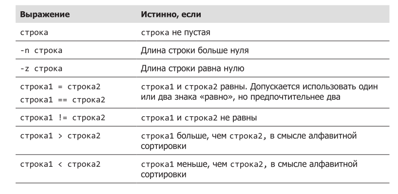

### ВНИМАНИЕ
При использовании с командой test операторы > и < необходимо заключать в кавычки (или экранировать символом «обратный слеш»). Если этого не сделать,
они будут интерпретироваться командной оболочкой как операторы перенаправления, что может привести к плачевным результатам. Обратите также внимание:
в документации к командной оболочке bash утверждается, что порядок сортировки соответствует порядку алфавитной сортировки, определяемому текущими
региональными настройками, но в действительности это не так. В версиях bash,
вплоть до 4.0, используется порядок сортировки ASCII (POSIX). Эта проблема
была исправлена в версии 4.1.

Следующий сценарий демонстрирует применение выражений для проверки строк:

```
#!/bin/bash
# test-string: проверка значения строки

ANSWER=maybe

if [ -z "$ANSWER" ]; then
    echo "There is no answer." >&2
    exit 1
fi

if [ "$ANSWER" == "yes" ]; then
    echo "The answer is YES."
elif [ "$ANSWER" == "no" ]; then
    echo "The answer is NO."
elif [ "$ANSWER" == "maybe" ]; then
    echo "The answer is MAYBE."
else
    echo "The answer is UNKNOWN."
fi
```
В этом сценарии определяется константа ANSWER. Сначала сценарий проверяет, не
является ли строка пустой. Если строка пустая, сценарий завершается с кодом 1.
Обратите внимание на оператор перенаправления в команде echo. Он перенаправ-
ляет сообщение об ошибке «There is no answer» («Нет ответа») в стандартный вывод ошибок как «наиболее подходящий» для сообщений об ошибках. Если строка
не пустая, сценарий сравнивает ее значение со строками «yes», «no» или «maybe».
Проверки выполняются с использованием инструкции elif, которая является краткой формой записи для else if. Инструкция elif позволяет конструировать
более сложные логические проверки.

### Выражения для проверки целых чисел
В таблице ниже перечислены выражения, используемые для проверки целых чисел.

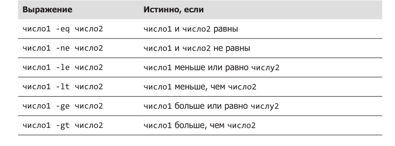

Следующий сценарий демонстрирует их применение:

```
#!/bin/bash
# test-integer: проверка целочисленного значения.

INT=-5

if [ -z "$INT" ]; then
    echo "INT is empty." >&2
    exit 1
fi

if [ $INT -eq 0 ]; then
    echo "INT is zero."
else
    if [ $INT -lt 0 ]; then
        echo "INT is negative."
    else
        echo "INT is positive."
    fi
    
    if [ $((INT % 2)) -eq 0 ]; then
        echo "INT is even."
    else
        echo "INT is odd."
    fi
fi

```

### Более современная версия команды test

Последние версии bash реализуют составную команду, которая действует как
улучшенная замена для команды test. Она имеет следующий синтаксис:

```
[[ выражение ]]
```

где выражение возвращает истинное (true) или ложное (false) значение. Команда
[[ ]] очень похожа на команду test (она поддерживает те же выражения), но до-
бавляет новое выражение для проверки строк:

```
строка1 =~ регулярное_выражение
```

возвращающее истинное значение, если строка1 соответствует расширенному регулярному выражению. Это открывает широкие перспективы для решения таких
задач, как проверка корректности данных. Предыдущий сценарий, демонстрирующий применение выражений проверки целых чисел, может завершиться с ошиб-
кой, если константе INT присвоить любое значение, не являющееся целым числом.
Для надежности сценарию необходима возможность убедиться, что константа
действительно содержит целое число. Используя [[ ]] с оператором проверки
строки =~, мы усовершенствуем его, как показано ниже:

```
#!/bin/bash
# test-integer2: проверка целочисленного значения.

INT=-5

if [[ "$INT" =~ ^-?[0-9]+$ ]]; then
    if [ $INT -eq 0 ]; then
        echo "INT is zero."
    else
        if [ $INT -lt 0 ]; then
            echo "INT is negative."
        else
            echo "INT is positive."
        fi
        
        if [ $((INT % 2)) -eq 0 ]; then
            echo "INT is even."
        else
            echo "INT is odd."
        fi
    fi
else
    echo "INT is not an integer." >&2
    exit 1
fi
```

Применив регулярное выражение, мы смогли ограничить круг проверяемых зна-
чений в константе INT только строками, начинающимися с необязательного зна-
ка «минус», за которым следует одна или несколько цифр. Это выражение также
устраняет вероятность появления пустых значений.
Еще одна дополнительная особенность [[ ]]: оператор == поддерживает сопостав-
ление с шаблоном по аналогии с механизмом подстановки путей. Например:

```
[me@linuxbox ~]$ FILE=foo.bar
[me@linuxbox ~]$ if [[ $FILE == foo.* ]]; then
> echo "$FILE matches pattern 'foo.*'"
> fi
foo.bar matches pattern 'foo.*'

```
Она превращает [[ ]] в удобный инструмент проверки имен файлов и путей.

### (( )) — для проверки целых чисел

В дополнение к составной команде [[ ]] bash поддерживает также составную
коман­ду (( )), которую удобно использовать для работы с целыми числами. Она
поддерживает полное множество арифметических операторов, о которых подробно рассказывается далее.
Команда (( )) применяется для проверки истинности арифметических выраже-
ний. Арифметическое выражение считается истинным, если его результат отли-
чается от нуля.

```
[me@linuxbox ~]$ if ((1)); then echo "It is true."; fi
It is true.
[me@linuxbox ~]$ if ((0)); then echo "It is true."; fi
[me@linuxbox ~]$
```

Применив (( )), можно немного упростить сценарий test-integer2, как показано
ниже:

```
#!/bin/bash
# test-integer2a: проверка целочисленного значения.

INT=-5

if [[ "$INT" =~ ^-?[0-9]+$ ]]; then
    if ((INT == 0)); then
        echo "INT is zero."
    else
        if ((INT < 0)); then
            echo "INT is negative."
        else
            echo "INT is positive."
        fi
        
        if (( (INT % 2) == 0 )); then
            echo "INT is even."
        else
            echo "INT is odd."
        fi
    fi
else
    echo "INT is not an integer." >&2
    exit 1
fi
```

Обратите внимание, что здесь мы использовали знак «меньше», а равенство про-
веряется с помощью оператора ==. Такой синтаксис выглядит более естественным
при работе с целыми числами. Отметьте также, что составная команда (( )) явля-
ется частью синтаксиса командной оболочки, а не обычной командой, может при-
меняться только к целым числам, распознает переменные по именам и не требует
выполнять подстановку. Подробнее команду (( )) и связанную с ней подстановку
значения арифметического выражения мы обсудим далее.

### Объединение выражений

Для более сложных вычислений существует возможность объединения выражений. Объединяются выражения с помощью логических операторов. Мы уже
встречались с ними в главе 17, когда изучали команду find. Всего команды test
и [[ ]] поддерживают три логические операции. Это И (AND), ИЛИ (OR) и НЕ
(NOT). Для представления этих операций test и [[ ]] используют разные операторы, как показано в таблице ниже. 

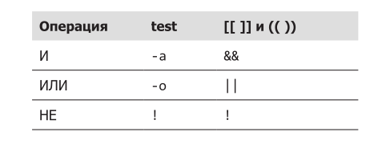

Ниже приводится пример использования операции И (AND). Следующий сцена-
рий определяет вхождение целочисленного значения в определенный диапазон:

```
#!/bin/bash
# test-integer3: проверка вхождения целочисленного значения
# в определенный диапазон.

MIN_VAL=1
MAX_VAL=100
INT=50

if [[ "$INT" =~ ^-?[0-9]+$ ]]; then
    if [[ "$INT" -ge "$MIN_VAL" && "$INT" -le "$MAX_VAL" ]]; then
        echo "$INT is within $MIN_VAL to $MAX_VAL."
    else
        echo "$INT is out of range."
    fi
else
    echo "$INT is not an integer." >&2
    exit 1
fi
```

Этот сценарий определяет, попадает ли целочисленное значение INT в диапазон
между MIN_VAL и MAX_VAL. Эта операция выполняется единственной командой
[[ ]], включающей два выражения, разделенных оператором &&. Ту же проверку
можно выполнить с помощью test:

```
if [ "$INT" -ge "$MIN_VAL" -a "$INT" -le "$MAX_VAL" ]; then
    echo "$INT is within $MIN_VAL to $MAX_VAL."
else
    echo "$INT is out of range."
fi

```

Оператор отрицания ! обращает результат выражения. Он возвращает истинное
значение, если выражение ложно, и ложное значение, если выражение истинно.
В следующем сценарии мы изменили логику вычислений, чтобы определить, находится ли значение INT за пределами указанного диапазона:

```
#!/bin/bash
# test-integer4: проверка выхода целочисленного значения
# за границы определенного диапазона.

MIN_VAL=1
MAX_VAL=100
INT=50

if [[ "$INT" =~ ^-?[0-9]+$ ]]; then
    if [[ ! ("$INT" -ge "$MIN_VAL" && "$INT" -le "$MAX_VAL") ]]; then
        echo "$INT is outside $MIN_VAL to $MAX_VAL."
    else
        echo "$INT is in range."
    fi
else
    echo "$INT is not an integer." >&2
    exit 1
fi
```
Здесь выражение заключено в круглые скобки для группировки. Если этого не
сделать, оператор отрицания будет применяться к результату первого выражения,
а не к объединению двух выражений. Ту же проверку можно реализовать с помощью test:

```
if [ ! \( "$INT" -ge "$MIN_VAL" -a "$INT" -le "$MAX_VAL" \) ]; then
    echo "$INT is outside $MIN_VAL to $MAX_VAL."
else
    echo "$INT is in range."
fi
```

Поскольку все выражения и операторы в команде test интерпретируются ко-
мандной оболочкой как аргументы (в отличие от [[ ]] и (( ))), символы, имею-
щие специальное значение для bash, такие как <, >, ( и ), необходимо заключать
в кавычки или экранировать.
Учитывая, что команды test и [[ ]] до определенной степени равноценны, возникает вопрос: какой из них отдать предпочтение? Команда test является традиционной (и частью стандарта POSIX), тогда как команда [[ ]] характерна для bash.
Уметь пользоваться командой test крайне важно, потому что она применяется очень широко, но команда [[ ]] проще и удобнее, поэтому она часто используется
в современных сценариях.

### Операторы управления: еще один способ ветвления

bash поддерживает два оператора управления, которые используются для ветвления. Операторы && (И) и || (ИЛИ) действуют подобно логическим операторам
в составной команде [[ ]]. Они имеют следующий синтаксис:

```
команда1 && команда2
и
команда1 || команда2
```

Важно понимать, как они действуют. В последовательности с оператором && пер-
вая команда выполняется всегда, а вторая — только если первая завершилась успе-
хом. В последовательности с оператором || первая команда выполняется всегда,
а вторая — только если первая завершилась неудачей.
В практическом смысле это означает, что можно выполнить следующую последо-
вательность команд:

```
[me@linuxbox ~]$ mkdir temp && cd temp

```
Она создаст каталог с именем temp и, если эта операция завершится успехом, ката-
лог temp будет назначен текущим рабочим каталогом. Попытка выполнить вторую
команду будет произведена, только если команда mkdir завершится успехом. Ана-
логично, следующая команда

```
[me@linuxbox ~]$ [ -d temp ] || mkdir temp
```

проверит существование каталога temp, и только если проверка не увенчается
успехом, будет выполнена команда его создания. Такие конструкции очень удобно
использовать для обработки ошибок в сценариях, о чем подробнее рассказывается
в следующих главах. Например, в сценарии можно предусмотреть такую последо-
вательность:

```
[ -d temp ] || exit 1
```
Если сценарий требует наличия каталога temp, а он не существует, тогда сценарий
завершится с кодом 1.

### Заключение

Мы начали эту главу с вопроса, оставшегося без ответа в предыдущей главе: как
сценарию sys_info_page определить, имеет ли текущий пользователь права на
чтение всех домашних каталогов? После знакомства с инструкцией if эту проблему можно решить, добавив следующий код в функцию report_home_space:

```
report_home_space () {
    if [[ $(id -u) -eq 0 ]]; then
        cat <<- _EOF_
<h2>Home Space Utilization (All Users)</h2>
<pre>$(du -sh /home/*)</pre>
_EOF_
    else
        cat <<- _EOF_
<h2>Home Space Utilization ($USER)</h2>
<pre>$(du -sh $HOME)</pre>
_EOF_
    fi
    return
}

```

<<- _EOF_ — here-document с удалением табов

Здесь проверяется вывод команды id. Если вызвать команду id с параметром -u,
она выведет числовой идентификатор действующего пользователя. Суперпользователю всегда присваивается числовой идентификатор 0. Зная это, мы сконструировали два разных вложенных документа: один пользуется преимуществом привилегий суперпользователя, а другой ограничивается домашним каталогом
текущего пользователя.
Теперь мы немного отдохнем от программы sys_info_page, но не волнуйтесь. Мы
еще вернемся к ней. А пока затронем те темы, знание которых потребуется, когда
мы возобновим разработку.

## Глава 28. Чтение ввода с клавиатуры

В сценариях, написанных нами до сих пор, отсутствует одно свойство, характер-
ное для многих компьютерных программ, — интерактивность, то есть возможность взаимодействия с пользователем.

### read — чтение значений со стандартного ввода

Встроенная команда read используется для чтения единственной строки со стандартного ввода. Эту команду можно использовать для чтения ввода с клавиатуры
или, в случае перенаправления, строки данных из файла. Команда имеет следующий синтаксис:

read [-параметры] [переменная...]

где параметры — это один или несколько параметров из перечисленных в таблице
далее, а переменная — имя одной или нескольких переменных для сохранения введенного значения. Если имя переменной не указано, строка с данными сохраняется в переменной REPLY.

В простейшем случае read сохраняет значения полей, прочитанные со стандартного ввода, в указанные переменные. Ниже показано, как можно изменить наш
сценарий проверки целочисленных значений, задействовав в нем команду read:

```
#!/bin/bash
# read-integer: проверка целочисленного значения.
echo -n "Please enter an integer -> "
read int
if [[ "$int" =~ ^-?[0-9]+$ ]]; then
    if [ "$int" -eq 0 ]; then
        echo "$int is zero."
    else
        if [ "$int" -lt 0 ]; then
            echo "$int is negative."
        else
            echo "$int is positive."
        fi
        if [ $((int % 2)) -eq 0 ]; then
            echo "$int is even."
        else
            echo "$int is odd."
        fi
    fi
else
    echo "Input value is not an integer." >&2
    exit 1
fi

```

Сначала мы использовали команду echo с параметром -n (подавляющим вывод символа перевода строки в конце) для вывода приглашения к вводу, а затем коман­ду read для ввода значения в переменную int. Запуск этого сценария приводит к следующим результатам:

```

[me@linuxbox ~]$ read-integer
Please enter an integer -> 5
5 is positive.
5 is odd.
```

Команда read может сохранять ввод в множестве переменных, это показано в сле-
дующем сценарии:

```
#!/bin/bash
# read-multiple: чтение нескольких значений с клавиатуры
echo -n "Enter one or more values > "

read var1 var2 var3 var4 var5
echo "var1 = '$var1'"
echo "var2 = '$var2'"
echo "var3 = '$var3'"
echo "var4 = '$var4'"
echo "var5 = '$var5'"
```

Этот сценарий вводит, присваивает переменным и выводит до пяти значений.
Обратите внимание, как действует команда read, когда получает разное число
значений:

```
[me@linuxbox ~]$ read-multiple
Enter one or more values > a b c d e
var1 = 'a'
var2 = 'b'
var3 = 'c'
var4 = 'd'
var5 = 'e'
[me@linuxbox ~]$ read-multiple
Enter one or more values > a
var1 = 'a'
var2 = ''
var3 = ''
var4 = ''
var5 = ''
[me@linuxbox ~]$ read-multiple
Enter one or more values > a b c d e f g
var1 = 'a'
var2 = 'b'
var3 = 'c'
var4 = 'd'
var5 = 'e f g'

```

Если read получит меньше значений, чем ожидается, переменные, для которых не
хватило значений, останутся пустыми, а при избыточном количестве значений на
входе последняя переменная получит весь остаток введенной строки.
Если не передать переменные команде read, весь ввод будет сохранен в перемен-
ной командной оболочки REPLY:

```
#!/bin/bash
# read-single: чтение множества значений в переменную по умолчанию
echo -n "Enter one or more values > "

read
echo "REPLY = '$REPLY'"
```

Запуск этого сценария приводит к следующим результатам:

```
[me@linuxbox ~]$ read-single
Enter one or more values > a b c d
REPLY = 'a b c d'
```

### Параметры

read поддерживает следующие параметры:

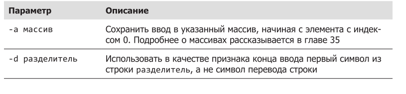

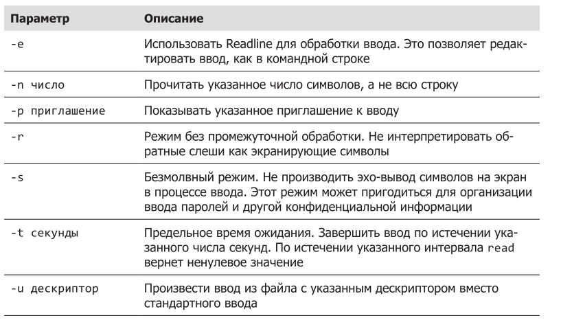

Множество поддерживаемых параметров открывает доступ к довольно интерес-
ным способам использования read. Например, параметр -p позволяет определить
строку приглашения к вводу:

```
#!/bin/bash

# read-single: чтение множества значений в переменную по умолчанию

read -p "Enter one or more values > "

echo "REPLY = '$REPLY'"

```
Параметры -t и -s позволяют писать сценарии, реализующие ввод «секретных»
данных и прерывающие ввод по истечении заданного времени:

```
#!/bin/bash
# read-secret: ввод секретного пароля

if read -t 10 -sp "Enter secret passphrase > " secret_pass; then
    echo -e "\nSecret passphrase = '$secret_pass'"
else
    echo -e "\nInput timed out" >&2
    exit 1
fi
```

Сценарий предлагает пользователю ввести секретный пароль и ждет 10 секунд.
Если в течение этого времени ввод не был завершен, сценарий завершается с ко-
дом ошибки. Поскольку в команду включен параметр -s, символы пароля не вы-
водятся на экран в процессе ввода.
С помощью параметров -e и -i можно предложить пользователю значение по
умолчанию для ввода.

```
#!/bin/bash

# read-default: предложение значения по умолчанию, для ввода
#       которого достаточно нажать клавишу Enter.

read -e -p "What is your user name? " -i $USER
echo "You answered: '$REPLY'"

```

Этот сценарий просит ввести имя учетной записи и использует переменную окружения USER, чтобы предложить значение по умолчанию. После запуска сценарий
выведет строку со значением по умолчанию, и если пользователь просто нажмет
ENTER, команда read присвоит это значение переменной REPLY.

[me@linuxbox ~]$ read-default
What is your user name? me
You answered: 'me'

### Выделение полей в строке ввода с помощью IFS

Обычно командная оболочка разбивает введенную строку на слова перед передачей команде read. Как мы уже знаем, в результате этого слова в строке, разделенные одним или несколькими пробелами, превращаются в отдельные значения и присваиваются командой read разным переменным. Такое поведение командной оболочки регулируется переменной с именем IFS (от Internal Field Separator — внутренний разделитель полей). По умолчанию переменная IFS хранит символы пробела, табуляции и перевода строки, каждый из которых может служить разделителем полей.
Изменяя значение переменной IFS, можно управлять делением ввода на поля перед передачей команде read. Например, файл /etc/passwd хранит строки данных,
в которых поля отделяются друг от друга двоеточием. Присвоив переменной IFS
значение, состоящее из единственного двоеточия, можно с помощью read прочитать содержимое /etc/passwd и благополучно разделить строки на поля для присваивания разным переменным. Ниже приводится сценарий, который именно так и действует:


```
#!/bin/bash
# read-ifs: чтение полей из файла

FILE=/etc/passwd

read -p "Enter a username > " user_name
file_info=$(grep "^$user_name:" $FILE)

if [ -n "$file_info" ]; then
    IFS=":" read user pw uid gid name home shell <<< "$file_info"
    echo "User = '$user'"
    echo "UID = '$uid'"
    echo "GID = '$gid'"
    echo "Full Name = '$name'"
    echo "Home Dir. = '$home'"
    echo "Shell = '$shell'"
else
    echo "No such user '$user_name'" >&2
    exit 1
fi
```


Этот сценарий предлагает пользователю ввести имя учетной записи в системе
и затем выводит разные поля, найденные в соответствующей записи в файле /etc/
passwd. В сценарии есть две интересные строки. Первая:

file_info=$(grep "^$user_name:" $FILE)

присваивает результат команды grep переменной file_info. Регулярное выражение гарантирует извлечение из файла /etc/passwd единственной строки, соответствующей введенному имени пользователя.
Вторая интересная строка:

IFS=":" read user pw uid gid name home shell <<< "$file_info"

состоит из трех частей: присваивания значения переменной, команды read со списком имен переменных в виде аргументов и незнакомого нам, нового оператора
перенаправления. Рассмотрим сначала присваивание значения переменной.
Командная оболочка позволяет выполнить одну или несколько операций присваивания значений переменным непосредственно перед командой, в той же строке. Они изменяют окружение, в котором выполняется команда. Действие этих операций присваивания носит временный характер, окружение изменяется только на время выполнения команды. В данном случае в переменной IFS сохраняется двоеточие. То же самое можно выразить иначе:

```
OLD_IFS="$IFS"
IFS=":"
read user pw uid gid name home shell <<< "$file_info"
IFS="$OLD_IFS"
```

Здесь мы сохранили прежнее значение IFS, присвоили новое значение, выполнили команду read и восстановили прежнее значение IFS. Очевидно, что размещение операции присваивания перед командой позволяет получить более компактный код, действующий точно так же.

Оператор <<< отмечает встроенную строку. Встроенная строка (here string) подобна встроенному документу, только короче, она простирается лишь до конца
текущей строки кода. В данном примере строка с данными из файла /etc/passwd
подается на стандартный ввод команды read. У кого-то может возникнуть вопрос,
почему был выбран такой, несколько необычный, способ вместо

echo "$file_info" | IFS=":" read user pw uid gid name home shell

Скажем так: на то есть свои причины…

### READ НЕЛЬЗЯ ИСПОЛЬЗОВАТЬ В КОНВЕЙЕРЕ

Даже притом, что команда read способна принимать данные со стандартного
ввода, она не позволяет использовать ее следующим образом:

echo "foo" | read

Можно было бы ожидать, что этот прием сработает, но это не так. Внешне все
будет выглядеть так, как будто команда успешно отработала, но при этом переменная REPLY всегда будет оставаться пустой. Почему?

Объясняется это особенностью обработки конвейеров командной оболочкой. В bash
(и в других командных оболочках, таких как sh) конвейеры создают подоболочки
(subshells). Они являются копиями родительской оболочки и ее окружения и используются для выполнения команд в конвейерах. В предыдущем примере команда
read выполняется в подоболочке.

Для подоболочек в Unix-подобных системах создаются копии родительского окружения, которые они и используют в работе. Когда конвейер завершается, копия
окружения уничтожается. Это означает, что подоболочка никогда не сможет
изменить окружение родительского процесса. Как мы знаем, read присваивает
значения переменным, которые становятся частью окружения. В примере выше
read присвоит значение foo переменной REPLY в окружении подоболочки, но когда
конвейер завершится, подоболочка и ее окружение будут уничтожены, а результат
присваивания будет утрачен. Использование встроенных строк — один из способов обойти эту проблему.


### Проверка ввода

Использование новой для нас возможности приема ввода с клавиатуры влечет за
собой дополнительную проблему: необходимость проверки введенных данных.
Очень часто хорошо написанная программа отличается от плохо написанной
готовностью к неожиданностям. Зачастую неожиданности возникают в форме
ввода ошибочных данных. Мы уже сделали кое-что, чтобы противостоять неожиданностям в программах проверки целочисленных значений из предыдущей главы, где предусмотрено отсеивание пустых значений и значений с нецифровыми
символами. Такого рода программные проверки должны выполняться для любых
вводимых данных, чтобы обезопасить программу от недопустимых значений. Это
особенно актуально для программ, используемых множеством пользователей. Отказ от защитных мер ради экономии простителен, только если программа пишется
для однократного использования автором с целью решения некоей специальной
задачи. Но даже в этом случае, если программа выполняет потенциально опасные
операции, такие как удаление файлов, на всякий случай включите в нее проверку
данных.

Далее приводится пример программы, проверяющий входные данные разного
вида:

```
#!/bin/bash
# read-validate: проверка ввода

invalid_input () {
    echo "Invalid input '$REPLY'" >&2
    exit 1
}

read -p "Enter a single item > "

# пустой ввод (недопустимо)
[[ -z "$REPLY" ]] && invalid_input

# ввод множества элементов (недопустимо)
(( "$(echo "$REPLY" | wc -w)" > 1 )) && invalid_input

# введено допустимое имя файла?
if [[ "$REPLY" =~ ^[-[:alnum:]\._]+$ ]]; then
    echo "'$REPLY' is a valid filename."
    
    if [[ -e "$REPLY" ]]; then
        echo "And file '$REPLY' exists."
    else
        echo "However, file '$REPLY' does not exist."
    fi
    
    # введено вещественное число?
    if [[ "$REPLY" =~ ^-?[[:digit:]]*\.[[:digit:]]+$ ]]; then
        echo "'$REPLY' is a floating point number."
    else
        echo "'$REPLY' is not a floating point number."
    fi
    
    # введено целое число?
    if [[ "$REPLY" =~ ^-?[[:digit:]]+$ ]]; then
        echo "'$REPLY' is an integer."
    else
        echo "'$REPLY' is not an integer."
    fi
else
    echo "The string '$REPLY' is not a valid filename."
fi
```

Этот сценарий предлагает пользователю ввести элемент данных и затем последо-
вательно анализирует его содержимое. Как видите, в сценарии использовано мно-
жество идей, с которыми мы уже познакомились, включая функции, [[ ]], (( )),
операторы управления && и if, а также разумную дозу регулярных выражений.

### Меню

Часто для организации интерактивной работы используются меню. Программы,
управляемые системой меню, выводят список возможных вариантов и предлага-
ют пользователю выбрать один из них. Например, представьте программу, которая
выводит следующее:
Выберите команду:

1. Вывести информацию о системе
2. Вывести информацию о дисковом пространстве
3. Вывести информацию об объеме домашнего каталога
0. Выйти
Введите номер выбранной команды [0-3] >

Используя все, что мы узнали в ходе создания программы sys_info_page, мож-
но сконструировать программу, реализующую решение задач, перечисленных
в меню, приведенном выше:

```
#!/bin/bash
# read-menu: программа вывода системной информации,
# управляемая с помощью меню

clear
echo "
Please Select:
1. Display System Information
2. Display Disk Space
3. Display Home Space Utilization
0. Quit
"

read -p "Enter selection [0-3] > "

if [[ "$REPLY" =~ ^[0-3]$ ]]; then
    if [[ "$REPLY" == 0 ]]; then
        echo "Program terminated."
        exit
    fi
    
    if [[ "$REPLY" == 1 ]]; then
        echo "Hostname: $HOSTNAME"
        uptime
        exit
    fi
    
    if [[ "$REPLY" == 2 ]]; then
        df -h
        exit
    fi
    
    if [[ "$REPLY" == 3 ]]; then
        if [[ "$(id -u)" -eq 0 ]]; then
            echo "Home Space Utilization (All Users)"
            du -sh /home/*
        else
            echo "Home Space Utilization ($USER)"
            du -sh "$HOME"
        fi
        exit
    fi
else
    echo "Invalid entry." >&2
    exit 1
fi
```

Этот сценарий делится на две логические части. Первая часть выводит меню
и вводит выбор пользователя. Вторая часть идентифицирует выбор и выполняет
соответствующие действия. Обратите внимание, как используется команда exit
в этом сценарии. Она препятствует выполнению ненужного кода после завершения затребованного действия. Наличие нескольких точек выхода из программы
вообще считается дурным тоном (логику работы такой программы труднее понять), но в данном сценарии нас это устраивает.

### Заключение

В этой главе мы сделали первый шаг к интерактивности, позволив пользователю
вводить данные в наши программы с клавиатуры. Используя описанные приемы,
можно написать множество полезных программ, например, программы, выполняющие специализированные вычисления или упрощающие доступ к таинственным инструментам командной строки. В следующей главе мы усовершенствуем идею программ, управляемых при помощи меню, чтобы добиться большего.

## Глава 29. Управление потоком выполнения: циклы while и until

### while

Представьте, что нам нужно вывести пять чисел по порядку, от 1 до 5. В сценарии на языке bash это можно реализовать, как показано ниже:


```
#!/bin/bash
# while-count: вывод последовательности чисел

count=1
while [[ $count -le 5 ]]; do
    echo $count
    count=$((count + 1))
done

echo "Finished."
```


Если запустить этот сценарий, он выведет:

```
[me@linuxbox ~]$ while-count
1
2
3
4
5
Finished.
```

Команда while имеет следующий синтаксис:
while команды; do команды; done

Подобно if, команда while проверяет код завершения списка команд. Пока код завершения равен 0, она выполняет команды внутри цикла. В сценарии, приведенном выше, создается переменная count, и ей присваивается начальное значение 1.
Команда while проверяет код завершения составной команды [[ ]]. Пока [[ ]]
возвращает код 0, команды внутри цикла продолжают выполняться. В конце каж-
дого цикла повторно выполняется команда [[ ]]. После пяти итераций цикла значение переменной count увеличится до 6, команда [[ ]] вернет код завершения, отличный от 0, и цикл завершится, а программа продолжит выполнение с инструкции, следующей непосредственно за циклом.

Цикл while можно использовать для усовершенствования программы read-menu
из предыдущей главы:

```
#!/bin/bash
# while-menu: программа вывода системной информации,
# управляемая с помощью меню

DELAY=3 # Время отображения результатов на экране (в секундах)

while [[ "$REPLY" != 0 ]]; do
    clear

    cat <<- _EOF_
Please Select:
1. Display System Information
2. Display Disk Space
3. Display Home Space Utilization
0. Quit
_EOF_

    read -p "Enter selection [0-3] > "

    if [[ "$REPLY" =~ ^[0-3]$ ]]; then
        if [[ "$REPLY" == 1 ]]; then
            echo "Hostname: $HOSTNAME"
            uptime
            sleep "$DELAY"
        fi

        if [[ "$REPLY" == 2 ]]; then
            df -h
            sleep "$DELAY"
        fi

        if [[ "$REPLY" == 3 ]]; then
            if [[ "$(id -u)" -eq 0 ]]; then
                echo "Home Space Utilization (All Users)"
                du -sh /home/*
            else
                echo "Home Space Utilization ($USER)"
                du -sh "$HOME"
            fi
            sleep "$DELAY"
        fi
    else
        echo "Invalid entry."
        sleep "$DELAY"
    fi
done

echo "Program terminated."
```

Заключив меню в цикл while, мы смогли заставить программу повторять вывод
меню после каждой операции выбора. Цикл продолжает выполняться и выводить
меню, пока переменная REPLY не получит значение 0, предоставляя пользователю
возможность сделать другой выбор. После выполнения выбранной операции выполняется команда sleep, она приостанавливает программу на несколько секунд и дает возможность увидеть результаты до того, как экран будет очищен и на нем
вновь появится меню. Когда переменная REPLY получит значение 0, соответствующее варианту «Quit» (выйти), цикл завершится и выполнение продолжится со
строки, следующей за done.

### Прерывание цикла

В bash имеются две встроенные команды для управления потоком выполнения
внутри циклов. Команда break немедленно завершает цикл, после чего выполнение программы продолжается с первой инструкции, следующей за циклом.
Команда пропускает оставшуюся часть цикла, и программа переходит к началу
следующей итерации цикла. Ниже приводится версия программы while-menu, использующая обе команды — break и continue:

```
#!/bin/bash
# while-menu2: программа вывода системной информации,
# управляемая с помощью меню

DELAY=3 # Время отображения результатов на экране (в секундах)

while true; do
    clear

    cat <<- _EOF_
Please Select:
1. Display System Information
2. Display Disk Space
3. Display Home Space Utilization
0. Quit
_EOF_

    read -p "Enter selection [0-3] > "

    if [[ "$REPLY" =~ ^[0-3]$ ]]; then
        if [[ "$REPLY" == 1 ]]; then
            echo "Hostname: $HOSTNAME"
            uptime
            sleep "$DELAY"
            continue
        fi

        if [[ "$REPLY" == 2 ]]; then
            df -h
            sleep "$DELAY"
            continue
        fi

        if [[ "$REPLY" == 3 ]]; then
            if [[ "$(id -u)" -eq 0 ]]; then
                echo "Home Space Utilization (All Users)"
                du -sh /home/*
            else
                echo "Home Space Utilization ($USER)"
                du -sh "$HOME"
            fi
            sleep "$DELAY"
            continue
        fi

        if [[ "$REPLY" == 0 ]]; then
            break
        fi
    else
        echo "Invalid entry."
        sleep $DELAY
    fi
done

echo "Program terminated."

```


В этой версии сценария используется бесконечный цикл, в котором команда while проверяет код завершения команды true. Так как true всегда возвращает код 0, цикл никогда не завершится. Поскольку цикл никогда не завершится сам по себе, программист должен предусмотреть его принудительное прерывание в нужный момент времени. В этом сценарии выход из цикла осуществляется с помощью команды break, когда пользователь выберет пункт 0. 
В конец других операций добавлена команда continue, чтобы увеличить
эффективность работы сценария. Встретив команду continue, сценарий перепрыгнет через остальной код в цикле, который не требуется выполнять для данного выбора. Например, если пользователь выбрал пункт 1, нет никаких причин проверять выбор остальных вариантов.

### until

Команда until очень похожа на while, но завершает цикл не когда обнаружит ненулевой код завершения, а наоборот. Цикл until продолжается, пока не получит
код завершения 0. В сценарии while-count цикл продолжает выполняться, пока
значение переменной count меньше или равно 5. Тот же результат можно получить, переписав сценарий с командой until:

```
#!/bin/bash
# until-count: вывод последовательности чисел

count=1
until [[ "$count" -gt 5 ]]; do
    echo "$count"
    count=$((count + 1))
done

echo "Finished."
```

С условным выражением $count -gt 5 команда until завершит цикл в нужный
момент времени. Выбор между циклами while и until обычно зависит от того,
в каком случае условное выражение будет более читабельным.

### Чтение файлов в циклах

Команды while и until могут принимать данные со стандартного ввода. Это дает
возможность обрабатывать файлы с их помощью. В следующем примере мы выведем содержимое файла distros.txt, созданного в одной из предыдущих глав:

```
#!/bin/bash
# while-read: чтение строк из файла

while read distro version release; do
    printf "Distro: %s\tVersion: %s\tReleased: %s\n" \
        "$distro" \
        "$version" \
        "$release"
done < distros.txt
```

Чтобы перенаправить файл в цикл, мы поместили оператор перенаправления после инструкции done. Цикл будет вводить поля из указанного файла с помощью
read. После ввода каждой строки команда read будет завершаться с кодом 0, пока не достигнет конца файла. В этот момент она вернет ненулевой код завершения,
и цикл завершится. Цикл можно также использовать в конвейерах:


```
#!/bin/bash
# while-read2: чтение строк из файла

sort -k 1,1 -k 2n distros.txt | while read distro version release; do
    printf "Distro: %s\tVersion: %s\tReleased: %s\n" \
        "$distro" \
        "$version" \
        "$release"
done
```

Здесь вывод команды sort передается на стандартный ввод цикла, который выводит поток текста на экран. Но не забывайте, что конвейер выполняет цикл в под­
оболочке, поэтому после его завершения любые переменные, созданные в цикле,
будут потеряны.

## Заключение

После знакомства с циклами и ранее представленными командами ветвления,
функциями и последовательностями мы получили представление об основных
способах управления потоком выполнения в программах. В арсенале bash имеется еще множество хитрых трюков, но все они основаны на этих простых идеях.

## Глава 30. Поиск и устранение ошибок

Поскольку наши сценарии становятся все сложнее и сложнее, настало время посмотреть, что случается, когда что-то идет не так и сценарии перестают делать то,
что нам нужно. В этой главе мы познакомимся с некоторыми распространенными
ошибками, встречающимися в сценариях, и приемами поиска и устранения неисправностей.

### Синтаксические ошибки

Один из самых распространенных видов ошибок — синтаксические ошибки. Синтаксические ошибки возникают при неправильном вводе некоторого элемента
с нарушением синтаксиса командной оболочки. Чаще всего эти ошибки вызывают
отказ командной оболочки от выполнения сценария.
Для демонстрации распространенных видов ошибок в дальнейших обсуждениях
мы будем использовать следующий сценарий:

```
#!/bin/bash
# trouble: сценарий для демонстрации распространенных видов ошибок

number=1
if [ $number = 1 ]; then
    echo "Number is equal to 1."
else
    echo "Number is not equal to 1."
fi
```

В текущем своем виде сценарий выполняется без ошибок:

```
[me@linuxbox ~]$ trouble
Number is equal to 1.
```


### Отсутствующие кавычки

Давайте изменим сценарий, удалив кавычку в конце аргумента первой команды
echo:

```

echo "Number is equal to 1.
```

При запуске сценария будут выводиться внятные ошибки, но глазами такие ошибки в длинных сценариях порой найти очень сложно. Хорошую помощь в этом случае может оказать текстовый редактор с подсветкой синтаксиса.

Если в системе установлена полная версия редактора vim, подсветка синтаксиса
в нем включается командой:
:syntax on


### Непредвиденная подстановка

Существуют ошибки, которые возникают лишь время от времени. Иногда сценарий работает без ошибок, а иногда терпит неудачу из-за работы механизма подстановки. Для демонстрации этой проблемы изменим значение переменной number, присвоив ей пустое значение:

```
#!/bin/bash
# trouble: сценарий для демонстрации распространенных видов ошибок

number=
if [ $number = 1 ]; then
    echo "Number is equal to 1."
else
    echo "Number is not equal to 1."
fi
```

При попытке выполнить сценарий после внесения изменений мы получим:

```
[me@linuxbox ~]$ trouble
./trouble: строка 7: [: =: ожидается использование унарного оператора
Number is not equal to 1.

```
Мы получили довольно загадочное сообщение, за которым следует вывод второй
команды echo. Проблема заключается в подстановке переменной number в коман-
ду test. После обработки команды

```
[ $number = 1 ]
```
механизмом подстановки, который заменит number пустым значением:

```
[ = 1 ]
```

То есть, вот тут [ $number = 1 ]; сравнивается пусто и 1. 


В результате получится недопустимый результат, и командная оболочка сгенерирует сообщение об ошибке. Оператор = является бинарным (он требует наличия двух операндов, по одному с каждой стороны), но первое значение отсутствует, поэтому команда test ожидает встретить унарный оператор (такой, как -z). Далее, поскольку
test вернула ненулевой код завершения (из-за ошибки), команда if получит ненулевой код завершения, примет соответствующее решение и выполнит вторую команду echo.

Эту проблему можно исправить, заключив в кавычки первый аргумент команды
test:
```
[ "$number" = 1 ]
```

Теперь подстановка приведет к следующему результату:

```
[ "" = 1 ]
```

с правильным числом аргументов. Кавычки следует использовать не только для
предохранения от пустых строк, но и в том случае, если переменная содержит
строку с несколькими словами, например имя файла со встроенными пробелами.

Возьмите за правило всегда заключать в кавычки переменные и операции подстановки, когда не требуется разбивать значение на слова.

### Логические ошибки

Логические ошибки, в отличие от синтаксических, не прерывают выполнение сценария. Сценарий работает, но желаемых результатов вы не дождетесь, и причина
этому — проблемы с логикой. Существует бесчисленное множество возможных
логических ошибок, ниже перечислены наиболее типичные их виды, встречающиеся в сценариях: 

* Неправильное условное выражение. Очень легко неправильно запрограммировать оператор if/then/else и получить ошибочную логику работы. Иногда логика получается полностью обратной желаемой или не охватывает весь возможный набор ситуаций. 
* Ошибки «смещения на единицу». При программировании циклов со счетчиками можно упустить из виду, что цикл должен начинать считать с 0, а не с 1, чтобы счет закончился в нужной точке. Ошибки этого вида приводят к тому, что цикл выполняет на одну итерацию больше или меньше, заканчиваясь соответственно слишком поздно или слишком рано. 
* Непредвиденные ситуации. Большинство логических ошибок приводят
к тому, что программа сталкивается с данными или с ситуацией, не предусмотренными программистом. К ним относятся непредвиденная подстановка, как, например, в случае с именами файлов, содержащими пробелы, которые преобразуются в несколько аргументов команды вместо одного.


### Защитное программирование

При программировании важно не опираться на допущения, то есть тщательно
проверять коды завершения программ и команд, используемых сценарием. Вот пример из реальной жизни. Системный горе-администратор написал сценарий,
выполняющий некую административную задачу на очень важном сервере. Этот
сценарий содержал следующие две строки кода:

```
cd $dir_name
rm *
```

В самих строках нет никакой ошибки, при условии, что каталог, указанный в переменной dir_name, действительно существует. Но что случится, если это не так?
Тогда команда cd потерпит неудачу, сценарий перейдет к следующей строке и удалит файлы в текущем рабочем каталоге. Результат, как вы понимаете, далек от
ожидаемого! Несчастный администратор уничтожил массу важных файлов на
сервере из-за этой логической ошибки.

Рассмотрим несколько способов усовершенствования описанной логики. Прежде
всего можно заставить сценарий развернуть содержимое переменной dir_name
в одно слово, заключая ее в кавычки, и поставить вызов команды rm в зависимость
от успеха cd:

```
cd "$dir_name" && rm *
```

В этом случае, если команда cd потерпит неудачу, команда rm не будет выполнена.
Так намного лучше, но еще остается вероятность отсутствия переменной dir_name
или хранения в ней пустого значения, что, безусловно, приведет к удалению файлов в домашнем каталоге пользователя. Этого можно избежать, убедившись, что
dir_name действительно содержит имя существующего каталога:

```
[[ -d "$dir_name" ]] && cd "$dir_name" && rm *
```

В подобных ситуациях, описанных выше, лучше прервать выполнение сценария
с выводом сообщения об ошибке:

```
# Удаление файлов в каталоге $dir_name
if [[ ! -d "$dir_name" ]]; then
    echo "No such directory: '$dir_name'" >&2
    exit 1
fi

if ! cd "$dir_name"; then
    echo "Cannot cd to '$dir_name'" >&2
    exit 1
fi

if ! rm *; then
    echo "File deletion failed. Check results" >&2
    exit 1
fi

```

Здесь проверяются существование каталога с указанным именем и успешное завершение команды cd. Если какая-то из проверок завершается неудачей, в стандартный вывод ошибок отправляется содержательное описание и сценарий завершается с кодом 1, чтобы показать, что он завершился с ошибкой.

#### ПЕРЕНОСИМЫЕ ИМЕНА ФАЙЛОВ

Чтобы гарантировать переносимость имен файлов между разными платформами (например, разными типами компьютеров и операционными системами), ограничьте набор символов, которые можно использовать в именах файлов.
Существует стандарт POSIX Portable Filename Character Set (POSIX-совместимый
набор символов для переносимых имен файлов), который можно использовать,
чтобы увеличить вероятность совместимости имени файла с разными систе-
мами. Стандарт очень прост. Он допускает использовать в именах файлов
только заглавные A–Z и строчные a–z, буквы, цифры 0–9, точку (.), дефис (-)
и подчеркивание (_). Также стандарт определяет, что имена файлов не могут
начинаться с дефиса.

## Будьте внимательны к именам файлов

У этого сценария есть еще одна проблема, неочевидная, но очень опасная. Unix
по общему признанию имеет существенный недостаток, касающийся имен файлов, — чрезмерно либеральное отношение к ним. Фактически имена файлов не могут включать только два символа: слеш (/), поскольку он используется для разделения элементов путей в файловой системе, и «пустой» символ (с нулевым кодом), который внутренне используется для обозначения концов строк. Все остальные символы считаются допустимыми, включая пробелы, табуляции, переводы строк, ведущие дефисы, возвраты каретки и т. д.
Особую сложность вызывают ведущие дефисы. Например, ничто не помешает
создать файл с именем -rf ~. А теперь представьте, что случится, если передать
имя этого файла команде rm. Чтобы защититься от этой проблемы, нужно заменить команду удаления файлов в сценарии:

rm *
следующей командой:
rm ./*

Это предотвратит интерпретацию имен файлов, начинающихся с дефиса, как параметров команды. Возьмите за правило всегда предварять групповые символы
(такие, как * и ?) комбинацией ./, чтобы предотвратить неверную интерпретацию
команд. Примером таких подстановок с групповыми символами могут служить
*.pdf или ???.mp3.

### Проверка ввода

Главное правило надежного программирования: если программа принимает ввод,
она должна уметь обработать все, что ей передали. Обычно это означает тщательную отбраковку ввода с целью гарантировать, что дальнейшей обработке будут
подвергнуты только допустимые данные. Пример такой проверки мы видели
в предыдущей главе, когда обсуждали команду read. Там один из сценариев содержал следующую проверку выбранного пункта меню:

```
[[ "$REPLY" =~ ^[0-3]$ ]]
```

Это очень специализированная проверка. Она возвращает код завершения 0, только если строка, введенная пользователем, содержит число в диапазоне от 0 до 3.
Никакой другой ввод не принимается. Иногда писать такие проверки очень утомительно, но они совершенно необходимы, если вы хотите в результате получить
надежно работающий сценарий.

### Тестирование

Вернемся к рассматривавшейся выше задаче удаления файлов и посмотрим, как
можно было бы легко протестировать ее решение. Тестировать оригинальный фрагмент довольно опасно, потому что его задача — удаление файлов, но его можно изменить, чтобы сделать тестирование безопасным:

```
if [[ -d $dir_name ]]; then
    if cd $dir_name; then
        echo rm * # ТЕСТИРОВАНИЕ
    else
        echo "cannot cd to '$dir_name'" >&2
        exit 1
    fi
else
    echo "no such directory: '$dir_name'" >&2
    exit 1
fi

exit # ТЕСТИРОВАНИЕ

```

Так как проверка ошибочных условий уже выводит содержательные сообщения,
нам не требуется добавлять ничего нового. Самое важное изменение заключается
в добавлении команды echo перед командой rm, которая выведет ее и список ее
аргументов, но не разрешит ей выполниться. Это изменение позволит безопасно
выполнить код. В конец фрагмента мы добавили команду exit, чтобы завершить
тест и предотвратить выполнение любых других частей сценария. Необходимость
этого шага зависит от предназначения сценария.
Мы также включили несколько комментариев, которые служат «маркерами» изменений, имеющих отношение к тестированию. С их помощью легко можно найти
и удалить эти изменения по завершении тестирования.


### Поиск проблемной области
В некоторых сценариях, особенно длинных, иногда полезным оказывается использование приема изолирования области сценария, связанной с проблемой. Проблема не всегда является ошибкой, но изоляция часто помогает понять суть происходящего. Один из приемов изоляции заключается в том, чтобы закомментировать фрагмент сценария. Например, попробуем изменить наш фрагмент, удаляющий
содержимое каталога, чтобы определить, имеет ли он отношение к ошибке:

```
if [[ -d $dir_name ]]; then
    if cd $dir_name; then
        rm *
    else
        echo "cannot cd to '$dir_name'" >&2
        exit 1
    fi
    # else
    # echo "no such directory: '$dir_name'" >&2
    # exit 1
fi
```

Поместив символы комментария в начало каждой строки внутри логического раз-
дела сценария, мы предотвратили возможность выполнения этого раздела. Последующее повторное тестирование покажет, связан ли исключенный код с ошибочным поведением.

### Трассировка
Ошибки часто становятся причиной неожиданного направления выполнения сценария. То есть фрагменты сценария могут никогда не выполняться или выполняться в неправильном порядке или в неправильные моменты. Чтобы увидеть, как в действительности протекает выполнение программы, воспользуемся приемом трассировки.
Один из способов трассировки заключается в размещении информативных сообщений в разных точках сценария, сообщающих, где протекает выполнение. Например, добавим в наш фрагмент следующие сообщения:

```
echo "preparing to delete files" >&2

if [[ -d $dir_name ]]; then
    if cd $dir_name; then
        echo "deleting files" >&2
        rm *
    else
        echo "cannot cd to '$dir_name'" >&2
        exit 1
    fi
else
    echo "no such directory: '$dir_name'" >&2
    exit 1
fi

echo "file deletion complete" >&2
```

Здесь сообщения посылаются в стандартный вывод ошибок, чтобы отделить их от
обычного вывода. Кроме того, отсутствуют отступы перед строками с сообщениями — это упростит их поиск, когда придет время убрать эти строки.

Теперь, запустив сценарий, убедимся, что удаление файлов действительно было
выполнено:

```
[me@linuxbox ~]$ deletion-script
preparing to delete files
deleting files
file deletion complete
[me@linuxbox ~]$

```

Кроме того, bash поддерживает встроенный метод трассировки, реализованный
в виде параметра -x и команды set с параметром -x. Возьмем для примера сценарий trouble, написанный ранее, и активируем встроенный механизм трассировки
для всего сценария, добавив параметр -x в первую строку:

```
#!/bin/bash -x
# trouble: сценарий для демонстрации распространенных видов ошибок

number=1
if [ $number = 1 ]; then
    echo "Number is equal to 1."
else
    echo "Number is not equal to 1."
fi
```

После запуска мы получим следующие результаты:

```
[me@linuxbox ~]$ trouble
+ number=1
+ '[' 1 = 1 ']'
+ echo 'Number is equal to 1.'
Number is equal to 1.
```
Включенный механизм трассировки позволяет увидеть, какой вид приобретают команды после применения подстановки. Начальные знаки «плюс» помогают отличить трассировочную информацию от обычного вывода. Знак «плюс» — это символ по умолчанию, используемый для вывода трассировки.

Он хранится в переменной командной оболочки PS4 (prompt string 4 — строка
приглашения 4). Изменим значение этой переменной, чтобы сделать трассировочный вывод более полезным. Ниже мы изменили эту переменную, включив
в трассировочный вывод текущий номер выполняемой строки в сценарии. Обратите внимание на необходимость использования одиночных кавычек — это предотвращает подстановку до момента, когда строка приглашения не будет использоваться фактически:

```
[me@linuxbox ~]$ export PS4='$LINENO + '
[me@linuxbox ~]$ trouble
5 + number=1
7 + '[' 1 = 1 ']'
8 + echo 'Number is equal to 1.'
Number is equal to 1.
```

Выполнить трассировку только выбранного фрагмента сценария можно с помо-
щью команды set с параметром -x:


```
#!/bin/bash -x
# trouble: сценарий для демонстрации распространенных видов ошибок

number=1
set -x # Включить трассировку

if [ $number = 1 ]; then
    echo "Number is equal to 1."
else
    echo "Number is not equal to 1."
fi
set +x # Выключить трассировку
```

Здесь мы использовали команду set с параметром -x, чтобы включить трассировку, и с параметром +x, чтобы выключить ее. Этот прием используется для исследования сразу нескольких проблемных фрагментов в сценарии.


### Исследование значений в процессе выполнения
Часто вместе с трассировкой полезно выводить содержимое переменных, чтобы
иметь более полное представление о действиях сценария. Обычно для этого используются дополнительные инструкции echo:

```
#!/bin/bash
# trouble: сценарий для демонстрации распространенных видов ошибок

number=1
echo "number=$number" # ОТЛАДКА

set -x # Включить трассировку
if [ $number = 1 ]; then
    echo "Number is equal to 1."
else
    echo "Number is not equal to 1."
fi
set +x # Выключить трассировку
```

В этом тривиальном примере мы просто вывели значение переменной number и отметили дополнительную строку комментарием, чтобы в будущем упростить ее поиск и удаление. Подобный прием особенно полезен при исследовании поведения
циклов и арифметических операций в сценариях.

### Заключение

В этой главе мы рассмотрели несколько проблем, с которыми можно столкнуться
в процессе разработки сценариев. Конечно, таких проблем несоизмеримо больше.
Приемы, описанные здесь, помогут вам в поиске наиболее распространенных видов ошибок. Отладка — это искусство предотвращения ошибок (за счет постоянного тестирования в ходе разработки) и их поиска (путем эффективного использования приемов трассировки).

## Глава 31. Управление потоком выполнения: ветвление с помощью case

В этой главе мы продолжим знакомство с инструментами управления потоком
выполнения. В главе 28 мы сконструировали простое меню и реализовали логику обработки выбора его пунктов пользователем. Для этого использовалась серия
команд if, выясняющих, какой из возможных вариантов выбран. Такие конструкции часто можно увидеть в программах, причем так часто, что в некоторых языках
программирования (включая командную оболочку) был реализован механизм
управления потоком выполнения для случаев с множеством альтернативных вариантов.

### Команда case

Командная оболочка bash поддерживает составную команду выбора из нескольких вариантов, которая называется case. Она имеет следующий синтаксис:

```
case слово in
[шаблон [| шаблон]...) команды ;;]...
esac
```

Взгляните еще раз, как программа read-menu из главы 28 обрабатывает выбор
пользователя:

```
#!/bin/bash
# read-menu: программа вывода системной информации,
# управляемая с помощью меню

clear
echo "
Please Select:
1. Display System Information
2. Display Disk Space
3. Display Home Space Utilization
0. Quit
"

read -p "Enter selection [0-3] > "

if [[ "$REPLY" =~ ^[0-3]$ ]]; then
    if [[ "$REPLY" == 0 ]]; then
        echo "Program terminated."
        exit
    fi
    
    if [[ "$REPLY" == 1 ]]; then
        echo "Hostname: $HOSTNAME"
        uptime
        exit
    fi
    
    if [[ "$REPLY" == 2 ]]; then
        df -h
        exit
    fi
    
    if [[ "$REPLY" == 3 ]]; then
        if [[ "$(id -u)" -eq 0 ]]; then
            echo "Home Space Utilization (All Users)"
            du -sh /home/*
        else
            echo "Home Space Utilization ($USER)"
            du -sh "$HOME"
        fi
        exit
    fi
else
    echo "Invalid entry." >&2
    exit 1
fi

```


С помощью case можно сделать логику выбора немного проще:

```
#!/bin/bash
# case-menu: программа вывода системной информации,
# управляемая с помощью меню

clear
echo "
Please Select:
1. Display System Information
2. Display Disk Space
3. Display Home Space Utilization
0. Quit
"

read -p "Enter selection [0-3] > "

case "$REPLY" in
    0)
        echo "Program terminated."
        exit
        ;;
    1)
        echo "Hostname: $HOSTNAME"
        uptime
        ;;
    2)
        df -h
        ;;
    3)
        if [[ "$(id -u)" -eq 0 ]]; then
            echo "Home Space Utilization (All Users)"
            du -sh /home/*
        else
            echo "Home Space Utilization ($USER)"
            du -sh "$HOME"
        fi
        ;;
    *)
        echo "Invalid entry" >&2
        exit 1
        ;;
esac

```

Команда case берет значение слова — в данном примере значение переменной
REPLY — и затем сопоставляет его с указанными шаблонами. Найдя соответствие,
она выполняет команды, связанные с найденным шаблоном. После нахождения
соответствия сопоставление с нижележащими шаблонами уже не производится.


### Шаблоны
Шаблоны обрабатываются командой case точно так же, как пути механизмом подстановки. Шаблоны завершаются символом ). В таблице ниже перечислены некоторые допустимые шаблоны.

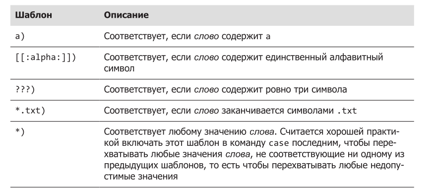

Следующий пример демонстрирует работу шаблонов:

```
#!/bin/bash

read -p "enter word > "

case "$REPLY" in
    [[:alpha:]])
        echo "is a single alphabetic character."
        ;;
    [ABC][0-9])
        echo "is A, B, or C followed by a digit."
        ;;
    ???)
        echo "is three characters long."
        ;;
    *.txt)
        echo "is a word ending in '.txt'"
        ;;
    *)
        echo "is something else."
        ;;
esac
```
Мы можем объединить несколько шаблонов, перечислив их через символ вертикальной черты. В результате получается комбинированный условный шаблон,
объединенный по «ИЛИ». Эта возможность может пригодиться, например, для
обработки символов верхнего и нижнего регистров:

```
#!/bin/bash
# case-menu: программа вывода системной информации,
# управляемая с помощью меню

clear
echo "
Please Select:
A. Display System Information
B. Display Disk Space
C. Display Home Space Utilization
Q. Quit
"

read -p "Enter selection [A, B, C or Q] > "

case "$REPLY" in
    q|Q)
        echo "Program terminated."
        exit
        ;;
    a|A)
        echo "Hostname: $HOSTNAME"
        uptime
        ;;
    b|B)
        df -h
        ;;
    c|C)
        if [[ "$(id -u)" -eq 0 ]]; then
            echo "Home Space Utilization (All Users)"
            du -sh /home/*
        else
            echo "Home Space Utilization ($USER)"
            du -sh "$HOME"
        fi
        ;;
    *)
        echo "Invalid entry" >&2
        exit 1
        ;;
esac

```
Здесь мы изменили программу case-menu, предложив пользователю выбирать
пункты меню вводом букв, а не цифр. Обратите внимание, что новые шаблоны
позволяют вводить буквы обоих регистров — верхнего и нижнего.

### Выполнение нескольких вариантов

В версиях bash до 4.0 команда case могла выполнить только один вариант, соответствующий совпавшему шаблону. После этого команда завершалась. Рассмотрим сценарий, проверяющий введенный символ:

```
#!/bin/bash

# case4-1: проверка символа
read -n 1 -p "Type a character > "
echo

case "$REPLY" in
    [[:upper:]])
        echo "'$REPLY' is upper case."
        ;;
    [[:lower:]])
        echo "'$REPLY' is lower case."
        ;;
    [[:alpha:]])
        echo "'$REPLY' is alphabetic."
        ;;
    [[:digit:]])
        echo "'$REPLY' is a digit."
        ;;
    [[:graph:]])
        echo "'$REPLY' is a visible character."
        ;;
    [[:punct:]])
        echo "'$REPLY' is a punctuation symbol."
        ;;
    [[:space:]])
        echo "'$REPLY' is a whitespace character."
        ;;
    [[:xdigit:]])
        echo "'$REPLY' is a hexadecimal digit."
        ;;
esac

```
Вот как выглядит результат выполнения этого сценария:

```
[me@linuxbox ~]$ case4-1
Type a character > a
'a' is lower case.
```

В большинстве случаев сценарий прекрасно справляется со своей задачей, но терпит неудачу, если символ соответствует нескольким символьным классам POSIX.
Например, символ a соответствует классам алфавитных символов и символов
нижнего регистра, а также шестнадцатеричных цифр. В bash до версии 4.0 не было
никакой возможности заставить case выполнить больше одной успешной проверки. Современные версии bash поддерживают дополнительную нотацию ;;& в конце каждого варианта, которая используется, как показано ниже:

```
#!/bin/bash

# case4-2: проверка символа

read -n 1 -p "Type a character > "
echo
case "$REPLY" in
[[:upper:]])
echo "'$REPLY' is upper case." ;;&
[[:lower:]])
echo "'$REPLY' is lower case." ;;&
[[:alpha:]])
echo "'$REPLY' is alphabetic." ;;&
[[:digit:]])
echo "'$REPLY' is a digit." ;;&
[[:graph:]])
echo "'$REPLY' is a visible character." ;;&
[[:punct:]])
echo "'$REPLY' is a punctuation symbol." ;;&
[[:space:]])
echo "'$REPLY' is a whitespace character." ;;&
[[:xdigit:]]) echo "'$REPLY' is a hexadecimal digit." ;;&
esac
```

Запустив этот сценарий, мы получим:

```
[me@linuxbox ~]$ case4-2
Type a character > a
'a' is lower case.
'a' is alphabetic.
'a' is a visible character.
'a' is a hexadecimal digit.
```

Дополнительный синтаксис ;;& позволяет команде case продолжить проверку
вместо простого завершения после первого найденного совпадения.

### Заключение
Команда case является удобным дополнением к нашей коллекции приемов программирования. Как будет показано в следующей главе, она отлично подходит
для решения некоторых видов задач.

## Глава 32. Позиционные параметры

Во всех предыдущих наших программах отсутствовала одна особенность — возможность принимать и обрабатывать параметры и аргументы командной строки. В этой главе мы исследуем эту возможность и позволим нашим программам обращаться к содержимому командной строки.

## Доступ к командной строке

Командная оболочка поддерживает множество переменных, которые называются
позиционными параметрами и содержат отдельные слова из командной строки.
Эти переменные имеют имена от 0 до 9. Продемонстрируем их:

```
#!/bin/bash
# posit-param: сценарий для просмотра параметров командной строки
echo "
\$0 = $0
\$1 = $1
\$2 = $2
\$3 = $3
\$4 = $4
\$5 = $5
\$6 = $6
\$7 = $7
\$8 = $8
\$9 = $9
"
```

Этот очень простой сценарий выводит значения переменных с именами от $0 до
$9. Запустим его без аргументов командной строки:

```
[me@linuxbox ~]$ posit-param
$0 = /home/me/bin/posit-param
$1 =
$2 =
$3 =
$4 =
$5 =
$6 =
$7 =
$8 =
$9 =
```

Даже в отсутствие аргументов переменная $0 всегда содержит первый элемент
командной строки — путь к файлу выполняемой программы. Давайте передадим
сценарию несколько аргументов:

```
[me@linuxbox ~]$ posit-param a b c d
$0 = /home/me/bin/posit-param
$1 = a
$2 = b
$3 = c
$4 = d
$5 =
$6 =
$7 =
$8 =
$9 =
```

## ПРИМЕЧАНИЕ

В действительности, если использовать механизм подстановки параметров,
можно получить доступ более чем к девяти параметрам. Чтобы указать число
больше девяти, следует заключить его в фигурные скобки; например, ${10},
${55}, ${211} и т.д.

## Определение числа аргументов
Командная оболочка поддерживает также переменную $#, хранящую число аргументов командной строки:

```
#!/bin/bash
# posit-param: сценарий для просмотра параметров командной строки
echo "
Number of arguments: $#
\$0 = $0
\$1 = $1
\$2 = $2
\$3 = $3
\$4 = $4
\$5 = $5
\$6 = $6
\$7 = $7
\$8 = $8
\$9 = $9
"
```

Результат:

```
[me@linuxbox ~]$ posit-param a b c d
Number of arguments: 4
$0 = /home/me/bin/posit-param
$1 = a
$2 = b
$3 = c
$4 = d
$5 =
$6 =
$7 =
$8 =
$9 =
```

## shift — доступ к множеству аргументов

Но как быть, если программе передается большое число аргументов, как в следующем примере:

```
[me@linuxbox ~]$ posit-param *
Number of arguments: 82

$0 = /home/me/bin/posit-param
$1 = addresses.ldif
$2 = bin
$3 = bookmarks.html
$4 = debian-500-i386-netinst.iso
$5 = debian-500-i386-netinst.jigdo
$6 = debian-500-i386-netinst.template
$7 = debian-cd_info.tar.gz
$8 = Desktop
$9 = dirlist-bin.txt
```

В системе, где выполнялся этот пример, механизм подстановки развернул символ * в 82 аргумента. Как обработать такое количество? Командная оболочка
предусматривает решение и для подобных случаев, правда, следует отметить, что
изяществом оно не отличается. Команда shift выполняет «сдвиг» параметров
к началу списка. Фактически, используя shift, можно обойтись единственной
переменной-параметром (помимо $0, которая никогда не изменяется).

```
#!/bin/bash

# posit-param2: сценарий вывода всех аргументов
count=1

while [[ $# -gt 0 ]]; do
    echo "Argument $count = $1"
    count=$((count + 1))
    shift
done
```

Каждый раз, когда выполняется команда shift, значение $2 перемещается в $1,
значение $3 перемещается в $2 и т. д. Значение $# при этом уменьшается на 1.
В программе posit-param2 мы создали цикл, проверяющий число оставшихся ар-
гументов и продолжающийся до тех пор, пока оно не уменьшится до нуля. Цикл
выводит текущий аргумент, в каждой итерации увеличивает счетчик обработанных аргументов count и, наконец, выполняет shift, чтобы загрузить в $1 следующий аргумент. Вот как работает эта программа:

```
[me@linuxbox ~]$ posit-param2 a b c d
Argument 1 = a
Argument 2 = b
Argument 3 = c
Argument 4 = d
```

## Простые приложения

Даже без команды shift можно писать полезные приложения, использующие позиционные параметры. Например, ниже приводится простая программа получения информации о файле:

```
#!/bin/bash

# file_info: простая программа получения информации о файле

PROGNAME="$(basename "$0")"

if [[ -e "$1" ]]; then
    echo -e "\nFile Type:"
    file "$1"
    echo -e "\nFile Status:"
    stat "$1"
    else
    echo "$PROGNAME: usage: $PROGNAME file" >&2
exit 1
fi
```

Эта программа выводит тип указанного файла (определяется с помощью команды
file) и его атрибуты (командой stat). Интересной особенностью программы является переменная PROGNAME. Ей присваивается результат выполнения команды basename
"$0". Команда basename удаляет начальную часть из пути к файлу, оставляя только
базовое имя. В данном примере basename удалит начальную часть из параметра $0,
хранящего полный путь к данной программе. Такой результат удобно использовать
для конструирования сообщений, например, о правилах использования программы.
При подобном подходе можно переименовать сценарий, и при выводе сообщений
новое имя программы будет использоваться автоматически.

## Использование позиционных параметров в функциях

Позиционные параметры используются для передачи аргументов не только в сценарии, но и в функции командной оболочки. Для демонстрации преобразуем сценарий file_info в функцию:

```
file_info () {

# file_info: функция для вывода информации о файле

if [[ -e "$1" ]]; then
    echo -e "\nFile Type:"
    file "$1"
    echo -e "\nFile Status:"
    stat "$1"
else
    echo "$FUNCNAME: usage: $FUNCNAME file" >&2
return 1
fi
}
```

Теперь, если сценарий, включающий функцию file_info, вызовет ее с именем файла в аргументе, аргумент будет передан в функцию.
Благодаря этому мы получаем возможность написать множество полезных функций для использования не только в наших сценариях, но и в файле .bashrc.
Обратите внимание, что в этом примере вместо переменной PROGNAME используется переменная командной оболочки FUNCNAME. Оболочка автоматически присваивает значение этой переменной в момент вызова функции. Отметьте также, что $0
всегда содержит полный путь к первому элементу командной строки (то есть имя
программы), а не имя функции, как можно было бы ожидать.

### Обработка позиционных параметров скопом

Иногда бывает необходимо выполнить операцию сразу со всеми позиционными
параметрами. Например, может понадобиться написать «обертку» для некоторой
программы, то есть сценарий или функцию, упрощающие запуск этой программы.
Обертка принимает список непонятных для нее параметров командной строки
и просто передает его обертываемой программе.
Для этой цели командная оболочка предоставляет два специальных параметра.
Они оба замещаются полным списком позиционных параметров, но имеют некоторые тонкие отличия. Описание этих параметров приводится в таблице ниже.

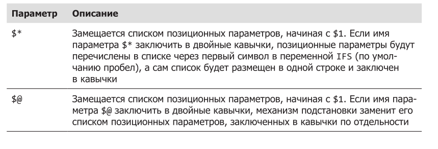

Следующий сценарий демонстрирует, как действуют эти специальные параметры:

```
#!/bin/bash
# posit-params3 : сценарий для демонстрации $* и $@

print_params () {
    echo "\$1 = $1"
    echo "\$2 = $2"
    echo "\$3 = $3"
    echo "\$4 = $4"
}
pass_params () {
    echo -e "\n" '$* :';
    print_params $*
    echo -e "\n" '"$*" :'; print_params "$*"
    echo -e "\n" '$@ :';
    print_params $@
    echo -e "\n" '"$@" :'; print_params "$@"
}
pass_params "word" "words with spaces"
```

В этой довольно замысловатой программе мы создали два аргумента, word и words
with spaces, и передали их функции pass_params. Эта функция, в свою очередь,
передает их функции print_params, с применением каждого из четырех методов,
доступных для специальных параметров $* и $@. Вывод сценария показывает разницу между ними:

```
[me@linuxbox ~]$ posit-param3
$* :
$1 = word
$2 = words
$3 = with
$4 = spaces

"$*" :
$1 = word words with spaces
$2 =
$3 =
$4 =

$@ :
$1 = word
$2 = words
$3 = with
$4 = spaces

"$@" :
$1 = word
$2 = words with spaces
$3 =
$4 =
```

В данном примере оба параметра, $* и $@, возвращают результат из четырех слов:

word words with spaces

"$*" возвращает результат в виде одного слова, содержащего пробелы:

"word words with spaces"

"$@" возвращает результат в виде двух слов, второе из которых включает пробелы:

"word" "words with spaces"

Это соответствует нашим фактическим намерениям. Этот пример показывает, что, несмотря на наличие четырех разных способов получения списка позиционных параметров, в большинстве ситуаций предпочтительнее использовать прием с "$@", потому что он сохраняет целостность каждого позиционного параметра.

### Более сложное приложение

После долгой паузы мы продолжим работу над программой sys_info_page. Теперь
мы добавим в нее поддержку нескольких параметров командной строки:

* Выходной файл. Мы добавим параметр, который позволит указать имя файла
для вывода результатов работы программы. Сделать это можно будет с помощью -f файл или --file файл.
* Интерактивный режим. При передаче этого параметра программа будет предлагать пользователю ввести имя выходного файла и определять, существует ли
этот файл. Если файл существует, пользователю будет предложено подтвердить свое решение, прежде чем затереть существующий файл. Этот параметр
можно будет передать как -i или --interactive.
* Справка. Передав параметр -h или --help, можно потребовать от программы
вывести сообщение с информацией о правилах пользования программой.

Далее приводится код, реализующий обработку командной строки:

```
usage () {
    echo "$PROGNAME: usage: $PROGNAME [-f file | -i]"
    return
}

# обработка параметров командной строки
interactive=
filename=

while [[ -n "$1" ]]; do
    case "$1" in
        -f | --file)
            shift
            filename="$1"
            ;;
        -i | --interactive)
            interactive=1
            ;;
        -h | --help)
            usage
            exit
            ;;
        *)
            usage >&2
            exit 1
            ;;
    esac
    shift
done

```

Сначала мы добавили функцию usage для вывода сообщения, если программа вызывается с параметром --help или с неизвестным параметром.
Затем следует цикл обработки параметров. Цикл продолжается, пока позиционный параметр $1 не получит пустое значение. В конце цикла вызывается команда
shift, чтобы сдвинуть позиционные параметры и, в конечном итоге, гарантировать завершение цикла.
Внутри цикла инструкция case проверяет текущий позиционный параметр на соответствие поддерживаемым вариантам. Если данный параметр поддерживается,
выполняется соответствующая операция, если нет — выводится сообщение с информацией о правилах пользования программой и сценарий завершается с признаком ошибки.
Обратите внимание, как обрабатывается параметр -f. Обнаружив этот параметр,
программа выполняет команду shift, которая сдвинет аргумент параметра -f
с именем файла в позиционный параметр $1.
Далее следует код, реализующий интерактивный режим:

```
# интерактивный режим
if [[ -n "$interactive" ]]; then
    while true; do
        read -p "Enter name of output file: " filename
        
        if [[ -e "$filename" ]]; then
            read -p "'$filename' exists. Overwrite? [y/n/q] > "
            case "$REPLY" in
                Y|y)
                    break
                    ;;
                Q|q)
                    echo "Program terminated."
                    exit
                    ;;
                *)
                    continue
                    ;;
            esac
        elif [[ -z "$filename" ]]; then
            continue
        else
            break
        fi
    done
fi

```

Если переменная interactive содержит непустое значение, начинается бесконечный цикл, который предлагает ввести имя файла и затем обрабатывает ситуацию,
если введенное имя соответствует существующему файлу. Если указанный файл
уже существует, пользователю на выбор предлагается три варианта: затереть существующий файл, выбрать другое имя или завершить программу. Если поль-
зователь предпочтет затереть существующий файл, выполняется команда break
и цикл прерывается. Обратите внимание, что инструкция case различает только
вариант перезаписи существующего файла и завершения программы. Любой другой ответ пользователя будет приводить к переходу в начало цикла с повторным
предложением ввести имя файла.
Для поддержки вывода в файл сначала необходимо имеющийся код вывода страницы преобразовать в функцию. Необходимость такого решения станет понятна
чуть позже:

```
write_html_page () {
    cat <<- _EOF_
<html>
    <head>
        <title>$TITLE</title>
    </head>
    <body>
        <h1>$TITLE</h1>
        <p>$TIME_STAMP</p>
        $(report_uptime)
        $(report_disk_space)
        $(report_home_space)
    </body>
</html>
_EOF_
    return
}

# вывод страницы html
if [[ -n "$filename" ]]; then
    if touch "$filename" && [[ -f "$filename" ]]; then
        write_html_page > "$filename"
    else
        echo "$PROGNAME: Cannot write file '$filename'" >&2
        exit 1
    fi
else
    write_html_page
fi

```

Код, обслуживающий логику параметра -f, находится в конце листинга, приведенного выше. Он проверяет, определено ли имя файла и затем — доступность
для записи файла с указанным именем. Для этого выполняется команда touch
с последующей проверкой, что файл является обычным файлом. Эти две проверки позволяют обработать ситуацию неправильно указанного пути (в этом случае
touch потерпит неудачу) и убедиться, что существующий файл является обычным
файлом.
Как видите, функция write_html_page вызывается, чтобы сгенерировать фактическое содержимое страницы, которое затем либо выводится в стандартный вывод (если переменная filename содержит пустое значение), либо перенаправляется
в указанный файл. Поскольку код HTML может выводиться в файл или в стандартный вывод, есть смысл преобразовать процедуру write_html_page в функцию,
чтобы избежать повторения кода.

### Заключение

С помощью дополнительных позиционных параметров мы можем теперь писать
довольно функциональные сценарии. Позиционные параметры помогают создавать очень полезные функции командной оболочки для выполнения повседневных задач, которые можно поместить в файл .bashrc.
Наша программа sys_info_page выросла и усложнилась. Ниже приводится полный листинг программы с выделенными последними изменениями:

```
#!/bin/bash
# sys_info_page: программа вывода страницы с информацией о системе

PROGNAME="$(basename $0)"
TITLE="System Information Report For $HOSTNAME"
CURRENT_TIME=$(date +"%x %r %Z")
TIME_STAMP="Generated $CURRENT_TIME, by $USER"

report_uptime () {
    cat <<- _EOF_
<h2>System Uptime</h2>
<pre>$(uptime)</pre>
_EOF_
    return
}

report_disk_space () {
    cat <<- _EOF_
<h2>Disk Space Utilization</h2>
<pre>$(df -h)</pre>
_EOF_
    return
}

report_home_space () {
    if [[ "$(id -u)" -eq 0 ]]; then
        cat <<- _EOF_
<h2>Home Space Utilization (All Users)</h2>
<pre>$(du -sh /home/*)</pre>
_EOF_
    else
        cat <<- _EOF_
<h2>Home Space Utilization ($USER)</h2>
<pre>$(du -sh "$HOME")</pre>
_EOF_
    fi
    return
}

usage () {
    echo "$PROGNAME: usage: $PROGNAME [-f file | -i]"
    return
}

write_html_page () {
    cat <<- _EOF_
<html>
    <head>
        <title>$TITLE</title>
    </head>
    <body>
        <h1>$TITLE</h1>
        <p>$TIME_STAMP</p>
        $(report_uptime)
        $(report_disk_space)
        $(report_home_space)
    </body>
</html>
_EOF_
    return
}

# обработка параметров командной строки
interactive=
filename=

while [[ -n "$1" ]]; do
    case "$1" in
        -f | --file)
            shift
            filename="$1"
            ;;
        -i | --interactive)
            interactive=1
            ;;
        -h | --help)
            usage
            exit
            ;;
        *)
            usage >&2
            exit 1
            ;;
    esac
    shift
done

# интерактивный режим
if [[ -n "$interactive" ]]; then
    while true; do
        read -p "Enter name of output file: " filename
        if [[ -e "$filename" ]]; then
            read -p "'$filename' exists. Overwrite? [y/n/q] > "
            case "$REPLY" in
                Y|y)
                    break
                    ;;
                Q|q)
                    echo "Program terminated."
                    exit
                    ;;
                *)
                    continue
                    ;;
            esac
        fi
    done
fi

# вывод страницы html
if [[ -n "$filename" ]]; then
    if touch "$filename" && [[ -f "$filename" ]]; then
        write_html_page > "$filename"
    else
        echo "$PROGNAME: Cannot write file '$filename'" >&2
        exit 1
    fi
else
    write_html_page
fi

```

У нас уже получился неплохой сценарий, но он еще не закончен. В следующей
главе мы добавим в него последнее улучшение.

## Глава 33. Управление потоком выполнения: цикл for

## for: традиционная форма

Оригинальный синтаксис команды for имеет следующий вид:

```
for переменная [in слова]; do
    команды
done
```

где переменная — это имя переменной, значение которой будет увеличиваться
в ходе выполнения цикла, слова — необязательный список элементов, которые
последовательно будут присваиваться переменной, и команды — это команды, выполняемые в каждой итерации.

Команду for удобно использовать в командной строке. Рассмотрим, как она работает:

```
[me@linuxbox ~]$ for i in A B C D; do echo $i; done
A
B
C
D
```

В этом примере команда for получает список из четырех слов: A, B, C и D. Для об-
хода этого списка выполняется четыре итерации цикла. В начале каждой итерации
переменной i присваивается очередное слово. Внутри цикла находится команда
echo, она выводит значение i, чтобы показать, что присваивание действительно
выполняется. Так же как в случае с циклами while и until, цикл for заканчивается
ключевым словом done.

По-настоящему мощной особенностью for является разнообразие способов формирования списка слов. Например, можно использовать подстановку в фигурных скобках:

```
[me@linuxbox ~]$ for i in {A..D}; do echo $i; done
A
B
C
D
```

или подстановку имен файлов:

```
[me@linuxbox ~]$ for i in distros*.txt; do echo "$i"; done
distros-by-date.txt
distros-dates.txt
distros-key-names.txt
distros-key-vernums.txt
distros-names.txt
distros.txt
distros-vernums.txt
distros-versions.txt
```

Механизм подстановки имен файлов позволяет получить четкий список с именами файлов, который можно обработать в цикле. Единственное, о чем следует
позаботиться, — убедиться, что механизм подстановки вернул действительные совпадения. По умолчанию, если операция подстановки не найдет ни одного файла,
соответствующего шаблону, она вернет сам шаблон (в данном случае distros*.
txt). Чтобы защититься от этой проблемы, предыдущий код можно преобразовать
в сценарий, как показано ниже:

```
for i in distros*.txt; do

    if [[ -e "$i" ]]; then
        echo "$i"
    fi
done
```

Добавив проверку существования файла, мы обезопасили себя от ситуации, когда
механизм подстановки не нашел ни одного файла. Другой распространенный метод получения списка слов — подстановка команд.

```
#!/bin/bash
# longest-word : поиск самой длинной строки в файле

while [[ -n "$1" ]]; do
    if [[ -r "$1" ]]; then
        max_word=
        max_len=0
        
        for i in $(strings "$1"); do
            len="$(echo "$i" | wc -c)"
            if (( len > max_len )); then
                max_len="$len"
                max_word="$i"
            fi
        done
        
        echo "$1: '$max_word' ($max_len characters)"
    fi
    shift
done

```

Этот пример осуществляет поиск самой длинной строки в файле. Когда в командной строке указано несколько имен файлов, сценарий вызывает процедуру
strings (входит в состав пакета GNU binutils), чтобы получить список «слов» из
каждого файла. Цикл for обрабатывает каждое слово по очереди и определяет,
является ли оно самым длинным из встречавшихся до сих пор. По завершении
цикла сценарий выводит самое длинное слово.
Обратите внимание, что здесь, вопреки обычной практике, мы не заключили подстановку команд $(strings "$1") в кавычки. Объясняется это просто: здесь мы
действительно хотим разбить строку на слова, чтобы получить список. Заключив
подстановку команд в кавычки, мы получили бы одно слово, содержащее все строки из файла. А это не совсем то, что нам нужно.
Если необязательный компонент слова в команде for отсутствует, она по умолчанию обрабатывает позиционные параметры. Чтобы показать использование этого
способа, изменим сценарий longest-word:

```
#!/bin/bash
# longest-word2 : поиск самой длинной строки в файле

for i; do
    if [[ -r "$i" ]]; then
        max_word=
        max_len=0
        
        for j in $(strings "$i"); do
            len="$(echo "$j" | wc -c)"
            if (( len > max_len )); then
                max_len="$len"
                max_word="$j"
            fi
        done
        
        echo "$i: '$max_word' ($max_len characters)"
    fi
done

```

Как видите, мы заменили внешний цикл while циклом for. Так как список слов
в команде for отсутствует, она перебирает позиционные параметры. Во внутреннем цикле вместо переменной i теперь используется переменная j. Кроме того,
нам больше не нужна команда shift.

### ПОЧЕМУ I?

Вы могли заметить, что во всех примерах цикла for выше использовалась переменная i. Почему? В действительности за этим выбором не стоят какие-то определенные причины, кроме стремления следовать традициям. В команде for можно
использовать любую допустимую переменную, но чаще всего используется переменная i, а также j и k.
Своими корнями эта традиция уходит в язык программирования Fortran. В Fortran
необъявленные переменные, начинающиеся с букв I, J, K, L и M, автоматически
становились целочисленными, тогда как переменные, начинающиеся с любой
другой буквы, — действительными, или вещественными (способными хранить числа с дробной частью). Эта особенность вынуждала программистов использовать переменные I, J и K в качестве переменных цикла, так как использование их
в качестве временных переменных (чем переменные цикла в действительности
и являются) требовало меньших усилий.
Из-за этого даже в среде программистов на Fortran ходила острота: «GOD is real,
unless declared integer» (Бог действителен, пока явно не объявлен целым).

### for: форма в стиле языка C

В последние версии bash добавлена вторая форма синтаксиса команды for, напоминающая одноименный оператор в языке программирования C, которая поддерживается также многими другими языками.

```
for (( выражение1; выражение2; выражение3 )); do
    команды
done
```

где выражение1, выражение2 и выражение3 — это арифметические выражения,
а коман­ды — это команды, выполняемые в каждой итерации цикла.

Своим поведением эта форма эквивалентна следующей конструкции:

```
(( выражение1 ))
while (( выражение2 )); do
команды
(( выражение3 ))
done
```

выражение1 инициализирует цикл, выражение2 определяет условие завершения
цикла, выражение3 выполняется в конце каждой итерации.
Ниже приводится пример типичного применения:

```
#!/bin/bash
# simple_counter : демонстрация команды for в стиле языка C

for (( i=0; i<5; i=i+1 )); do
    echo $i
done
```

Этот сценарий произведет следующий вывод:

```
[me@linuxbox ~]$ simple_counter
0
1
2
3
4
```
Здесь выражение1 инициализирует переменную i значением 0, выражение2 позволяет продолжать итерации, пока значение i остается меньше 5, выражение3 увеличивает на единицу значение i в конце каждой итерации.
Форма команды for в стиле языка C выглядит предпочтительнее, если требуется
работать с числовыми последовательностями. Несколько примеров ее применения будут приведены в следующих двух главах.

### Заключение

Познакомившись с командой for, внесем заключительное усовершенствование
в наш сценарий sys_info_page. В настоящий момент функция report_home_space
выглядит так:

```
report_home_space () {
    if [[ "$(id -u)" -eq 0 ]]; then
        cat <<- _EOF_
<h2>Home Space Utilization (All Users)</h2>
<pre>$(du -sh /home/*)</pre>
_EOF_
    else
        cat <<- _EOF_
<h2>Home Space Utilization ($USER)</h2>
<pre>$(du -sh "$HOME")</pre>
_EOF_
    fi
    
    return
}
```

Теперь мы можем переписать ее, добавив вывод информации о домашнем каталоге каждого пользователя и включив в вывод общее число файлов и подкаталогов
в каждом из них:

```
report_home_space () {
    local format="%8s%10s%10s\n"
    local i dir_list total_files total_dirs total_size user_name
    
    if [[ "$(id -u)" -eq 0 ]]; then
        dir_list=/home/*
        user_name="All Users"
    else
        dir_list="$HOME"
        user_name="$USER"
    fi
    
    echo "<h2>Home Space Utilization ($user_name)</h2>"
    
    for i in $dir_list; do
        total_files="$(find "$i" -type f | wc -l)"
        total_dirs="$(find "$i" -type d | wc -l)"
        total_size="$(du -sh "$i" | cut -f 1)"
        
        echo "<h3>$i</h3>"
        echo "<pre>"
        printf "$format" "Dirs" "Files" "Size"
        printf "$format" "----" "-----" "----"
        printf "$format" "$total_dirs" "$total_files" "$total_size"
        echo "</pre>"
    done
    
    return
}

```
В этой новой версии применено многое из того, что мы узнали к данному моменту.
Она все еще проверяет наличие привилегий суперпользователя, но вместо того,
чтобы выполнить полный набор операций в каждой из ветвей if, здесь устанавливаются некоторые переменные, которые затем используются в цикле for. В функции использованы несколько локальных переменных и команда printf для фор-
матирования части вывода.


## Глава 34. Строки и числа

В этой главе мы рассмотрим некоторые возможности командной оболочки для
работы со строками и числами. Командная оболочка поддерживает большое разнообразие способов подстановки параметров, которые выполняют строковые
операции.

### Подстановка параметров

Мы уже знакомы с некоторыми формами подстановки параметров, например, с подстановкой значений переменных командной оболочки. Но в командной оболочке их намного больше.

### ПРИМЕЧАНИЕ

Старайтесь всегда заключать операции подстановки параметров в двойные кавычки, чтобы предотвратить нежелательное разделение строк на слова, если для
этого нет веских причин. Это особенно актуально при работе с именами файлов,
потому что они могут включать пробелы и другие неожиданные символы.

### Простые параметры

Простейшую форму подстановки параметров можно наблюдать в использовании
переменных. Например, запись

```
$a
```

после подстановки превращается в содержимое переменной a. Простые параметры можно заключать в фигурные скобки, например:

```
${a}
```

Это не оказывает влияния на результат подстановки, но является необходимым,
если сразу за именем переменной следует какой-то другой текст, который может
сбивать с толку командную оболочку. В следующем примере выполняется попытка сконструировать имя файла добавлением строки _file к содержимому перемен-
ной a:

```
[me@linuxbox ~]$ a="foo"
[me@linuxbox ~]$ echo "$a_file"
```

Если выполнить эту последовательность команд, результатом будет пустое значение, потому что командная оболочка попытается выполнить подстановку значения переменной a_file вместо a. Эта проблема устраняется с помощью фигурных скобок:

```
[me@linuxbox ~]$ echo "${a}_file"
foo_file
```

Мы видели также, что доступ к позиционным параметрам с порядковыми номерами выше 9 тоже осуществляется с помощью фигурных скобок. Например, прочитать 11-й позиционный параметр можно следующим образом:

```
${11}
```

### Подстановка пустых переменных

Некоторые формы подстановки параметров помогают решать проблемы с несуществующими, или пустыми, переменными. Эти формы удобно использовать для обработки ситуаций отсутствия позиционных параметров и назначения им значений по умолчанию. Ниже приводится пример такой подстановки:

```
${параметр:-слово}
```

Если параметр не определен (то есть отсутствует) или содержит пустое значение,
механизм подстановки вернет значение указанного слова. Если параметр не пустой, механизм подстановки вернет значение параметра.

```
[me@linuxbox ~]$ foo=
[me@linuxbox ~]$ echo ${foo:-"substitute value if unset"}
substitute value if unset
[me@linuxbox ~]$ echo $foo
[me@linuxbox ~]$ foo=bar
[me@linuxbox ~]$ echo ${foo:-"substitute value if unset"}
bar
[me@linuxbox ~]$ echo $foo
bar

```

Вот еще один вариант подстановки, где вместо дефиса используется знак «равно»:

```
${параметр:=слово}
```

Если параметр не определен или содержит пустое значение, механизм подстановки вернет значение указанного слова и дополнительно присвоит его параметру. Если параметр не пустой, механизм подстановки вернет значение параметра.

```
[me@linuxbox ~]$ foo=
[me@linuxbox ~]$ echo ${foo:="default value if unset"}
default value if unset
[me@linuxbox ~]$ echo $foo
default value if unset
[me@linuxbox ~]$ foo=bar
[me@linuxbox ~]$ echo ${foo:="default value if unset"}
bar
[me@linuxbox ~]$ echo $foo
bar
```


### ПРИМЕЧАНИЕ
Таким способом нельзя присваивать значения позиционным и другим специальным параметрам.

Ниже демонстрируется форма со знаком вопроса:

```
${параметр:?слово}
```

Если параметр не определен или содержит пустое значение, механизм подстановки завершит сценарий с ошибкой и выведет значение указанного слова в стандартный вывод ошибок. Если параметр не пустой, механизм подстановки
вернет значение параметра.

```
[me@linuxbox ~]$ foo=
[me@linuxbox ~]$ echo ${foo:?"parameter is empty"}
bash: foo: parameter is empty
[me@linuxbox ~]$ echo $?
1
[me@linuxbox ~]$ foo=bar
[me@linuxbox ~]$ echo ${foo:?"parameter is empty"}
bar
[me@linuxbox ~]$ echo $?
0
```

Ниже демонстрируется форма со знаком «плюс»:

```
${параметр:+слово}
```

Если параметр не определен или содержит пустое значение, механизм подстановки вернет пустое значение. Если параметр не пустой, механизм подстановки вернет значение слова, но сам параметр не изменится.

```
[me@linuxbox ~]$ foo=
[me@linuxbox ~]$ echo ${foo:+"substitute value if set"}
[me@linuxbox ~]$ foo=bar
[me@linuxbox ~]$ echo ${foo:+"substitute value if set"}
substitute value if set
```


### Получение имен переменных

Командная оболочка может возвращать имена переменных. Это используется
в некоторых экзотических ситуациях.

${!префикс*}
${!префикс@}

Эти две формы подстановки возвращают имена существующих переменных, начинающиеся с указанного префикса (а-ля регулярки). Согласно документации bash, обе формы
действуют совершенно одинаково. Следующая команда выводит список всех переменных окружения с именами, начинающимися с BASH:

```
[me@linuxbox ~]$ echo ${!BASH*}
BASH BASH_ARGC BASH_ARGV BASH_COMMAND BASH_COMPLETION BASH_COMPLETION_DIR BASH_
LINENO BASH_SOURCE BASH_SUBSHELL BASH_VERSINFO BASH_VERSION

```

### Операции со строками

Существует множество форм подстановки, которые можно использовать для работы со строками. Многие из них особенно хорошо подходят для операций с путями. Форма

```
${#параметр}
```

вернет длину строки, содержащуюся в указанном параметре. 

```
[me@linuxbox ~]$ foo="This string is long."
[me@linuxbox ~]$ echo "'$foo' is ${#foo} characters long."
'This string is long.' is 20 characters long.

```
Следующая форма подстановки:

```
${параметр:смещение}
${параметр:смещение:длина}
```

используется для извлечения фрагмента строки, содержащейся в параметре. Извлечение начинается с указанного смещения от начала строки и продолжается до
конца строки, если не указана длина.

```
[me@linuxbox ~]$ foo="This string is long."
[me@linuxbox ~]$ echo ${foo:5}
string is long.
[me@linuxbox ~]$ echo ${foo:5:6}
string
```

Если указать отрицательное смещение, его отсчет начнется с конца строки вместо
начала. Обратите внимание, что отрицательному значению должен предшествовать пробел, чтобы предотвратить путаницу с формой ${параметр:-слово}. Длина,
если указана, в этом случае не должна быть меньше 0.


```
[me@linuxbox ~]$ foo="This string is long."
[me@linuxbox ~]$ echo ${foo: -5}
long.
[me@linuxbox ~]$ echo ${foo: -5:2}
lo
```

Следующие две формы:

```
${параметр#шаблон}
${параметр##шаблон}
```

возвращают значение параметра, удаляя из него начальную часть, определяемую
указанным шаблоном.

В шаблоне допускается использовать групповые символы: например, те, что используются в подстановке путей. Эти две формы отличаются тем, что форма #
удаляет кратчайшее совпадение, тогда как форма ## удаляет самое длинное совпадение.


```
[me@linuxbox ~]$ foo=file.txt.zip
[me@linuxbox ~]$ echo ${foo#*.}
txt.zip
[me@linuxbox ~]$ echo ${foo##*.}
zip
```

Следующие две формы:

```
${параметр%шаблон}
${параметр%%шаблон}

```
действуют так же, как формы # и ##, представленные выше, но удаляют текст
с конца строки, содержащейся в параметре.

```
[me@linuxbox ~]$ foo=file.txt.zip
[me@linuxbox ~]$ echo ${foo%.*}
file.txt
[me@linuxbox ~]$ echo ${foo%%.*}
file
```

Следующие формы:

```
${параметр/шаблон/строка}
${параметр//шаблон/строка}
${параметр/#шаблон/строка}
${параметр/%шаблон/строка}
```

выполняют поиск с заменой в содержимом указанного параметра. Если в пара-
метре будет найдено совпадение с шаблоном, который может содержать груп-
повые символы, это совпадение будет заменено содержимым указанной строки.
Первая форма заменит только первое совпадение с шаблоном. Форма // заменит все найденные совпадения. Форма /# выполняет замену, только если совпадение
с шаблоном найдено в самом начале строки, а форма /% выполняет замену, только
если совпадение найдено в конце строки. Часть /строка можно опустить, и тогда
совпавший фрагмент будет удален.

```
[me@linuxbox ~]$ foo=JPG.JPG
[me@linuxbox ~]$ echo ${foo/JPG/jpg}
jpg.JPG
[me@linuxbox ~]$ echo ${foo//JPG/jpg}
jpg.jpg
[me@linuxbox ~]$ echo ${foo/#JPG/jpg}
jpg.JPG
[me@linuxbox ~]$ echo ${foo/%JPG/jpg}
JPG.jpg
```

Механизм подстановки параметров — ценный инструмент. Его возможности для
работы со строками можно использовать вместо других широко используемых
команд, таких как sed и cut. Применение механизма подстановки способствует
увеличению производительности сценария за счет отсутствия необходимости
выполнять внешние программы. Например, изменим программу longest-word
из предыдущей главы, задействовав подстановку параметра ${#j} взамен подстановки команды $(echo $j | wc -c), которая к тому же выполняется в подобо­
лочке:

```
#!/bin/bash
# longest-word3 : поиск самой длинной строки в файле

for i; do
    if [[ -r "$i" ]]; then
        max_word=
        max_len=
        for j in $(strings "$i"); do
            len="${#j}"
            if (( len > max_len )); then
                max_len="$len"
                max_word="$j"
            fi
        done
        echo "$i: '$max_word' ($max_len characters)"
    fi
    shift
done
```

Далее, сравним эффективность двух версий с помощью команды time:

```
[me@linuxbox ~]$ time longest-word2 dirlist-usr-bin.txt
dirlist-usr-bin.txt: 'scrollkeeper-get-extended-content-list' (38 characters)
real 0m3.618s
user 0m1.544s
sys 0m1.768s
[me@linuxbox ~]$ time longest-word3 dirlist-usr-bin.txt
dirlist-usr-bin.txt: 'scrollkeeper-get-extended-content-list' (38 characters)
real 0m0.060s
user 0m0.056s
sys 0m0.008s

```

Первоначальной версии потребовалось 3,618 секунды, чтобы просканировать
текстовый файл, тогда как новой версии, использующей механизм подстановки
параметров, понадобилось всего 0,06 секунды — весьма существенное улучшение.

### Преобразование регистра символов

bash поддерживает четыре подстановки параметров и два варианта команды declare для преобразования регистра символов в строках.

Для нормализации строк — приведения их к верхнему или нижнему регистру — можно использовать команду declare. C помощью declare мы сможем гарантировать, что переменная всегда будет содержать строки в желаемом формате, независимо от их первоначального вида.

```
#!/bin/bash
# ul-declare: демонстрация преобразования регистра символов с использованием
declare
declare -u upper
declare -l lower

if [[ $1 ]]; then
    upper="$1"
    lower="$1"
    echo "$upper"
    echo "$lower"
fi
```

В предыдущем сценарии мы использовали declare для создания двух переменных, upper и lower. Затем мы присвоили им значение первого аргумента командной строки (позиционного параметра $1) и вывели их на экран.

```
[me@linuxbox ~]$ ul-declare aBc
ABC
abc

```

В консоли это можно повторить вот так 

```
$ declare -u upper="тест"    # Сразу с присвоением
$ echo "$upper"              # ТЕСТ
$ declare -p upper           # declare -u upper="ТЕСТ"
```

Как видите, аргумент командной строки (aBc) был нормализован.
Кроме команды declare поддерживаются также четыре подстановки параметров, выполняющие преобразование символов в верхний/нижний регистр.

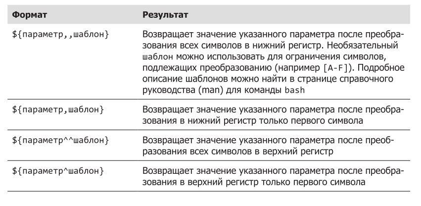

Работу этих операций подстановки демонстрирует следующий сценарий:

```
#!/bin/bash
# ul-param: демонстрация преобразования регистра символов
# с использованием подстановки параметров

if [[ "$1" ]]; then
    echo "${1,,}"
    echo "${1,}"
    echo "${1^^}"
    echo "${1^}"
fi
```

Результат выполнения этого сценария:

```
[me@linuxbox ~]$ ul-param aBc
abc
aBc
ABC
ABc

```
Здесь мы снова обрабатываем первый аргумент командной строки и выводим
результаты выполнения четырех поддерживаемых вариантов подстановки параметров. Сценарий использует первый позиционный параметр, но вообще в операцию подстановки можно передать любую строку, переменную или строковое выражение.


### Вычисление и подстановка арифметических выражений

Ранее мы видели, как работает механизм подстановки результатов арифметических выражений. Он используется для выполнения разных арифметических операций с целыми числами. Ниже приводится его базовый синтаксис

```
$((выражение))
```

где выражение — это любое допустимое арифметическое выражение.

### Основание системы счисления

Ниже показаны формы записи чисел с указанием основания системы счисления.

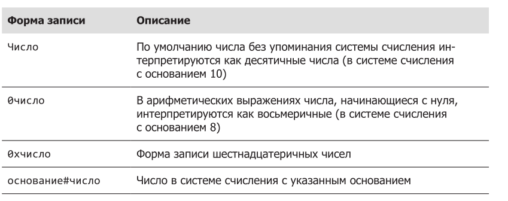

Несколько примеров:

```
[me@linuxbox ~]$ echo $((0xff))
255
[me@linuxbox ~]$ echo $((2#11111111))
255
```
В этих примерах выводится значение шестнадцатеричного числа ff (наиболь-
шее двухзначное число) и наибольшее восьмизначное двоичное число (в системе
счисления с основанием 2).


### Унарные операторы
Оболочка поддерживает два унарных оператора, + и -, используемых для обозначения положительных и отрицательных чисел соответственно.

### Простая арифметика
В таблице ниже перечислены обычные арифметические операторы.

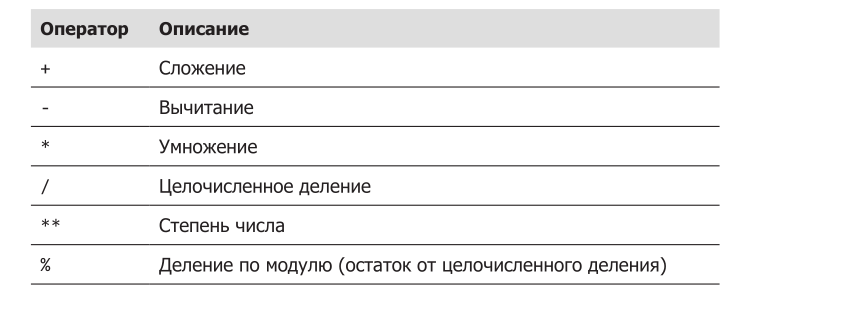

Действия большинства из перечисленных операторов не вызывают вопросов, кро-
ме целочисленного деления и деления по модулю, которые требуют дополнитель-
ного рассмотрения.
Поскольку оболочка поддерживает только арифметические операции с целыми
числами, результатом деления всегда будет целое число:

```
[me@linuxbox ~]$ echo $(( 5 / 2 ))
2

```

Это обстоятельство увеличивает важность операции определения остатка от деления:

```
[me@linuxbox ~]$ echo $(( 5 % 2 ))
1
```

Используя операторы деления и деления по модулю, можно определить, что деление 5 на 2 дает в результате 2 с остатком 1.


### Присваивание

Хотя на данном этапе это не очевидно, тем не менее арифметические выражения
могут выполнять операцию присваивания. Мы уже выполняли присваивание
много раз, хотя и в других контекстах. Каждый раз, передавая переменной число,
мы выполняем присваивание. То же самое можно делать в арифметических вы-
ражениях:

```
[me@linuxbox ~]$ foo=
[me@linuxbox ~]$ echo $foo
[me@linuxbox ~]$ if (( foo = 5 ));then echo "It is true."; fi
It is true.
[me@linuxbox ~]$ echo $foo
5

```
В примере выше мы сначала присвоили переменной foo пустое значение и проверили, что она действительно получила пустое значение. Далее выполнили коман­
ду if с составной командой (( foo = 5 )). Эта команда имеет два интересных аспекта: (1) она присваивает значение 5 переменной foo и (2) оценивает ее значение как истинное, потому что присваивание прошло успешно.

В дополнение к оператору = командная оболочка поддерживает еще несколько
очень полезных операторов присваивания.

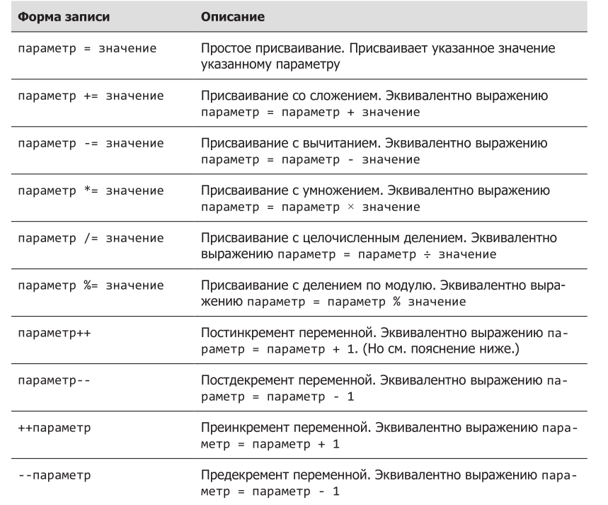

Взгляните на следующий пример:

```
[me@linuxbox ~]$ foo=1
[me@linuxbox ~]$ echo $((foo++))
1
[me@linuxbox ~]$ echo $foo
2

```
Если присвоить переменной foo значение 1 и затем увеличить ее значение с помощью оператора ++, следующего за именем переменной, выражение вернет прежнее
значение 1 переменной foo. Однако если вывести значение переменной второй
раз, мы увидим увеличенное значение. Если поместить оператор ++ перед параме-
тром, мы получим более ожидаемый результат:

```
[me@linuxbox ~]$ foo=1
[me@linuxbox ~]$ echo $((++foo))
2
[me@linuxbox ~]$ echo $foo
2

```
Для большинства приложений на языке командной оболочки более полезным будет префиксный оператор.

Операторы ++ и -- часто используются совместно с циклами. Внесем некоторые
улучшения в сценарий, демонстрирующий применение оператора деления по модулю, чтобы немного сократить его:

```
#!/bin/bash
# modulo2 : демонстрация оператора деления по модулю

for ((i = 0; i <= 20; ++i )); do
    if (((i % 5) == 0 )); then
        printf "<%d> " "$i"
    else
        printf "%d " "$i"
    fi
done
printf "\\n"

```

### Битовые операции

Описание битовых операторов приводится в следующей таблице:

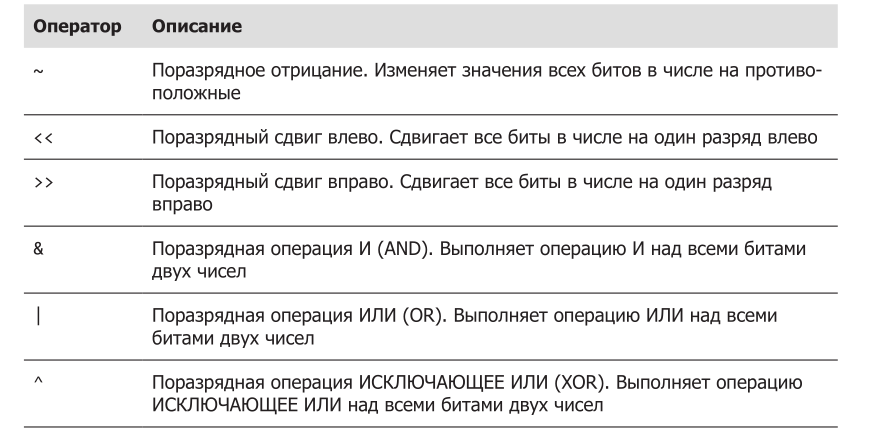

Обратите внимание, что для всех битовых операторов, кроме поразрядного отри-
цания, существуют соответствующие операторы присваивания (например, <<=).
Ниже показано, как с использованием оператора поразрядного сдвига влево вы-
вести список степеней 2:

```
[me@linuxbox ~]$ for ((i=0;i<8;++i)); do echo $((1<<i)); done
1
2
4
8
16
32
64
128

```

Составная команда (( )) поддерживает разные операторы сравнения. Однако существует еще несколько операторов, которые можно использовать для оценки. 

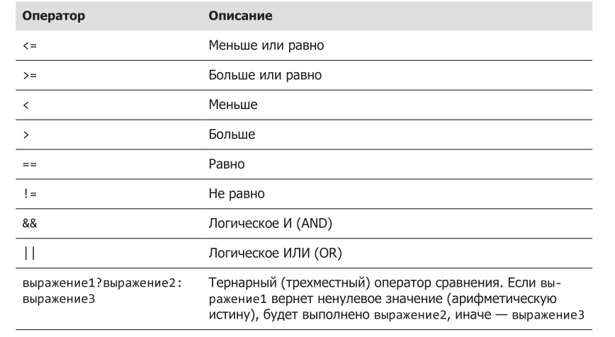

При использовании логических операторов в арифметических выражениях дей-
ствуют следующие правила: выражение, возвращающее 0, считается ложным, а выражение, возвращающее ненулевое значение, — истинным. Составная команда (( )) отображает результаты в обычные для командной оболочки коды завершения:

```
[me@linuxbox ~]$ if ((1)); then echo "true"; else echo "false"; fi
true
[me@linuxbox ~]$ if ((0)); then echo "true"; else echo "false"; fi
false
```

Самым странным из логических операторов выглядит тернарный оператор. Этот оператор  самостоятельно выполняет логическую проверку. Его можно использовать вместо инструкции if/then/else. Он оперирует тремя арифметическими
выражениями (этот оператор не работает со строками), и если первое выражение оценивается как истинное (то есть возвращает ненулевое значение), выполняется второе выражение. Иначе выполняется третье выражение. Опробуем его в командной строке.

```
[me@linuxbox ~]$ a=0
[me@linuxbox ~]$ ((a<1?++a:--a))
[me@linuxbox ~]$ echo $a
1
[me@linuxbox ~]$ ((a<1?++a:--a))
[me@linuxbox ~]$ echo $a
0
```


Этот пример реализует переключение значения переменной. Каждый раз, когда
выполняется оператор, значение переменной a переключается с 0 на 1 или об-
ратно.
Обратите внимание, что прямое присваивание в этом операторе считается недопустимой операцией. Если попытаться выполнить присваивание, bash сообщит
об ошибке:

```
[me@linuxbox ~]$ a=0
[me@linuxbox ~]$ ((a<1?a+=1:a-=1))
bash: ((: a<1?a+=1:a-=1: attempted assignment to non-variable (error token
is "-=1")

```
Эту проблему можно решить, заключив выражения присваивания в круглые
скобки:

```
[me@linuxbox ~]$ ((a<1?(a+=1):(a-=1)))
```

Далее приводится более полный пример использования арифметических операторов в сценарии, который выводит простую таблицу чисел:

```
#!/bin/bash
# arith-loop: сценарий для демонстрации арифметических операторов

finished=0
a=0

printf "a\ta**2\ta**3\n"
printf "=\t====\t====\n"

until ((finished)); do
    b=$((a**2))
    c=$((a**3))
    printf "%d\t%d\t%d\n" "$a" "$b" "$c"
    ((a<10?++a:(finished=1)))
done
```

В этом сценарии мы реализовали цикл until, проверяющий значение переменной finished. Первоначально переменной присвоено значение 0 (арифметическая
ложь). Цикл продолжается, пока эта переменная не получит ненулевое значение.

Внутри цикла вычисляются квадрат и куб переменной-счетчика a. В конце цикла выполняется проверка значения этой переменной. Если оно меньше 10 (максимальное число итераций), она увеличивается на 1, иначе переменной finished
присваивается значение 1, что превращает ее в арифметическую истину, и цикл
завершается. Запустив сценарий, вы получите следующий результат:

```
[me@linuxbox ~]$ arith-loop
a        a**2     a**3
=        ====     ====
0        0        0
1        1        1
2        4        8
3        9        27
4        16       64
5        25       125
6        36       216
7        49       343
8        64       512
9        81       729
10       100      1000
```

### bc — язык калькулятора для вычислений с произвольной точностью

Мы уже знаем, что командная оболочка поддерживает все виды арифметических
вычислений с целыми числами, но как быть, если понадобится реализовать какие-нибудь вычисления из высшей математики или хотя бы просто задействовать
вещественные числа? Ответ: никак. По крайней мере, средствами командной оболочки. Для подобных вычислений придется использовать внешнюю программу.
Существует множество вариантов решения этой проблемы. Одно из них — использовать программы на встроенном Perl или AWK, но, к сожалению, описание
этих языков выходит далеко за рамки данной книги.

Другое решение — использовать специализированную программу-калькулятор.
В большинстве систем Linux имеется одна из таких программ — программа с именем bc.

Программа bc читает файл с исходным кодом на собственном языке, напоминающем язык C, и выполняет его. Сценарий на языке bc можно хранить в отдельном
файле или передавать его на стандартный ввод программы. Язык bc поддерживает массу возможностей, включая переменные, циклы и функции, определяемые
программистом. Мы не будем рассматривать программу bc во всех подробностях,
а познакомимся лишь с некоторыми ее возможностями, чтобы вы могли получить общее представление. Неплохое описание программы bc можно найти на страни-
це справочного руководства (man).
Начнем с простого примера. Напишем сценарий на языке bc, складывающий два
числа — 2 и 2:

```
/* Очень простой сценарий на языке bc */
2 + 2

```
Первая строка сценария — это комментарий. Для оформления комментариев
в языке bc используется тот же синтаксис, что и в языке программирования C.
Комментарии могут размещаться в нескольких строках, начинаясь с пары символов /* и заканчиваясь парой */.

### Применение bc

Сохраним сценарий, приведенный выше, в файле foo.bc, а затем выполним его, как
показано ниже:

```
[me@linuxbox ~]$ bc foo.bc
bc 1.06.94
Copyright 1991-1994, 1997, 1998, 2000, 2004, 2006 Free Software Foundation, Inc.
This is free software with ABSOLUTELY NO WARRANTY.
For details type `warranty'.
4
```

Приглядевшись, можно обнаружить результат в самом низу, после сообщения
с информацией об авторских правах. Вывод этого сообщения можно подавить параметром -q (quiet — безмолвно).

bc также можно использовать в интерактивном режиме:

```
[me@linuxbox ~]$ bc -q
2 + 2
4
quit
```

В интерактивном режиме мы просто вводим выражения и сразу же получаем результат. Команда quit завершает интерактивный сеанс. Кроме того, существует возможность передать сценарий на стандартный ввод программы bc:

```
[me@linuxbox ~]$ bc < foo.bc
4
```

Эта возможность позволяет передавать сценарии с использованием встроенных
документов, встроенных строк и конвейеров. Ниже приводится пример со встро-
енной строкой:

```
[me@linuxbox ~]$ bc <<< "2+2"
4
```

### Пример сценария

В качестве практического примера сконструируем сценарий, вычисляющий сумму ежемесячных платежей по кредиту. Для передачи сценария программе bc в следующем примере используется встроенный документ:

```
#!/bin/bash
# loan-calc : сценарий вычисления суммы ежемесячных платежей по кредиту

PROGNAME="${0##*/}" # Для получения имени файла используется
# операция подстановки параметра

usage () {
cat <<- EOF
Usage: $PROGNAME PRINCIPAL INTEREST MONTHS
Where:
  PRINCIPAL is the amount of the loan.
  INTEREST is the APR as a number (7% = 0.07).
  MONTHS is the length of the loan's term.
EOF
}

if (($# != 3)); then
    usage
    exit 1
fi

principal=$1
interest=$2
months=$3

bc <<- EOF
scale = 10
i = $interest / 12
p = $principal
n = $months
a = p * ((i * ((1 + i) ^ n)) / (((1 + i) ^ n) - 1))
print a, "\\n"
EOF
```

Запустив этот сценарий, вы получите следующие результаты:

```
[me@linuxbox ~]$ loan-calc 135000 0.0775 180
1270.7222490000
```

В этом примере вычисляется размер ежемесячных платежей по кредиту на сумму
$135 000, выданную под 7,75 % годовых на 180 месяцев (15 лет). Обратите внимание на точность результата. Она определяется значением специальной переменной scale в сценарии на языке bc. Полное описание языка bc можно найти на справочной странице (man) для bc. Несмотря на то что форма записи математических выражений немного отличается от используемой в командной оболочке (bc больше напоминает язык C), значительная часть сценария все же выглядит достаточно понятной, учитывая все, что мы узнали к настоящему моменту.

### Заключение

В этой главе мы узнали множество маленьких хитростей, которые могут пригодиться в практической работе. По мере роста опыта в создании сценариев умение
эффективно работать со строками и числами обретает истинную ценность. Наш
сценарий loan-calc показал, что даже простые сценарии могут производить некоторые действительно полезные вычисления.

## Глава 35. Массивы

Большинство языков программирования поддерживает многомерные массивы.
Электронная таблица — это пример многомерного массива с двумя измерениями:
ширина и высота. Многие языки поддерживают массивы с произвольным числом
измерений, однако на практике чаще всего, пожалуй, используются двух- и трехмерные массивы. 

Массивы в bash ограничены единственным измерением. Их можно рассматривать
как электронные таблицы с единственным столбцом. Но даже с этим ограничением массивам можно найти массу применений. Впервые поддержка массивов появилась в bash версии 2. Оригинальная командная оболочка Unix sh вообще не поддерживала их.

### Создание массива

Переменным-массивам можно давать такие же имена, что и другим переменным
bash, и они точно так же создаются автоматически при первом обращении к ним.
Например:

```
[me@linuxbox ~]$ a[1]=foo
[me@linuxbox ~]$ echo ${a[1]}
foo
```

Это пример присваивания значения элементу массива и обращения к нему. Первая команда присваивает значение foo элементу массива a с индексом 1. Вторая
команда выводит значение, хранящееся в элементе с индексом 1. Использование
фигурных скобок во второй команде является обязательным условием, иначе командная оболочка будет пытаться выполнить подстановку пути, опираясь на имя элемента массива. Массив можно также создать командой declare:

```
[me@linuxbox ~]$ declare -a a
```

Параметр -a в этом примере требует от declare создать массив (array) с именем a.

### Присваивание значений массиву

Значения элементам массивов можно присваивать одним из двух способов. Присваивание одиночных значений осуществляется с использованием следующего синтаксиса:

```
имя[индекс]=значение
```

где имя — это имя массива, индекс — целое число (или арифметическое выражение) больше или равное 0. Обратите внимание, что первый элемент массива имеет индекс 0, а не 1. значение — строка или целое число, присваиваемое элементу
массива. 

Присвоить сразу множество значений можно с использованием следующего син-
таксиса:

```
имя=(значение1 значение2 ...)

```

где имя — это имя массива, а значение1 значение2 ... — значения, присваиваемые
последовательным элементам массива, начиная с элемента с индексом 0. Например, если понадобится присвоить элементам массива days сокращенные названия
дней недели, это можно сделать так:

```
[me@linuxbox ~]$ days=(Sun Mon Tue Wed Thu Fri Sat)
Можно присваивать значения конкретным элементам, указывая индекс для каж-
дого значения:
[me@linuxbox ~]$ days=([0]=Sun [1]=Mon [2]=Tue [3]=Wed [4]=Thu [5]=Fri [6]=Sat)
```

### Доступ к элементам массива

Итак, где могут пригодиться массивы? Так же как многие задачи управления данными могут решаться с применением программ электронных таблиц, массивы могут применяться для решения множества задач программирования.
Рассмотрим простой пример сбора и представления данных. Напишем сценарий,
проверяющий время последнего изменения файлов в указанном каталоге. На основе полученных данных сценарий будет выводить таблицу, показывающую, сколько файлов было изменено в каждый час суток. Такой сценарий можно использовать, например, для выяснения периодов наибольшей активности системы. 

В этом примере мы запустили программу hours, передав ей текущий каталог для
анализа. Она вывела таблицу, показывающую число файлов, изменявшихся в каждый час суток (0–23). Ниже показан код, осуществляющий вывод этой таблицы:

```
#!/bin/bash
# hours : сценарий для подсчета файлов по времени изменения

usage () {
    echo "usage: ${0##*/} directory" >&2
}

# Убедиться, что аргумент является каталогом
if [[ ! -d "$1" ]]; then
    usage
    exit 1
fi

# Инициализировать массив
for i in {0..23}; do hours[i]=0; done

# Собрать данные
for i in $(stat -c %y "$1"/* | cut -c 12-13); do
    j="${i#0}"
    ((++hours[j]))
    ((++count))
done

# Вывести данные
echo -e "Hour\tFiles\tHour\tFiles"
echo -e "----\t-----\t----\t-----"

for i in {0..11}; do
    j=$((i + 12))
    printf "%02d\t%d\t%02d\t%d\n" \
        "$i" \
        "${hours[i]}" \
        "$j" \
        "${hours[j]}"
done

printf "\nTotal files = %d\n" $count
```

Сценарий состоит из одной функции (usage) и основного тела с четырьмя разделами. В первом разделе проверяется, является ли аргумент командной строки именем каталога. Если нет, сценарий выводит сообщение с информацией о порядке использования и завершается.

Второй раздел инициализирует массив hours. Для этого каждому элементу массива присваивается значение 0. Массивы не требуют специальной инициализации перед использованием, но нашему сценарию важно, чтобы в массиве не
оставалось элементов с пустыми значениями. Обратите внимание на необычный способ организации цикла. Используя подстановку в фигурных скобках
({0..23}), мы смогли без труда сгенерировать последовательность слов для
коман­ды for.

Следующий раздел осуществляет сбор данных, вызывая программу stat для каждого файла в каталоге. С помощью cut из результата извлекается двузначный час.
Внутри цикла выполняется удаление ведущих нулей из поля с часом, потому что
иначе командная оболочка попытается (и, в конечном счете, потерпит неудачу)
интерпретировать значения с 00 по 09 как восьмеричные числа (см. табл. 34.1).
Далее сценарий увеличивает на единицу значение элемента массива, соответствующего полученному часу дня. Наконец, будет увеличен счетчик (count), хранящий общее число файлов в каталоге.

Последний раздел в сценарии выводит содержимое массива. Сначала выводится
пара строк заголовка, а затем начинает выполняться цикл, осуществляющий вывод в четыре колонки. В заключение выводится общее число файлов.

### Операции с массивами

Массивы поддерживают множество типовых операций, таких как удаление массивов, определение их размеров, сортировка и др., которым можно найти много
вариантов применения в сценариях.


### Вывод содержимого всего массива

Для доступа к каждому элементу массива используются индексы * и @. Так же как
и в случае с позиционными параметрами, индекс @ имеет большую практическую
ценность. Например:

```
[me@linuxbox ~]$ animals=("a dog" "a cat" "a fish")
[me@linuxbox ~]$ for i in ${animals[*]}; do echo $i; done
a
dog
a
cat
a
fish
[me@linuxbox ~]$ for i in ${animals[@]}; do echo $i; done
a
dog
a
cat
a
fish
[me@linuxbox ~]$ for i in "${animals[*]}"; do echo $i; done
a dog a cat a fish
[me@linuxbox ~]$ for i in "${animals[@]}"; do echo $i; done
a dog
a cat
a fish
```

Мы создали массив animals и сохранили в нем три строки по два слова в каждой.
Затем выполнили четыре цикла, чтобы посмотреть, как выполняется разбиение
содержимого массива на слова. Инструкции ${animals[*]} и ${animals[@]} действуют идентично, если они не заключены в кавычки. Индекс * возвращает содержимое массива, разбитое на отдельные слова, тогда как индекс @ возвращает три
«слова», соответствующие «истинному» содержимому массива.

### Определение числа элементов в массиве

Определить число элементов в массиве, так же как длину строки, можно с помощью механизма подстановки параметров. Например:

```
[me@linuxbox ~]$ a[100]=foo
[me@linuxbox ~]$ echo ${#a[@]} # число элементов в массиве
1
[me@linuxbox ~]$ echo ${#a[100]} # длина элемента с индексом 100
3
```

Мы создали массив a и записали строку foo в элемент с индексом 100. Далее с помощью механизма подстановки параметров мы определили длину массива, используя при этом форму записи индекса @. Затем определили длину элемента
с индексом 100, содержащего строку foo. Обратите внимание, что даже притом,
что мы присвоили строку элементу с индексом 100, bash сообщает, что в массиве
имеется только один элемент. Такое поведение необычно для тех языков, в которых неиспользуемые элементы массива (элементы с индексами 0–99) были бы
инициализированы пустыми значениями и учитывались бы при определении размера массива. В bash элемент массива существует, только если ему присвоено значение, независимо от индекса.

### Поиск используемых индексов

Так как bash позволяет создавать разреженные массивы путем присваивания значений отдельным элементам, иногда требуется определить, какие элементы действительно существуют. Это можно сделать с помощью механизма подстановки
параметров, как показано ниже:

```
${!массив[*]}
${!массив[@]}
```

где массив — это имя переменной-массива. Как и в других случаях использования * и @ в операциях подстановки, форма @, заключенная в кавычки, оказывается
наиболее полезной, так как выполняет подстановку нераздробленных значений
элементов:

```
[me@linuxbox ~]$ foo=([2]=a [4]=b [6]=c)
[me@linuxbox ~]$ for i in "${foo[@]}"; do echo $i; done
a
b
c
[me@linuxbox ~]$ for i in "${!foo[@]}"; do echo $i; done
2
4
6
```

### Добавление элементов в конец массива

Знание количества элементов в массиве не поможет, если понадобится добавить
значения в конец массива, потому что значения, возвращаемые индексами * и @, не
сообщают наибольший занятый индекс в массиве. К счастью, командная оболочка
предоставляет собственное решение. Оператор присваивания += автоматически
добавляет значения в конец массива. Ниже мы записали три значения в массив,
а затем добавили в конец еще три.

```
[me@linuxbox ~]$ foo=(a b c)
[me@linuxbox ~]$ echo ${foo[@]}
a b c
[me@linuxbox ~]$ foo+=(d e f)
[me@linuxbox ~]$ echo ${foo[@]}
a b c d e f
```

### Сортировка массива

Так же как и при работе с электронными таблицами, при работе с массивами часто
возникает необходимость отсортировать значения. Командная оболочка не имеет
прямой поддержки операции сортировки, но ее нетрудно реализовать самому:

```
#!/bin/bash
# array-sort : сортировка массива

a=(f e d c b a)
echo "Original array: ${a[@]}"
a_sorted=($(for i in "${a[@]}"; do echo $i; done | sort))
echo "Sorted array: ${a_sorted[@]}"
```

Если запустить этот сценарий, он выведет следующее:

```
[me@linuxbox ~]$ array-sort
Original array: f e d c b a
Sorted array: a b c d e f
```

Сценарий копирует содержимое исходного массива (a) во второй массив (a_sorted), выполняя трюк с подстановкой команды. Этот простой прием можно использовать для выполнения самых разных операций с массивами, просто изменяя
состав конвейера.


### Удаление массива

Удалить массив можно с помощью команды unset:

```
[me@linuxbox ~]$ foo=(a b c d e f)
[me@linuxbox ~]$ echo ${foo[@]}
a b c d e f
[me@linuxbox ~]$ unset foo
[me@linuxbox ~]$ echo ${foo[@]}
[me@linuxbox ~]$
```

Командой unset можно также удалить единственный элемент массива:

```
[me@linuxbox ~]$ foo=(a b c d e f)
[me@linuxbox ~]$ echo ${foo[@]}
a b c d e f
[me@linuxbox ~]$ unset 'foo[2]'
[me@linuxbox ~]$ echo ${foo[@]}
a b d e f
```

В этом примере мы удалили третий элемент массива, с индексом 2. Не забывайте,
что индексация элементов массива начинается с 0, а не с 1! Отметьте также, что
элемент массива нужно заключить в кавычки, чтобы предотвратить подстановку
путей оболочкой.


Интересно отметить, что присваивание пустого значения массиву не уничтожает
его содержимое:

```
[me@linuxbox ~]$ foo=(a b c d e f)
[me@linuxbox ~]$ foo=
[me@linuxbox ~]$ echo ${foo[@]}
b c d e f
```

Любая ссылка на переменную-массив без индекса возвращает элемент с индексом 0:

```
[me@linuxbox ~]$ foo=(a b c d e f)
[me@linuxbox ~]$ echo ${foo[@]}
a b c d e f
[me@linuxbox ~]$ foo=A
[me@linuxbox ~]$ echo ${foo[@]}
A b c d e f
```

### Ассоциативные массивы

bash версии 4.0 и выше поддерживает ассоциативные массивы. Для индексации
элементов в ассоциативных массивах используются строки, а не целые числа, как
в обычных массивах. Эта возможность открывает новые подходы к управлению
данными. Например, можно создать массив colors и в качестве индексов использовать названия цветов:

```
declare -A colors
colors["red"]="#ff0000"
colors["green"]="#00ff00"
colors["blue"]="#0000ff"

```
В отличие от обычных массивов с целочисленной индексацией, которые создают-
ся простой ссылкой на них, ассоциативные массивы можно создать только коман-
дой declare с новым параметром -A. Доступ к элементам ассоциативного массива
осуществляется во многом так же, как к элементам обычных массивов с целочис-
ленными индексами:

```
echo ${colors["blue"]}
```
В следующей главе мы рассмотрим сценарий, использующий ассоциативные массивы для создания одного интересного отчета.


### Заключение

Если на странице справочного руководства (man) для bash выполнить поиск слова array, можно найти множество его упоминаний, где описываются приемы работы с переменными-массивами. Большая часть этих описаний довольно туманна,
но иногда они содержат весьма полезные сведения. Фактически массивы недостаточно широко используются в программировании на языке командной оболочки,
в основном потому, что традиционные командные оболочки для Unix (такие, как
sh) не поддерживают их.

## Глава 36. Экзотика

В этой главе, завершающей наше путешествие, обратимся к совершенно случайным темам. Несмотря на то что в предыдущих главах мы рассмотрели основные
темы, немало особенностей bash остались неохваченными. Многие из них плохо
освещены в документации и полезны в основном для тех, кто занимается интеграцией bash в дистрибутивы Linux. Но есть среди них и такие, которые, хотя и используются нечасто, могут пригодиться при решении некоторых задач программирования. Их-то мы и рассмотрим.

### Группы команд и подоболочки

bash поддерживает возможность группировки команд. Воспользоваться ею мож-
но двумя способами: либо путем группировки команд, либо путем применения по-
доболочки. Ниже приводятся примеры синтаксиса обоих подходов.
Группа команд:

```
{ команда1; команда2; [команда3; ...] }
Подоболочка:
(команда1; команда2; [команда3;...])
```

Группа команд заключается в фигурные скобки, а подоболочка оформляется круглыми скобками. Вот и вся разница. Однако обратите внимание, что из-за особенностей реализации группировки команд в bash фигурные скобки должны отделяться от команд пробелами и последняя команда должна завершаться точкой с запятой или символом перевода строки.

Итак, где могут пригодиться группы команд и подоболочки? Даже притом, что между ними имеются важные различия (которые будут раскрыты далее), и те и другие используются в основном для перенаправления. Рассмотрим фрагмент
сценария, выполняющий перенаправление вывода множества команд:

```
ls -l > output.txt
echo "Listing of foo.txt" >> output.txt
cat foo.txt >> output.txt
```

Выглядит достаточно просто: вывод трех команд перенаправляется в файл с именем output.txt. Воспользовавшись приемом группировки, то же самое можно выразить более кратко:

```
{ ls -l; echo "Listing of foo.txt"; cat foo.txt; } > output.txt
```

Подоболочка используется аналогично:
(ls -l; echo "Listing of foo.txt"; cat foo.txt) > output.txt
Этот прием помог нам сэкономить силы и время на вводе текста сценария, но истинная мощь групп команд и подоболочек проявляется в конвейерах. Создавая
конвейеры из команд, мы часто сталкиваемся с необходимостью объединения результатов нескольких команд в общий поток. Группы команд и подоболочки упрощают эту задачу:

```
{ ls -l; echo "Listing of foo.txt"; cat foo.txt; } | lpr
```

Здесь мы объединили вывод трех команд и передали его по конвейеру на вход
команды lpr, чтобы напечатать отчет.
В следующем сценарии мы задействуем группы команд и рассмотрим несколько
приемов, которые можно использовать в сочетании с ассоциативными массивами. Получив имя каталога, сценарий с названием array-2 выводит список файлов, находящихся в этом каталоге, с именами пользователей и групп, владеющих
файлами. В конце сценарий выводит общее количество файлов, принадлежащих
каждому пользователю и каждой группе. 


Далее следует исходный код сценария (с номерами строк):

```
 1  #!/bin/bash
 2  # array-2: Используем массивы для подсчета файлов, принадлежащих
 3  # разным владельцам
 4  
 5  declare -A files file_group file_owner groups owners
 6  
 7  if [[ ! -d "$1" ]]; then
 8      echo "Usage: array-2 dir" >&2
 9      exit 1
10  fi
11  
12  for i in "$1"/*; do
13      owner="$(stat -c %U "$i")"
14      group="$(stat -c %G "$i")"
15      
16      files["$i"]="$i"
17      file_owner["$i"]="$owner"
18      file_group["$i"]="$group"
19      
20      ((++owners[$owner]))
21      ((++groups[$group]))
22  done
23  
24  # Вывод списка файлов
25  { for i in "${files[@]}"; do
26      printf "%-40s %-10s %-10s\n" \
27          "$i" "${file_owner["$i"]}" "${file_group["$i"]}"
28  done } | sort
29  
30  echo
31  
32  # Вывод списка владельцев
33  echo "File owners:"
34  { for i in "${!owners[@]}"; do
35      printf "%-10s: %5d file(s)\n" "$i" "${owners["$i"]}"
36  done } | sort
37  
38  echo
39  
40  # Вывод списка групп
41  echo "File group owners:"
42  { for i in "${!groups[@]}"; do
43      printf "%-10s: %5d file(s)\n" "$i" "${groups["$i"]}"
44  done } | sort
```

Рассмотрим механику работы этого сценария.
* Строка 5: ассоциативные массивы должны создаваться командой declare с пара-
метром -A. Этот сценарий создает пять таких массивов:
 files хранит имена файлов, найденных в каталоге, индексируется именами
файлов.
 file_group хранит имена групп, владеющих файлами, индексируется именами
файлов.
 file_owner хранит имена пользователей, владеющих файлами, индексируется
именами файлов.
 groups хранит число файлов, принадлежащих каждой группе, индексируется
именами групп.
 owners хранит число файлов, принадлежащих каждому пользователю, индек-
сируется именами пользователей.
* Строки 7–10: эти строки проверяют имя каталога, переданное в позиционном па-
раметре. Если каталог с указанным именем не существует, выводится сообщение,
описывающее порядок использования сценария, после чего сценарий завершает-
ся с кодом 1.
* Строки 12–20: Эти строки выполняют обход файлов в каталоге. Команды stat
в строках 13 и 14 извлекают имена пользователя и группы, владеющих файлом,
которые затем сохраняются в соответствующих массивах (строки 16 и 17), с ис-
пользованием имени файла в роли индекса. Само имя файла сохраняется в масси-
ве files (строка 15).
* Строки 18–19: количество файлов, принадлежащих пользователю и группе, уве-
личивается на 1.
* Строки 22–27: вывод списка файлов. Вывод осуществляется с использованием
подстановки параметров "${массив[@]}", которая возвращает полный список эле-
ментов массива, каждый из которых интерпретируется как отдельное слово. При
таком подходе не возникает проблем с именами файлов, содержащими пробелы.
Отметьте также, что весь цикл заключен в фигурные скобки, формирующие груп-
пу команд. Это позволяет передать вывод, полученный в цикле, команде sort. Это
важно, потому что операция подстановки в строке 12 возвращает имена файлов
в неотсортированном порядке.
* Строки 29–40: эти два цикла реализованы подобно циклу вывода списка файлов
и отличаются только использованием подстановки "${!массив[@]}", которая воз-
вращает не список элементов, а список индексов массива.


### Подстановка процессов

Несмотря на внешнее сходство и возможность объединения потоков для последующего перенаправления, между группами команд и подоболочками существуют
важные отличия. Все команды, входящие в группу, выполняются в текущей оболочке, подоболочка (как можно догадаться из названия) выполняет свои команды
в дочерней копии текущей командной оболочки. Это означает, что в момент запуска подоболочки создается копия окружения текущей оболочки и передается новому экземпляру оболочки. Когда подоболочка завершается, ее копия окружения
уничтожается, соответственно, теряются любые изменения в окружении подобо-
лочки (включая значения переменных). Поэтому если нет прямой необходимости
в использовании подоболочки, предпочтительнее использовать группы команд.
Группы команд выполняются быстрее и требуют меньше памяти.

В главе 28 мы столкнулись с одной из проблем, характерных для подоболочек,
когда выяснили, что команда read действует в конвейерах не так, как можно было
бы ожидать. Там мы сконструировали следующий конвейер:

```
echo "foo" | read
echo $REPLY
```

после выполнения которого переменная REPLY всегда оставалась пустой, потому
что команда read выполняется в подоболочке и ее копия REPLY уничтожается по
ее завершении.

Так как конвейеры команд всегда выполняются в подоболочке, любые команды,
присваивающие значения переменным, будут сталкиваться с этой проблемой.
К счастью, командная оболочка поддерживает экзотическую форму подстановки,
которая называется подстановкой процессов и может использоваться для преодо-
ления указанных трудностей.
Подстановка процессов оформляется двумя способами: для процессов, отправля-
ющих результаты в стандартный вывод:

```
<(список)
и для процессов, принимающих данные через стандартный ввод:
>(список)
```

где список — это список команд.
Ниже показано, как использовать подстановку процессов для решения проблемы
с командой read:

```
read < <(echo "foo")
echo $REPLY
```

Подстановка процессов позволяет интерпретировать вывод подоболочки как
обычный файл и осуществлять его перенаправление. Так как это форма подстановки, всегда можно узнать действительное подставляемое значение:

```
[me@linuxbox ~]$ echo <(echo "foo")
/dev/fd/63
```

Вывод результата подстановки командой echo показывает, что вывод подоболочки передается через файл с именем /dev/fd/63.

Подстановка процессов часто используется в циклах, содержащих команду read.
Ниже приводится пример использования read в цикле, обрабатывающем список
файлов в каталоге, созданном подоболочкой:

```
#!/bin/bash

# pro-sub : демонстрация подстановки процессов
while read attr links owner group size date time filename; do

cat <<- EOF
Filename: $filename
Size:     $size
Owner:    $owner
Group:    $group
Modified: $date $time
Links:    $links
Attributes: $attr
EOF
done < <(ls -l | tail -n +2)

```

Цикл выполняет read для каждой строки в списке с содержимым каталога. Сам
список создается последней строкой в сценарии. Здесь вывод подоболочки перенаправляется на стандартный ввод цикла с помощью подстановки процесса.
Коман­да tail включена в конвейер, чтобы устранить первую строку в списке, ко-
торая не нужна.
Этот сценарий выведет примерно следующее:

```
[me@linuxbox ~]$ pro_sub | head -n 20
Filename:    addresses.ldif    Filename:    bin
Size:        14540             Size:        4096
Owner:       me                Owner:       me
Group:       me                Group:       me
Modified:    2009-04-02 11:12 Modified:    2009-07-10 07:31
Links:       1                 Links:       2
Attributes:  -rw-r--r--       Attributes:  drwxr-xr-x

Filename:                   Size:
                            394213
Owner:       bookmarks.html Owner:
Group:       me             Group:
                            me
```

### Ловушки

В главе 10 мы узнали, что программы могут реагировать на сигналы. Эту возможность можно добавить и в сценарии. Ни в одном из сценариев, написанных
нами до сих пор, этого не требовалось (потому что они быстро завершаются и не создают временных файлов), но в больших и сложных сценариях процедура об-
работки сигналов может оказаться весьма кстати.

Проектируя большие и сложные сценарии, важно предусматривать их реакцию
на неожиданный выход пользователя из системы или выключение компьютера
во время их выполнения. Если возникают подобные события, всем процессам посылается сигнал. Программы, представляющие эти процессы, могут выполнять
некие действия, гарантирующие корректное завершение с сохранением необходимых данных. Допустим, к примеру, что мы написали сценарий, создающий временный файл во время выполнения. При внимательном подходе к проектированию мы могли бы предусмотреть удаление этого файла по завершении сценария.

Было бы неплохо также предусмотреть удаление файла в случае получения сценарием сигнала, требующего преждевременного завершения программы.

Для этой цели в bash поддерживается механизм, известный как ловушка (trap).
Ловушки реализуются с применением встроенной команды с соответствующим
именем trap. Команда trap имеет следующий синтаксис:

```
trap аргумент сигнал [сигнал...]
```


где аргумент — это строка, которая будет прочитана и выполнена как команда,
а сигнал — идентификатор сигнала, в ответ на который будет выполнена указан-
ная команда.
Рассмотрим простой пример:

```
#!/bin/bash

# trap-demo : простой пример обработки сигналов
trap "echo 'I am ignoring you.'" SIGINT SIGTERM
for i in {1..5}; do
echo "Iteration $i of 5"
sleep 5
done
```

Этот сценарий определяет ловушку, которая будет выполнять команду echo в ответ на сигналы SIGINT и SIGTERM, получаемые сценарием во время выполнения.
Ниже показано, как выглядят попытки остановить сценарий нажатием комбинации CTRL+C:

```
[me@linuxbox ~]$ trap-demo
Iteration 1 of 5
Iteration 2 of 5
^CI am ignoring you.

Iteration 3 of 5
^CI am ignoring you.
Iteration 4 of 5
Iteration 5 of 5
```

Как видите, каждый раз, когда пользователь пытается прервать работу программы, она вместо этого выводит сообщение.

Иногда бывает непросто сформировать строку с требуемой последовательностью
команд, поэтому на практике в качестве команды часто используют функции.
Следующий пример демонстрирует применение разных функций для обработки
разных сигналов:

```
#!/bin/bash
# trap-demo2 : простой пример обработки сигналов

exit_on_signal_SIGINT () {
    echo "Script interrupted." 2>&1
    exit 0
}

exit_on_signal_SIGTERM () {
    echo "Script terminated." 2>&1
    exit 0
}

trap exit_on_signal_SIGINT SIGINT
trap exit_on_signal_SIGTERM SIGTERM

for i in {1..5}; do
    echo "Iteration $i of 5"
    sleep 5
done
```

Этот сценарий дважды использует команду trap, настраивая ловушки для двух
сигналов. В каждой ловушке используется своя функция, которая будет вызвана
для обработки конкретного сигнала. Обратите внимание на включение команды
exit в обе функции обработки сигналов. Без этого сценарий продолжил бы вы-
полняться после завершения функции.

Если во время выполнения этого сценария пользователь нажмет комбинацию
CTRL+C, он увидит следующее:

```
[me@linuxbox ~]$ trap-demo2
Iteration 1 of 5
Iteration 2 of 5
^CScript interrupted.
```

### ВРЕМЕННЫЕ ФАЙЛЫ

Одним из побудительных мотивов включения обработчиков сигналов в сценарии
является необходимость удаления временных файлов, которые сценарии могут
создавать для хранения промежуточных результатов. Выбор имен для временных
файлов — целое искусство. Традиционно программы в Unix-подобных системах
создают свои временные файлы в каталоге /tmp, общем для всех и предназначенном именно для таких файлов. Однако из-за того, что каталог является общим,
возникает проблема безопасности, особенно остро проявляющаяся в программах,
действующих с привилегиями суперпользователя. Помимо очевидной необходимости установки соответствующих разрешений для файлов, которые могут быть
доступны всем пользователям в системе, важно также давать временным файлам
непредсказуемые имена. Это поможет избежать атаки на основе состояния гонки при обращении к временным файлам (temp race attack).

Суть атаки
Злоумышленник пытается вмешаться в работу программы в короткий промежуток времени между тем, как программа проверила наличие временного файла, и тем, как она начала его использовать. В это «окно» хакер может подменить файл или создать на него ссылку (симлинк), чтобы заставить программу с высокими правами перезаписать важный системный файл или выполнить вредоносный код. 

Ниже показан один из способов создания непредсказуемого (но все еще осмысленного) имени:

```
tempfile=/tmp/$(basename $0).$$.$RANDOM
```

Эта команда сконструирует имя файла из имени программы, идентификатора
процесса (PID) и случайного целого числа. Но имейте в виду, что переменная
командной оболочки $RANDOM возвращает значения только из диапазона от 1
до 32 767, не очень большого по компьютерным меркам, поэтому единственного
экземпляра переменной недостаточно, чтобы противостоять заинтересованному
злоумышленнику.
Лучший результат дает программа mktemp (не путайте с функцией mktemp из стандартной библиотеки) — она автоматически выбирает имя и создает временный
файл. Программа mktemp принимает аргумент с шаблоном, на основе которого
конструирует имя файла. Шаблон должен включать последовательность симво-
лов X, которые будут заменены соответствующим числом случайных букв и цифр.
Чем длиннее последовательность из символов X, тем длиннее последовательность
случайных символов. Например:

```
tempfile=$(mktemp /tmp/foobar.$$.XXXXXXXXXX)
```

Эта команда создаст временный файл и сохранит его имя в переменной tempfile.
Символы X в шаблоне будут заменены случайными буквами и цифрами, соответ-
ственно, окончательное имя файла, которое в данном примере включает также
значение специального параметра $$, возвращающего идентификатор процесса,
может выглядеть, например, так:

```
/tmp/foobar.6593.UOZuvM6654
```
В сценариях, предназначенных для запуска рядовыми пользователями, разумнее
отказаться от использования каталога /tmp и создать каталог для временных
файлов в домашнем каталоге пользователя, например, так:

```
[[ -d $HOME/tmp ]] || mkdir $HOME/tmp
```

### Асинхронное выполнение с командой wait

Иногда возникает необходимость решать одновременно несколько задач. Мы знаем, что все современные операционные системы, даже те, которые не являются
многопользовательскими, поддерживают многозадачность. Сценарии тоже можно конструировать так, что они будут действовать в многозадачном режиме.
Обычно такие сценарии запускают один или несколько дочерних сценариев, решающих вспомогательные задачи, пока родительский сценарий продолжает выполнять основной алгоритм. Однако когда таким способом запускается целая серия сценариев, возникает проблема координации действий родителя и потомков.
Например, представьте, что родитель зависит от результатов работы потомка или,
наоборот, и он должен дождаться, пока другой сценарий завершится, прежде чем
завершиться самому.

В bash имеется встроенная команда, помогающая управлять асинхронным выполнением в подобных ситуациях. Команда wait приостанавливает выполнение родительского сценария, пока не завершится указанный процесс (то есть дочерний
сценарий). Для демонстрации нам понадобятся два сценария. Ниже приводится
родительский сценарий:

```
#!/bin/bash
# async-parent : пример асинхронного выполнения (родитель)

echo "Parent: starting..."
echo "Parent: launching child script..."

async-child &
pid=$!
echo "Parent: child (PID= $pid) launched."
echo "Parent: continuing..."
sleep 2
echo "Parent: pausing to wait for child to finish..."
wait $pid
echo "Parent: child is finished. Continuing..."
echo "Parent: parent is done. Exiting."
```

и дочерний сценарий:

```
#!/bin/bash
# async-child : пример асинхронного выполнения (потомок)

echo "Child: child is running..."
sleep 5
echo "Child: child is done. Exiting."
```

В этом примере дочерний сценарий тривиально прост. Фактическая работа выполняется родителем. Родительский сценарий запускает дочерний сценарий и переводит его в фоновый режим выполнения. Идентификатор дочернего процесса
сохраняется в переменной pid путем присваивания ей значения параметра $!, который всегда содержит идентификатор процесса последнего задания, переведенного в фоновый режим.

Родительский сценарий продолжает работу и в конце выполняет команду wait
с идентификатором процесса дочернего сценария. Это вызывает приостановку
родительского сценария до завершения дочернего сценария, после чего родительский сценарий возобновляет работу и тут же завершается.
В ходе выполнения родительский и дочерний сценарии производят следующий
вывод:

```
[me@linuxbox ~]$ async-parent
Parent: starting...
Parent: launching child script...
Parent: child (PID= 6741) launched.
Parent: continuing...
Child: child is running...
Parent: pausing to wait for child to finish...
Child: child is done. Exiting.
Parent: child is finished. Continuing...
Parent: parent is done. Exiting.
```

### Именованные каналы

В большинстве Unix-подобных систем существует возможность создавать файлы
специального типа, которые называются именованными каналами (named pipe).
Именованные каналы создают соединения между двумя процессами и могут использоваться как обычные файлы. Они не пользуются большой популярностью,
но знать о такой возможности и уметь пользоваться ею желательно.

Именованные каналы имеют некоторое сходство с файлами, но на самом деле
образуют буферы, действующие по принципу очереди: первым пришел, первым
вышел (First-In, First-Out, FIFO). Так же как в случае с обычными (неименованными) каналами, данные записываются с одного конца канала и извлекаются из
другого. С применением именованных каналов можно, например, выполнять следующие команды:

```
процесс1 > именованный_канал
```

и

```
процесс2 < именованный_канал
```

и такая пара команд будет действовать подобно конвейеру

```
процесс1 | процесс2
```

### Создание именованного канала

Прежде чем использовать именованный канал, его нужно создать. Это делается
с помощью команды mkfifo:

```
[me@linuxbox ~]$ mkfifo pipe1
[me@linuxbox ~]$ ls -l pipe1
prw-r--r-- 1 me
me
0 2018-07-17 06:41 pipe1

```

Здесь с помощью команды mkfifo создается именованный канал с именем pipe1.
Командой ls мы исследовали созданный файл, и, как видите, первой в поле с атрибутами стоит буква p, сообщающая, что это именованный канал (pipe).


### Использование именованных каналов

Чтобы показать, как работают именованные каналы, откроем два окна терминала
(или, как вариант, выполним описанные ниже действия в двух виртуальных консолях). В первом терминале введите простую команду и перенаправьте ее вывод
в именованный канал:

```
[me@linuxbox ~]$ ls -l > pipe1
```

После нажатия клавиши ENTER появится ощущение, что команда «зависла». Это
объясняется тем, что с другого конца канала данные еще не были прочитаны.
В таких ситуациях говорят, что канал заблокирован. Разблокировка произойдет
автоматически, как только мы подключим процесс с другого конца канала и прочитаем данные из него. Во втором окне терминала введите следующую команду:

```
[me@linuxbox ~]$ cat < pipe1
```

Во втором терминале появится список содержимого каталога, созданный в первом окне, как результат работы команды cat. Команда ls в первом окне терминала
благополучно разблокируется и завершится.

### Заключение

Итак, мы закончили наше путешествие. Единственное, что осталось, — это практика, практика и еще раз практика. Даже притом, что на своем пути мы охватили широкий круг вопросов, в действительности мы лишь затронули верхушку
айсберга под названием «командная строка». Существуют еще тысячи программ
командной строки, которые вам предстоит открыть и изучить. Начните свои исследования с каталога /usr/bin, и вы увидите их!